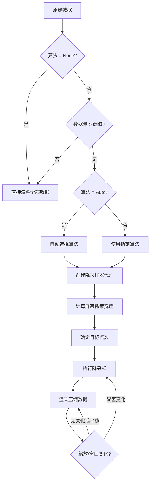

# 降采样器使用指南

QIm 内置基于 LTTB（Largest-Triangle-Three-Buckets）及其优化变体 MinMaxLTTB 的降采样器，
用于大数据量渲染时在保持视觉效果的同时提高渲染性能。

## 主要功能特性

**特性**

- ✅ **LTTB 算法**：经典 Largest-Triangle-Three-Buckets，保留视觉关键特征
- ✅ **MinMaxLTTB 算法**：带 MinMax 预筛选的优化版 LTTB，10-30 倍性能提升
- ✅ **自适应采样**：根据屏幕像素宽度自动计算最优目标点数
- ✅ **算法可选**：通过 `Q_PROPERTY` 在运行时切换降采样算法
- ✅ **自动模式**：系统根据数据量自动选择最优算法
- ✅ **缩放感知**：仅在显著缩放或窗口调整时重新降采样，平移不触发

## 可用算法

| 算法 | 枚举值 | 适用数据量 | 特点 |
|------|--------|-----------|------|
| 不降采样 | `QImDownsampleAlgorithm::None` | < 1 万点 | 保留全部数据点，精确渲染 |
| LTTB | `QImDownsampleAlgorithm::LTTB` | 1 万 - 10 万点 | 经典算法，性能与精度均衡 |
| MinMaxLTTB | `QImDownsampleAlgorithm::MinMaxLTTB` | > 10 万点 | 优化版，10-30 倍性能提升 |
| 自动选择 | `QImDownsampleAlgorithm::Auto` | 所有场景 | 系统根据数据量自动选择（默认） |

## 基本概念

### 为什么需要降采样

渲染百万级数据点时：
- GPU 渲染压力极大，帧率下降
- 屏幕像素有限，大量数据点重叠显示
- 用户无法区分密集数据细节

LTTB 算法智能保留视觉关键点，在保持曲线形状的同时大幅减少渲染数据量。

### 工作原理



## 使用方法

### 1. 默认配置（自动模式）

`QImPlotLineItemNode` 和 `QImPlotScatterItemNode` 默认启用自适应降采样，
算法自动选择：

```cpp
auto* line = new QIM::QImPlotLineItemNode(plot);
line->setData(x, y);

// 默认值：
// line->downsampleAlgorithm() == QImDownsampleAlgorithm::Auto
// line->downsampleThreshold() == 20000
```

### 2. 指定降采样算法

```cpp
// 使用 LTTB 算法
line->setDownsampleAlgorithm(QIM::QImDownsampleAlgorithm::LTTB);

// 使用 MinMaxLTTB 算法（大数据量推荐）
line->setDownsampleAlgorithm(QIM::QImDownsampleAlgorithm::MinMaxLTTB);

// 关闭降采样
line->setDownsampleAlgorithm(QIM::QImDownsampleAlgorithm::None);

// 恢复自动选择
line->setDownsampleAlgorithm(QIM::QImDownsampleAlgorithm::Auto);
```

### 3. 配置降采样阈值

设置触发降采样的最小数据量：

```cpp
// 仅在数据量超过 50000 点时触发降采样
line->setDownsampleThreshold(50000);

// 获取当前阈值
int threshold = line->downsampleThreshold();
```

### 4. 响应算法变更

```cpp
// 连接信号以响应算法切换
connect(line, &QIM::QImPlotLineItemNode::downsampleAlgorithmChanged,
        [](QIM::QImDownsampleAlgorithm algo) {
    qDebug() << "降采样算法已切换为:" << static_cast<int>(algo);
});

connect(line, &QIM::QImPlotLineItemNode::downsampleThresholdChanged,
        [](int threshold) {
    qDebug() << "降采样阈值已变更为:" << threshold;
});
```

### 5. 使用 Q_PROPERTY 绑定

```cpp
// 通过属性系统设置
line->setProperty("downsampleAlgorithm",
                  QVariant::fromValue(QIM::QImDownsampleAlgorithm::MinMaxLTTB));
line->setProperty("downsampleThreshold", 30000);
```

## Auto 模式的启发式规则

当 `downsampleAlgorithm` 设为 `Auto` 时，系统按以下规则自动选择：

| 原始数据量 | 自动选择 | 说明 |
|-----------|---------|------|
| < 1 万点 | 不降采样 | 数据量小，降采样反而增加开销 |
| 1 万 - 10 万点 | LTTB | 经典算法，精度高 |
| > 10 万点 | MinMaxLTTB | 优化算法，10-30 倍性能提升 |

> 注意：自动选择仅在原始数据量 **超过** `downsampleThreshold`（默认 20000）时才会触发。
> 当数据量介于 `downsampleThreshold` 和 10000 之间时，Auto 也不会进行降采样。

## 性能影响

### 算法性能对比

| 算法 | 100 万点降采样耗时 | 视觉效果 | 内存开销 |
|------|-------------------|---------|---------|
| LTTB | ~500ms | 优秀 | 低 |
| MinMaxLTTB | ~20ms | 几乎不可区分 | 低 |

### 渲染帧率对比

| 数据量 | 无降采样 | LTTB | MinMaxLTTB |
|--------|---------|------|------------|
| 10 万 | ~60 FPS | ~60 FPS | ~60 FPS |
| 100 万 | ~10 FPS | ~25 FPS | ~27 FPS |
| 500 万 | ~2 FPS | ~4 FPS | ~5 FPS |

### 缩放感知优化

降采样器不会每一帧都重新采样，而是智能检测：
- **缩放**：X 轴范围缩小超过 33%（放大）或扩大超过 50%（缩小）时重新降采样
- **窗口调整**：绘图区域像素宽度变化超过 10% 时重新降采样
- **平移**：纯平移操作不触发重新降采样

这确保了交互操作时的响应性，同时避免了不必要的计算开销。

## 最佳实践

| 数据量 | 推荐配置 |
|--------|---------|
| < 1 万点 | `setDownsampleAlgorithm(None)` |
| 1 万 - 10 万点 | `setDownsampleAlgorithm(Auto)` 或 `LTTB` |
| 10 万 - 100 万点 | `setDownsampleAlgorithm(Auto)` 或 `MinMaxLTTB` |
| > 100 万点 | `setDownsampleAlgorithm(MinMaxLTTB)` |

## 自定义降采样器

### 实现新的降采样算法

要添加新的降采样算法，需要：

1. 实现 `QImAbstractXYDataSeries` 接口的装饰器类
2. 在 `QImDownsampleAlgorithm` 枚举中添加新值
3. 在 `QImDownsamplingController::rebuild()` 中添加对应的 case 分支

```cpp
// 1. 创建自定义降采样器（装饰器模式）
class QImCustomDownsampler : public QImAbstractXYDataSeries
{
    QImAbstractXYDataSeries* m_source;
    // 实现所有虚函数...
};

// 2. 添加枚举值（在 QImPlot.h 中）
// enum class QImDownsampleAlgorithm
// {
//     // ...existing values...
//     Custom  // Your custom algorithm
// };

// 3. 在 QImDownsamplingController::rebuild() 中处理
// case QImDownsampleAlgorithm::Custom:
//     m_downsampled.reset(new QImCustomDownsampler(m_source, effectiveTarget));
//     break;
```

## 参考

- 相关类：`QImDownsamplingController`、`QImLTTBDownsampler`、`QImMinMaxLTTBDownsampler`
- 相关文档：[性能对比](performance.md)
- API 参考：`src/core/plot/QImDownsamplingController.h`
- 规范文档：[渲染性能规范](../dev/render-guidelines.md)
