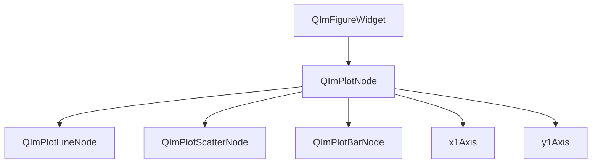

# 2D绘图模块

QIm的2D绘图模块基于 `ImPlot` 封装，提供完整的2D数据可视化功能，包括折线图、散点图、柱状图、热力图等常见图表类型。所有绘图组件均以Qt节点对象的形式呈现，支持信号槽交互和属性系统配置。

## 主要功能特性

**特性**

- ✅ **Figure Widget**：提供Qt Widget风格的绘图窗口，可直接嵌入Qt应用
- ✅ **折线图**：支持多条曲线叠加、自定义样式和标签
- ✅ **数据系列**：灵活的数据输入接口，支持多种数据类型
- ✅ **降采样**：内置LTTB算法，百万级数据高效渲染
- ✅ **子图布局**：支持多行多列子图排列
- ✅ **坐标轴配置**：独立的X/Y轴属性系统
- ✅ **交互操作**：框选、缩放、拖拽等鼠标交互

## 模块架构

2D绘图模块的对象树结构如下：



## 文档导航

| 文档 | 说明 |
|------|------|
| [Figure Widget](figure-widget.md) | 绘图窗口组件的使用方法 |
| [线条图](plot-line.md) | 折线图数据系列的详细配置 |
| [数据系列](data-series.md) | 数据输入接口和类型说明 |
| [降采样](downsampling.md) | 大规模数据降采样优化策略 |

## 快速示例

```cpp
#include <QImFigureWidget.h>

// 创建绘图窗口
QIM::QImFigureWidget* figure = new QIM::QImFigureWidget(this);
setCentralWidget(figure);

// 配置2行1列子图
figure->setSubplotGrid(2, 1);

// 创建第一个子图并添加曲线
QIM::QImPlotNode* plot1 = figure->createPlotNode();
plot1->x1Axis()->setLabel("时间 (s)");
plot1->y1Axis()->setLabel("幅度");

QVector<double> x = {0, 1, 2, 3, 4};
QVector<double> y = {0, 1, 4, 9, 16};
plot1->addLine(x, y, "二次曲线");
```

## 参考

- 核心概念：[渲染节点](../render-node.md)、[对象树](../object-tree.md)
- 示例代码：`examples/qimfigure-test`