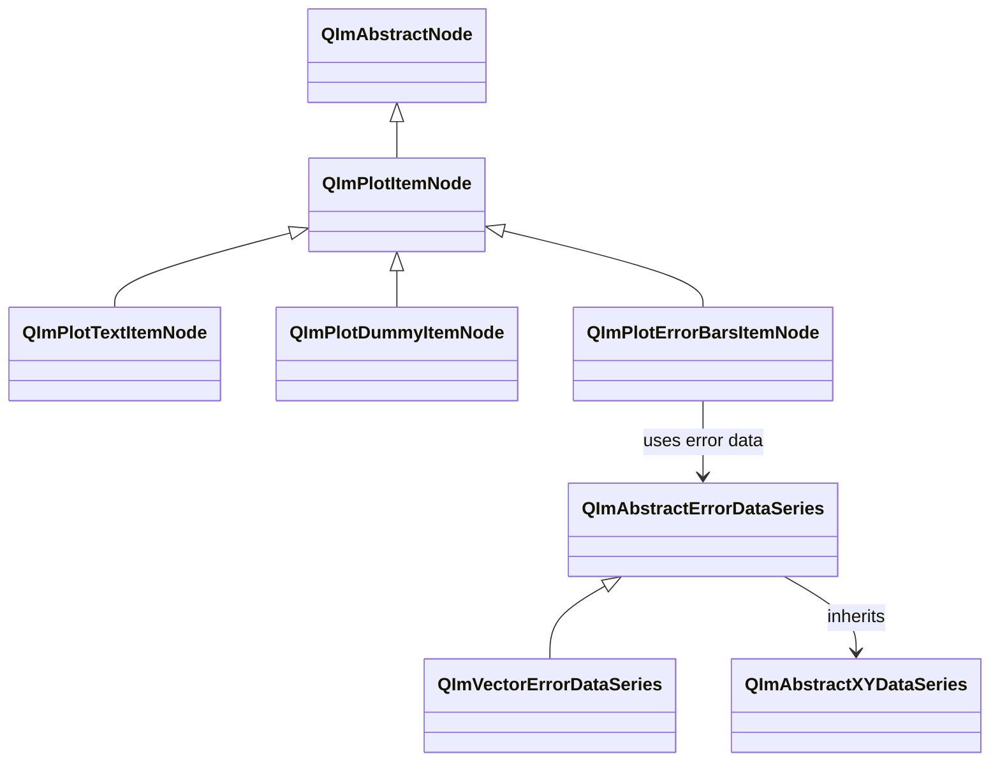
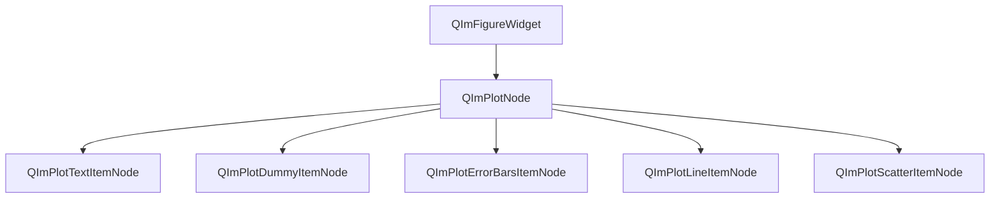
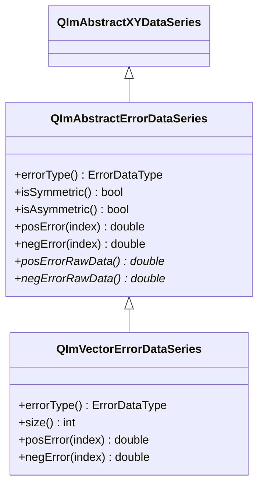

# 2D 标注类使用指南

QIm 提供三种 2D 标注类节点，用于在绘图区域中添加文本标签、图例占位符和误差棒，
分别对应 ImPlot 的 Text、Dummy 和 ErrorBars 绘图项。
这些标注类节点继承自 `QImPlotItemNode`，遵循 QIm 对象树管理机制和 PIMPL 设计模式。

## 主要功能特性

**特性**

- ✅ **文本标签（Text）**：在绘图坐标处渲染文本，支持像素偏移精细定位和垂直方向显示
- ✅ **虚拟项（Dummy）**：仅在图例中创建占位条目，不渲染任何图形，用于自定义图例标注
- ✅ **误差棒（ErrorBars）**：支持对称和非对称误差模式，可切换垂直/水平方向，常与散点图或折线图配合使用
- ✅ **属性系统**：所有标注属性通过 Q_PROPERTY 暴露，支持信号槽响应式编程
- ✅ **对象树管理**：标注节点创建时指定 `QImPlotNode` 为父节点，自动加入对象树

## 基本概念

### 类继承关系



三种标注类节点均继承自 `QImPlotItemNode`，共享基类的 `label`、`visible` 等通用属性。
`QImPlotErrorBarsItemNode` 使用 `QImAbstractErrorDataSeries` 管理误差数据，
其具体实现 `QImVectorErrorDataSeries` 支持对称和非对称两种误差模式。

### 对象树定位

标注节点在 QIm 对象树中的位置：



**对象树说明：**

- 标注节点通过构造函数指定 `QImPlotNode` 为父节点，自动加入对象树
- `QImPlotErrorBarsItemNode` 通常与散点图或折线图并列，共享同一父节点
- `QImPlotDummyItemNode` 仅影响图例，不影响绘图区域内的其他子节点渲染

## QImPlotTextItemNode

`QImPlotTextItemNode` 封装 ImPlot 文本标签，在指定绘图坐标处渲染居中文本，
可选像素偏移和垂直方向。适用于标注数据点、标记特征区域或添加描述性文字。

### 基本使用

该组件的示例位于 `examples/qimfigure-test` 中的 TextFunction，示例截图如下：


创建文本标签并定位到绘图坐标：

```cpp
#include "QImFigureWidget.h"
#include "plot/QImPlotNode.h"
#include "plot/QImPlotTextItemNode.h"

// 创建绘图节点作为父节点
QIM::QImPlotNode* plot = figure->createPlotNode();
plot->setTitle("文本标注示例");
plot->setLegendEnabled(false);

// 创建文本标签，指定 plot 为父节点
QIM::QImPlotTextItemNode* textNode = new QIM::QImPlotTextItemNode(plot);
textNode->setLabel("Text Label");
textNode->setText("关键数据点");          // 设置文本内容
textNode->setPosition(5.0, 3.0);          // 设置绘图坐标位置
textNode->setColor(QColor(255, 0, 0));    // 设置文本颜色

// 效果：在绘图坐标 (5.0, 3.0) 处显示红色文本"关键数据点"
// 对象树结构：figure → plot → textNode
```

### 像素偏移定位

`position` 使用绘图坐标系（与数据点相同的坐标空间），`pixelOffset` 使用屏幕像素坐标系。
两者叠加实现精细定位：先在绘图坐标处定位锚点，再通过像素偏移微调显示位置。

```cpp
// 在数据点附近标注，用像素偏移避免遮挡
textNode->setPosition(3.14, 1.0);      // 锚点定位到绘图坐标 (3.14, 1.0)
textNode->setPixelOffset(10.0f, -5.0f); // 向右偏移 10 像素、向上偏移 5 像素

// 效果：文本标签在 (3.14, 1.0) 的右上方显示，避免与数据点重叠
```

!!! info "position 与 pixelOffset 的区别"
    - `position`：绘图坐标系，随缩放和平移变化。适合标注特定数据位置
    - `pixelOffset`：屏幕像素坐标系，不受缩放影响。适合微调文本与锚点的相对距离

### 垂直方向文本

设置 `vertical` 属性使文本旋转 90° 垂直显示：

```cpp
// 水平方向文本（默认）
textNode->setVertical(false);  // 文本水平显示

// 垂直方向文本
textNode->setVertical(true);   // 文本旋转 90° 垂直显示
```

### 属性列表

| 属性 | 类型 | Getter | Setter | 信号 | 说明 |
|------|------|--------|--------|------|------|
| text | QString | `text()` | `setText()` | `textChanged` | 文本内容 |
| position | QPointF | `position()` | `setPosition()` | `positionChanged` | 绘图坐标位置 |
| pixelOffset | QPointF | `pixelOffset()` | `setPixelOffset()` | `pixelOffsetChanged` | 屏幕像素偏移 |
| vertical | bool | `isVertical()` | `setVertical()` | `verticalChanged` | 是否垂直显示 |
| color | QColor | `color()` | `setColor()` | `colorChanged` | 文本颜色 |

!!! info "便利重载方法"
    - `setPosition(double x, double y)`：接受双精度坐标而非 QPointF
    - `setPixelOffset(float dx, float dy)`：接受浮点偏移而非 QPointF

### 方法列表

| 方法 | 参数 | 说明 |
|------|------|------|
| `setText(text)` | QString | 设置文本内容 |
| `text()` | - | 获取文本内容 |
| `setPosition(pos)` | QPointF | 设置绘图坐标位置 |
| `setPosition(x, y)` | double, double | 设置绘图坐标位置（便利重载） |
| `position()` | - | 获取绘图坐标位置 |
| `setPixelOffset(offset)` | QPointF | 设置屏幕像素偏移 |
| `setPixelOffset(dx, dy)` | float, float | 设置屏幕像素偏移（便利重载） |
| `pixelOffset()` | - | 获取屏幕像素偏移 |
| `setVertical(vertical)` | bool | 设置垂直方向显示 |
| `isVertical()` | - | 检查是否垂直显示 |
| `setColor(color)` | QColor | 设置文本颜色 |
| `color()` | - | 获取文本颜色 |
| `textFlags()` | - | 获取原始 ImPlotTextFlags |
| `setTextFlags(flags)` | int | 设置原始 ImPlotTextFlags |

### 信号列表

| 信号 | 参数 | 触发时机 |
|------|------|----------|
| `textChanged(text)` | QString | 文本内容变更时 |
| `positionChanged(pos)` | QPointF | 绘图坐标位置变更时 |
| `pixelOffsetChanged(offset)` | QPointF | 屏幕像素偏移变更时 |
| `verticalChanged(vertical)` | bool | 垂直方向状态变更时 |
| `colorChanged(color)` | QColor | 文本颜色变更时 |
| `textFlagChanged()` | - | 任何文本标志属性变更时 |

```cpp
// 监控文本位置变更
connect(textNode, &QIM::QImPlotTextItemNode::positionChanged,
        this, [](const QPointF& newPos) {
    qDebug() << "文本位置已更新为:" << newPos;
});
```

!!! warning "textFlagChanged 信号"
    所有文本标志属性（vertical 等）共用 `textFlagChanged()` 信号。
    此信号不指示具体哪个标志发生变更，连接的槽函数需查询相关属性以确定变更内容。

### 示例代码

完整示例来自 `examples/qimfigure-test/functions/other/TextFunction.cpp`：

```cpp
void TextFunction::createPlot(QIM::QImFigureWidget* figure)
{
    // 创建绘图节点
    m_plotNode = figure->createPlotNode();
    
    // 配置坐标轴和标题
    m_plotNode->x1Axis()->setLabel(m_xLabel);
    m_plotNode->y1Axis()->setLabel(m_yLabel);
    m_plotNode->setTitle(m_title);
    m_plotNode->setLegendEnabled(false);
    
    // 设置绘图范围
    m_plotNode->x1Axis()->setLimits(-10.0, 10.0);
    m_plotNode->y1Axis()->setLimits(-10.0, 10.0);
    
    // 创建文本标签节点
    m_textNode = new QIM::QImPlotTextItemNode(m_plotNode);  // 指定 plot 为父节点
    m_textNode->setLabel("Text Label");
    m_textNode->setText(m_text);
    m_textNode->setPosition(m_textX, m_textY);              // 绘图坐标定位
    m_textNode->setPixelOffset(m_pixelOffsetX, m_pixelOffsetY); // 像素偏移微调
    m_textNode->setVertical(m_vertical);                     // 垂直方向控制
    m_textNode->setColor(m_textColor);                       // 文本颜色
}
```

## QImPlotDummyItemNode

`QImPlotDummyItemNode` 是一种特殊的标注节点，仅在图例中创建带有颜色图标的占位条目，
不在绘图区域渲染任何可见图形。

### 设计用途

虚拟项的核心用途是为图例添加自定义标注条目，而不与实际绘图数据关联：

- 为手动标注添加图例说明
- 表示分组数据的类别标识
- 作为图例中的分隔或提示条目

```text
绘图区域：仅显示折线数据（虚拟项不渲染）
图例区域：
┌─────────────────────┐
│ ── Sine Wave        │ ← 折线图例条目
│ ■ Reference         │ ← 虚拟项图例条目（仅图标+标签）
└─────────────────────┘
```

!!! info "虚拟项不渲染任何图形"
    `QImPlotDummyItemNode` 只在图例中创建一个带颜色图标和标签的条目，
    绘图区域中不会出现任何与之对应的图形元素。

### 基本使用

该组件的示例位于 `examples/qimfigure-test` 中的 DummyFunction，示例截图如下：


创建虚拟项作为图例占位：

```cpp
#include "QImFigureWidget.h"
#include "plot/QImPlotNode.h"
#include "plot/QImPlotLineItemNode.h"
#include "plot/QImPlotDummyItemNode.h"

// 创建绘图节点
QIM::QImPlotNode* plot = figure->createPlotNode();
plot->setTitle("虚拟项示例");
plot->setLegendEnabled(true);  // 必须启用图例才能看到虚拟项

// 创建折线图数据
std::vector<double> xData, yData;
for (int i = 0; i < 200; ++i) {
    xData.push_back(i * 0.05);
    yData.push_back(std::sin(xData[i]) * 5.0);
}

// 创建折线节点
QIM::QImPlotLineItemNode* lineNode = new QIM::QImPlotLineItemNode(plot);
lineNode->setLabel("Sine Wave");
lineNode->setData(xData, yData);
lineNode->setColor(QColor(0, 114, 189));

// 创建虚拟项节点，仅作为图例占位
QIM::QImPlotDummyItemNode* dummyNode = new QIM::QImPlotDummyItemNode(plot);
dummyNode->setLabel("Reference");         // 图例中显示的标签
dummyNode->setColor(QColor(255, 165, 0)); // 图例图标颜色

// 效果：图例中显示两条条目——折线"Sine Wave"和虚拟项"Reference"
// 绘图区域仅显示折线数据，虚拟项不渲染任何图形
// 对象树结构：figure → plot → lineNode, dummyNode
```

!!! warning "图例必须启用"
    虚拟项仅在图例中可见。如果 `QImPlotNode` 的 `legendEnabled` 为 `false`，
    虚拟项将完全不可见。创建虚拟项前应确保图例已启用：
    ```cpp
    plot->setLegendEnabled(true);  // 启用图例
    ```

### 属性列表

| 属性 | 类型 | Getter | Setter | 信号 | 说明 |
|------|------|--------|--------|------|------|
| color | QColor | `color()` | `setColor()` | `colorChanged` | 图例图标颜色 |

!!! info "label 属性"
    `label` 属性继承自 `QImPlotItemNode` 基类，通过 `setLabel()` 设置图例标签文本，
    `label()` 获取标签。这是虚拟项最重要的属性，决定了图例中显示的文字。

### 方法列表

| 方法 | 参数 | 说明 |
|------|------|------|
| `setColor(color)` | QColor | 设置图例图标颜色 |
| `color()` | - | 获取图例图标颜色 |
| `dummyFlags()` | - | 获取原始 ImPlotDummyFlags |
| `setDummyFlags(flags)` | int | 设置原始 ImPlotDummyFlags |

### 信号列表

| 信号 | 参数 | 触发时机 |
|------|------|----------|
| `colorChanged(color)` | QColor | 图例图标颜色变更时 |
| `dummyFlagsChanged()` | - | 虚拟项标志变更时 |

```cpp
// 监控虚拟项颜色变更
connect(dummyNode, &QIM::QImPlotDummyItemNode::colorChanged,
        this, [](const QColor& newColor) {
    qDebug() << "虚拟项颜色已更新为:" << newColor.name();
});
```

!!! warning "dummyFlagsChanged 信号"
    所有虚拟项标志属性共用 `dummyFlagsChanged()` 信号。
    此信号不指示具体哪个标志发生变更，连接的槽函数需查询相关属性以确定变更内容。

### 示例代码

完整示例来自 `examples/qimfigure-test/functions/other/DummyFunction.cpp`：

```cpp
void DummyFunction::createPlot(QIM::QImFigureWidget* figure)
{
    // 创建绘图节点
    m_plotNode = figure->createPlotNode();
    
    // 配置坐标轴和标题
    m_plotNode->x1Axis()->setLabel(m_xLabel);
    m_plotNode->y1Axis()->setLabel(m_yLabel);
    m_plotNode->setTitle(m_title);
    m_plotNode->setLegendEnabled(true);  // 启用图例以显示虚拟项
    
    // 生成 200 点正弦波数据
    const int numPoints = 200;
    std::vector<double> xData(numPoints);
    std::vector<double> yData(numPoints);
    for (int i = 0; i < numPoints; ++i) {
        xData[i] = i * 0.05;
        yData[i] = std::sin(xData[i]) * 5.0;
    }
    
    // 创建折线节点作为背景数据
    m_lineNode = new QIM::QImPlotLineItemNode(m_plotNode);
    m_lineNode->setLabel("Sine Wave");
    m_lineNode->setData(xData, yData);
    m_lineNode->setColor(m_lineColor);
    
    // 创建虚拟项节点，仅作为图例占位
    m_dummyNode = new QIM::QImPlotDummyItemNode(m_plotNode);  // 指定 plot 为父节点
    m_dummyNode->setLabel("Reference");       // 图例标签
    m_dummyNode->setColor(m_dummyColor);      // 图例图标颜色
    
    // 创建值追踪器
    m_trackerNode = new QIM::QImPlotValueTrackerNode(m_plotNode);
    m_trackerNode->setGroup(nullptr);
    m_plotNode->addChildNode(m_trackerNode);
}
```

## QImPlotErrorBarsItemNode

`QImPlotErrorBarsItemNode` 封装 ImPlot 误差棒，支持对称和非对称两种误差模式，
以及垂直和水平方向。误差棒通常与散点图或折线图配合使用，
可视化数据不确定性或测量误差。

### 误差模式

#### 对称误差模式

对称模式下，每个数据点的上下（或左右）误差相同，
通过 `setData(x, y, errors)` 设置：

```text
        │  ← 上误差 = errors[i]
    ●───┤
        │  ← 下误差 = errors[i]
```

```cpp
// 对称误差：上下误差相同
std::vector<double> x = {0, 1, 2, 3};
std::vector<double> y = {1.0, 2.5, 4.0, 6.5};
std::vector<double> errors = {0.2, 0.3, 0.4, 0.5};  // 上下误差均为此值

QIM::QImPlotErrorBarsItemNode* errorBars = new QIM::QImPlotErrorBarsItemNode(plot);
errorBars->setLabel("对称误差");
errorBars->setData(x, y, errors);  // 3 参数：对称模式
// errorBars->isAsymmetricMode() 返回 false
```

#### 非对称误差模式

非对称模式下，每个数据点的上下（或左右）误差不同，
通过 `setData(x, y, negErrors, posErrors)` 设置：

```text
        │  ← 上误差 = posErrors[i]（较大）
    ●───┤
        │  ← 下误差 = negErrors[i]（较小）
```

```cpp
// 非对称误差：上下误差不同
std::vector<double> x = {0, 1, 2, 3};
std::vector<double> y = {1.0, 2.5, 4.0, 6.5};
std::vector<double> negErrors = {0.1, 0.15, 0.2, 0.25};  // 下误差（较小）
std::vector<double> posErrors = {0.3, 0.45, 0.6, 0.75};  // 上误差（较大）

QIM::QImPlotErrorBarsItemNode* errorBars = new QIM::QImPlotErrorBarsItemNode(plot);
errorBars->setLabel("非对称误差");
errorBars->setData(x, y, negErrors, posErrors);  // 4 参数：非对称模式
// errorBars->isAsymmetricMode() 返回 true
```

!!! warning "非对称误差数组大小"
    非对称误差模式下，`negErrors` 和 `posErrors` 数组的大小必须与 `x`、`y` 数组相同。
    大小不一致将导致渲染错误或数据截断。

!!! info "isAsymmetricMode 属性"
    `isAsymmetricMode()` 返回 `true` 表示当前使用非对称误差模式，
    返回 `false` 表示使用对称误差模式。此属性由 `setData()` 调用自动确定，
    不可手动设置。

### 方向控制

误差棒默认垂直显示（沿 Y 轴方向），设置 `horizontal` 属性切换为水平方向（沿 X 轴方向）：

```text
垂直误差棒（默认）：         水平误差棒：
        │                    ───●───
    ●───┤                    ← 左误差  右误差 →
        │
```

```cpp
// 垂直误差棒（默认）
errorBars->setHorizontal(false);  // 误差棒沿 Y 轴方向显示

// 水平误差棒
errorBars->setHorizontal(true);   // 误差棒沿 X 轴方向显示
```

### 基本使用

该组件的示例位于 `examples/qimfigure-test` 中的 ErrorBarsFunction，示例截图如下：


创建误差棒并与散点图配合使用：

```cpp
#include "QImFigureWidget.h"
#include "plot/QImPlotNode.h"
#include "plot/QImPlotScatterItemNode.h"
#include "plot/QImPlotErrorBarsItemNode.h"

// 创建绘图节点
QIM::QImPlotNode* plot = figure->createPlotNode();
plot->setTitle("误差棒示例");
plot->setLegendEnabled(true);

// 生成数据
const int numPoints = 10;
std::vector<double> xData(numPoints);
std::vector<double> yData(numPoints);
std::vector<double> errors(numPoints);
for (int i = 0; i < numPoints; ++i) {
    xData[i] = i;
    yData[i] = static_cast<double>(i * i) / 5.0 + 2.0;
    errors[i] = 0.5 + static_cast<double>(i) * 0.1;
}

// 创建散点图节点
QIM::QImPlotScatterItemNode* scatter = new QIM::QImPlotScatterItemNode(plot);
scatter->setLabel("数据点");
scatter->setData(xData, yData);
scatter->setMarkerSize(6.0f);
scatter->setColor(Qt::blue);

// 创建对称误差棒节点
QIM::QImPlotErrorBarsItemNode* errorBars = new QIM::QImPlotErrorBarsItemNode(plot);
errorBars->setLabel("对称误差");
errorBars->setData(xData, yData, errors);  // 3 参数：对称模式
errorBars->setColor(QColor(200, 50, 50));

// 效果：散点图上显示垂直误差棒，每个数据点的上下误差相同
// 对象树结构：figure → plot → scatter, errorBars
```

### 误差数据系列

`QImPlotErrorBarsItemNode` 使用 `QImAbstractErrorDataSeries` 管理误差数据。
`setData()` 的模板方法内部自动创建 `QImVectorErrorDataSeries` 对象：



**QImAbstractErrorDataSeries 关键接口：**

| 方法 | 说明 |
|------|------|
| `errorType()` | 返回 `SymmetricError` 或 `AsymmetricError` |
| `isSymmetric()` | 对称误差模式返回 `true` |
| `isAsymmetric()` | 非对称误差模式返回 `true` |
| `posError(index)` | 获取指定索引的正误差值 |
| `negError(index)` | 获取指定索引的负误差值（对称模式下与正误差相同） |

!!! info "setData() 容器支持"
    `setData()` 是模板方法，支持 `std::vector<double>`、`QVector<double>` 等容器类型，
    容器的 `value_type` 必须为 `double`。内部自动创建 `QImVectorErrorDataSeries` 并接管数据生命周期。

### 属性列表

| 属性 | 类型 | Getter | Setter | 信号 | 说明 |
|------|------|--------|--------|------|------|
| horizontal | bool | `isHorizontal()` | `setHorizontal()` | `orientationChanged` | 水平方向标志 |
| color | QColor | `color()` | `setColor()` | `colorChanged` | 误差棒颜色 |
| isAsymmetricMode | bool | `isAsymmetricMode()` | - | - | 非对称误差模式标志（只读） |

!!! info "isAsymmetricMode 为只读属性"
    `isAsymmetricMode()` 是只读属性，不可通过 setter 设置。
    其值由 `setData()` 调用自动确定：3 参数为对称模式（`false`），4 参数为非对称模式（`true`）。

### 方法列表

| 方法 | 参数 | 说明 |
|------|------|------|
| `setData(errorDataSeries)` | `QImAbstractErrorDataSeries*` | 设置误差数据系列对象 |
| `setData(x, y, errors)` | Container, Container, Container | 对称误差：3 参数模板方法 |
| `setData(x, y, negErrors, posErrors)` | Container, Container, Container, Container | 非对称误差：4 参数模板方法 |
| `data()` | - | 获取误差数据系列对象 |
| `setHorizontal(horizontal)` | bool | 设置水平方向标志 |
| `isHorizontal()` | - | 检查是否水平方向 |
| `setColor(color)` | QColor | 设置误差棒颜色 |
| `color()` | - | 获取误差棒颜色 |
| `isAsymmetricMode()` | - | 检查是否非对称误差模式 |
| `errorBarsFlags()` | - | 获取原始 ImPlotErrorBarsFlags |
| `setErrorBarsFlags(flags)` | int | 设置原始 ImPlotErrorBarsFlags |

### 信号列表

| 信号 | 参数 | 触发时机 |
|------|------|----------|
| `orientationChanged(horizontal)` | bool | 方向变更时 |
| `colorChanged(color)` | QColor | 误差棒颜色变更时 |
| `dataChanged()` | - | 数据系列变更时 |
| `errorBarsFlagChanged()` | - | 任何误差棒标志变更时 |

```cpp
// 监控方向变更
connect(errorBars, &QIM::QImPlotErrorBarsItemNode::orientationChanged,
        this, [](bool horizontal) {
    qDebug() << "误差棒方向已切换为:" << (horizontal ? "水平" : "垂直");
});

// 监控数据变更
connect(errorBars, &QIM::QImPlotErrorBarsItemNode::dataChanged,
        this, [errorBars]() {
    qDebug() << "误差数据已更新，非对称模式:" << errorBars->isAsymmetricMode();
});
```

!!! warning "errorBarsFlagChanged 信号"
    所有误差棒标志属性（horizontal 等）共用 `errorBarsFlagChanged()` 信号。
    此信号不指示具体哪个标志发生变更，连接的槽函数需查询相关属性以确定变更内容。

### 示例代码

完整示例来自 `examples/qimfigure-test/functions/error/ErrorBarsFunction.cpp`：

```cpp
void ErrorBarsFunction::createPlot(QIM::QImFigureWidget* figure)
{
    // 创建绘图节点
    m_plotNode = figure->createPlotNode();
    
    // 配置坐标轴和标题
    m_plotNode->x1Axis()->setLabel(m_xLabel);
    m_plotNode->y1Axis()->setLabel(m_yLabel);
    m_plotNode->setTitle(m_title);
    m_plotNode->setLegendEnabled(true);
    
    // 生成数据：10 个数据点
    const int numPoints = 10;
    std::vector<double> xData(numPoints);
    std::vector<double> yData(numPoints);
    std::vector<double> errors(numPoints);       // 对称误差
    std::vector<double> negErrors(numPoints);    // 非对称下误差
    std::vector<double> posErrors(numPoints);    // 非对称上误差
    
    for (int i = 0; i < numPoints; ++i) {
        xData[i] = i;
        yData[i] = static_cast<double>(i * i) / 5.0 + 2.0;
        errors[i] = 0.5 + static_cast<double>(i) * 0.1;           // 对称误差
        negErrors[i] = 0.3 + static_cast<double>(i) * 0.05;       // 下误差（较小）
        posErrors[i] = 0.7 + static_cast<double>(i) * 0.15;       // 上误差（较大）
    }
    
    // 添加散点图1作为基础数据
    m_scatterNode1 = new QIM::QImPlotScatterItemNode(m_plotNode);
    m_scatterNode1->setLabel("Data Points");
    m_scatterNode1->setData(xData, yData);
    m_scatterNode1->setMarkerSize(6.0f);
    m_scatterNode1->setMarkerShape(ImPlotMarker_Circle);
    m_scatterNode1->setColor(Qt::blue);
    
    // 添加对称误差棒（垂直方向，默认）
    m_errorBarsNode1 = new QIM::QImPlotErrorBarsItemNode(m_plotNode);
    m_errorBarsNode1->setLabel("Symmetric Errors");
    m_errorBarsNode1->setData(xData, yData, errors);  // 3 参数：对称模式
    m_errorBarsNode1->setColor(m_errorColor);
    
    // 生成 X 偏移数据避免重叠
    std::vector<double> xOffset(numPoints);
    for (int i = 0; i < numPoints; ++i) {
        xOffset[i] = xData[i] + 0.3;
    }
    
    // 添加散点图2（X 偏移）
    m_scatterNode2 = new QIM::QImPlotScatterItemNode(m_plotNode);
    m_scatterNode2->setLabel("Data Points 2");
    m_scatterNode2->setData(xOffset, yData);
    m_scatterNode2->setMarkerSize(6.0f);
    m_scatterNode2->setMarkerShape(ImPlotMarker_Square);
    m_scatterNode2->setColor(Qt::green);
    
    // 添加非对称水平误差棒
    m_errorBarsNode2 = new QIM::QImPlotErrorBarsItemNode(m_plotNode);
    m_errorBarsNode2->setLabel("Asymmetric Horizontal");
    m_errorBarsNode2->setData(xOffset, yData, negErrors, posErrors);  // 4 参数：非对称模式
    m_errorBarsNode2->setHorizontal(m_horizontalMode);  // 水平方向
    m_errorBarsNode2->setColor(Qt::darkGreen);
    
    // 添加值追踪器
    m_trackerNode = new QIM::QImPlotValueTrackerNode(m_plotNode);
    m_trackerNode->setGroup(nullptr);
    m_plotNode->addChildNode(m_trackerNode);
}
```

## 信号槽连接

三种标注类节点的信号使用方式一致，均遵循 Qt 信号槽机制：

```cpp
// Text 信号连接
connect(textNode, &QIM::QImPlotTextItemNode::positionChanged,
        this, &MyClass::onTextPositionChanged);

// Dummy 信号连接
connect(dummyNode, &QIM::QImPlotDummyItemNode::colorChanged,
        this, &MyClass::onDummyColorChanged);

// ErrorBars 信号连接
connect(errorBars, &QIM::QImPlotErrorBarsItemNode::dataChanged,
        this, &MyClass::onErrorDataChanged);
connect(errorBars, &QIM::QImPlotErrorBarsItemNode::orientationChanged,
        this, [](bool horizontal) {
    qDebug() << "误差棒方向:" << (horizontal ? "水平" : "垂直");
});
```

!!! info "信号命名约定"
    QIm 信号命名遵循 Qt 惯例：属性变更信号为 `propertyNameChanged`，
    标志变更信号为 `flagNameChanged`（如 `textFlagChanged`、`dummyFlagsChanged`）。
    注意使用 `Q_SIGNALS` 而非 `signals` 关键字。

## 注意事项

!!! warning "对象树父子关系"
    创建标注节点时，必须指定 `QImPlotNode` 为父节点：
    ```cpp
    // 正确：构造时指定父节点（推荐）
    QIM::QImPlotTextItemNode* text = new QIM::QImPlotTextItemNode(plot);
    
    // 正确：通过 addPlotItem() 添加
    QIM::QImPlotTextItemNode* text = new QIM::QImPlotTextItemNode();
    plot->addPlotItem(text);
    ```
    两种方式等效。方式1 更符合 Qt 对象树习惯，节点生命周期由父节点管理。

!!! warning "误差棒与数据节点的关系"
    误差棒节点的 `setData()` 需要独立的 X/Y 数据，而非引用散点图或折线图的数据。
    这意味着误差棒与数据节点使用相同的数据数组但各自持有独立副本：
    ```cpp
    // 误差棒和数据节点共享相同的 x, y 数据源
    scatter->setData(xData, yData);
    errorBars->setData(xData, yData, errors);  // 独立持有 x, y 副本
    ```

!!! info "label 与图例分组"
    标注节点的 `label` 属性（继承自 `QImPlotItemNode`）决定图例中显示的文本。
    ErrorBars 的 `label` 通常应与关联的散点图或折线图匹配以便图例分组显示。

!!! tip "颜色默认值"
    所有标注类节点的 `color` 属性未设置时，使用 ImPlot 的默认颜色序列自动分配颜色。
    如需精确控制颜色，应在创建节点后立即调用 `setColor()`。

## 参考

- 相关文档：[QImPlotNode](plot-node.md)、[坐标轴配置](plot-axis.md)、[渲染节点](../render-node.md)
- 示例代码：`examples/qimfigure-test/functions/other/TextFunction.cpp`、`examples/qimfigure-test/functions/other/DummyFunction.cpp`、`examples/qimfigure-test/functions/error/ErrorBarsFunction.cpp`
- API参考：`src/core/plot/QImPlotTextItemNode.h`、`src/core/plot/QImPlotDummyItemNode.h`、`src/core/plot/QImPlotErrorBarsItemNode.h`、`src/core/plot/QImPlotErrorDataSeries.h`