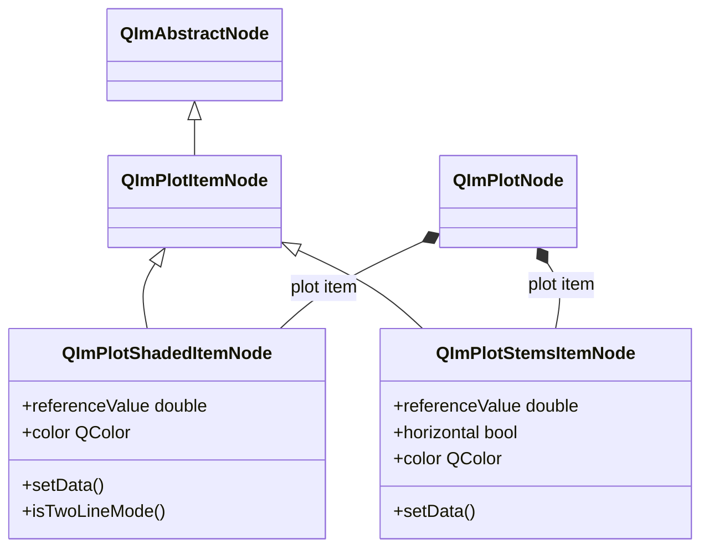
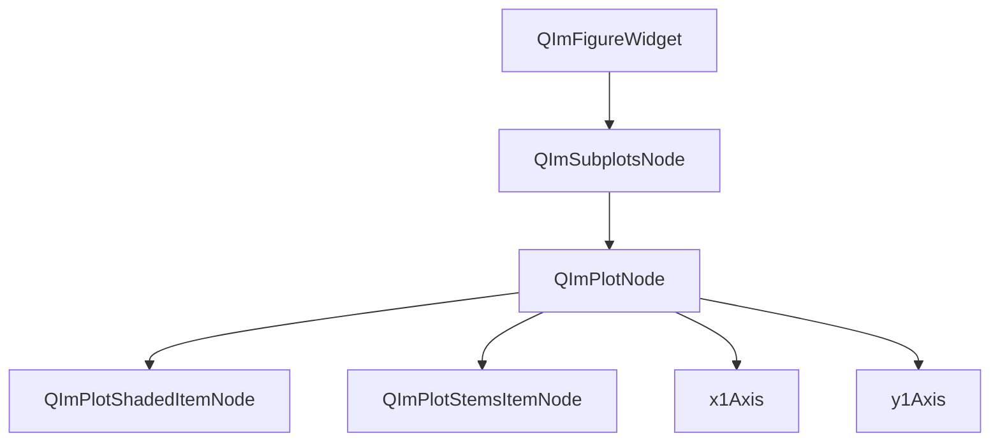

# 填充区域图使用指南

`QImPlotShadedItemNode` 和 `QImPlotStemsItemNode` 是 QIm 中用于绘制填充区域和茎叶图的两个核心节点，
分别继承自 `QImPlotItemNode`，适用于面积图、置信区间可视化以及离散数据点与基线的关系展示。

## 主要功能特性

**QImPlotShadedItemNode 特性**

- ✅ **单线填充模式**：将一条数据曲线与水平参考值之间的区域填充颜色，适合面积图和基线对比
- ✅ **双线填充模式**：将两条数据曲线之间的区域填充颜色，适合置信区间和上下限区间可视化
- ✅ **参考值控制**：通过 `referenceValue` 属性设置单线模式的填充参考线，支持 ±∞ 填充到无穷
- ✅ **颜色自定义**：通过 `color` 属性设置填充区域颜色，未设置时使用 ImPlot 默认颜色序列

**QImPlotStemsItemNode 特性**

- ✅ **茎线绘制**：从参考值（基线）到每个数据点绘制垂直或水平线条
- ✅ **方向切换**：支持垂直茎线（默认）和水平茎线，通过 `horizontal` 属性切换
- ✅ **基线控制**：通过 `referenceValue` 属性设置茎线的起点基线
- ✅ **颜色自定义**：通过 `color` 属性设置茎线颜色

## 基本概念

### 类继承关系



`QImPlotShadedItemNode` 和 `QImPlotStemsItemNode` 均继承自 `QImPlotItemNode`，
后者继承自 `QImAbstractNode`。它们作为 `QImPlotNode` 的子节点加入对象树，
在父节点的 `BeginPlot/EndPlot` 渲染上下文中完成绘制。

### 对象树定位

填充区域图节点在 QIm 对象树中的位置：



**对象树说明：**

- `QImPlotShadedItemNode` 和 `QImPlotStemsItemNode` 通过构造时指定 `QImPlotNode` 为父节点，自动加入对象树
- 它们与 `QImPlotLineItemNode`、`QImPlotScatterItemNode` 等其他绘图项目节点共享同一父节点层级
- 多个填充区域图节点可以共存于同一个 `QImPlotNode` 下

### Shaded 与 Stems 的区别

| 特性 | QImPlotShadedItemNode | QImPlotStemsItemNode |
|------|-----------------------|----------------------|
| 渲染方式 | 填充区域颜色 | 绘制茎线（垂直/水平线条） |
| 视觉效果 | 连续的半透明填充区域 | 从基线到数据点的离散线条 |
| 适用场景 | 面积图、置信区间、误差范围 | 离散数据展示、基线偏差可视化 |
| 数据模式 | 单线或双线 | 单系列 |
| 方向 | 仅垂直 | 垂直或水平 |
| 参考值含义 | 单线模式下填充到参考值 | 茎线的起点基线 |

**示意对比：**

```text
Shaded（单线模式）：         Stems（垂直模式）：
    ╱╲   ╱╲                  |   |   |
   ████ ████                 |   |   |
  ███████████    ← ref=0     ────|───|────  ← ref=0
  ███████████                 |   |   |
 ████  ████  ████            ─┘  ─┘  ─┘
────────────────            ────────────────
```

## 使用方法

Shaded 的示例位于 `examples/qimfigure-test/functions/shaded/ShadedFunction.cpp`，
Stems 的示例位于 `examples/qimfigure-test/functions/other/StemsFunction.cpp`。

### 1. Shaded 单线填充模式

单线填充模式下，数据曲线与水平参考值之间的区域被填充颜色。

```cpp
#include "QImFigureWidget.h"
#include "plot/QImPlotNode.h"
#include "plot/QImPlotShadedItemNode.h"

// 创建绘图窗口
QIM::QImFigureWidget* figure = new QIM::QImFigureWidget(this);

// 创建绘图节点
QIM::QImPlotNode* plot = figure->createPlotNode();
plot->setTitle("单线填充模式");
plot->setLegendEnabled(true);

// 生成正弦波数据
const int numPoints = 100;
std::vector<double> xData(numPoints);
std::vector<double> yData(numPoints);
for (int i = 0; i < numPoints; ++i) {
    xData[i] = i * 0.1;
    yData[i] = std::sin(xData[i]) * 5.0 + 5.0;  // 范围 0~10
}

// 创建填充区域节点，以 plot 为父节点
QIM::QImPlotShadedItemNode* shaded = new QIM::QImPlotShadedItemNode(plot);
shaded->setLabel("Shaded Area");
shaded->setData(xData, yData);       // 单线模式：传入一组数据
shaded->setReferenceValue(0.0);      // 参考值为 0，填充从 0 到数据线
shaded->setColor(QColor(0, 114, 189));

// 效果：数据线与 y=0 之间的区域被蓝色填充
```

**单线模式说明：**

- `setData(x, y)` 传入一组 X/Y 数据，节点进入单线填充模式
- `referenceValue` 设置水平参考线位置，数据线与参考线之间的区域被填充
- 默认参考值为 0.0
- 使用 `-INFINITY` 可让填充延伸到负无穷，`+INFINITY` 可延伸到正无穷

!!! tip "参考值技巧"
    `setReferenceValue(-INFINITY)` 可实现从负无穷到数据线的完全填充，
    适用于只关注数据线上方区域的场景。同理，`setReferenceValue(+INFINITY)` 填充数据线下方。

### 2. Shaded 双线填充模式

双线填充模式下，两条数据曲线之间的区域被填充颜色，常用于置信区间、上下限范围可视化。

```cpp
#include "QImFigureWidget.h"
#include "plot/QImPlotNode.h"
#include "plot/QImPlotShadedItemNode.h"
#include "plot/QImPlotDataSeries.h"

// 创建绘图窗口
QIM::QImFigureWidget* figure = new QIM::QImFigureWidget(this);
QIM::QImPlotNode* plot = figure->createPlotNode();
plot->setTitle("双线填充模式 - 置信区间");

// 生成数据
const int numPoints = 100;
std::vector<double> xData(numPoints);
std::vector<double> yData(numPoints);
for (int i = 0; i < numPoints; ++i) {
    xData[i] = i * 0.1;
    yData[i] = std::sin(xData[i]) * 5.0 + 5.0;
}

// 计算上下边界（±2 的偏移）
std::vector<double> yUpper(numPoints);
std::vector<double> yLower(numPoints);
for (int i = 0; i < numPoints; ++i) {
    yUpper[i] = yData[i] + 2.0;   // 上界
    yLower[i] = yData[i] - 2.0;   // 下界
}

// 创建填充区域节点，以 plot 为父节点
QIM::QImPlotShadedItemNode* shaded = new QIM::QImPlotShadedItemNode(plot);
shaded->setLabel("置信区间");

// 双线模式：传入两个数据系列
QIM::QImAbstractXYDataSeries* lowerSeries = new QIM::QImVectorXYDataSeries(xData, yLower);
QIM::QImAbstractXYDataSeries* upperSeries = new QIM::QImVectorXYDataSeries(xData, yUpper);
shaded->setData(lowerSeries, upperSeries);  // 填充两条线之间的区域

shaded->setColor(QColor(0, 114, 189, 80));  // 半透明蓝色

// 效果：上下两条边界线之间的区域被半透明蓝色填充，形成置信区间视觉效果
```

**双线模式说明：**

- `setData(series1, series2)` 传入两个数据系列，节点自动进入双线填充模式
- `isTwoLineMode()` 返回 `true` 表示当前处于双线模式
- 也可以使用模板方法 `setData(x, y1, y2)` 直接传入容器数据

!!! warning "双线模式数据要求"
    双线填充模式的两个数据系列必须具有**相同的 X 坐标**。
    X 坐标不一致会导致填充区域计算错误。

!!! info "模式切换"
    单线模式与双线模式通过 `setData()` 的调用形式自动区分：
    - `setData(series)` 或 `setData(x, y)` → 单线模式
    - `setData(series1, series2)` 或 `setData(x, y1, y2)` → 双线模式
    模式切换需要重新调用 `setData()`，不支持运行中动态切换。

### 3. Stems 茎叶图基本使用

茎叶图从基线到每个数据点绘制线条，适合展示离散数据与基线的偏差关系。

```cpp
#include "QImFigureWidget.h"
#include "plot/QImPlotNode.h"
#include "plot/QImPlotStemsItemNode.h"

// 创建绘图窗口
QIM::QImFigureWidget* figure = new QIM::QImFigureWidget(this);
QIM::QImPlotNode* plot = figure->createPlotNode();
plot->setTitle("茎叶图 - 衰减正弦波");
plot->setLegendEnabled(true);

// 生成衰减正弦波数据（20 个离散点）
const int numPoints = 20;
std::vector<double> xData(numPoints);
std::vector<double> yData(numPoints);
for (int i = 0; i < numPoints; ++i) {
    xData[i] = i;
    yData[i] = std::sin(i * 0.5) * std::exp(-i * 0.1) * 10.0;
}

// 创建茎叶图节点，以 plot 为父节点
QIM::QImPlotStemsItemNode* stems = new QIM::QImPlotStemsItemNode(plot);
stems->setLabel("衰减信号");
stems->setData(xData, yData);           // 设置数据
stems->setReferenceValue(0.0);          // 基线为 0
stems->setColor(QColor(0, 114, 189));   // 茎线颜色

// 效果：从 y=0 基线到每个数据点绘制垂直茎线，数据点在茎线顶端
```

**Stems 说明：**

- `setData(x, y)` 传入一组 X/Y 数据
- `referenceValue` 设置茎线的起点基线，默认为 0.0
- 默认绘制垂直茎线（从基线到数据点沿 Y 方向）

### 4. Stems 水平茎叶图

水平模式下，茎线沿 X 方向绘制，适合展示数据点与 X 轴基线的水平偏差。

```cpp
// 创建绘图节点
QIM::QImPlotNode* plot = figure->createPlotNode();
plot->setTitle("水平茎叶图");

// 生成数据
std::vector<double> xData = {1, 2, 3, 4, 5, 6, 7, 8};
std::vector<double> yData = {3.5, 2.8, 5.1, 4.0, 6.2, 3.7, 5.5, 4.3};

// 创建水平茎叶图节点
QIM::QImPlotStemsItemNode* stems = new QIM::QImPlotStemsItemNode(plot);
stems->setLabel("水平茎线");
stems->setData(xData, yData);
stems->setReferenceValue(0.0);         // 基线为 0
stems->setHorizontal(true);            // 启用水平方向
stems->setColor(QColor(217, 83, 25));  // 红色茎线

// 效果：从 x=0 基线到每个数据点绘制水平茎线
// 每条茎线的 Y 坐标为数据点的 Y 值，X 方向从参考值延伸到数据点的 X 值
```

!!! info "水平方向说明"
    垂直茎线：沿 Y 轴方向绘制，基线是一条水平线（y = referenceValue）
    水平茎线：沿 X 轴方向绘制，基线是一条垂直线（x = referenceValue）

### 5. 配置样式属性

Shaded 和 Stems 均支持通过属性系统进行样式配置：

```cpp
// Shaded 样式配置
QIM::QImPlotShadedItemNode* shaded = new QIM::QImPlotShadedItemNode(plot);

// 填充颜色（支持半透明）
shaded->setColor(QColor(0, 114, 189, 100));  // 半透明蓝色

// 参考值
shaded->setReferenceValue(5.0);   // 单线模式下填充到 y=5

// Shaded 标志位（高级用法）
shaded->setShadedFlags(0);  // 设置 ImPlotShadedFlags

// Stems 样式配置
QIM::QImPlotStemsItemNode* stems = new QIM::QImPlotStemsItemNode(plot);

// 茎线颜色
stems->setColor(QColor(80, 170, 90));  // 绿色

// 基线
stems->setReferenceValue(2.5);  // 茎线从 y=2.5 开始

// 方向
stems->setHorizontal(false);  // 垂直方向（默认）
stems->setHorizontal(true);   // 水平方向

// Stems 标志位（高级用法）
stems->setStemsFlags(0);  // 设置 ImPlotStemsFlags
```

!!! tip "半透明填充"
    Shaded 的 `setColor()` 支持 QColor 的 alpha 通道，通过半透明颜色可以
    在同一图表上叠加多个填充区域而不完全遮挡底层数据。

## API 参考

### QImPlotShadedItemNode 属性列表

| 属性 | 类型 | Getter | Setter | 信号 | 说明 |
|------|------|--------|--------|------|------|
| referenceValue | double | `referenceValue()` | `setReferenceValue()` | `referenceValueChanged` | 单线模式的参考值（Y 轴），默认 0.0 |
| color | QColor | `color()` | `setColor()` | `colorChanged` | 填充区域颜色 |

### QImPlotShadedItemNode 方法列表

| 方法 | 参数 | 说明 |
|------|------|------|
| `setData(series)` | `QImAbstractXYDataSeries*` | 单线模式：设置一组数据系列 |
| `setData(x, y)` | Container, Container | 单线模式：设置 X/Y 容器数据（模板方法） |
| `setData(series1, series2)` | `QImAbstractXYDataSeries*`, `QImAbstractXYDataSeries*` | 双线模式：设置上下界数据系列 |
| `setData(x, y1, y2)` | Container, Container, Container | 双线模式：设置 X/Y1/Y2 容器数据（模板方法） |
| `data()` | - | 获取主数据系列 |
| `data2()` | - | 获取副数据系列（双线模式） |
| `isTwoLineMode()` | - | 检查是否处于双线填充模式 |
| `shadedFlags()` | - | 获取 ImPlotShadedFlags |
| `setShadedFlags(flags)` | int | 设置 ImPlotShadedFlags |

!!! info "setData() 模板方法"
    `setData()` 的模板版本支持 `std::vector<double>`、`QVector<double>` 等容器类型，
    内部自动创建 `QImVectorXYDataSeries`。返回值为创建的数据系列指针（单线模式），
    双线模式模板版本无返回值。

### QImPlotStemsItemNode 属性列表

| 属性 | 类型 | Getter | Setter | 信号 | 说明 |
|------|------|--------|--------|------|------|
| referenceValue | double | `referenceValue()` | `setReferenceValue()` | `referenceValueChanged` | 基线参考值，默认 0.0 |
| horizontal | bool | `isHorizontal()` | `setHorizontal()` | `orientationChanged` | 水平方向标志，默认 false |
| color | QColor | `color()` | `setColor()` | `colorChanged` | 茎线颜色 |

### QImPlotStemsItemNode 方法列表

| 方法 | 参数 | 说明 |
|------|------|------|
| `setData(series)` | `QImAbstractXYDataSeries*` | 设置数据系列 |
| `setData(x, y)` | Container, Container | 设置 X/Y 容器数据（模板方法） |
| `data()` | - | 获取数据系列 |
| `stemsFlags()` | - | 获取 ImPlotStemsFlags |
| `setStemsFlags(flags)` | int | 设置 ImPlotStemsFlags |

## 信号槽连接

### QImPlotShadedItemNode 信号

| 信号 | 参数 | 触发时机 |
|------|------|----------|
| `referenceValueChanged(value)` | double | 参考值实际变更时 |
| `colorChanged(color)` | QColor | 填充颜色实际变更时 |
| `dataChanged()` | - | 数据系列变更时（setData 调用时） |
| `shadedFlagChanged()` | - | 填充标志变更时 |

```cpp
// 监控参考值变更
connect(shaded, &QIM::QImPlotShadedItemNode::referenceValueChanged,
        this, [](double newValue) {
    qDebug() << "填充参考值已更新为:" << newValue;
});

// 监控颜色变更
connect(shaded, &QIM::QImPlotShadedItemNode::colorChanged,
        this, [](const QColor& newColor) {
    qDebug() << "填充颜色已更新为:" << newColor.name();
});
```

### QImPlotStemsItemNode 信号

| 信号 | 参数 | 触发时机 |
|------|------|----------|
| `referenceValueChanged(value)` | double | 参考值实际变更时 |
| `orientationChanged(horizontal)` | bool | 方向变更时 |
| `colorChanged(color)` | QColor | 茎线颜色实际变更时 |
| `dataChanged()` | - | 数据系列变更时（setData 调用时） |
| `stemsFlagChanged()` | - | 茎叶图标志变更时 |

```cpp
// 监控方向变更
connect(stems, &QIM::QImPlotStemsItemNode::orientationChanged,
        this, [](bool isHorizontal) {
    qDebug() << "茎叶图方向已切换为:" << (isHorizontal ? "水平" : "垂直");
});

// 监控参考值变更
connect(stems, &QIM::QImPlotStemsItemNode::referenceValueChanged,
        this, [](double newValue) {
    qDebug() << "茎叶图基线已更新为:" << newValue;
});
```

!!! warning "信号触发条件"
    上述信号仅在属性值**实际变更**时触发（与旧值不同），相同值的重复设置不会触发信号。

## 注意事项

!!! warning "双线模式 X 坐标一致性"
    Shaded 双线填充模式下，两个数据系列必须共享相同的 X 坐标。
    X 坐标不一致会导致填充区域计算错误或渲染异常。

!!! warning "对象树父子关系"
    创建 Shaded 或 Stems 节点时，必须指定 `QImPlotNode` 为父对象，
    否则节点不会加入渲染对象树，无法在绘图区域中显示：
    ```cpp
    // 正确：指定父节点（推荐）
    QIM::QImPlotShadedItemNode* shaded = new QIM::QImPlotShadedItemNode(plot);

    // 错误：无父节点，不会渲染
    QIM::QImPlotShadedItemNode* shaded = new QIM::QImPlotShadedItemNode();
    ```

!!! info "参考值语义"
    Shaded 和 Stems 都有 `referenceValue` 属性，但语义不同：
    - **Shaded**：参考值定义填充的水平边界线，数据线与参考线之间的区域被填充
    - **Stems**：参考值定义茎线的起点基线，茎线从基线延伸到数据点

!!! tip "半透明叠加"
    在同一图表中使用多个 Shaded 节点时，建议使用半透明颜色（alpha < 255），
    这样重叠区域会自然混合，不会完全遮挡底层数据：
    ```cpp
    shaded1->setColor(QColor(0, 114, 189, 80));   // 半透明蓝色
    shaded2->setColor(QColor(217, 83, 25, 80));    // 半透明红色
    ```

!!! info "从示例代码获取更多用法"
    完整的 Shaded 和 Stems 示例代码请参考：
    - Shaded：`examples/qimfigure-test/functions/shaded/ShadedFunction.cpp`
    - Stems：`examples/qimfigure-test/functions/other/StemsFunction.cpp`

## 参考

- 相关文档：[QImPlotNode](plot-node.md)、[渲染节点](../render-node.md)、[枚举语义转换](../dev/flag-mapping.md)
- 示例代码：`examples/qimfigure-test/functions/shaded/ShadedFunction.cpp`、`examples/qimfigure-test/functions/other/StemsFunction.cpp`
- API 参考：`src/core/plot/QImPlotShadedItemNode.h`、`src/core/plot/QImPlotStemsItemNode.h`