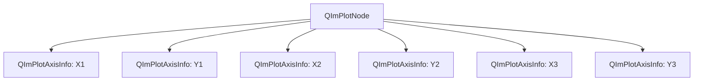
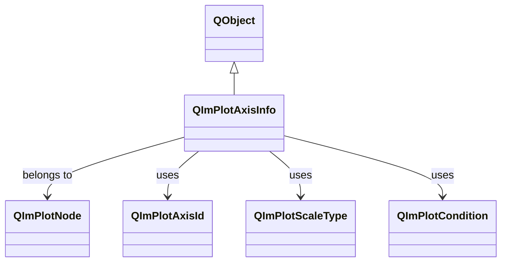

# QImPlotAxisInfo 坐标轴配置指南

`QImPlotAxisInfo` 是 QIm 中用于管理 ImPlot 坐标轴配置的 Qt 封装类，提供类型安全的属性接口来配置坐标轴，无需直接操作底层 ImPlotAxisFlags 位掩码。

## 主要功能特性

**特性**

- ✅ **标签配置**：支持坐标轴标签文本设置及可见性控制
- ✅ **范围限制**：支持设置最小/最大值范围及自动适配行为
- ✅ **标志属性**：所有 ImPlotAxisFlags_ 选项以直观的布尔属性形式暴露
- ✅ **刻度类型**：支持线性/对数/时间/对称对数等多种刻度类型
- ✅ **类型转换**：提供 Qt 枚举（QImPlotAxisId）与 ImPlot 枚举（ImAxis）的双向转换
- ✅ **信号通知**：提供标签变更、范围变更、标志变更、刻度类型变更等信号

## 基本概念

### 组件定位

QImPlotAxisInfo 在对象树中的位置：



每个 `QImPlotNode` 包含最多 6 个坐标轴对象（X1/X2/X3, Y1/Y2/Y3），可通过相应方法访问：

```cpp
QIM::QImPlotNode* plot = figure->createPlotNode();
QIM::QImPlotAxisInfo* xAxis = plot->x1Axis();  // 获取 X1 轴
QIM::QImPlotAxisInfo* yAxis = plot->y1Axis();  // 获取 Y1 轴
```

### 类继承关系



## 使用方法

该组件的示例位于：`examples/qimfigure-test` 和 `examples/readme-2d-example`。

### 1. 基本使用

设置坐标轴标签和范围：

```cpp
// 创建绘图节点
QIM::QImPlotNode* plot = figure->createPlotNode();

// 设置 X 轴标签
plot->x1Axis()->setLabel("时间 (s)");

// 设置 Y 轴标签  
plot->y1Axis()->setLabel("幅度");

// 设置坐标轴范围
plot->x1Axis()->setLimits(0.0, 10.0);  // X 轴范围 0~10
plot->y1Axis()->setLimits(-1.0, 1.0);  // Y 轴范围 -1~1

// 启用网格线
plot->x1Axis()->setGridLinesEnabled(true);
plot->y1Axis()->setGridLinesEnabled(true);
```

效果：显示带有标签、范围和网格线的坐标轴。

### 2. 隐藏坐标轴装饰（用于饼图等特殊图表）

在某些图表类型（如饼图）中，可能需要隐藏坐标轴的所有装饰：

```cpp
// 创建饼图
QIM::QImPlotNode* plot = figure->createPlotNode();
plot->setTitle("Pie Chart");
plot->setEqual(true);  // 设置等比例显示

// 隐藏 X 轴和 Y 轴的所有装饰
plot->x1Axis()->setNoDecorations(true);
plot->y1Axis()->setNoDecorations(true);

// 固定坐标轴范围（确保饼图在固定区域内显示）
plot->x1Axis()->setLimits(0.0, 1.0, QIM::QImPlotCondition::Always);
plot->y1Axis()->setLimits(0.0, 1.0, QIM::QImPlotCondition::Always);
```

此示例来自 `examples/readme-2d-example/main.cpp`，用于创建无坐标轴装饰的饼图。

### 3. 高级配置：对数刻度和自动适配

配置对数刻度坐标轴并启用自动适配：

```cpp
// 设置 Y 轴为对数刻度（适用于数据范围较大的场景）
plot->y1Axis()->setScaleType(QIM::QImPlotScaleType::Log10);

// 启用自动适配（坐标轴范围自动适应数据）
plot->x1Axis()->setAutoFit(true);
plot->y1Axis()->setAutoFit(true);

// 启用初始适配（仅在首次渲染时自动适配）
plot->x1Axis()->setInitialFitEnabled(true);
plot->y1Axis()->setInitialFitEnabled(true);

// 锁定坐标轴范围（防止用户交互修改）
plot->x1Axis()->setLock(true);  // 同时锁定最小值和最大值
// 或分别锁定
plot->y1Axis()->setLockMin(true);  // 仅锁定最小值
plot->y1Axis()->setLockMax(true);  // 仅锁定最大值
```

### 4. 交互功能控制

控制坐标轴的交互功能：

```cpp
// 启用右键菜单
plot->x1Axis()->setMenusEnabled(true);
plot->y1Axis()->setMenusEnabled(true);

// 启用高亮显示（鼠标悬停时高亮坐标轴）
plot->x1Axis()->setHighlightEnabled(true);
plot->y1Axis()->setHighlightEnabled(true);

// 启用侧边切换（允许坐标轴在左右/上下侧切换）
plot->x1Axis()->setSideSwitchEnabled(true);
plot->y1Axis()->setSideSwitchEnabled(true);

// 设置坐标轴在绘图区域前方显示
plot->x1Axis()->setForeground(true);
plot->y1Axis()->setForeground(true);
```

## 属性参考

| 属性 | 类型 | 默认值 | 说明 |
|------|------|--------|------|
| `label` | `QString` | 空字符串 | 坐标轴标签文本 |
| `minLimits` | `double` | 0.0 | 坐标轴可见范围的最小值 |
| `maxLimits` | `double` | 1.0 | 坐标轴可见范围的最大值 |
| `autoFit` | `bool` | `false` | 是否启用自动适配（对应 `ImPlotAxisFlags_AutoFit`） |
| `inverted` | `bool` | `false` | 是否反转坐标轴方向（对应 `ImPlotAxisFlags_Invert`） |
| `labelEnabled` | `bool` | `true` | 标签是否可见（对应 `ImPlotAxisFlags_NoLabel` 的肯定语义） |
| `gridLinesEnabled` | `bool` | `true` | 网格线是否可见（对应 `ImPlotAxisFlags_NoGridLines` 的肯定语义） |
| `tickMarksEnabled` | `bool` | `true` | 刻度标记是否可见（对应 `ImPlotAxisFlags_NoTickMarks` 的肯定语义） |
| `tickLabelsEnabled` | `bool` | `true` | 刻度标签是否可见（对应 `ImPlotAxisFlags_NoTickLabels` 的肯定语义） |
| `initialFitEnabled` | `bool` | `true` | 是否启用初始适配（对应 `ImPlotAxisFlags_NoInitialFit` 的肯定语义） |
| `menusEnabled` | `bool` | `true` | 是否启用右键菜单（对应 `ImPlotAxisFlags_NoMenus` 的肯定语义） |
| `sideSwitchEnabled` | `bool` | `true` | 是否允许侧边切换（对应 `ImPlotAxisFlags_NoSideSwitch` 的肯定语义） |
| `highlightEnabled` | `bool` | `true` | 是否启用高亮显示（对应 `ImPlotAxisFlags_NoHighlight` 的肯定语义） |
| `opposite` | `bool` | `false` | 是否显示在对面侧（对应 `ImPlotAxisFlags_Opposite`） |
| `foreground` | `bool` | `false` | 是否在绘图区域前方显示（对应 `ImPlotAxisFlags_Foreground`） |
| `rangeFit` | `bool` | `false` | 是否启用范围适配（对应 `ImPlotAxisFlags_RangeFit`） |
| `panStretch` | `bool` | `false` | 是否启用平移拉伸（对应 `ImPlotAxisFlags_PanStretch`） |
| `lockMin` | `bool` | `false` | 是否锁定最小值（对应 `ImPlotAxisFlags_LockMin`） |
| `lockMax` | `bool` | `false` | 是否锁定最大值（对应 `ImPlotAxisFlags_LockMax`） |
| `lock` | `bool` | `false` | 是否同时锁定最小值和最大值（`lockMin && lockMax`） |
| `noDecorations` | `bool` | `false` | 是否隐藏所有装饰（对应 `ImPlotAxisFlags_NoDecorations`） |
| `scaleType` | `QImPlotScaleType` | `Linear` | 刻度类型（线性/对数/时间/对称对数） |

### 肯定语义转换说明

QIm 采用**肯定语义**设计原则，将 ImPlot 的否定标志（如 `NoXxx`）转换为肯定的 `xxxEnabled` 属性：

| ImPlot 标志 | QIm 属性 | 说明 |
|------------|----------|------|
| `ImPlotAxisFlags_NoLabel` | `labelEnabled` | `true`=标签可见，`false`=标签隐藏 |
| `ImPlotAxisFlags_NoGridLines` | `gridLinesEnabled` | `true`=网格线可见，`false`=网格线隐藏 |
| `ImPlotAxisFlags_NoTickMarks` | `tickMarksEnabled` | `true`=刻度标记可见，`false`=刻度标记隐藏 |
| `ImPlotAxisFlags_NoTickLabels` | `tickLabelsEnabled` | `true`=刻度标签可见，`false`=刻度标签隐藏 |
| `ImPlotAxisFlags_NoInitialFit` | `initialFitEnabled` | `true`=启用初始适配，`false`=禁用初始适配 |
| `ImPlotAxisFlags_NoMenus` | `menusEnabled` | `true`=启用右键菜单，`false`=禁用右键菜单 |
| `ImPlotAxisFlags_NoSideSwitch` | `sideSwitchEnabled` | `true`=允许侧边切换，`false`=禁止侧边切换 |
| `ImPlotAxisFlags_NoHighlight` | `highlightEnabled` | `true`=启用高亮显示，`false`=禁用高亮显示 |
| `ImPlotAxisFlags_NoDecorations` | `noDecorations` | `true`=隐藏所有装饰，`false`=显示装饰 |

这种设计使 API 更符合直觉：`setLabelEnabled(true)` 表示"启用标签"，而不是 `setNoLabel(false)` 这种双重否定。

## 枚举类型

### QImPlotAxisId - 坐标轴标识

| 枚举值 | ImPlot 对应值 | 说明 |
|--------|---------------|------|
| `X1` | `ImAxis_X1` | 主 X 轴（底部） |
| `X2` | `ImAxis_X2` | 第二 X 轴（顶部） |
| `X3` | `ImAxis_X3` | 第三 X 轴（保留） |
| `Y1` | `ImAxis_Y1` | 主 Y 轴（左侧） |
| `Y2` | `ImAxis_Y2` | 第二 Y 轴（右侧） |
| `Y3` | `ImAxis_Y3` | 第三 Y 轴（保留） |
| `AxisCount` | `ImAxis_COUNT` | 坐标轴总数（6） |
| `Auto` | - | 自动选择坐标轴 |

### QImPlotScaleType - 刻度类型

| 枚举值 | ImPlot 对应值 | 说明 |
|--------|---------------|------|
| `Linear` | `ImPlotScale_Linear` | 线性刻度（默认） |
| `Time` | `ImPlotScale_Time` | 时间刻度（Unix 时间戳） |
| `Log10` | `ImPlotScale_Log10` | 以 10 为底的对数刻度（要求正值） |
| `SymLog` | `ImPlotScale_SymLog` | 对称对数刻度（可处理零附近的负值） |

### QImPlotCondition - 条件类型

| 枚举值 | ImPlot 对应值 | 说明 |
|--------|---------------|------|
| `None` | `ImPlotCond_None` | 不应用约束 |
| `Always` | `ImPlotCond_Always` | 每帧都应用约束 |
| `Once` | `ImPlotCond_Once` | 仅在首帧应用约束 |

## 核心方法

### 坐标轴范围管理

```cpp
// 设置坐标轴范围（推荐方式）
void setLimits(double min, double max, QImPlotCondition cond = QImPlotCondition::Once);

// 分别设置最小值和最大值
void setMinLimits(double min);
void setMaxLimits(double max);

// 获取当前范围
double minLimits() const;
double maxLimits() const;

// 获取/设置范围条件
QImPlotCondition limitsCondition() const;
void setLimitsCondition(QImPlotCondition v);
```

### 坐标轴标识和转换

```cpp
// 获取坐标轴标识
QImPlotAxisId axisId() const;

// 转换为 ImPlot 的 ImAxis 值
int imAxis() const;

// 获取所属的绘图节点
QImPlotNode* plotNode() const;
```

### 刻度类型管理

```cpp
// 获取/设置刻度类型
QImPlotScaleType scaleType() const;
void setScaleType(QImPlotScaleType t);

// 转换为 ImPlot 的刻度枚举值
int imPlotScale() const;
```

### 高级标志操作

```cpp
// 获取/设置原始标志位（高级用法）
int axisFlags() const;
void setAxisFlags(int flags);

// 坐标轴启用状态（通过 setNoDecorations 控制）
bool isEnabled() const;
void setEnabled(bool on);
```

## 信号槽连接

| 信号 | 参数 | 触发时机 |
|------|------|----------|
| `labelChanged(const QString& label)` | `QString` | 坐标轴标签文本改变时 |
| `limitsChanged(double min, double max)` | `double, double` | 坐标轴范围限制改变时（最小值、最大值或两者同时） |
| `axisFlagChanged()` | 无 | 任意坐标轴标志属性变更时（autoFit、inverted、gridLinesEnabled 等） |
| `scaleTypeChanged()` | 无 | 坐标轴刻度类型变更时（线性 → 对数、时间 → 对称对数等） |

### 典型信号槽连接示例

```cpp
// 监控坐标轴标签变更
connect(plot->x1Axis(), &QIM::QImPlotAxisInfo::labelChanged,
        this, &MyClass::onXAxisLabelChanged);

void MyClass::onXAxisLabelChanged(const QString& label) {
    qDebug() << "X轴标签已更新为:" << label;
    // 更新UI显示或持久化配置
}

// 监控坐标轴范围变更
connect(plot->y1Axis(), &QIM::QImPlotAxisInfo::limitsChanged,
        this, &MyClass::onYAxisLimitsChanged);

void MyClass::onYAxisLimitsChanged(double min, double max) {
    qDebug() << QString("Y轴范围已更新: [%1, %2]").arg(min).arg(max);
    // 更新范围显示或进行数据验证
}

// 监控所有标志变更
connect(plot->x1Axis(), &QIM::QImPlotAxisInfo::axisFlagChanged,
        this, &MyClass::onAxisFlagsChanged);

void MyClass::onAxisFlagsChanged() {
    // 需要查询具体哪个标志发生了变更
    bool autoFit = plot->x1Axis()->isAutoFit();
    bool gridVisible = plot->x1Axis()->isGridLinesEnabled();
    // 根据标志状态更新UI
}
```

!!! warning "注意事项"
    - **属性变更延迟生效**：所有属性变更仅在本地存储；实际绘图外观更新需在重新渲染时将配置应用到 ImPlot 上下文后生效。
    - **范围验证**：`setLimits()` 不验证 `min < max`；无效范围（`min >= max`）可能导致 ImPlot 渲染问题。
    - **对数刻度限制**：切换到 `Log10` 刻度时，数据必须包含正值，否则可能导致渲染异常。
    - **信号聚合**：`axisFlagChanged()` 信号不指示具体哪个标志变更，需查询相关属性确定具体变更。
    - **3D 坐标轴差异**：本文档主要描述 2D 绘图坐标轴配置。3D 绘图使用 `QImPlot3DAxisInfo`，具有额外的 3D 特定功能，详见 3D 配置文档。

## 参考

- 相关文档：[QImPlotNode](plot-node.md)、[QImFigureWidget](figure-widget.md)
- 示例代码：`examples/qimfigure-test`、`examples/readme-2d-example`
- API 参考：`src/core/plot/QImPlotAxisInfo.h`
- ImPlot 原生文档：[ImPlot Axis Configuration](https://github.com/epezent/implot)