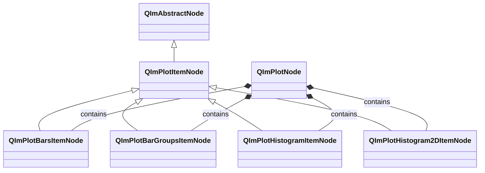
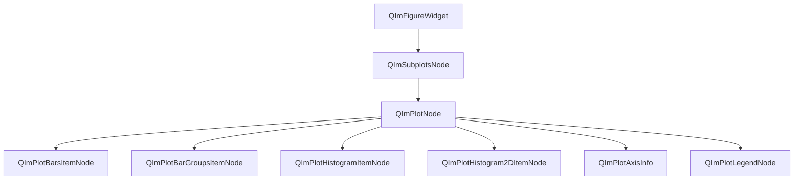

# 柱状图与直方图使用指南

QIm 提供四种柱状/直方图类节点，分别用于不同的数据可视化场景：
`QImPlotBarsItemNode`（基础柱状图）、`QImPlotBarGroupsItemNode`（分组柱状图）、
`QImPlotHistogramItemNode`（一维直方图）和 `QImPlotHistogram2DItemNode`（二维直方图）。
它们均继承自 `QImPlotItemNode`，遵循 Qt 保留模式封装，支持完整的属性系统和信号槽机制。

## 主要功能特性

**特性**

- ✅ **基础柱状图（Bars）**：XY 坐标数据驱动的单系列柱状图，支持水平/垂直方向和柱宽自定义
- ✅ **分组柱状图（BarGroups）**：多项目多组数据并排或堆叠展示，支持组宽、偏移量和水平方向
- ✅ **一维直方图（Histogram）**：自动装箱统计单变量分布，支持累积、密度归一化、范围限制和异常值控制
- ✅ **二维直方图（Histogram2D）**：双变量联合分布热力图，支持 X/Y 独立装箱、密度归一化和异常值排除
- ✅ **Qt 属性系统集成**：所有节点属性通过 Q_PROPERTY 暴露，支持 Designer 编辑和动态属性系统
- ✅ **信号槽通知**：属性变更时自动发射 Qt 信号，支持响应式编程
- ✅ **对象树管理**：节点创建时指定 QImPlotNode 为父对象，自动加入对象树并管理生命周期

## 基本概念

### 类继承关系



所有柱状/直方图节点均继承自 `QImPlotItemNode`，后者继承自 `QImAbstractNode`。
`QImPlotItemNode` 提供通用属性（`label`）和坐标轴绑定接口，
各子类在此基础上添加各自特有的样式和数据属性。

### 对象树定位



**对象树说明：**

- 所有柱状/直方图节点以 `QImPlotNode` 为父节点创建，自动加入对象树
- 节点生命周期由 Qt 对象树管理，父节点销毁时子节点自动销毁
- 多个不同类型的柱状/直方图节点可共存于同一 `QImPlotNode` 中

### 数据格式对比

四种图表的数据输入方式有明显差异，选择合适的图表类型取决于数据特征：

| 图表类型 | 数据格式 | setData 调用方式 | 适用场景 |
|----------|----------|------------------|----------|
| Bars | XY 坐标 | `setData(x, y)` | 分类或离散数据的单系列柱状图 |
| BarGroups | 标签 + 值矩阵 | `setData(labels, values, itemCount, groupCount)` | 多项目跨组对比（并排或堆叠） |
| Histogram | Y 值序列 | `setData(y)` | 单变量分布统计（自动装箱） |
| Histogram2D | XY 散点数据 | `setData(xs, ys)` | 双变量联合分布统计（自动 2D 装箱） |

!!! tip "选择合适的图表类型"
    - 需要精确控制每根柱子的位置和高度 → 使用 **Bars**
    - 需要对比多个项目在不同组中的表现 → 使用 **BarGroups**
    - 需要观察数据的分布形态（正态、偏态等） → 使用 **Histogram**
    - 需要观察两个变量的相关性 → 使用 **Histogram2D**

## Bars — 基础柱状图

`QImPlotBarsItemNode` 提供最基础的柱状图功能，使用 XY 坐标数据绘制单系列柱状图。
每根柱子的位置由 X 值决定，高度由 Y 值决定。

### 1. 基本使用

示例代码位于 `examples/qimfigure-test/functions/datapoints/BarsFunction.cpp`：

```cpp
#include "QImFigureWidget.h"
#include "plot/QImPlotNode.h"
#include "plot/QImPlotBarsItemNode.h"

// 创建绘图窗口
QIM::QImFigureWidget* figure = new QIM::QImFigureWidget(this);
figure->setSubplotGrid(2, 2);

// 创建子图 - 柱状图
if (QIM::QImPlotNode* plot = figure->createPlotNode()) {
    plot->setTitle("Bars");
    plot->x1Axis()->setLabel("Category");
    plot->y1Axis()->setLabel("Value");
    plot->setLegendEnabled(true);

    // 准备数据
    std::vector<double> x {1, 2, 3, 4};
    std::vector<double> y {3.6, 5.1, 4.4, 6.2};

    // 创建柱状图节点，以 plot 为父节点（自动加入对象树）
    QIM::QImPlotBarsItemNode* bars = new QIM::QImPlotBarsItemNode(plot);
    bars->setLabel("2026");       // 图例标签
    bars->setData(x, y);          // XY 坐标数据
    bars->setBarWidth(0.6);       // 柱宽（绘图单位）
    bars->setColor(QColor(80, 170, 90));  // 柱子颜色

    // 效果：4 根柱子分别位于 x=1,2,3,4，高度为 3.6, 5.1, 4.4, 6.2
}
```

### 2. 数据格式说明

Bars 的数据为标准 XY 格式，通过 `setData()` 设置：

- **`setData(x, y)`**：接受两个容器（`std::vector<double>`、`QVector<double>` 等），X 和 Y 数组长度必须一致
- **`setData(series)`**：接受 `QImAbstractXYDataSeries*` 指针，适合自定义数据源
- **移动语义版本**：`setData(std::move(x), std::move(y))` 避免数据拷贝

```cpp
// 方式1：直接传入容器（拷贝）
std::vector<double> x {1, 2, 3, 4, 5};
std::vector<double> y {10, 20, 15, 25, 18};
bars->setData(x, y);

// 方式2：移动语义（零拷贝）
std::vector<double> x = generateXData();
std::vector<double> y = generateYData();
bars->setData(std::move(x), std::move(y));

// 方式3：使用数据系列对象
QIM::QImAbstractXYDataSeries* series = new QIM::QImVectorXYDataSeries<...>(xData, yData);
bars->setData(series);
```

### 3. 样式配置

```cpp
// 水平方向柱状图（柱子沿 Y 轴水平展开）
bars->setHorizontal(true);

// 柱宽控制（绘图单位，而非像素）
bars->setBarWidth(0.5);   // 柱子占 0.5 个绘图单位宽

// 柱子颜色
bars->setColor(QColor(0, 114, 189));
```

!!! warning "柱宽单位"
    `barWidth` 的单位是绘图坐标单位（不是像素）。例如在 x 轴范围为 0~10 的图表中，
    设置 `barWidth = 0.6` 表示每根柱子占 0.6 个坐标单位宽度。柱宽过大会导致柱子重叠。

### 4. 属性列表

**Bars 特有属性（Q_PROPERTY）：**

| 属性 | 类型 | Getter | Setter | 信号 | 默认值 | 说明 |
|------|------|--------|--------|------|--------|------|
| barWidth | double | `barWidth()` | `setBarWidth()` | `barWidthChanged` | - | 柱宽（绘图单位） |
| horizontal | bool | `isHorizontal()` | `setHorizontal()` | `orientationChanged` | false | 水平方向标志 |
| color | QColor | `color()` | `setColor()` | `colorChanged` | - | 柱子颜色 |

**继承自 QImPlotItemNode 的属性：**

| 属性 | 类型 | Getter | Setter | 信号 | 说明 |
|------|------|--------|--------|------|------|
| label | QString | `label()` | `setLabel()` | `labelChanged` | 图例标签 |

**其他方法：**

| 方法 | 说明 |
|------|------|
| `setData(x, y)` | 设置 XY 数据（模板方法） |
| `setData(series)` | 设置数据系列指针 |
| `data()` | 获取当前数据系列 |
| `barsFlags()` | 获取原始 ImPlotBarsFlags |
| `setBarsFlags(int)` | 设置原始 ImPlotBarsFlags |

### 5. 信号列表

| 信号 | 参数 | 触发时机 |
|------|------|----------|
| `barWidthChanged(width)` | double | 柱宽实际变更时 |
| `orientationChanged(horizontal)` | bool | 方向标志实际变更时 |
| `colorChanged(color)` | QColor | 柱子颜色实际变更时 |
| `dataChanged()` | - | 数据系列变更时 |
| `barsFlagChanged()` | - | 任何标志属性变更时 |

```cpp
// 监控柱宽变更
connect(bars, &QIM::QImPlotBarsItemNode::barWidthChanged,
        this, [](double newWidth) {
    qDebug() << "柱宽已更新为:" << newWidth;
});

// 监控方向变更
connect(bars, &QIM::QImPlotBarsItemNode::orientationChanged,
        this, [](bool isHorizontal) {
    qDebug() << "方向切换为:" << (isHorizontal ? "水平" : "垂直");
});
```

## BarGroups — 分组柱状图

`QImPlotBarGroupsItemNode` 用于可视化多项目跨组的对比数据，
支持并排（grouped）和堆叠（stacked）两种展示模式。

### 1. 基本使用

示例代码位于 `examples/qimfigure-test/functions/datapoints/BarGroupsFunction.cpp`：

```cpp
#include "QImFigureWidget.h"
#include "plot/QImPlotNode.h"
#include "plot/QImPlotBarGroupsItemNode.h"

// 创建绘图窗口
QIM::QImFigureWidget* figure = new QIM::QImFigureWidget(this);

// 创建子图
if (QIM::QImPlotNode* plot = figure->createPlotNode()) {
    plot->setTitle("Product Performance");
    plot->x1Axis()->setLabel("Quarter");
    plot->y1Axis()->setLabel("Revenue");
    plot->setLegendEnabled(true);

    // 项目标签（3 个项目）
    QStringList itemLabels;
    itemLabels << "A" << "B" << "C";

    // 值矩阵：行主序，3 项目 × 4 组 = 12 个值
    // Item A: Q1=10, Q2=20, Q3=15, Q4=25
    // Item B: Q1=15, Q2=25, Q3=20, Q4=30
    // Item C: Q1=12, Q2=18, Q3=22, Q4=28
    QVector<double> values = {
        10.0, 20.0, 15.0, 25.0,  // Item A
        15.0, 25.0, 20.0, 30.0,  // Item B
        12.0, 18.0, 22.0, 28.0   // Item C
    };

    // 创建分组柱状图节点
    QIM::QImPlotBarGroupsItemNode* barGroups = new QIM::QImPlotBarGroupsItemNode(plot);
    barGroups->setLabel("Product Performance");
    barGroups->setData(itemLabels, values, 3, 4);  // 3 项目 × 4 组
    barGroups->setGroupWidth(0.67);                 // 组宽（默认 0.67）

    // 效果：3 个项目在 4 个组中并排展示，图例显示 A/B/C 三项
}
```

### 2. 数据格式说明

BarGroups 的数据格式与 Bars 不同，采用 **标签 + 值矩阵** 的方式：

- **labels**：`QStringList`，每个项目一个标签，用于图例显示
- **values**：行主序值矩阵，大小为 `itemCount × groupCount`
- **itemCount**：项目数量（每个组中有几根柱子）
- **groupCount**：组数量（X 轴上有几个分组）

```text
值矩阵布局（行主序）：

             Group0  Group1  Group2  Group3
  Item0  │  v[0]    v[1]    v[2]    v[3]
  Item1  │  v[4]    v[5]    v[6]    v[7]
  Item2  │  v[8]    v[9]    v[10]   v[11]
```

!!! warning "数据矩阵大小"
    `values` 容器的 size 必须严格等于 `itemCount × groupCount`，
    `labels` 的 size 必须严格等于 `itemCount`。
    不满足时将触发 `Q_ASSERT` 断言失败。

### 3. 堆叠模式

通过 `setStacked(true)` 切换为堆叠柱状图，同一组内的柱子纵向堆叠而非并排：

```cpp
// 并排模式（默认）
barGroups->setStacked(false);  // 每组内的项目柱子水平并排

// 堆叠模式
barGroups->setStacked(true);   // 每组内的项目柱子纵向堆叠
```

!!! tip "堆叠 vs 并排"
    - **并排**适合比较各项目在同一组的绝对值差异
    - **堆叠**适合展示各项目对组总值的贡献比例

### 4. 水平方向与偏移量

```cpp
// 水平方向分组柱状图
barGroups->setHorizontal(true);  // 柱子沿 Y 轴水平展开

// 组偏移量（调整整组在 X 轴上的位置）
barGroups->setShift(0.5);  // 组整体向右偏移 0.5 个绘图单位
```

`shift` 属性用于微调组的位置，在多组柱状图叠加场景中有用，
例如将不同年份的数据对齐到同一组位置。

### 5. 属性列表

**BarGroups 特有属性（Q_PROPERTY）：**

| 属性 | 类型 | Getter | Setter | 信号 | 默认值 | 说明 |
|------|------|--------|--------|------|--------|------|
| groupWidth | double | `groupWidth()` | `setGroupWidth()` | `groupWidthChanged` | 0.67 | 组宽（绘图单位） |
| horizontal | bool | `isHorizontal()` | `setHorizontal()` | `orientationChanged` | false | 水平方向标志 |
| stacked | bool | `isStacked()` | `setStacked()` | `stackedChanged` | false | 堆叠模式标志 |
| shift | double | `shift()` | `setShift()` | `shiftChanged` | 0 | 组偏移量（绘图单位） |
| color | QColor | `color()` | `setColor()` | `colorChanged` | - | 柱子颜色（未设置时使用 ImPlot 默认序列） |

**继承自 QImPlotItemNode 的属性：**

| 属性 | 类型 | Getter | Setter | 信号 | 说明 |
|------|------|--------|--------|------|------|
| label | QString | `label()` | `setLabel()` | `labelChanged` | 图例标签 |

**其他方法：**

| 方法 | 说明 |
|------|------|
| `setData(labels, values, itemCount, groupCount)` | 设置分组数据（模板方法） |
| `setData(series)` | 设置数据系列指针 |
| `data()` | 获取当前数据系列 |
| `barGroupsFlags()` | 获取原始 ImPlotBarGroupsFlags |
| `setBarGroupsFlags(int)` | 设置原始 ImPlotBarGroupsFlags |

### 6. 信号列表

| 信号 | 参数 | 触发时机 |
|------|------|----------|
| `groupWidthChanged(width)` | double | 组宽实际变更时 |
| `orientationChanged(horizontal)` | bool | 方向标志实际变更时 |
| `stackedChanged(stacked)` | bool | 堆叠标志实际变更时 |
| `shiftChanged(shift)` | double | 偏移量实际变更时 |
| `colorChanged(color)` | QColor | 柱子颜色实际变更时 |
| `dataChanged()` | - | 数据系列变更时 |
| `barGroupsFlagChanged()` | - | 任何标志属性变更时 |

```cpp
// 监控堆叠模式变更
connect(barGroups, &QIM::QImPlotBarGroupsItemNode::stackedChanged,
        this, [](bool isStacked) {
    qDebug() << "堆叠模式:" << (isStacked ? "启用" : "禁用");
});

// 监控组宽变更
connect(barGroups, &QIM::QImPlotBarGroupsItemNode::groupWidthChanged,
        this, [](double newWidth) {
    qDebug() << "组宽更新为:" << newWidth;
});
```

## Histogram — 一维直方图

`QImPlotHistogramItemNode` 用于统计单变量数据的分布形态。
只需传入 Y 值序列，ImPlot 自动将数据装箱（binning）为柱状展示。
支持累积分布、密度归一化、范围限制等多种统计模式。

### 1. 基本使用

示例代码位于 `examples/qimfigure-test/functions/datapoints/HistogramFunction.cpp`：

```cpp
#include "QImFigureWidget.h"
#include "plot/QImPlotNode.h"
#include "plot/QImPlotHistogramItemNode.h"
#include "plot/QImPlotHistogramDataSeries.h"
#include <random>

// 创建绘图窗口
QIM::QImFigureWidget* figure = new QIM::QImFigureWidget(this);

// 创建子图
if (QIM::QImPlotNode* plot = figure->createPlotNode()) {
    plot->setTitle("Histogram");
    plot->x1Axis()->setLabel("Value");
    plot->y1Axis()->setLabel("Frequency");
    plot->setLegendEnabled(true);

    // 生成 1000 个正态分布随机值（均值=0，标准差=1）
    const int numValues = 1000;
    QVector<double> values(numValues);
    std::random_device rd;
    std::mt19937 gen(rd());
    std::normal_distribution<double> dist(0.0, 1.0);
    for (int i = 0; i < numValues; ++i) {
        values[i] = dist(gen);
    }

    // 创建直方图节点
    QIM::QImPlotHistogramItemNode* hist = new QIM::QImPlotHistogramItemNode(plot);
    hist->setLabel("Normal Distribution");
    auto dataSeries = new QIM::QImVectorHistogramDataSeries<QVector<double>>(std::move(values));
    hist->setData(dataSeries);
    hist->setBins(-2);           // Sturges 自动装箱方法
    hist->setColor(QColor(0, 150, 136));

    // 效果：正态分布的钟形直方图，自动选择箱数
}
```

### 2. 数据格式说明

Histogram 的数据只需 Y 值序列，X 轴由 ImPlot 根据装箱结果自动计算：

- **`setData(y)`**：接受单个容器，只需 Y 值（模板方法）
- **`setData(series)`**：接受 `QImAbstractXYDataSeries*` 或 `QImAbstractHistogramDataSeries*`
- **移动语义版本**：`setData(std::move(y))` 避免数据拷贝

```cpp
// 方式1：直接传入 Y 值容器
QVector<double> values = {1.2, 3.5, 2.8, 5.1, 4.3, ...};
hist->setData(values);

// 方式2：移动语义
QVector<double> values = generateData();
hist->setData(std::move(values));

// 方式3：使用数据系列对象
auto* series = new QIM::QImVectorHistogramDataSeries<QVector<double>>(std::move(values));
hist->setData(series);
```

!!! info "与 Bars 的数据差异"
    Bars 需要显式 XY 数据（你控制每根柱子的位置和高度），
    Histogram 只需要 Y 值序列（ImPlot 自动装箱计算位置和高度）。

### 3. 装箱配置

`bins` 属性控制装箱策略，支持正整数（精确箱数）和负值（自动方法）：

| bins 值 | 装箱方法 | 说明 |
|---------|----------|------|
| 正整数（如 20） | 精确箱数 | 指定固定的箱数量 |
| -1 | SquareRoot | √n 箱数，简单近似 |
| -2 | Sturges | ⌈log₂(n) + 1⌉，**默认值**，适合近似正态分布 |
| -3 | Rice | ⌈2 × ∛n⌉，适合较大数据集 |
| -4 | Scott | 基于 Scott 正态参考规则，箱宽自适应 |
| -5 | Freedman-Diaconis | 基于 IQR，对异常值鲁棒 |
| -6 | Doane | 修正 Sturges，适合偏态分布 |

```cpp
// 使用 20 个固定箱
hist->setBins(20);

// 使用 Sturges 自动方法（默认）
hist->setBins(-2);

// 使用 Freedman-Diaconis 方法（对异常值鲁棒）
hist->setBins(-5);
```

### 4. 统计模式

**累积分布（Cumulative）：**

启用累积模式后，每根柱子的高度表示前面所有箱的累计频率而非单独频率：

```cpp
hist->setCumulative(true);  // 累积分布模式
```

**密度归一化（Density）：**

启用密度模式后，柱子高度归一化为概率密度（柱面积总和为 1），而非频率计数：

```cpp
hist->setDensity(true);  // 密度归一化模式
```

!!! tip "统计模式组合"
    - 默认模式：频率计数（每箱内的数据点数量）
    - `cumulative = true`：累积频率（递增计数）
    - `density = true`：概率密度（面积归一化为 1）
    - `cumulative + density`：累积概率密度（CDF，最终值为 1）

### 5. 范围限制与异常值

**范围限制（Range）：**

通过 `rangeMin` 和 `rangeMax` 指定装箱范围，超出范围的值不计入统计：

```cpp
// 仅统计 -3 到 3 范围内的值
hist->setRangeMin(-3.0);
hist->setRangeMax(3.0);
// 0 表示自动范围（默认）
```

**异常值包含（OutliersIncluded）：**

控制范围外的值是否影响归一化和累积计算：

```cpp
// 包含异常值（异常值影响归一化基数）
hist->setOutliersIncluded(true);

// 排除异常值（仅范围内的值参与归一化）
hist->setOutliersIncluded(false);
```

!!! warning "outliersIncluded 与 ImPlot 语义转换"
    ImPlot 原生使用否定语义 `ImPlotHistogramFlags_NoOutliers`，
    QIm 转换为肯定语义 `outliersIncluded`。
    `setOutliersIncluded(false)` 对应 ImPlot 的 `NoOutliers` 标志。
    详见[枚举语义转换规范](../dev/flag-mapping.md)。

### 6. 水平方向与柱条缩放

```cpp
// 水平方向直方图（柱子沿 Y 轴水平展开）
hist->setHorizontal(true);

// 柱条缩放因子（调整柱宽比例，默认 1.0）
hist->setBarScale(0.8);  // 柱宽缩小为 80%
```

### 7. 属性列表

**Histogram 特有属性（Q_PROPERTY）：**

| 属性 | 类型 | Getter | Setter | 信号 | 默认值 | 说明 |
|------|------|--------|--------|------|--------|------|
| bins | int | `bins()` | `setBins()` | `binsChanged` | -2 (Sturges) | 箱数或自动装箱方法 |
| barScale | double | `barScale()` | `setBarScale()` | `barScaleChanged` | 1.0 | 柱条缩放因子 |
| rangeMin | double | `rangeMin()` | `setRangeMin()` | `rangeChanged` | 0（自动） | 装箱范围最小值 |
| rangeMax | double | `rangeMax()` | `setRangeMax()` | `rangeChanged` | 0（自动） | 装箱范围最大值 |
| cumulative | bool | `isCumulative()` | `setCumulative()` | `cumulativeChanged` | false | 累积分布标志 |
| density | bool | `isDensity()` | `setDensity()` | `densityChanged` | false | 密度归一化标志 |
| horizontal | bool | `isHorizontal()` | `setHorizontal()` | `orientationChanged` | false | 水平方向标志 |
| outliersIncluded | bool | `isOutliersIncluded()` | `setOutliersIncluded()` | `outliersIncludedChanged` | true | 包含异常值标志（肯定语义） |
| colMajor | bool | `isColMajor()` | `setColMajor()` | `histogramFlagChanged` | false | 列主序数据布局标志 |
| color | QColor | `color()` | `setColor()` | `colorChanged` | - | 柱条颜色 |

**继承自 QImPlotItemNode 的属性：**

| 属性 | 类型 | Getter | Setter | 信号 | 说明 |
|------|------|--------|--------|------|------|
| label | QString | `label()` | `setLabel()` | `labelChanged` | 图例标签 |

**其他方法：**

| 方法 | 说明 |
|------|------|
| `setData(y)` | 设置 Y 值序列（模板方法） |
| `setData(series)` | 设置数据系列指针 |
| `data()` | 获取当前数据系列 |
| `histogramFlags()` | 获取原始 ImPlotHistogramFlags |
| `setHistogramFlags(int)` | 设置原始 ImPlotHistogramFlags |

### 8. 信号列表

| 信号 | 参数 | 触发时机 |
|------|------|----------|
| `binsChanged(bins)` | int | 箱数实际变更时 |
| `barScaleChanged(scale)` | double | 柱条缩放因子实际变更时 |
| `rangeChanged()` | - | rangeMin 或 rangeMax 实际变更时 |
| `cumulativeChanged(cumulative)` | bool | 累积标志实际变更时 |
| `densityChanged(density)` | bool | 密度标志实际变更时 |
| `orientationChanged(horizontal)` | bool | 方向标志实际变更时 |
| `outliersIncludedChanged(included)` | bool | 异常值包含标志实际变更时 |
| `colorChanged(color)` | QColor | 柱条颜色实际变更时 |
| `dataChanged()` | - | 数据系列变更时 |
| `histogramFlagChanged()` | - | 任何标志属性变更时 |

```cpp
// 监控箱数变更
connect(hist, &QIM::QImPlotHistogramItemNode::binsChanged,
        this, [](int newBins) {
    qDebug() << "箱数更新为:" << newBins;
});

// 监控范围变更（单一信号覆盖 min 和 max）
connect(hist, &QIM::QImPlotHistogramItemNode::rangeChanged,
        this, [hist]() {
    qDebug() << "范围更新:" << hist->rangeMin() << "~" << hist->rangeMax();
});
```

!!! warning "rangeChanged 信号"
    `rangeMin` 和 `rangeMax` 共用 `rangeChanged()` 信号。
    此信号不指示具体哪个范围值发生变更，连接的槽函数需查询两个属性以确定变更内容。

## Histogram2D — 二维直方图

`QImPlotHistogram2DItemNode` 用于可视化两个变量的联合分布，
结果以热力图形式展示：颜色深浅表示该区域内数据点的密度。
传入 XY 散点数据，ImPlot 自动在两个维度上进行装箱。

### 1. 基本使用

示例代码位于 `examples/qimfigure-test/functions/datapoints/Histogram2DFunction.cpp`：

```cpp
#include "QImFigureWidget.h"
#include "plot/QImPlotNode.h"
#include "plot/QImPlotHistogram2DItemNode.h"
#include "plot/QImPlotHistogram2DDataSeries.h"
#include <random>

// 创建绘图窗口
QIM::QImFigureWidget* figure = new QIM::QImFigureWidget(this);

// 创建子图
if (QIM::QImPlotNode* plot = figure->createPlotNode()) {
    plot->setTitle("2D Histogram");
    plot->x1Axis()->setLabel("X Variable");
    plot->y1Axis()->setLabel("Y Variable");
    plot->setLegendEnabled(false);  // 2D 直方图通常不使用图例

    // 生成 1000 个相关随机点
    const int numPoints = 1000;
    QVector<double> xs(numPoints);
    QVector<double> ys(numPoints);
    std::random_device rd;
    std::mt19937 gen(rd());
    std::normal_distribution<double> distX(0.0, 1.0);
    std::normal_distribution<double> distY(0.0, 0.8);
    for (int i = 0; i < numPoints; ++i) {
        xs[i] = distX(gen);
        ys[i] = distY(gen) + 0.5 * xs[i];  // Y 与 X 相关
    }

    // 创建二维直方图节点
    QIM::QImPlotHistogram2DItemNode* hist2d = new QIM::QImPlotHistogram2DItemNode(plot);
    hist2d->setLabel("Correlated 2D Normal");
    auto dataSeries = new QIM::QImVectorHistogram2DDataSeries<QVector<double>, QVector<double>>(
        std::move(xs), std::move(ys));
    hist2d->setData(dataSeries);
    hist2d->setXBins(-2);  // X 维度使用 Sturges 自动装箱
    hist2d->setYBins(-2);  // Y 维度使用 Sturges 自动装箱

    // 效果：二维热力图，颜色深浅表示 X/Y 变量联合分布密度
}
```

### 2. 数据格式说明

Histogram2D 的数据为 XY 散点格式，ImPlot 自动进行二维装箱：

- **`setData(xs, ys)`**：接受两个容器，分别表示 X 和 Y 坐标值
- **`setData(series)`**：接受 `QImAbstractXYDataSeries*` 指针
- **移动语义版本**：`setData(std::move(xs), std::move(ys))`

```cpp
// 方式1：直接传入容器
QVector<double> xs = {...};
QVector<double> ys = {...};
hist2d->setData(xs, ys);

// 方式2：移动语义
hist2d->setData(std::move(xs), std::move(ys));

// 方式3：使用数据系列对象
auto* series = new QIM::QImVectorHistogram2DDataSeries<...>(std::move(xs), std::move(ys));
hist2d->setData(series);
```

!!! info "与 Histogram 的数据差异"
    Histogram 只需要 Y 值（单变量分布），Histogram2D 需要 XY 散点数据（双变量联合分布）。
    ImPlot 将散点数据在 X 和 Y 两个维度上分别装箱，形成二维网格。

### 3. 装箱配置

Histogram2D 支持 X 和 Y 维度独立设置装箱策略：

```cpp
// X 维度：30 个固定箱
hist2d->setXBins(30);

// Y 维度：Sturges 自动方法
hist2d->setYBins(-2);

// 也可统一设置
hist2d->setXBins(-2);  // 默认值
hist2d->setYBins(-2);  // 默认值
```

装箱方法与一维 Histogram 相同，参见[装箱配置](#3-装箱配置)章节的表格。

### 4. 范围限制

Histogram2D 支持 X 和 Y 维度独立的范围限制：

```cpp
// 限制 X 维度装箱范围
hist2d->setXRangeMin(-3.0);
hist2d->setXRangeMax(3.0);

// 限制 Y 维度装箱范围
hist2d->setYRangeMin(-2.0);
hist2d->setYRangeMax(2.0);

// 0 表示自动范围（默认）
```

当 `xRangeMin == xRangeMax == 0` 或 `yRangeMin == yRangeMax == 0` 时，
ImPlot 根据数据自动计算范围。

### 5. 密度归一化与异常值

**密度归一化（Density）：**

启用密度模式后，计数归一化为概率密度（体积总和为 1）：

```cpp
hist2d->setDensity(true);  // 二维概率密度归一化
```

**异常值排除（NoOutliers）：**

!!! warning "noOutliers 语义注意"
    Histogram2D 使用 **否定语义** `noOutliers`（而非 Histogram 的肯定语义 `outliersIncluded`）。
    这是因为 Histogram2D 直接映射 ImPlot 的 `ImPlotHistogramFlags_NoOutliers` 标志。
    设置 `setNoOutliers(true)` 表示排除异常值。

```cpp
// 排除范围外的异常值（不影响归一化基数）
hist2d->setNoOutliers(true);

// 包含异常值（默认）
hist2d->setNoOutliers(false);
```

### 6. 列主序布局

```cpp
// 列主序数据布局（适用于从列主序数据源读取的场景）
hist2d->setColMajor(true);

// 行主序（默认）
hist2d->setColMajor(false);
```

### 7. 属性列表

**Histogram2D 特有属性（Q_PROPERTY）：**

| 属性 | 类型 | Getter | Setter | 信号 | 默认值 | 说明 |
|------|------|--------|--------|------|--------|------|
| xBins | int | `xBins()` | `setXBins()` | `xBinsChanged` | -2 (Sturges) | X 维度箱数或自动方法 |
| yBins | int | `yBins()` | `setYBins()` | `yBinsChanged` | -2 (Sturges) | Y 维度箱数或自动方法 |
| xRangeMin | double | `xRangeMin()` | `setXRangeMin()` | `xRangeChanged` | 0（自动） | X 装箱范围最小值 |
| xRangeMax | double | `xRangeMax()` | `setXRangeMax()` | `xRangeChanged` | 0（自动） | X 装箱范围最大值 |
| yRangeMin | double | `yRangeMin()` | `setYRangeMin()` | `yRangeChanged` | 0（自动） | Y 装箱范围最小值 |
| yRangeMax | double | `yRangeMax()` | `setYRangeMax()` | `yRangeChanged` | 0（自动） | Y 装箱范围最大值 |
| density | bool | `isDensity()` | `setDensity()` | `densityChanged` | false | 密度归一化标志 |
| noOutliers | bool | `isNoOutliers()` | `setNoOutliers()` | `noOutliersChanged` | false | 排除异常值标志（否定语义） |
| colMajor | bool | `isColMajor()` | `setColMajor()` | `colMajorChanged` | false | 列主序数据布局标志 |

**继承自 QImPlotItemNode 的属性：**

| 属性 | 类型 | Getter | Setter | 信号 | 说明 |
|------|------|--------|--------|------|------|
| label | QString | `label()` | `setLabel()` | `labelChanged` | 图例标签 |

**其他方法：**

| 方法 | 说明 |
|------|------|
| `setData(xs, ys)` | 设置 XY 散点数据（模板方法） |
| `setData(series)` | 设置数据系列指针 |
| `data()` | 获取当前数据系列 |
| `histogramFlags()` | 获取原始 ImPlotHistogramFlags |
| `setHistogramFlags(int)` | 设置原始 ImPlotHistogramFlags |

!!! warning "Histogram2D 无 color 属性"
    `QImPlotHistogram2DItemNode` 不提供 `color` Q_PROPERTY。
    二维直方图的颜色由 ImPlot 内置 colormap（热力图颜色映射）自动管理。

### 8. 信号列表

| 信号 | 参数 | 触发时机 |
|------|------|----------|
| `xBinsChanged(bins)` | int | X 箱数实际变更时 |
| `yBinsChanged(bins)` | int | Y 箱数实际变更时 |
| `xRangeChanged()` | - | X 范围值实际变更时 |
| `yRangeChanged()` | - | Y 范围值实际变更时 |
| `densityChanged(density)` | bool | 密度标志实际变更时 |
| `noOutliersChanged(noOutliers)` | bool | 排除异常值标志实际变更时 |
| `colMajorChanged(colMajor)` | bool | 列主序标志实际变更时 |
| `dataChanged()` | - | 数据系列变更时 |
| `histogramFlagChanged()` | - | 任何标志属性变更时 |

```cpp
// 监控 X 箱数变更
connect(hist2d, &QIM::QImPlotHistogram2DItemNode::xBinsChanged,
        this, [](int newBins) {
    qDebug() << "X 箱数更新为:" << newBins;
});

// 监控 X 范围变更
connect(hist2d, &QIM::QImPlotHistogram2DItemNode::xRangeChanged,
        this, [hist2d]() {
    qDebug() << "X 范围更新:" << hist2d->xRangeMin() << "~" << hist2d->xRangeMax();
});
```

!!! warning "范围变更信号"
    `xRangeChanged()` 和 `yRangeChanged()` 分别覆盖各自维度的 min/max 变更。
    不指示具体哪个范围值发生变更，需查询对应属性。

## 注意事项

!!! warning "柱宽/组宽单位为绘图坐标"
    `barWidth`、`groupWidth` 和 `shift` 的单位均为绘图坐标单位（非像素）。
    在 x 轴范围为 0~10 的图表中，`barWidth = 0.6` 表示柱子占 0.6 个坐标单位。
    坐标轴范围变化时，视觉柱宽会随之缩放。

!!! warning "属性变更需重绘生效"
    所有柱状/直方图节点的属性变更（柱宽、箱数、颜色等）需要触发重绘才能在画面上体现。
    QIm 的自适应渲染模式会自动处理此流程，无需手动调用 update。

!!! warning "Histogram2D 性能"
    大量箱数（>100×100）可能影响渲染性能。建议使用自动装箱方法或适度控制箱数。

!!! info "对象树父子关系"
    创建柱状/直方图节点时，指定 `QImPlotNode` 为父对象即可自动加入对象树：
    ```cpp
    // 方式1：构造时指定父节点（推荐）
    QIM::QImPlotBarsItemNode* bars = new QIM::QImPlotBarsItemNode(plot);

    // 方式2：后设父节点
    QIM::QImPlotBarsItemNode* bars = new QIM::QImPlotBarsItemNode();
    bars->setParent(plot);
    ```
    方式1 更符合 Qt 对象树习惯，节点生命周期由父节点管理。

!!! info "Histogram 与 Histogram2D 的异常值语义差异"
    - `QImPlotHistogramItemNode` 使用 **肯定语义** `outliersIncluded`
    - `QImPlotHistogram2DItemNode` 使用 **否定语义** `noOutliers`
    这种差异源于两者对 ImPlot 标志的映射策略不同。
    Histogram 将 `NoOutliers` 转换为肯定语义，
    而 Histogram2D 保留了否定语义以保持与 ImPlot colormap 模块的兼容性。
    详见[枚举语义转换规范](../dev/flag-mapping.md)。

!!! tip "Histogram2D 与 colormap"
    二维直方图的结果以热力图形式渲染，颜色由 ImPlot 的 colormap 系统自动映射。
    当前版本未提供独立的 colormap 配置接口，后续版本计划增加
    `QImPlotHeatmapItemNode` 相关的 colormap 属性。

## 参考

- 相关文档：[QImPlotNode](plot-node.md)、[坐标轴配置](plot-axis.md)、[渲染节点](../render-node.md)、[枚举语义转换](../dev/flag-mapping.md)
- 示例代码：`examples/qimfigure-test/functions/datapoints/BarsFunction.cpp`、`BarGroupsFunction.cpp`、`HistogramFunction.cpp`、`Histogram2DFunction.cpp`
- API 参考：`src/core/plot/QImPlotBarsItemNode.h`、`src/core/plot/QImPlotBarGroupsItemNode.h`、`src/core/plot/QImPlotHistogramItemNode.h`、`src/core/plot/QImPlotHistogram2DItemNode.h`