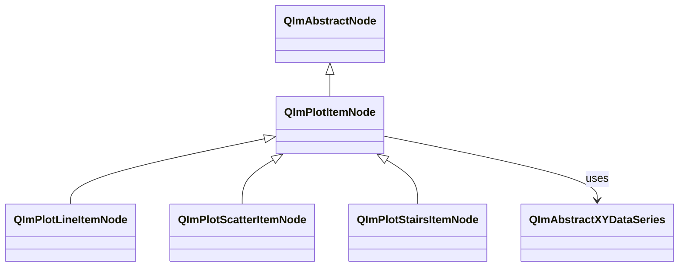
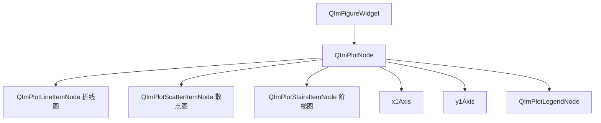

# 2D 基本图表使用指南

折线图（Line）、散点图（Scatter）和阶梯图（Stairs）是 QIm 中最基础的 2D 绘图类型，
分别用于可视化连续数据、离散点分布和阶梯式变化数据。它们共享相同的 `QImPlotItemNode` 基类
和 XY 数据系列接口，通过 Qt 属性系统提供一致的使用方式。

## 主要功能特性

**特性**

- ✅ **统一基类**：三种图表均继承 `QImPlotItemNode`，共享标签、坐标轴绑定、颜色等通用属性
- ✅ **Qt 属性集成**：通过 Q_PROPERTY 暴露所有可配置属性，支持信号槽响应式编程
- ✅ **自适应采样**：Line 和 Scatter 内置 LTTB 降采样算法，百万级数据量保持流畅渲染
- ✅ **对象树管理**：构造时指定 `QImPlotNode` 为父节点即可自动加入对象树
- ✅ **便捷创建**：Line 提供 `addLine()` 模板方法快速创建，Scatter/Stairs 可手动构造
- ✅ **丰富样式**：Line 支持阴影填充和循环模式，Scatter 支持 10 种标记形状，Stairs 支持前阶梯/后阶梯切换

## 基本概念

### 类继承关系

三种基本图表节点都继承自 `QImPlotItemNode`，后者继承自 `QImAbstractNode`：



`QImPlotItemNode` 是所有 2D 绘图项目的基类，提供标签（`label`）、坐标轴绑定（`bindAxis`）、
可见性（`visible`）等通用属性。`QImAbstractXYDataSeries` 是数据系列的抽象基类，
三种图表通过 `setData()` 方法绑定数据。

### 对象树定位

图表项目节点作为 `QImPlotNode` 的子节点存在：



**对象树说明：**

- 图表项目节点创建时指定 `QImPlotNode` 为父节点，即可自动加入对象树
- 多个不同类型的图表项目可以共存于同一 `QImPlotNode` 下
- 节点生命周期由 Qt 对象树管理，父节点销毁时子节点自动销毁

### 三种图表的区别

| 图表类型 | 适用场景 | 数据特征 | 渲染方式 |
|----------|----------|----------|----------|
| Line（折线图） | 连续数据趋势 | 数据点之间用线段连接 | `ImPlot::PlotLine` |
| Scatter（散点图） | 离散点分布 | 每个数据点独立显示为标记 | `ImPlot::PlotScatter` |
| Stairs（阶梯图） | 阶梯式变化数据 | 数据点之间用水平+垂直线段连接 | `ImPlot::PlotStairs` |

!!! info "选择合适的图表类型"
    - 需要观察数据趋势和连续变化 → **Line**
    - 需要观察数据点分布和离散特征 → **Scatter**
    - 需要表达离散状态切换或阶梯式变化（如数字信号、库存水平）→ **Stairs**

## 折线图（QImPlotLineItemNode）

`QImPlotLineItemNode` 是 QIm 中最常用的绘图组件，用于绘制折线图和曲线图，
将数据点用连续线段连接，适合可视化连续数据趋势。

### 1. 基本使用

#### 方式一：addLine() 便捷方法

通过 `QImPlotNode::addLine()` 模板方法快速创建折线图，内部自动创建节点并加入对象树：

```cpp
#include "QImFigureWidget.h"
#include "plot/QImPlotNode.h"

// 创建绘图窗口
QIM::QImFigureWidget* figure = new QIM::QImFigureWidget(this);
QIM::QImPlotNode* plot = figure->createPlotNode();
plot->setTitle("示例图表");

// 直接传入数据数组，addLine() 自动创建 QImPlotLineItemNode
std::vector<double> x = {0, 1, 2, 3, 4};
std::vector<double> y = {0, 1, 4, 9, 16};
QIM::QImPlotLineItemNode* line = plot->addLine(x, y, "二次曲线");
// line 自动成为 plot 的子节点，加入对象树
```

`addLine()` 是模板方法，支持 `QVector<double>`、`std::vector<double>` 等标准容器类型，
内部流程为：

1. 创建 `QImPlotLineItemNode` 对象
2. 调用 `setData(x, y)` 设置数据
3. 调用 `setLabel(label)` 设置图例标签
4. 调用 `addPlotItem()` 将节点加入对象树
5. 返回节点指针，便于后续样式配置

!!! tip "addLine() vs 手动创建"
    `addLine()` 适合快速创建场景。需要更灵活的控制（如先创建节点再逐步配置属性）时，
    应手动创建 `QImPlotLineItemNode`。

#### 方式二：手动创建节点

手动创建可以更精细地控制节点属性：

```cpp
#include "plot/QImPlotLineItemNode.h"

// 手动创建线条节点，指定 plot 为父节点（自动加入对象树）
QIM::QImPlotLineItemNode* line = new QIM::QImPlotLineItemNode(plot);
line->setLabel("自定义曲线");
line->setData(x, y);
line->setColor(QColor(255, 0, 0));  // 红色

// 效果：显示一条红色折线，节点树结构为 figure → plot → line
```

!!! info "对象树父子关系"
    创建图表项目节点时，指定 `QImPlotNode` 为父对象即可自动加入对象树：
    ```cpp
    // 方式1：构造时指定父节点（推荐）
    QIM::QImPlotLineItemNode* line = new QIM::QImPlotLineItemNode(plot);

    // 方式2：通过 addPlotItem() 添加
    QIM::QImPlotLineItemNode* line = new QIM::QImPlotLineItemNode();
    plot->addPlotItem(line);
    ```
    两种方式等效。方式1 更符合 Qt 对象树习惯，构造时指定父节点后节点生命周期由父节点管理。

### 2. 样式配置

```cpp
// 设置线条颜色
line->setColor(QColor(0, 100, 200));

// 启用阴影填充（线条下方区域填充半透明色）
line->setShaded(true);

// 启用循环模式（首尾数据点相连，形成封闭曲线）
line->setLoop(true);

// 跳过 NaN 值（遇到 NaN 时断开线段而不连接）
line->setSkipNaN(true);

// 启用分段绘制（每对相邻点之间绘制独立线段）
line->setSegments(true);

// 启用裁剪（不在绘图区域边缘裁剪线段，对应 ImPlot 的 NoClip 反转）
line->setClippingEnabled(true);
```

### 3. 自适应采样

折线图默认启用 LTTB（Largest Triangle Three Buckets）自适应降采样算法，
当数据量超过阈值时自动降采样以保持流畅渲染：

```cpp
// 查询自适应采样状态
bool enabled = line->isAdaptiveSampling();

// 关闭自适应采样（小数据量场景，<10 万点时可关闭获得精确渲染）
line->setAdaptivesSampling(false);

// 开启自适应采样（大数据量场景，默认开启）
line->setAdaptivesSampling(true);
```

!!! tip "自适应采样建议"
    - **<10 万点**：可关闭自适应采样获得精确渲染
    - **10 万~100 万点**：建议保持默认开启
    - **>100 万点**：必须开启，否则帧率显著下降

### 4. 大数据量示例

此示例来自 `examples/qimfigure-test/functions/line/Line10KFunction.cpp`：

```cpp
#include "QImFigureWidget.h"
#include "plot/QImPlotNode.h"
#include "plot/QImPlotLineItemNode.h"
#include "plot/QImWaveformGenerator.hpp"

// 创建绘图节点
QIM::QImPlotNode* plotNode = figure->createPlotNode();
plotNode->x1Axis()->setLabel("x");
plotNode->y1Axis()->setLabel("cos(x)");
plotNode->setTitle("Line10K");

// 生成 10000 个余弦波数据点
const int numPoints = 10000;
auto wave = QIM::make_waveform<QIM::CosineWave>(15.0, 0.001);
auto datas = wave.generate(numPoints, 0.0, 20 * M_PI);

// 手动创建线条节点（指定 plotNode 为父节点，自动加入对象树）
QIM::QImPlotLineItemNode* lineNode = new QIM::QImPlotLineItemNode(plotNode);
lineNode->setData(datas.first, datas.second);
lineNode->setColor(QColor(0, 114, 189));
// 自适应采样默认启用，无需手动设置
```

### 5. 属性列表

| 属性 | 类型 | Getter | Setter | 信号 | 说明 |
|------|------|--------|--------|------|------|
| label | QString | `label()` | `setLabel()` | `labelChanged` | 图例标签（继承自 QImPlotItemNode） |
| segments | bool | `isSegments()` | `setSegments()` | `lineFlagChanged` | 分段绘制模式 |
| loop | bool | `isLoop()` | `setLoop()` | `lineFlagChanged` | 循环模式（首尾相连） |
| skipNaN | bool | `isSkipNaN()` | `setSkipNaN()` | `lineFlagChanged` | 跳过 NaN 值 |
| clippingEnabled | bool | `isClippingEnabled()` | `setClippingEnabled()` | `lineFlagChanged` | 裁剪启用（对应 ImPlot !NoClip） |
| shaded | bool | `isShaded()` | `setShaded()` | `lineFlagChanged` | 阴影填充 |
| adaptiveSampling | bool | `isAdaptiveSampling()` | `setAdaptivesSampling()` | - | 自适应采样（LTTB） |
| color | QColor | `color()` | `setColor()` | - | 线条颜色 |

!!! warning "标志语义转换"
    ImPlot 原生使用否定语义（如 `ImPlotLineFlags_NoClip`），QIm 统一转换为肯定语义
    （如 `clippingEnabled`）。`setClippingEnabled(false)` 等同于 ImPlot 的 `ImPlotLineFlags_NoClip`。
    详见[枚举语义转换规范](../dev/flag-mapping.md)。

!!! warning "lineFlagChanged 信号"
    所有标志属性（segments、loop、skipNaN、clippingEnabled、shaded）共用 `lineFlagChanged()` 信号。
    此信号不指示具体哪个标志发生变更，连接的槽函数需查询相关属性以确定变更内容。

### 6. 信号列表

| 信号 | 参数 | 触发时机 |
|------|------|----------|
| `lineFlagChanged()` | - | 任何线条标志属性变更时 |
| `labelChanged(name)` | QString | 标签变更时（继承自 QImPlotItemNode） |

```cpp
// 监控标志变更
connect(line, &QIM::QImPlotLineItemNode::lineFlagChanged,
        this, [line]() {
    if (line->isShaded()) {
        qDebug() << "阴影填充已启用";
    }
});

// 监控标签变更
connect(line, &QIM::QImPlotItemNode::labelChanged,
        this, [](const QString& name) {
    qDebug() << "标签更新为:" << name;
});
```

## 散点图（QImPlotScatterItemNode）

`QImPlotScatterItemNode` 用于绘制散点图，每个数据点独立显示为标记（Marker），
不连接线段，适合可视化离散数据点的分布和聚类特征。

### 1. 基本使用

散点图通过手动创建节点的方式使用：

```cpp
#include "plot/QImPlotScatterItemNode.h"

// 创建绘图节点
QIM::QImPlotNode* plot = figure->createPlotNode();
plot->setTitle("散点图示例");

// 创建散点节点，指定 plot 为父节点（自动加入对象树）
QIM::QImPlotScatterItemNode* scatter = new QIM::QImPlotScatterItemNode(plot);
scatter->setLabel("样本数据");

// 设置数据
std::vector<double> x = {0.2, 0.5, 0.9, 1.3, 1.8, 2.1, 2.6, 3.0};
std::vector<double> y = {1.4, 1.0, 1.8, 1.3, 2.0, 1.7, 2.3, 2.1};
scatter->setData(x, y);

// 配置标记样式
scatter->setMarkerSize(6.0f);
scatter->setMarkerFill(true);
scatter->setColor(QColor(0, 114, 189));

// 效果：显示蓝色填充圆形标记的散点图
```

### 2. 标记形状（ImPlotMarker）

散点图的标记形状通过 `setMarkerShape()` 设置，对应 ImPlot 的 `ImPlotMarker` 枚举：

```cpp
// 设置标记形状（传入 ImPlotMarker 枚举值）
scatter->setMarkerShape(ImPlotMarker_Circle);   // 圆形（默认）
scatter->setMarkerShape(ImPlotMarker_Square);   // 方形
scatter->setMarkerShape(ImPlotMarker_Diamond);  // 菱形
```

**ImPlotMarker 枚举值一览：**

| 枚举值 | 数值 | 形状 | 可填充 | 说明 |
|--------|------|------|--------|------|
| `ImPlotMarker_None` | -1 | 无 | - | 不显示标记 |
| `ImPlotMarker_Circle` | 0 | 圆形 | ✅ | 默认标记形状 |
| `ImPlotMarker_Square` | 1 | 方形 | ✅ | 正方形标记 |
| `ImPlotMarker_Diamond` | 2 | 菱形 | ✅ | 45° 旋转方形 |
| `ImPlotMarker_Up` | 3 | 上三角 | ✅ | 向上指向三角形 |
| `ImPlotMarker_Down` | 4 | 下三角 | ✅ | 向下指向三角形 |
| `ImPlotMarker_Left` | 5 | 左三角 | ✅ | 向左指向三角形 |
| `ImPlotMarker_Right` | 6 | 右三角 | ✅ | 向右指向三角形 |
| `ImPlotMarker_Cross` | 7 | 十字 | ❌ | 交叉线（不可填充） |
| `ImPlotMarker_Plus` | 8 | 加号 | ❌ | 十字加号（不可填充） |
| `ImPlotMarker_Asterisk` | 9 | 星号 | ❌ | 六芒星号（不可填充） |

!!! warning "不可填充标记"
    `ImPlotMarker_Cross`、`ImPlotMarker_Plus`、`ImPlotMarker_Asterisk` 三种标记不支持填充，
    即使设置 `setMarkerFill(true)` 也仅显示轮廓线。

### 3. 标记样式配置

```cpp
// 设置标记大小（像素单位）
scatter->setMarkerSize(8.0f);

// 设置标记填充（true=填充颜色，false=仅轮廓）
scatter->setMarkerFill(true);

// 设置标记颜色
scatter->setColor(QColor(217, 83, 25));

// 设置裁剪（标记是否在绘图区域边缘裁剪）
scatter->setClippingEnabled(true);
```

### 4. 自适应采样与降采样阈值

散点图同样支持自适应采样，并提供独立的降采样阈值控制：

```cpp
// 查询自适应采样状态
bool enabled = scatter->isAdaptiveSampling();

// 开启/关闭自适应采样
scatter->setAdaptiveSampling(true);

// 设置降采样阈值（数据点超过此值时触发降采样）
scatter->setDownsampleThreshold(5000);  // 默认值由内部设定

// 查询当前阈值
int threshold = scatter->downsampleThreshold();
```

!!! tip "散点图降采样建议"
    - 散点图的降采样使用 MinMaxLTTB 算法，确保降采样后的点分布保持原始数据的范围特征
    - 对于聚类分析场景，建议关闭降采样或提高阈值，避免丢失关键分布特征

### 5. 完整示例

此示例来自 `examples/qimfigure-test/functions/datapoints/ScatterFunction.cpp`：

```cpp
#include "QImFigureWidget.h"
#include "plot/QImPlotNode.h"
#include "plot/QImPlotScatterItemNode.h"

// 创建绘图节点
QIM::QImPlotNode* plotNode = figure->createPlotNode();
plotNode->x1Axis()->setLabel("x");
plotNode->y1Axis()->setLabel("y");
plotNode->setTitle("Scatter");
plotNode->setLegendEnabled(true);

// 生成 1000 个随机散点数据
const int numPoints = 1000;
std::vector<double> xData(numPoints);
std::vector<double> yData(numPoints);

std::random_device rd;
std::mt19937 gen(rd());
std::normal_distribution<double> xDist(0.0, 1.0);
std::normal_distribution<double> yDist(0.0, 1.0);

for (int i = 0; i < numPoints; ++i) {
    xData[i] = xDist(gen);
    yData[i] = yDist(gen);
}

// 创建散点节点，指定 plotNode 为父节点
QIM::QImPlotScatterItemNode* scatterNode = new QIM::QImPlotScatterItemNode(plotNode);
scatterNode->setData(xData, yData);
scatterNode->setMarkerSize(4.0f);
scatterNode->setMarkerShape(0);   // Circle
scatterNode->setMarkerFill(true);
scatterNode->setColor(QColor(0, 114, 189));
scatterNode->setClippingEnabled(true);
```

### 6. 属性列表

| 属性 | 类型 | Getter | Setter | 信号 | 说明 |
|------|------|--------|--------|------|------|
| label | QString | `label()` | `setLabel()` | `labelChanged` | 图例标签（继承自 QImPlotItemNode） |
| markerSize | float | `markerSize()` | `setMarkerSize()` | `markerSizeChanged` | 标记大小（像素） |
| markerShape | int | `markerShape()` | `setMarkerShape()` | `markerShapeChanged` | 标记形状（ImPlotMarker 枚举值） |
| markerFill | bool | `isMarkerFill()` | `setMarkerFill()` | `markerFillChanged` | 标记填充模式 |
| adaptiveSampling | bool | `isAdaptiveSampling()` | `setAdaptiveSampling()` | `adaptiveSamplingChanged` | 自适应采样 |
| downsampleThreshold | int | `downsampleThreshold()` | `setDownsampleThreshold()` | `downsampleThresholdChanged` | 降采样阈值 |
| color | QColor | `color()` | `setColor()` | `colorChanged` | 标记颜色 |
| clippingEnabled | bool | `isClippingEnabled()` | `setClippingEnabled()` | `scatterFlagChanged` | 裁剪启用（对应 ImPlot !NoClip） |

!!! warning "标志语义转换"
    `clippingEnabled` 属性对应 ImPlot 的 `ImPlotScatterFlags_NoClip` 的反转。
    `setClippingEnabled(false)` 等同于设置 `ImPlotScatterFlags_NoClip`。

### 7. 信号列表

| 信号 | 参数 | 触发时机 |
|------|------|----------|
| `markerSizeChanged(size)` | float | 标记大小变更时 |
| `markerShapeChanged(shape)` | int | 标记形状变更时 |
| `markerFillChanged(fill)` | bool | 标记填充状态变更时 |
| `adaptiveSamplingChanged(enabled)` | bool | 自适应采样状态变更时 |
| `downsampleThresholdChanged(threshold)` | int | 降采样阈值变更时 |
| `colorChanged(color)` | QColor | 标记颜色变更时 |
| `dataChanged()` | - | 数据系列变更时 |
| `scatterFlagChanged()` | - | 散点图标志变更时 |
| `labelChanged(name)` | QString | 标签变更时（继承自 QImPlotItemNode） |

```cpp
// 监控标记大小变更
connect(scatter, &QIM::QImPlotScatterItemNode::markerSizeChanged,
        this, [](float newSize) {
    qDebug() << "标记大小更新为:" << newSize;
});

// 监控颜色变更
connect(scatter, &QIM::QImPlotScatterItemNode::colorChanged,
        this, [](const QColor& newColor) {
    qDebug() << "标记颜色更新为:" << newColor.name();
});
```

!!! warning "scatterFlagChanged 信号"
    `scatterFlagChanged()` 信号目前仅由 `clippingEnabled` 属性变更触发。

## 阶梯图（QImPlotStairsItemNode）

`QImPlotStairsItemNode` 用于绘制阶梯图（阶梯式折线），数据点之间通过水平线段
和垂直线段连接，形成阶梯状外观。与折线图不同，阶梯图不使用斜线连接相邻点，
适合表达离散状态切换、数字信号或库存水平等阶梯式变化数据。

### 与折线图的区别

阶梯图和折线图使用相同的 XY 数据，但连接方式不同：

- **折线图**：相邻数据点之间用斜线段连接，形成连续曲线
- **阶梯图**：相邻数据点之间用水平线段 + 垂直线段连接，形成阶梯状外观

```text
折线图：        阶梯图（后阶梯）：
    │   /       │     ┌──┐
    │  /        │     │  │
    │ /         │ ┌──┐│  │
    │/          │ │  ││  └──
```

### 1. 基本使用

```cpp
#include "plot/QImPlotStairsItemNode.h"

// 创建绘图节点
QIM::QImPlotNode* plot = figure->createPlotNode();
plot->setTitle("阶梯图示例");

// 创建阶梯节点，指定 plot 为父节点（自动加入对象树）
QIM::QImPlotStairsItemNode* stairs = new QIM::QImPlotStairsItemNode(plot);
stairs->setLabel("状态变化");

// 设置数据
std::vector<double> x = {0, 1, 2, 3, 4, 5, 6, 7, 8, 9};
std::vector<double> y = {1, 2, 1, 3, 2, 1, 3, 2, 1, 3};
stairs->setData(x, y);

// 设置颜色
stairs->setColor(QColor(80, 170, 90));
```

### 2. preStep 属性

阶梯图提供 `preStep` 属性控制阶梯的绘制方向：

- **preStep = false（默认，后阶梯）**：阶梯在数据点**之后**绘制——先画水平线到下一个 x 值，再画垂直线到下一个 y 值
- **preStep = true（前阶梯）**：阶梯在数据点**之前**绘制——先画垂直线到下一个 y 值，再画水平线到下一个 x 值

```cpp
// 后阶梯模式（默认）
stairs->setPreStep(false);

// 前阶梯模式
stairs->setPreStep(true);
```

```text
后阶梯（preStep=false）：   前阶梯（preStep=true）：
    │     ┌──┐               │ ┌──┐
    │     │  │               │ │  │
    │ ┌──┐│  │               │ │  └──┐
    │ │  ││  └──             │ │     │
```

!!! info "preStep 使用场景"
    - **后阶梯**：表示"从当前时刻开始，值变为 y"，适合表达事件触发后的状态变化
    - **前阶梯**：表示"在当前时刻之前，值已经变为 y"，适合表达预期状态或提前生效

### 3. shaded 属性

启用 `shaded` 后，阶梯线下方区域会填充半透明颜色：

```cpp
// 启用阴影填充
stairs->setShaded(true);

// 关闭阴影填充
stairs->setShaded(false);
```

### 4. 完整示例

此示例来自 `examples/qimfigure-test/functions/datapoints/StairsFunction.cpp`：

```cpp
#include "QImFigureWidget.h"
#include "plot/QImPlotNode.h"
#include "plot/QImPlotStairsItemNode.h"

// 创建绘图节点
QIM::QImPlotNode* plotNode = figure->createPlotNode();
plotNode->x1Axis()->setLabel("x");
plotNode->y1Axis()->setLabel("y");
plotNode->setTitle("Stairs");
plotNode->setLegendEnabled(true);

// 生成 10 个阶梯数据点
const int numPoints = 10;
std::vector<double> xData(numPoints);
std::vector<double> yData(numPoints);

for (int i = 0; i < numPoints; ++i) {
    xData[i] = i;
    yData[i] = static_cast<double>(i % 3) + 1.0;  // 值在 1/2/3 之间循环
}

// 创建阶梯节点，指定 plotNode 为父节点
QIM::QImPlotStairsItemNode* stairsNode = new QIM::QImPlotStairsItemNode(plotNode);
stairsNode->setLabel("Stairs Plot");
stairsNode->setData(xData, yData);
stairsNode->setColor(QColor(80, 170, 90));
stairsNode->setShaded(false);   // 不启用阴影填充
stairsNode->setPreStep(false);  // 后阶梯模式
```

### 5. 属性列表

| 属性 | 类型 | Getter | Setter | 信号 | 说明 |
|------|------|--------|--------|------|------|
| label | QString | `label()` | `setLabel()` | `labelChanged` | 图例标签（继承自 QImPlotItemNode） |
| shaded | bool | `isShaded()` | `setShaded()` | `stairsFlagChanged` | 阴影填充 |
| preStep | bool | `isPreStep()` | `setPreStep()` | `stairsFlagChanged` | 前阶梯模式 |

!!! warning "标志语义转换"
    `preStep` 属性对应 ImPlot 的 `ImPlotStairsFlags_PreStep`。
    `setPreStep(true)` 等同于设置该标志位。

!!! warning "stairsFlagChanged 信号"
    `shaded` 和 `preStep` 两个标志属性共用 `stairsFlagChanged()` 信号。
    此信号不指示具体哪个标志发生变更，连接的槽函数需查询相关属性以确定变更内容。

### 6. 信号列表

| 信号 | 参数 | 触发时机 |
|------|------|----------|
| `stairsFlagChanged()` | - | 阶梯图标志（shaded、preStep）变更时 |
| `labelChanged(name)` | QString | 标签变更时（继承自 QImPlotItemNode） |

```cpp
// 监控阶梯图标志变更
connect(stairs, &QIM::QImPlotStairsItemNode::stairsFlagChanged,
        this, [stairs]() {
    if (stairs->isShaded()) {
        qDebug() << "阴影填充已启用";
    }
    if (stairs->isPreStep()) {
        qDebug() << "前阶梯模式已启用";
    }
});
```

## 共用接口

三种基本图表节点共享以下接口（继承自 `QImPlotItemNode`）：

### 数据设置

```cpp
// 方式1：传入已有的数据系列对象
void setData(QImAbstractXYDataSeries* series);

// 方式2：直接传入容器（模板方法，支持 std::vector、QVector 等）
QImAbstractXYDataSeries* setData(const ContainerX& x, const ContainerY& y);

// 方式3：传入右值容器（移动语义，避免数据拷贝）
QImAbstractXYDataSeries* setData(ContainerX&& x, ContainerY&& y);

// 获取当前数据系列
QImAbstractXYDataSeries* data() const;
```

### 通用属性（QImPlotItemNode）

| 方法 | 说明 |
|------|------|
| `setLabel(name)` / `label()` | 设置/获取图例标签 |
| `bindAxis(xId, yId)` | 绑定坐标轴（x/y 坐标轴 ID） |
| `xAxisId()` / `yAxisId()` | 获取绑定的坐标轴 ID |
| `plotNode()` | 获取所属的 QImPlotNode |
| `setVisible(on)` / `isVisible()` | 设置/获取可见性 |
| `itemColor()` | 获取 ImPlot 分配的项目颜色 |
| `isLegendHovered()` | 图例项是否被鼠标悬停 |
| `pixelsToPlot(sx, sy)` | 屏幕坐标 → 绘图坐标（需在 beginDraw 内调用） |
| `plotToPixels(dx, dy)` | 绘图坐标 → 屏幕坐标（需在 beginDraw 内调用） |

!!! warning "交互方法调用时机"
    `pixelsToPlot()`、`plotToPixels()`、`isLegendHovered()` 必须在 `beginDraw()` 执行期间调用，
    即 ImPlot 上下文活跃时。在其他时机调用将返回无效值。

## 注意事项

!!! warning "字符串存储规范"
    QIm 节点内部只存储 `QByteArray`（UTF-8 格式），不存储 `QString`。
    `setLabel()` 接受 `QString` 参数，但内部会转换为 UTF-8 存储。
    代码中应使用 `QIM::` 命名空间和 `Q_SLOTS`/`Q_SIGNALS`/`Q_EMIT` 宏，
    禁止使用 `slots`/`signals`/`emit`。

!!! tip "大数据量性能"
    - Line 和 Scatter 默认启用 LTTB 自适应降采样，百万级数据量仍可保持流畅渲染
    - 对于小数据量（<10 万点），可关闭降采样获得精确渲染
    - Stairs 不提供自适应采样属性，但大数据量时建议控制数据点数量

!!! info "坐标轴绑定"
    默认情况下，图表项目绑定到 x1/y1 主坐标轴。通过 `bindAxis()` 可绑定到副坐标轴：
    ```cpp
    // 绑定到 x2/y2 副坐标轴
    line->bindAxis(QIM::QImPlotAxisId::X2, QIM::QImPlotAxisId::Y2);
    ```

!!! warning "不可用线型"
    QIm 当前不支持线型设置（虚线、点划线等），这是 ImPlot 的已知限制。

## 参考

- 相关文档：[QImPlotNode 使用指南](plot-node.md)、[线条图](plot-line.md)、[渲染节点](../render-node.md)、[枚举语义转换](../dev/flag-mapping.md)
- 示例代码：`examples/qimfigure-test/functions/line/Line10KFunction.cpp`、`examples/qimfigure-test/functions/datapoints/ScatterFunction.cpp`、`examples/qimfigure-test/functions/datapoints/StairsFunction.cpp`
- API 参考：`src/core/plot/QImPlotLineItemNode.h`、`src/core/plot/QImPlotScatterItemNode.h`、`src/core/plot/QImPlotStairsItemNode.h`、`src/core/plot/QImPlotItemNode.h`