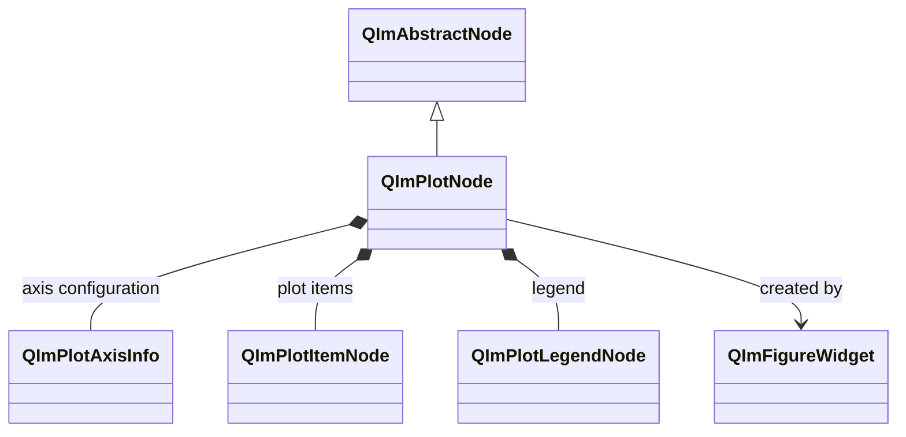
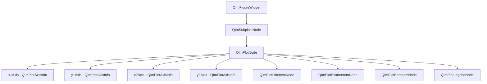

# QImPlotNode 使用指南

`QImPlotNode` 是 QIm 中 2D 绘图的核心节点，继承自 `QImAbstractNode`，
管理单个 ImPlot 绘图区域的生命周期、坐标轴配置和渲染上下文，
是所有 2D 绘图元素的父节点。

## 主要功能特性

**特性**

- ✅ **绘图区域管理**：封装 ImPlot 的 BeginPlot/EndPlot 渲染流程，自动管理绘图上下文
- ✅ **坐标轴配置**：支持最多 6 条坐标轴（x1/y1/x2/y2/x3/y3），通过 `QImPlotAxisInfo` 进行细粒度控制
- ✅ **标志属性系统**：将 ImPlotFlags 映射为 Qt 肯定语义布尔属性（titleEnabled、legendEnabled 等）
- ✅ **便捷添加曲线**：提供 `addLine()` 模板方法快速创建折线图
- ✅ **交互查询**：支持鼠标悬停检测、屏幕坐标与绘图坐标互转
- ✅ **信号通知**：属性变更时发射 Qt 信号，支持响应式编程

## 基本概念

### 类继承关系



`QImPlotNode` 继承自 `QImAbstractNode`，是 QIm 对象树中 2D 绘图区域的核心节点。
每个 `QImPlotNode` 内部管理坐标轴配置对象（`QImPlotAxisInfo`）、绘图项目节点（`QImPlotItemNode`）
和图例节点（`QImPlotLegendNode`）。

### 对象树定位

`QImPlotNode` 在 QIm 对象树中的位置和子节点关系：



**对象树说明：**

- `QImPlotNode` 由 `QImFigureWidget::createPlotNode()` 创建，自动成为 `QImSubplotsNode` 的子节点
- 坐标轴配置对象（`QImPlotAxisInfo`）由 `QImPlotNode` 内部创建并持有
- 绘图项目节点（如 `QImPlotLineItemNode`）通过 `addPlotItem()` 或构造时指定父节点加入对象树
- 图例节点（`QImPlotLegendNode`）由 `QImPlotNode` 内部创建，通过 `legendNode()` 获取

### 渲染流程

`QImPlotNode` 的渲染流程严格遵循 ImPlot 约束：

1. `beginDraw()` → 调用 `ImPlot::BeginPlot()` 创建绘图上下文
2. `SetupAxes()` → 设置坐标轴（必须在首个绘图调用前完成）
3. 子节点渲染 → 各 `QImPlotItemNode` 调用 ImPlot 绘图 API
4. `endDraw()` → 调用 `ImPlot::EndPlot()` 关闭绘图上下文

## 使用方法

示例代码位于 `examples/qimfigure-test` 和 `examples/readme-2d-example`。

### 1. 基本使用

通过 `QImFigureWidget::createPlotNode()` 创建绘图节点并添加曲线：

```cpp
#include "QImFigureWidget.h"
#include "plot/QImPlotNode.h"

// 创建绘图窗口
QIM::QImFigureWidget* figure = new QIM::QImFigureWidget(this);
setCentralWidget(figure);

// 创建绘图节点（默认 1x1 布局）
QIM::QImPlotNode* plot = figure->createPlotNode();
plot->setTitle("示例图表");

// 设置坐标轴标签
plot->x1Axis()->setLabel("x");
plot->y1Axis()->setLabel("y");

// 快速添加折线
std::vector<double> x = {0, 1, 2, 3, 4};
std::vector<double> y = {0, 1, 4, 9, 16};
plot->addLine(x, y, "二次曲线");
```

效果：显示一个包含单条折线的绘图窗口，坐标轴标签分别为 x 和 y。

### 2. 多绘图配置

在 2x2 子图网格中创建多个不同类型的绘图节点：
（此示例来自 `examples/readme-2d-example/main.cpp`）

```cpp
// 创建图窗，设置 2x2 子图布局
QIM::QImFigureWidget* figure = new QIM::QImFigureWidget(this);
figure->setSubplotGrid(2, 2);
figure->setRenderMode(QIM::QImWidget::RenderOnDemand);

// 子图1 - 折线图
if (QIM::QImPlotNode* plot = figure->createPlotNode()) {
    plot->setTitle("Sine Wave");
    plot->x1Axis()->setLabel("x");
    plot->y1Axis()->setLabel("sin(x)");
    plot->setLegendEnabled(true);

    std::vector<double> x, y;
    x.reserve(400);
    y.reserve(400);
    for (int i = 0; i < 400; ++i) {
        double value = i * 2.0 * M_PI / 399.0;
        x.push_back(value);
        y.push_back(std::sin(value));
    }
    plot->addLine(x, y, "sin(x)");
}

// 子图2 - 散点图
if (QIM::QImPlotNode* plot = figure->createPlotNode()) {
    plot->setTitle("Scatter");
    plot->x1Axis()->setLabel("x");
    plot->y1Axis()->setLabel("y");
    plot->setLegendEnabled(true);
    std::vector<double> x {0.2, 0.5, 0.9, 1.3, 1.8, 2.1, 2.6, 3.0};
    std::vector<double> y {1.4, 1.0, 1.8, 1.3, 2.0, 1.7, 2.3, 2.1};
    auto* scatter = new QIM::QImPlotScatterItemNode(plot);  // 自动成为 plot 的子节点
    scatter->setLabel("samples");
    scatter->setData(x, y);
    scatter->setMarkerSize(6.0f);
    scatter->setMarkerFill(true);
    scatter->setColor(QColor(0, 114, 189));
}

// 子图4 - 饼图（配置等比例和隐藏装饰）
if (QIM::QImPlotNode* plot = figure->createPlotNode()) {
    plot->setTitle("Pie Chart");
    plot->setEqual(true);                    // 等比例显示
    plot->setMouseTextEnabled(false);         // 隐藏鼠标坐标文本
    plot->x1Axis()->setNoDecorations(true);   // 隐藏 x 轴装饰
    plot->y1Axis()->setNoDecorations(true);   // 隐藏 y 轴装饰
    plot->x1Axis()->setLimits(0.0, 1.0, QIM::QImPlotCondition::Always);
    plot->y1Axis()->setLimits(0.0, 1.0, QIM::QImPlotCondition::Always);
}
```

注意 `createPlotNode()` 按顺序填充子图格子，返回 `nullptr` 表示格子已满。

### 3. 坐标轴配置

通过 `QImPlotAxisInfo` 进行坐标轴的细粒度控制：

```cpp
QIM::QImPlotNode* plot = figure->createPlotNode();

// 获取主坐标轴
QIM::QImPlotAxisInfo* x1 = plot->x1Axis();
QIM::QImPlotAxisInfo* y1 = plot->y1Axis();

// 设置标签
x1->setLabel("时间 (s)");
y1->setLabel("幅度 (V)");

// 设置范围限制（Always 表示持续生效）
x1->setLimits(0.0, 10.0, QIM::QImPlotCondition::Always);
y1->setLimits(-1.0, 1.0, QIM::QImPlotCondition::Once);

// 设置刻度类型
x1->setScaleType(QIM::QImPlotScaleType::Time);  // 时间轴
y1->setScaleType(QIM::QImPlotScaleType::Log10);  // 对数轴

// 启用/禁用副坐标轴
plot->setAxisEnabled(QIM::QImPlotAxisId::X2, true);
plot->x2Axis()->setLabel("温度 (°C)");
```

### 4. 大数据量绘图

通过 `addLine()` 模板方法或手动创建节点处理大数据量场景：
（此示例来自 `examples/qimfigure-test/functions/line/Line10KFunction.cpp`）

```cpp
// 创建绘图节点
QIM::QImPlotNode* plotNode = figure->createPlotNode();

// 配置坐标轴和标题
plotNode->x1Axis()->setLabel("x");
plotNode->y1Axis()->setLabel("cos(x)");
plotNode->setTitle("Line10K");

// 生成 10000 个余弦波数据点
const int numPoints = 10000;
std::vector<double> x, y;
x.reserve(numPoints);
y.reserve(numPoints);
for (int i = 0; i < numPoints; ++i) {
    double t = i * 20.0 * M_PI / (numPoints - 1);
    x.push_back(t);
    y.push_back(std::cos(t));
}

// 手动创建线条节点（指定 plotNode 为父节点，自动加入对象树）
QIM::QImPlotLineItemNode* lineNode = new QIM::QImPlotLineItemNode(plotNode);
lineNode->setData(x, y);
lineNode->setColor(QColor(0, 114, 189));
// addPlotItem 由构造时指定父节点自动完成
```

!!! tip "大数据量性能"
    默认启用 LTTB 自适应降采样，大数据量时自动降采样保持流畅渲染。
    对于小数据量（<10 万点），可关闭以获得精确渲染：`lineNode->setAdaptiveSampling(false)`。

### 5. 标志属性配置

通过肯定语义布尔属性控制绘图区域的各种交互和显示特性：

```cpp
QIM::QImPlotNode* plot = figure->createPlotNode();

// 标题显示
plot->setTitleEnabled(true);    // 显示标题（默认启用）

// 图例显示
plot->setLegendEnabled(true);   // 显示图例

// 鼠标坐标文本
plot->setMouseTextEnabled(true);  // 显示鼠标位置坐标文本

// 交互控制
plot->setInputsEnabled(true);     // 启用鼠标交互（拖拽缩放等）
plot->setMenusEnabled(true);      // 启用右键菜单
plot->setBoxSelectEnabled(true);  // 启用框选功能

// 显示控制
plot->setFrameEnabled(true);      // 显示边框
plot->setEqual(true);             // 等比例坐标轴
plot->setCrosshairs(true);        // 显示十字线
plot->setCanvasEnabled(true);     // 显示画布背景
```

!!! warning "标志语义转换"
    ImPlot 原生使用否定语义（如 `ImPlotFlags_NoTitle`），QIm 统一转换为肯定语义
    （如 `titleEnabled`）。设置 `setTitleEnabled(false)` 等同于 ImPlot 的
    `ImPlotFlags_NoTitle`。详见[枚举语义转换规范](../dev/flag-mapping.md)。

### 6. 颜色映射

QIm 提供栈式 colormap 管理，通过 `pushColormap()` / `popColormap()` 方法控制当前绘图区域的颜色映射：

```cpp
QIM::QImPlotNode* plot = figure->createPlotNode();

// 方式1：通过枚举值设置 colormap
plot->pushColormap(QIM::QImPlotColormap::Viridis);

// 方式2：通过名称字符串设置 colormap（需在 QImPlotColormapManager 注册）
plot->pushColormap(QByteArray("MyCustomColormap"));

// 添加使用当前 colormap 的绘图节点
QIM::QImPlotHeatmapItemNode* heatmap = new QIM::QImPlotHeatmapItemNode(plot);
heatmap->setData(values, rows, cols);

// 恢复上一个 colormap
plot->popColormap();

// 也可一次弹出多个
plot->popColormap(2);
```

`QImPlotColormap` 枚举提供 16 种内置 colormap：

| 枚举值 | 序号 | 枚举值 | 序号 |
|--------|------|--------|------|
| `Deep` | 0 | `Dark` | 1 |
| `Pastel` | 2 | `Paired` | 3 |
| `Viridis` | 4 | `Plasma` | 5 |
| `Hot` | 6 | `Cool` | 7 |
| `Pink` | 8 | `Jet` | 9 |
| `Twilight` | 10 | `RdBu` | 11 |
| `BrBG` | 12 | `PiYG` | 13 |
| `Spectral` | 14 | `Greys` | 15 |

`pushColormap()` 在 `beginDraw()` 中生效，`popColormap()` 在 `endDraw()` 中执行。
自定义 colormap 可通过 `QImPlotColormapManager` 注册，
详见[颜色映射文档](colormap.md)。

## API参考

### 属性列表

| 属性 | 类型 | Getter | Setter | 信号 | 说明 |
|------|------|--------|--------|------|------|
| title | QString | `title()` | `setTitle()` | `titleChanged` | 绘图标题 |
| size | QSizeF | `size()` | `setSize()` | `sizeChanged` | 绘图区域尺寸 |
| autoSize | bool | `isAutoSize()` | `setAutoSize()` | `autoSizeChanged` | 自动适配尺寸 |
| titleEnabled | bool | `isTitleEnabled()` | `setTitleEnabled()` | `plotFlagChanged` | 是否显示标题 |
| legendEnabled | bool | `isLegendEnabled()` | `setLegendEnabled()` | `plotFlagChanged` | 是否显示图例 |
| mouseTextEnabled | bool | `isMouseTextEnabled()` | `setMouseTextEnabled()` | `plotFlagChanged` | 是否显示鼠标坐标文本 |
| inputsEnabled | bool | `isInputsEnabled()` | `setInputsEnabled()` | `plotFlagChanged` | 是否启用鼠标交互 |
| menusEnabled | bool | `isMenusEnabled()` | `setMenusEnabled()` | `plotFlagChanged` | 是否启用右键菜单 |
| boxSelectEnabled | bool | `isBoxSelectEnabled()` | `setBoxSelectEnabled()` | `plotFlagChanged` | 是否启用框选 |
| frameEnabled | bool | `isFrameEnabled()` | `setFrameEnabled()` | `plotFlagChanged` | 是否显示边框 |
| equal | bool | `isEqual()` | `setEqual()` | `plotFlagChanged` | 等比例坐标轴 |
| crosshairs | bool | `isCrosshairs()` | `setCrosshairs()` | `plotFlagChanged` | 是否显示十字线 |
| canvasEnabled | bool | `isCanvasEnabled()` | `setCanvasEnabled()` | `plotFlagChanged` | 是否显示画布背景 |

### 方法列表

| 方法 | 参数 | 说明 |
|------|------|------|
| `axisInfo(id)` | `QImPlotAxisId` | 获取指定坐标轴配置对象 |
| `x1Axis()` / `y1Axis()` | - | 获取主坐标轴配置 |
| `x2Axis()` / `y2Axis()` | - | 获取副坐标轴配置 |
| `x3Axis()` / `y3Axis()` | - | 获取第三坐标轴配置 |
| `isAxisEnabled(id)` | `QImPlotAxisId` | 检查坐标轴是否启用 |
| `setAxisEnabled(id, on)` | `QImPlotAxisId`, bool | 启用/禁用坐标轴 |
| `addPlotItem(item)` | `QImPlotItemNode*` | 添加绘图项目节点 |
| `addLine(x, y, label)` | Container, Container, QString | 模板方法，快速添加折线 |
| `addLine(lineItem)` | `QImPlotLineItemNode*` | 添加已有折线节点 |
| `plotItemNodes()` | - | 获取所有绘图项目节点 |
| `legendNode()` | - | 获取图例节点 |
| `isPlotHovered()` | - | 鼠标是否悬停在绘图区域上 |
| `pixelsToPlot(sx, sy)` | float, float | 屏幕坐标 → 绘图坐标 |
| `plotToPixels(dx, dy)` | double, double | 绘图坐标 → 屏幕坐标 |
| `rescaleAxes()` | - | 自动适配坐标轴范围 |
| `setAxesToFit()` | - | 设置坐标轴范围适配数据 |
| `pushColormap(colormap)` | QImPlotColormap | 压入 colormap（枚举值） |
| `pushColormap(name)` | QByteArray | 压入 colormap（名称字符串） |
| `popColormap(count)` | int | 弹出 N 个 colormap（默认1） |
| `imPlotFlags()` | - | 获取原始 ImPlot 标志位 |
| `setImPlotFlags(flags)` | int | 设置原始 ImPlot 标志位 |

!!! info "addLine() 模板方法"
    `addLine()` 是模板方法，支持 `QVector<double>`、`std::vector<double>` 等容器类型，
    内部自动创建 `QImPlotLineItemNode` 并调用 `addPlotItem()` 加入对象树。

!!! warning "交互方法调用时机"
    `isPlotHovered()`、`pixelsToPlot()`、`plotToPixels()` 必须在 `beginDraw()` 执行期间调用，
    即 ImPlot 上下文活跃时。在其他时机调用将返回无效值。

## 信号槽连接

| 信号 | 参数 | 触发时机 |
|------|------|----------|
| `titleChanged(title)` | QString | 标题变更时 |
| `sizeChanged(size)` | QSizeF | 尺寸变更时 |
| `autoSizeChanged(autoSize)` | bool | 自适应尺寸状态变更时 |
| `plotFlagChanged()` | - | 任何标志属性变更时 |

```cpp
// 监控标题变更
connect(plot, &QIM::QImPlotNode::titleChanged,
        this, [](const QString& newTitle) {
    qDebug() << "标题已更新为:" << newTitle;
});

// 监控标志变更（单一信号覆盖所有标志属性）
connect(plot, &QIM::QImPlotNode::plotFlagChanged,
        this, [plot]() {
    // 需查询具体属性确定变更内容
    if (!plot->isLegendEnabled()) {
        qDebug() << "图例已隐藏";
    }
});
```

!!! warning "plotFlagChanged 信号"
    所有标志属性（titleEnabled、legendEnabled 等）共用 `plotFlagChanged()` 信号。
    此信号不指示具体哪个标志发生变更，连接的槽函数需查询相关属性以确定变更内容。

## 注意事项

!!! warning "createPlotNode() 返回 nullptr"
    当子图格子已满时，`createPlotNode()` 返回 `nullptr`。建议始终检查返回值：
    ```cpp
    if (QIM::QImPlotNode* plot = figure->createPlotNode()) {
        plot->setTitle("图表");
    } else {
        qDebug() << "子图格子已满，无法创建新绘图";
    }
    ```

!!! warning "坐标轴设置时机"
    `SetupAxes()` 必须在首个绘图调用前完成。QIm 在 `beginDraw()` 内自动处理此流程，
    但坐标轴配置（标签、范围、标志等）应在创建绘图节点后立即设置，不要在渲染循环中动态修改。

!!! info "对象树父子关系"
    创建绘图项目节点时，指定 `QImPlotNode` 为父对象即可自动加入对象树：
    ```cpp
    // 方式1：构造时指定父节点（推荐）
    QIM::QImPlotLineItemNode* line = new QIM::QImPlotLineItemNode(plot);

    // 方式2：通过 addPlotItem() 添加
    QIM::QImPlotLineItemNode* line = new QIM::QImPlotLineItemNode();
    plot->addPlotItem(line);
    ```
    两种方式等效。方式1 更符合 Qt 对象树习惯，构造时指定父节点后节点生命周期由父节点管理。

!!! info "坐标轴条件枚举"
    `setLimits()` 的 `QImPlotCondition` 参数控制范围限制生效策略：
    - `Always`：每次渲染都强制设置范围
    - `Once`：仅在首次渲染时设置范围（默认）

## 参考

- 相关文档：[QImFigureWidget](figure-widget.md)、[线条图](plot-line.md)、[渲染节点](../render-node.md)、[枚举语义转换](../dev/flag-mapping.md)
- 示例代码：`examples/qimfigure-test`、`examples/readme-2d-example`
- API参考：`src/core/plot/QImPlotNode.h`、`src/core/plot/QImPlotAxisInfo.h`