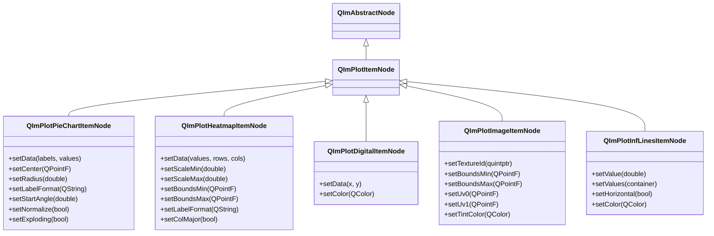
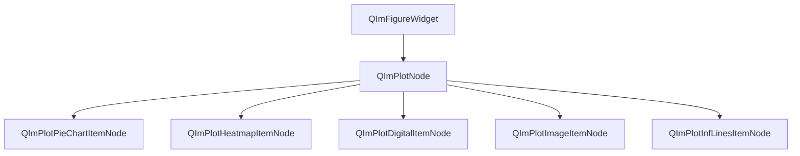

# 2D 特殊图表使用指南

QIm 提供了 5 种特殊 2D 图表节点，用于饼图、热力图、数字信号、图像渲染和无限参考线等
非标准曲线场景。这些图表节点均继承自 `QImPlotItemNode`，遵循相同的对象树管理模式，
通过 Qt 属性系统和信号槽机制实现配置和交互。

## 主要功能特性

**特性**

- ✅ **PieChart 饼图**：比例数据可视化，支持归一化、爆炸切片、自定义标签格式和起始角度
- ✅ **Heatmap 热力图**：二维矩阵数据颜色网格，支持色阶缩放、坐标边界和列主序布局
- ✅ **Digital 数字信号**：二进制/逻辑电平信号可视化，0/1 状态切换的阶梯式绘图
- ✅ **Image 图像**：GPU 纹理在绘图坐标系中的渲染，支持 UV 坐标和色调叠加
- ✅ **InfLines 无限线**：垂直/水平参考线，支持单值设置和多值批量设置

## 基本概念

### 类继承关系



所有特殊图表节点继承自 `QImPlotItemNode`，通过构造时指定 `QImPlotNode` 为父节点
即可自动加入对象树，无需手动调用 `addPlotItem()`。

### 对象树定位



**对象树说明：**

- 特殊图表节点通过构造函数指定 `QImPlotNode` 为父对象，自动成为其子节点
- 节点生命周期由 Qt 对象树管理，父节点销毁时子节点自动销毁
- 所有图表节点的渲染在 `QImPlotNode::beginDraw()` / `endDraw()` 上下文中执行

## PieChart 饼图

`QImPlotPieChartItemNode` 为 ImPlot 饼图提供 Qt 风格的保留模式封装。
饼图使用圆形切片可视化比例数据，适用于市场份额、资源分配等场景。

### 数据设置

饼图数据由标签列表（`QStringList`）和数值容器组成：

```cpp
// 创建饼图节点，以 plotNode 为父节点
QIM::QImPlotPieChartItemNode* pie = new QIM::QImPlotPieChartItemNode(plotNode);

// 设置数据：标签和对应的数值
pie->setData(QStringList() << "Desktop" << "Web" << "Embedded" << "Tools",
             std::vector<double> {28.0, 34.0, 22.0, 16.0});
```

`setData()` 是模板方法，支持 `std::vector<double>`、`QVector<double>` 等容器类型。
也支持移动语义版本，避免大容器拷贝：

```cpp
QStringList labels = {"Apple", "Banana", "Cherry", "Date", "Elderberry"};
std::vector<double> values = {30.0, 25.0, 15.0, 20.0, 10.0};
pie->setData(std::move(labels), std::move(values));  // 移动语义，避免拷贝
```

### 位置和尺寸

饼图在绘图坐标系中定位，需要设置中心点和半径：

```cpp
pie->setCenter(QPointF(0.5, 0.5));  // 中心点坐标（绘图单位）
pie->setRadius(0.40);               // 半径（绘图单位）
```

!!! warning "坐标系要求"
    饼图通常需要配合等比例坐标轴（`setEqual(true)`）和固定范围才能呈现圆形，
    否则可能因 X/Y 比例不同而变形为椭圆。

### 标签格式

`labelFormat` 使用 printf 风格格式字符串控制切片标签显示：

```cpp
pie->setLabelFormat("%.0f");     // 整数显示：28
pie->setLabelFormat("%.1f");     // 一位小数：28.0
pie->setLabelFormat("%.1f%%");   // 百分比显示：28.0%
```

### 起始角度

`startAngle` 控制第一个切片的起始角度（度），0 度对应 3 点钟方向，90 度对应 12 点钟方向：

```cpp
pie->setStartAngle(90.0);  // 从顶部开始绘制
pie->setStartAngle(0.0);   // 从右侧开始绘制（默认）
```

### 标志属性

| 属性 | 类型 | Getter | Setter | 说明 |
|------|------|--------|--------|------|
| normalize | bool | `isNormalized()` | `setNormalize()` | 归一化，强制各切片数值之和构成完整圆 |
| ignoreHidden | bool | `isIgnoreHidden()` | `setIgnoreHidden()` | 忽略隐藏切片，绘制时跳过被隐藏的项 |
| exploding | bool | `isExploding()` | `setExploding()` | 爆炸效果，图例悬停时切片从中心偏移 |

```cpp
pie->setNormalize(true);    // 归一化：即使数值之和不为 100，也会显示完整圆
pie->setIgnoreHidden(true); // 忽略隐藏切片
pie->setExploding(true);    // 爆炸效果：悬停图例项时对应切片弹出
```

!!! tip "exploding 爆炸效果"
    `exploding` 属性启用后，当鼠标悬停在图例中的切片项时，该切片会从中心偏移弹出，
    形成视觉上的"爆炸"效果，便于区分各切片。

### 隐藏坐标轴

饼图通常不需要坐标轴装饰，需要配合 `QImPlotNode` 的坐标轴配置隐藏轴线和刻度：

```cpp
// 来自 examples/readme-2d-example/main.cpp 的饼图完整示例
if (QIM::QImPlotNode* plot = figure->createPlotNode()) {
    plot->setTitle("Pie Chart");
    plot->setEqual(true);                     // 等比例坐标轴，保证饼图呈圆形
    plot->setMouseTextEnabled(false);          // 隐藏鼠标坐标文本
    plot->x1Axis()->setNoDecorations(true);    // 隐藏 X 轴装饰（刻度、标签、网格线）
    plot->y1Axis()->setNoDecorations(true);    // 隐藏 Y 轴装饰
    plot->x1Axis()->setLimits(0.0, 1.0, QIM::QImPlotCondition::Always);  // 固定 X 轴范围
    plot->y1Axis()->setLimits(0.0, 1.0, QIM::QImPlotCondition::Always);  // 固定 Y 轴范围

    auto* pie = new QIM::QImPlotPieChartItemNode(plot);  // 以 plot 为父节点
    pie->setData(QStringList() << "Desktop" << "Web" << "Embedded" << "Tools",
                 std::vector<double> {28.0, 34.0, 22.0, 16.0});
    pie->setCenter(QPointF(0.5, 0.5));
    pie->setRadius(0.40);
    pie->setLabelFormat("%.0f");
    pie->setExploding(true);
    pie->setIgnoreHidden(true);
}
```

!!! warning "饼图坐标轴配置要点"
    饼图需要三项关键配置：① `setEqual(true)` 确保等比例显示；
    ② `setNoDecorations(true)` 隐藏轴装饰；③ `setLimits()` 固定坐标范围。
    详见 [QImPlotNode 使用指南](plot-node.md) 和 [坐标轴配置](plot-axis.md)。

### 属性列表

| 属性 | 类型 | Getter | Setter | 信号 | 说明 |
|------|------|--------|--------|------|------|
| center | QPointF | `center()` | `setCenter()` | `centerChanged` | 饼图中心位置（绘图单位） |
| radius | double | `radius()` | `setRadius()` | `radiusChanged` | 饼图半径（绘图单位） |
| labelFormat | QString | `labelFormat()` | `setLabelFormat()` | `labelFormatChanged` | 切片标签格式字符串 |
| startAngle | double | `startAngle()` | `setStartAngle()` | `startAngleChanged` | 起始角度（度） |
| normalize | bool | `isNormalized()` | `setNormalize()` | `normalizeChanged` | 归一化标志 |
| ignoreHidden | bool | `isIgnoreHidden()` | `setIgnoreHidden()` | `ignoreHiddenChanged` | 忽略隐藏切片标志 |
| exploding | bool | `isExploding()` | `setExploding()` | `explodingChanged` | 爆炸切片标志 |

### 信号列表

| 信号 | 参数 | 触发时机 |
|------|------|----------|
| `centerChanged(center)` | QPointF | 中心位置变更时 |
| `radiusChanged(radius)` | double | 半径变更时 |
| `labelFormatChanged(format)` | QString | 标签格式变更时 |
| `startAngleChanged(angle)` | double | 起始角度变更时 |
| `normalizeChanged(normalize)` | bool | 归一化标志变更时 |
| `ignoreHiddenChanged(ignore)` | bool | 忽略隐藏标志变更时 |
| `explodingChanged(exploding)` | bool | 爆炸标志变更时 |
| `dataChanged()` | - | 数据系列变更时 |
| `pieChartFlagChanged()` | - | 任何饼图标志属性变更时 |

!!! warning "pieChartFlagChanged 信号"
    `normalize`、`ignoreHidden`、`exploding` 等标志属性共用 `pieChartFlagChanged()` 信号。
    此信号不指示具体哪个标志变更，槽函数需查询相关属性确定变更内容。

### 示例

饼图的示例位于 `examples/qimfigure-test/functions/other/PieChartFunction.cpp` 和
`examples/readme-2d-example/main.cpp`。

## Heatmap 热力图

`QImPlotHeatmapItemNode` 为 ImPlot 热力图提供 Qt 风格的保留模式封装。
热力图将二维矩阵数据可视化为颜色网格，适用于相关矩阵、温度分布、密度图等场景。

### 数据设置

热力图数据为二维矩阵，通过一维容器 + 行列数指定：

```cpp
// 创建热力图节点，以 plotNode 为父节点
QIM::QImPlotHeatmapItemNode* heatmap = new QIM::QImPlotHeatmapItemNode(plotNode);

// 生成 10x10 正弦图案数据
const int rows = 10;
const int cols = 10;
std::vector<double> values(rows * cols);
for (int i = 0; i < rows; ++i) {
    for (int j = 0; j < cols; ++j) {
        values[i * cols + j] = sin(i * 0.5) * cos(j * 0.5);
    }
}

// 设置数据：值容器、行数、列数
heatmap->setData(values, rows, cols);
```

`setData()` 的第四个参数 `colMajor` 控制数据布局（默认行主序 `false`）：

```cpp
heatmap->setData(values, rows, cols, true);  // 列主序布局
```

也支持移动语义版本：

```cpp
heatmap->setData(std::move(values), rows, cols);  // 移动语义
```

!!! info "数据布局说明"
    - **行主序（默认）**：数据按行存储，`values[i * cols + j]` 表示第 i 行第 j 列
    - **列主序**：数据按列存储，`values[j * rows + i]` 表示第 i 行第 j 列
    - `colMajor` 属性可通过 `setData()` 参数或 `setColMajor()` 方法设置

### 色阶缩放

`scaleMin` / `scaleMax` 控制颜色映射的数值范围：

```cpp
heatmap->setScaleMin(0.0);   // 色阶最小值（0 = 自动）
heatmap->setScaleMax(1.0);   // 色阶最大值（0 = 自动）
```

当设置为 0 时，ImPlot 会根据数据自动确定缩放范围。
手动设置可确保不同热力图使用相同的色阶基准，便于对比。

!!! tip "色阶范围对比"
    多个热力图需要对比时，建议统一设置 `scaleMin` 和 `scaleMax`，
    使相同数值映射到相同颜色，避免因自动缩放导致的颜色不一致。

### 坐标边界

`boundsMin` / `boundsMax` 定义热力图在绘图坐标系中的矩形范围：

```cpp
heatmap->setBoundsMin(QPointF(0.0, 0.0));    // 左下角坐标
heatmap->setBoundsMax(QPointF(10.0, 10.0));   // 右上角坐标
```

如果不设置边界，ImPlot 使用默认坐标系（行列索引作为坐标）。

### 标签格式

`labelFormat` 控制热力图单元格上数值标签的显示格式：

```cpp
heatmap->setLabelFormat("%.1f");   // 显示一位小数
heatmap->setLabelFormat("");       // 空字符串 = 不显示标签
```

### 列主序布局

```cpp
heatmap->setColMajor(true);   // 列主序数据布局
heatmap->setColMajor(false);  // 行主序（默认）
```

### 属性列表

| 属性 | 类型 | Getter | Setter | 信号 | 说明 |
|------|------|--------|--------|------|------|
| scaleMin | double | `scaleMin()` | `setScaleMin()` | `scaleMinChanged` | 色阶最小值（0 = 自动） |
| scaleMax | double | `scaleMax()` | `setScaleMax()` | `scaleMaxChanged` | 色阶最大值（0 = 自动） |
| labelFormat | QString | `labelFormat()` | `setLabelFormat()` | `labelFormatChanged` | 数值标签格式字符串 |
| boundsMin | QPointF | `boundsMin()` | `setBoundsMin()` | `boundsMinChanged` | 左下角边界坐标 |
| boundsMax | QPointF | `boundsMax()` | `setBoundsMax()` | `boundsMaxChanged` | 右上角边界坐标 |
| colMajor | bool | `isColMajor()` | `setColMajor()` | `colMajorChanged` | 列主序数据布局标志 |

### 信号列表

| 信号 | 参数 | 触发时机 |
|------|------|----------|
| `scaleMinChanged(min)` | double | 色阶最小值变更时 |
| `scaleMaxChanged(max)` | double | 色阶最大值变更时 |
| `labelFormatChanged(format)` | QString | 标签格式变更时 |
| `boundsMinChanged(min)` | QPointF | 左下角边界变更时 |
| `boundsMaxChanged(max)` | QPointF | 右上角边界变更时 |
| `colMajorChanged(colMajor)` | bool | 列主序标志变更时 |
| `dataChanged()` | - | 数据系列变更时 |
| `heatmapFlagChanged()` | - | 任何热力图标志属性变更时 |

### 示例

热力图的示例位于 `examples/qimfigure-test/functions/other/HeatmapFunction.cpp`。

```cpp
// 来自 HeatmapFunction.cpp 的核心代码
void HeatmapFunction::createPlot(QIM::QImFigureWidget* figure)
{
    m_plotNode = figure->createPlotNode();
    m_plotNode->x1Axis()->setLabel(m_xLabel);
    m_plotNode->y1Axis()->setLabel(m_yLabel);
    m_plotNode->setTitle(m_title);
    m_plotNode->setLegendEnabled(true);

    const int rows = 10;
    const int cols = 10;
    std::vector<double> values(rows * cols);
    for (int i = 0; i < rows; ++i) {
        for (int j = 0; j < cols; ++j) {
            values[i * cols + j] = sin(i * 0.5) * cos(j * 0.5);
        }
    }

    m_heatmapNode = new QIM::QImPlotHeatmapItemNode(m_plotNode);  // 以 plot 为父节点
    m_heatmapNode->setLabel("Heatmap");
    m_heatmapNode->setData(values, rows, cols, m_colMajor);
    m_heatmapNode->setScaleMin(m_scaleMin);
    m_heatmapNode->setScaleMax(m_scaleMax);
    m_heatmapNode->setLabelFormat(m_labelFormat);
    m_heatmapNode->setBoundsMin(m_boundsMin);
    m_heatmapNode->setBoundsMax(m_boundsMax);
}
```

!!! warning "大型热力图性能"
    热力图尺寸超过 1000×1000 时可能影响渲染性能。对于大型热力图，
    建议关闭标签显示（`setLabelFormat("")`）以减少绘制开销。

## Digital 数字信号

`QImPlotDigitalItemNode` 为 ImPlot 数字信号提供 Qt 风格的保留模式封装。
数字信号图可视化二进制/逻辑电平信号（0/1 状态切换），适用于逻辑分析仪、
信号时序图、嵌入式调试等场景。

### 数据格式

数字信号数据使用 XY 格式，Y 值为 0 或 1 表示状态切换：

```cpp
// 创建数字信号节点，以 plotNode 为父节点
QIM::QImPlotDigitalItemNode* digital = new QIM::QImPlotDigitalItemNode(plotNode);

// X 为时间/采样点，Y 为 0/1 状态值
QVector<double> xs = {0, 1, 2, 3, 4, 5, 6, 7, 8};
QVector<double> ys = {0, 1, 1, 0, 0, 1, 1, 0, 1};  // 状态切换序列

digital->setData(xs, ys);
```

!!! info "0/1 切换数据格式"
    数字信号的 Y 值只能是 0 或 1（或其他离散值），表示信号的高低状态。
    QIm 在相邻数据点间自动绘制阶梯式连线，形成方波波形。
    与折线图不同，数字信号图不响应 Y 轴拖拽/缩放，始终参考绘图底部。

### 颜色设置

```cpp
digital->setColor(QColor(0, 114, 189));   // 设置信号线颜色
```

未设置颜色时，使用 ImPlot 的默认颜色序列。

### 属性列表

| 属性 | 类型 | Getter | Setter | 信号 | 说明 |
|------|------|--------|--------|------|------|
| color | QColor | `color()` | `setColor()` | `colorChanged` | 数字信号线颜色 |

### 信号列表

| 信号 | 参数 | 触发时机 |
|------|------|----------|
| `colorChanged(color)` | QColor | 信号颜色变更时 |
| `dataChanged()` | - | 数据系列变更时 |
| `digitalFlagChanged()` | - | 任何数字标志属性变更时 |

### 示例

数字信号的示例位于 `examples/qimfigure-test/functions/other/DigitalFunction.cpp`。

```cpp
// 来自 DigitalFunction.cpp 的核心代码
void DigitalFunction::createPlot(QIM::QImFigureWidget* figure)
{
    m_plotNode = figure->createPlotNode();
    m_plotNode->x1Axis()->setLabel(m_xLabel);
    m_plotNode->y1Axis()->setLabel(m_yLabel);
    m_plotNode->setTitle(m_title);
    m_plotNode->setLegendEnabled(true);

    // 0/1 数字信号数据
    QVector<double> xs = {0, 1, 2, 3, 4, 5, 6, 7, 8};
    QVector<double> ys = {0, 1, 1, 0, 0, 1, 1, 0, 1};

    m_digitalNode = new QIM::QImPlotDigitalItemNode(m_plotNode);  // 以 plot 为父节点
    m_digitalNode->setLabel(m_digitalLabel);
    m_digitalNode->setData(xs, ys);
    m_digitalNode->setColor(m_digitalColor);
}
```

!!! warning "数字信号图特性"
    数字信号图始终参考绘图底部，不响应 Y 轴缩放。
    多个数字信号会自动纵向堆叠，每个信号占据独立高度层。

## Image 图像

`QImPlotImageItemNode` 为 ImPlot 图像渲染提供 Qt 风格的保留模式封装。
在绘图坐标系中渲染 GPU 纹理图像，适用于叠加图标、Logo 或预渲染图形。

### 纹理 ID

`textureId` 是 GPU 纹理标识符，必须是来自渲染后端的有效 `ImTextureID`：

```cpp
// 创建图像节点，以 plotNode 为父节点
QIM::QImPlotImageItemNode* imageNode = new QIM::QImPlotImageItemNode(plotNode);

// 设置 GPU 纹理 ID（0 表示无纹理）
imageNode->setTextureId(textureId);
```

!!! warning "纹理 ID 来源"
    `textureId` 必须是通过 OpenGL 或渲染后端创建的有效 GPU 纹理 ID。
    直接使用未经上传的纹理 ID 将导致图像无法渲染或显示为空白。
    通常通过 `QOpenGLTexture` 或 ImGui 的纹理加载机制获取。

### 坐标边界

`boundsMin` / `boundsMax` 定义图像在绘图坐标系中的矩形位置：

```cpp
imageNode->setBoundsMin(QPointF(0.0, 0.0));    // 左下角坐标
imageNode->setBoundsMax(QPointF(10.0, 10.0));   // 右上角坐标
```

图像将在此矩形区域内渲染，坐标可随绘图缩放/平移而变化。

### UV 坐标

`uv0` / `uv1` 定义纹理的 UV 坐标范围，用于裁剪或翻转纹理：

```cpp
imageNode->setUv0(QPointF(0.0, 0.0));   // 纹理左下角 UV 坐标（默认）
imageNode->setUv1(QPointF(1.0, 1.0));   // 纹理右上角 UV 坐标（默认）
```

!!! info "UV 坐标系统"
    UV 坐标使用 OpenGL 标准：原点 (0,0) 在纹理左下角，(1,1) 在右上角。
    - 完整纹理：`uv0 = (0,0)`，`uv1 = (1,1)`
    - 上半部分：`uv0 = (0,0.5)`，`uv1 = (1,1)`
    - 水平翻转：`uv0 = (1,0)`，`uv1 = (0,1)`（X 坐标互换）

### 色调叠加

`tintColor` 对图像纹理进行颜色叠加，Alpha 通道控制透明度：

```cpp
imageNode->setTintColor(QColor(255, 255, 255, 255));  // 原色显示（默认）
imageNode->setTintColor(QColor(255, 0, 0, 128));      // 半透明红色叠加
```

### 属性列表

| 属性 | 类型 | Getter | Setter | 信号 | 说明 |
|------|------|--------|--------|------|------|
| textureId | quintptr | `textureId()` | `setTextureId()` | `textureIdChanged` | GPU 纹理标识符 |
| boundsMin | QPointF | `boundsMin()` | `setBoundsMin()` | `boundsMinChanged` | 左下角边界坐标 |
| boundsMax | QPointF | `boundsMax()` | `setBoundsMax()` | `boundsMaxChanged` | 右上角边界坐标 |
| uv0 | QPointF | `uv0()` | `setUv0()` | `uv0Changed` | 纹理左下角 UV 坐标 |
| uv1 | QPointF | `uv1()` | `setUv1()` | `uv1Changed` | 纹理右上角 UV 坐标 |
| tintColor | QColor | `tintColor()` | `setTintColor()` | `tintColorChanged` | 色调叠加颜色 |

### 信号列表

| 信号 | 参数 | 触发时机 |
|------|------|----------|
| `textureIdChanged(id)` | quintptr | 纹理 ID 变更时 |
| `boundsMinChanged(min)` | QPointF | 左下角边界变更时 |
| `boundsMaxChanged(max)` | QPointF | 右上角边界变更时 |
| `uv0Changed(uv)` | QPointF | UV0 坐标变更时 |
| `uv1Changed(uv)` | QPointF | UV1 坐标变更时 |
| `tintColorChanged(color)` | QColor | 色调颜色变更时 |
| `imageFlagChanged()` | - | 任何图像标志属性变更时 |

### 示例

图像的示例位于 `examples/qimfigure-test/functions/other/ImageFunction.cpp`。

```cpp
// 来自 ImageFunction.cpp 的核心代码
void ImageFunction::createPlot(QIM::QImFigureWidget* figure)
{
    m_plotNode = figure->createPlotNode();
    m_plotNode->x1Axis()->setLabel(m_xLabel);
    m_plotNode->y1Axis()->setLabel(m_yLabel);
    m_plotNode->setTitle(m_title);
    m_plotNode->setLegendEnabled(true);

    m_imageNode = new QIM::QImPlotImageItemNode(m_plotNode);  // 以 plot 为父节点
    m_imageNode->setLabel("Image");
    m_imageNode->setTextureId(m_textureId);
    m_imageNode->setBoundsMin(m_boundsMin);
    m_imageNode->setBoundsMax(m_boundsMax);
    m_imageNode->setUv0(m_uv0);
    m_imageNode->setUv1(m_uv1);
    m_imageNode->setTintColor(m_tintColor);
}
```

!!! warning "textureId 为 0"
    当 `textureId` 为 0 时，图像节点不会渲染任何内容。
    需要确保纹理已上传到 GPU 并获取有效 ID 后再设置。

## InfLines 无限线

`QImPlotInfLinesItemNode` 为 ImPlot 无限线提供 Qt 风格的保留模式封装。
无限线是垂直或水平的线条，在绘图区域内无限延伸，
适用于标记阈值、参考值、渐近线等。

### 单值设置

`setValue()` 设置单条无限线的位置：

```cpp
// 创建无限线节点，以 plotNode 为父节点
QIM::QImPlotInfLinesItemNode* infLine = new QIM::QImPlotInfLinesItemNode(plotNode);

// 设置单条垂直无限线（X = 3.0）
infLine->setValue(3.0);
```

### 多值批量设置

`setValues()` 设置多条无限线的位置，支持多种数据源：

```cpp
// std::vector 容器
std::vector<double> vValues = {2.0, 4.0, 6.0};
infLine->setValues(vValues);

// 初始化列表
infLine->setValues({1.0, 3.0, 5.0});

// std::vector 移动语义
infLine->setValues(std::vector<double>{1.5, 3.5});

// 原始指针 + 数量
double data[] = {2.0, 5.0, 8.0};
infLine->setValues(data, 3);
```

### 方向控制

默认为垂直无限线（X 坐标），`horizontal` 属性切换为水平无限线（Y 坐标）：

```cpp
// 垂直无限线（默认）：值为 X 坐标
infLine->setHorizontal(false);

// 水平无限线：值为 Y 坐标
infLine->setHorizontal(true);
```

!!! info "方向说明"
    - **垂直模式（默认）**：`setValues()` 中的值为 X 坐标，绘制垂直无限线
    - **水平模式**：`setValues()` 中的值为 Y 坐标，绘制水平无限线

### 颜色设置

```cpp
infLine->setColor(QColor(255, 0, 0));   // 红色无限线
```

### 典型用法：同时使用垂直和水平无限线

无限线常与折线图配合使用，标记关键阈值位置：

```cpp
// 来自 InfLinesFunction.cpp 的核心代码
void InfLinesFunction::createPlot(QIM::QImFigureWidget* figure)
{
    m_plotNode = figure->createPlotNode();
    m_plotNode->setTitle(m_title);
    m_plotNode->setLegendEnabled(true);

    // 背景曲线：200 点正弦波
    const int numPoints = 200;
    std::vector<double> xData(numPoints), yData(numPoints);
    for (int i = 0; i < numPoints; ++i) {
        xData[i] = i * 0.05;
        yData[i] = std::sin(xData[i]) * 5.0;
    }
    m_lineNode = new QIM::QImPlotLineItemNode(m_plotNode);  // 以 plot 为父节点
    m_lineNode->setLabel("Sine Wave");
    m_lineNode->setData(xData, yData);

    // 垂直无限线
    m_verticalInfLinesNode = new QIM::QImPlotInfLinesItemNode(m_plotNode);
    m_verticalInfLinesNode->setLabel("Vertical Ref");
    m_verticalInfLinesNode->setValues(std::vector<double>{2.0, 5.0, 7.0});
    m_verticalInfLinesNode->setHorizontal(false);   // 垂直方向
    m_verticalInfLinesNode->setColor(QColor(255, 0, 0));

    // 水平无限线
    m_horizontalInfLinesNode = new QIM::QImPlotInfLinesItemNode(m_plotNode);
    m_horizontalInfLinesNode->setLabel("Horizontal Ref");
    m_horizontalInfLinesNode->setValues(std::vector<double>{0.0, 3.0, -3.0});
    m_horizontalInfLinesNode->setHorizontal(true);   // 水平方向
    m_horizontalInfLinesNode->setColor(QColor(0, 128, 0));
}
```

### 属性列表

| 属性 | 类型 | Getter | Setter | 信号 | 说明 |
|------|------|--------|--------|------|------|
| horizontal | bool | `isHorizontal()` | `setHorizontal()` | `orientationChanged` | 水平方向标志 |
| color | QColor | `color()` | `setColor()` | `colorChanged` | 无限线颜色 |

### 信号列表

| 信号 | 参数 | 触发时机 |
|------|------|----------|
| `orientationChanged(horizontal)` | bool | 方向变更时 |
| `colorChanged(color)` | QColor | 颜色变更时 |
| `dataChanged()` | - | 数据变更时 |
| `infLinesFlagChanged()` | - | 任何无限线标志属性变更时 |

### 数据访问

| 方法 | 参数 | 说明 |
|------|------|------|
| `setValue(value)` | double | 设置单条无限线位置 |
| `setValues(container)` | Container | 设置多条无限线位置（模板方法） |
| `setValues(values, count)` | double*, int | 原始指针 + 数量 |
| `setValues(init_list)` | initializer_list | 初始化列表 |
| `setValues(vector&&)` | std::vector&& | 移动语义 |
| `count()` | - | 获取无限线数量 |
| `value(index)` | int | 获取指定索引的值 |

### 示例

无限线的示例位于 `examples/qimfigure-test/functions/other/InfLinesFunction.cpp`。

## 通用注意事项

!!! warning "对象树父节点"
    所有特殊图表节点创建时必须指定 `QImPlotNode` 为父对象：
    ```cpp
    // 正确：构造时指定父节点
    auto* node = new QIM::QImPlotPieChartItemNode(plotNode);
    
    // 不推荐：先创建再添加
    auto* node = new QIM::QImPlotPieChartItemNode();
    plotNode->addPlotItem(node);
    ```
    方式1更符合 Qt 对象树习惯，构造时指定父节点后节点生命周期由父节点管理。

!!! warning "渲染流程"
    所有图表节点的渲染必须在 `QImPlotNode::beginDraw()` / `endDraw()` 上下文中执行。
    QIm 自动管理此流程，但属性变更（setData、setColor 等）可在任意时机调用，
    变更会在下一次渲染时生效。

!!! info "setData 模板方法"
    所有图表节点的 `setData()` 方法都是模板方法，支持 `std::vector`、`QVector`、
    `std::array` 等标准容器类型。同时提供移动语义版本，避免大数据容器拷贝。

!!! info "标志变更信号"
    PieChart、Heatmap、Digital、Image、InfLines 各节点均有专属的标志变更信号
    (`pieChartFlagChanged`、`heatmapFlagChanged` 等)，所有标志属性共用此信号，
    不指示具体哪个标志变更。

## 参考

- 相关文档：[QImPlotNode 使用指南](plot-node.md)、[坐标轴配置](plot-axis.md)、[渲染节点](../render-node.md)
- 示例代码：`examples/qimfigure-test/functions/other/`、`examples/readme-2d-example/main.cpp`
- API 参考：`src/core/plot/QImPlotPieChartItemNode.h`、`src/core/plot/QImPlotHeatmapItemNode.h`、`src/core/plot/QImPlotDigitalItemNode.h`、`src/core/plot/QImPlotImageItemNode.h`、`src/core/plot/QImPlotInfLinesItemNode.h`