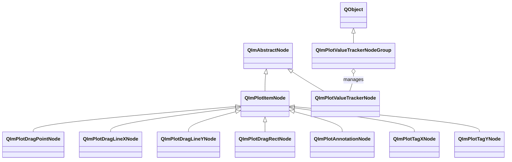

# 2D 交互工具使用指南

QIm 提供一组交互工具节点，将 ImPlot 的 DragPoint、DragLine、DragRect、Annotation、Tag、ValueTracker 等工具封装为 Qt 风格的保留模式节点。
这些工具节点继承自 `QImPlotItemNode` 或 `QImAbstractNode`，支持通过信号槽响应用户鼠标交互，
是 QIm 对象树中唯一能够实时捕获用户输入的绘图元素类型。

## 主要功能特性

**特性**

- ✅ **拖拽交互**：DragPoint、DragLineX/Y、DragRect 支持鼠标拖拽操作，位置变更通过信号实时通知
- ✅ **交互状态检测**：所有拖拽工具共享 clicked/hovered/held 三态信号，可精确检测用户操作
- ✅ **标注与注释**：Annotation 提供标注文本标签，支持 printf 风格格式化和像素偏移定位
- ✅ **轴标签**：TagX/Y 在指定坐标处显示带文本的轴标签线，用于标记关键数值位置
- ✅ **值追踪器**：ValueTracker 自动追踪鼠标附近的绘图数据点，支持多子图联动追踪
- ✅ **跨工具联动**：DragPoint 位置变更信号可连接 Annotation setText，实现拖拽点实时标注
- ✅ **标志属性肯定语义**：ImPlot 的 NoCursors/NoFit/NoInputs/Delayed 转换为 cursorsEnabled/fitEnabled/inputsEnabled/delayed

## 基本概念

### 类继承关系



**继承说明：**

- DragPoint、DragLineX/Y、DragRect、Annotation、TagX/Y 继承自 `QImPlotItemNode`，属于绘图项目节点
- ValueTracker 继承自 `QImAbstractNode`，不是绘图项目节点，而是独立的追踪覆盖层
- ValueTrackerNodeGroup 继承自 `QObject`，管理一组 ValueTracker 实现联动追踪

### 对象树定位

交互工具节点在 QIm 对象树中的位置：

```mermaid
graph TD
    Plot[QImPlotNode] --> DragPoint[QImPlotDragPointNode]
    Plot --> DragLineX[QImPlotDragLineXNode]
    Plot --> DragLineY[QImPlotDragLineYNode]
    Plot --> DragRect[QImPlotDragRectNode]
    Plot --> Annotation[QImPlotAnnotationNode]
    Plot --> TagX[QImPlotTagXNode]
    Plot --> TagY[QImPlotTagYNode]
    Plot --> Tracker[QImPlotValueTrackerNode]
    TrackerGroup[QImPlotValueTrackerNodeGroup] -.-> Tracker : sync
```

**对象树说明：**

- 所有交互工具以 `QImPlotNode` 为父节点创建，通过构造函数或 `addChildNode()` 加入对象树
- ValueTracker 构造时需传入 `QImPlotNode*` 参数以确定关联的绘图区域
- ValueTrackerNodeGroup 是独立的 QObject，不属于绘图对象树，仅管理联动关系

### 拖拽工具分类

交互工具按交互方式分为三类：

| 类别 | 工具 | 交互方式 | 基类 |
|------|------|----------|------|
| 拖拽工具 | DragPoint | 鼠标拖拽点标记 | `QImPlotItemNode` |
| 拖拽工具 | DragLineX/Y | 鼠标拖拽垂直/水平线 | `QImPlotItemNode` |
| 拖拽工具 | DragRect | 鼠标拖拽矩形区域 | `QImPlotItemNode` |
| 标注工具 | Annotation | 静态标注文本（可联动 DragPoint） | `QImPlotItemNode` |
| 标注工具 | TagX/Y | 轴标签线 | `QImPlotItemNode` |
| 追踪工具 | ValueTracker | 自动追踪鼠标数据点 | `QImAbstractNode` |

### 共享交互状态模式

所有拖拽工具（DragPoint、DragLineX/Y、DragRect）共享三个只读交互状态属性：

| 属性 | 类型 | 信号 | 说明 |
|------|------|------|------|
| `clicked` | bool | `clickedChanged(bool)` | 当前帧是否被点击（鼠标按下） |
| `hovered` | bool | `hoveredChanged(bool)` | 当前帧是否被鼠标悬停 |
| `held` | bool | `heldChanged(bool)` | 当前帧是否被按住拖拽 |

这些状态在每次渲染循环后更新，可通过信号槽检测用户的精确交互行为。

### 拖拽标志属性

所有拖拽工具共享四个标志属性，遵循 QIm 否定→肯定语义转换规则：

| QIm 属性（肯定语义） | ImPlot 原始标志（否定语义） | 默认值 | 说明 |
|----------------------|----------------------------|--------|------|
| `cursorsEnabled` | `ImPlotDragToolFlags_NoCursors` | true | 拖拽时显示十字光标辅助线 |
| `fitEnabled` | `ImPlotDragToolFlags_NoFit` | true | 拖拽时自动适配绘图范围 |
| `inputsEnabled` | `ImPlotDragToolFlags_NoInputs` | true | 响应鼠标输入（禁用则不可交互） |
| `delayed` | `ImPlotDragToolFlags_Delayed` | false | 延迟提交模式（仅鼠标释放后更新位置） |

这四个属性共享 `dragToolFlagChanged()` 信号，任何标志变更都会触发该信号。

!!! warning "标志语义转换"
    ImPlot 原生使用否定语义（如 `ImPlotDragToolFlags_NoCursors`），QIm 统一转换为肯定语义
    （如 `cursorsEnabled`）。设置 `setCursorsEnabled(false)` 等同于设置 `ImPlotDragToolFlags_NoCursors`。
    详见[枚举语义转换规范](../dev/flag-mapping.md)。

## 使用方法

交互工具的示例位于 `examples/qimfigure-test/functions/tools/` 和 `examples/qimfigure-splitWidget/`。

### 1. DragPoint — 可拖拽点

`QImPlotDragPointNode` 封装 ImPlot 的 DragPoint 工具，在绘图坐标空间显示一个可拖拽的彩色标记点。

（示例来自 `examples/qimfigure-test/functions/tools/DragPointFunction.cpp`）

```cpp
// 创建绘图节点
QIM::QImPlotNode* plotNode = figure->createPlotNode();

// 创建可拖拽点，以plotNode为父节点
QIM::QImPlotDragPointNode* dragPoint = new QIM::QImPlotDragPointNode(plotNode);
dragPoint->setPosition(QPointF(5.0, 5.0));   // 设置初始位置（绘图坐标）
dragPoint->setColor(QColor(255, 100, 100));   // 设置点颜色
dragPoint->setSize(8.0f);                      // 设置点大小（像素）
dragPoint->setId(0);                            // 设置唯一ID
dragPoint->setCursorsEnabled(true);             // 拖拽时显示光标辅助线
dragPoint->setFitEnabled(true);                 // 拖拽时自动适配绘图范围
dragPoint->setInputsEnabled(true);              // 启用鼠标交互
dragPoint->setDelayed(false);                   // 立即提交位置变更
plotNode->addChildNode(dragPoint);

// 监听位置变更信号
connect(dragPoint, &QIM::QImPlotDragPointNode::positionChanged,
        [](const QPointF& newPos) {
    qDebug() << "拖拽点位置更新:" << newPos;
});
```

效果：绘图区域显示一个红色标记点，用户可以点击拖拽该点到任意位置，拖拽时 `positionChanged` 信号实时通知新坐标。

#### DragPoint 属性列表

| 属性 | 类型 | Getter | Setter | 信号 | 说明 |
|------|------|--------|--------|------|------|
| position | QPointF | `position()` | `setPosition()` | `positionChanged` | 点在绘图坐标中的位置 |
| color | QColor | `color()` | `setColor()` | `colorChanged` | 点标记颜色 |
| size | float | `size()` | `setSize()` | `sizeChanged` | 点标记大小（像素），默认 4.0 |
| id | int | `id()` | `setId()` | `idChanged` | 拖拽工具唯一标识符 |
| flags | int | `flags()` | `setFlags()` | `flagsChanged` | ImPlotDragToolFlags 位掩码 |
| cursorsEnabled | bool | `isCursorsEnabled()` | `setCursorsEnabled()` | `dragToolFlagChanged` | 拖拽时显示光标辅助线 |
| fitEnabled | bool | `isFitEnabled()` | `setFitEnabled()` | `dragToolFlagChanged` | 拖拽时自动适配范围 |
| inputsEnabled | bool | `isInputsEnabled()` | `setInputsEnabled()` | `dragToolFlagChanged` | 启用鼠标交互 |
| delayed | bool | `isDelayed()` | `setDelayed()` | `dragToolFlagChanged` | 延迟提交模式 |
| clicked | bool | `clicked()` | - | `clickedChanged` | 只读：当前帧被点击 |
| hovered | bool | `hovered()` | - | `hoveredChanged` | 只读：当前帧被悬停 |
| held | bool | `held()` | - | `heldChanged` | 只读：当前帧被按住拖拽 |

#### DragPoint 信号列表

| 信号 | 参数 | 触发时机 |
|------|------|----------|
| `positionChanged(pos)` | QPointF | 位置变更（用户拖拽或程序设置） |
| `colorChanged(color)` | QColor | 颜色变更 |
| `sizeChanged(size)` | float | 大小变更 |
| `idChanged(id)` | int | ID变更 |
| `flagsChanged(flags)` | int | 标志位掩码变更 |
| `dragToolFlagChanged()` | - | 任何标志属性变更（共享信号） |
| `clickedChanged(clicked)` | bool | 点击状态变更 |
| `hoveredChanged(hovered)` | bool | 悬停状态变更 |
| `heldChanged(held)` | bool | 按住状态变更 |

!!! info "setPosition 重载"
    `setPosition()` 提供两个重载：
    - `setPosition(const QPointF& pos)` — 使用 QPointF 设置位置
    - `setPosition(double x, double y)` — 使用坐标分量设置位置

### 2. DragLineX/Y — 可拖拽线

`QImPlotDragLineXNode` 封装 ImPlot 的 DragLineX 工具，显示一条可拖拽的垂直线；
`QImPlotDragLineYNode` 封装 DragLineY 工具，显示一条可拖拽的水平线。

两者为独立的类，分别对应 X 轴和 Y 轴方向的拖拽线。DragLineX 的 `value` 属性表示 X 坐标，
DragLineY 的 `value` 属性表示 Y 坐标。

（示例来自 `examples/qimfigure-test/functions/tools/DragLinesFunction.cpp`）

```cpp
// 创建绘图节点
QIM::QImPlotNode* plotNode = figure->createPlotNode();

// 创建可拖拽垂直线（DragLineX）
QIM::QImPlotDragLineXNode* dragLineX = new QIM::QImPlotDragLineXNode(plotNode);
dragLineX->setValue(5.0);                       // 设置X坐标位置
dragLineX->setColor(QColor(255, 200, 0));        // 设置线颜色
dragLineX->setThickness(2.0f);                   // 设置线粗细（像素）
dragLineX->setId(0);                             // 设置唯一ID
dragLineX->setCursorsEnabled(true);              // 拖拽时显示光标
dragLineX->setInputsEnabled(true);               // 启用鼠标交互
plotNode->addChildNode(dragLineX);

// 创建可拖拽水平线（DragLineY）
QIM::QImPlotDragLineYNode* dragLineY = new QIM::QImPlotDragLineYNode(plotNode);
dragLineY->setValue(5.0);                       // 设置Y坐标位置
dragLineY->setColor(QColor(0, 200, 255));        // 设置线颜色
dragLineY->setThickness(2.0f);                   // 设置线粗细（像素）
dragLineY->setId(1);                             // ID需与DragLineX不同
dragLineY->setCursorsEnabled(true);
dragLineY->setInputsEnabled(true);
plotNode->addChildNode(dragLineY);

// 监听垂直线位置变更
connect(dragLineX, &QIM::QImPlotDragLineXNode::valueChanged,
        [](double newX) {
    qDebug() << "垂直线X坐标更新:" << newX;
});

// 监听水平线位置变更
connect(dragLineY, &QIM::QImPlotDragLineYNode::valueChanged,
        [](double newY) {
    qDebug() << "水平线Y坐标更新:" << newY;
});
```

效果：绘图区域显示一条黄色垂直线和一条青色水平线，用户拖拽时线条跟随鼠标移动，两条线相交形成十字线标记。

#### DragLineX 属性列表

| 属性 | 类型 | Getter | Setter | 信号 | 说明 |
|------|------|--------|--------|------|------|
| value | double | `value()` | `setValue()` | `valueChanged` | 垂直线的X坐标 |
| color | QColor | `color()` | `setColor()` | `colorChanged` | 线颜色 |
| thickness | float | `thickness()` | `setThickness()` | `thicknessChanged` | 粗细（像素），默认 1.0 |
| id | int | `id()` | `setId()` | `idChanged` | 拖拽工具唯一标识符 |
| flags | int | `flags()` | `setFlags()` | `flagsChanged` | ImPlotDragToolFlags 位掩码 |
| cursorsEnabled | bool | `isCursorsEnabled()` | `setCursorsEnabled()` | `dragToolFlagChanged` | 拖拽时显示光标 |
| fitEnabled | bool | `isFitEnabled()` | `setFitEnabled()` | `dragToolFlagChanged` | 拖拽时自动适配 |
| inputsEnabled | bool | `isInputsEnabled()` | `setInputsEnabled()` | `dragToolFlagChanged` | 启用鼠标交互 |
| delayed | bool | `isDelayed()` | `setDelayed()` | `dragToolFlagChanged` | 延迟提交模式 |
| clicked | bool | `clicked()` | - | `clickedChanged` | 只读：当前帧被点击 |
| hovered | bool | `hovered()` | - | `hoveredChanged` | 只读：当前帧被悬停 |
| held | bool | `held()` | - | `heldChanged` | 只读：当前帧被按住 |

#### DragLineY 属性列表

| 属性 | 类型 | Getter | Setter | 信号 | 说明 |
|------|------|--------|--------|------|------|
| value | double | `value()` | `setValue()` | `valueChanged` | 水平线的Y坐标 |
| color | QColor | `color()` | `setColor()` | `colorChanged` | 线颜色 |
| thickness | float | `thickness()` | `setThickness()` | `thicknessChanged` | 线粗细（像素），默认 1.0 |
| id | int | `id()` | `setId()` | `idChanged` | 拖拽工具唯一标识符 |
| flags | int | `flags()` | `setFlags()` | `flagsChanged` | ImPlotDragToolFlags 位掩码 |
| cursorsEnabled | bool | `isCursorsEnabled()` | `setCursorsEnabled()` | `dragToolFlagChanged` | 拖拽时显示光标 |
| fitEnabled | bool | `isFitEnabled()` | `setFitEnabled()` | `dragToolFlagChanged` | 拖拽时自动适配 |
| inputsEnabled | bool | `isInputsEnabled()` | `setInputsEnabled()` | `dragToolFlagChanged` | 启用鼠标交互 |
| delayed | bool | `isDelayed()` | `setDelayed()` | `dragToolFlagChanged` | 延迟提交模式 |
| clicked | bool | `clicked()` | - | `clickedChanged` | 只读：当前帧被点击 |
| hovered | bool | `hovered()` | - | `hoveredChanged` | 只读：当前帧被悬停 |
| held | bool | `held()` | - | `heldChanged` | 只读：当前帧被按住 |

#### DragLineX/Y 信号列表

| 信号 | 参数 | 触发时机 |
|------|------|----------|
| `valueChanged(value)` | double | 位置变更（X/Y坐标） |
| `colorChanged(color)` | QColor | 颜色变更 |
| `thicknessChanged(thickness)` | float | 粗细变更 |
| `idChanged(id)` | int | ID变更 |
| `flagsChanged(flags)` | int | 标志位掩码变更 |
| `dragToolFlagChanged()` | - | 任何标志属性变更 |
| `clickedChanged(clicked)` | bool | 点击状态变更 |
| `hoveredChanged(hovered)` | bool | 悬停状态变更 |
| `heldChanged(held)` | bool | 按住状态变更 |

!!! info "DragLineX 与 DragLineY 的区别"
    `QImPlotDragLineXNode` 和 `QImPlotDragLineYNode` 是两个独立的类，分别对应垂直线和水平线。
    DragLineX 的 `value` 表示 X 坐标（线沿 Y 方向延伸），DragLineY 的 `value` 表示 Y 坐标（线沿 X 方向延伸）。
    在同一绘图中使用两种线时，必须确保 `id` 值不同。

### 3. DragRect — 可拖拽矩形

`QImPlotDragRectNode` 封装 ImPlot 的 DragRect 工具，在绘图坐标空间显示一个可拖拽的矩形区域。
用户可以拖拽矩形的中心移动位置，拖拽角点调整大小。

（示例来自 `examples/qimfigure-test/functions/tools/DragRectFunction.cpp`）

```cpp
// 创建绘图节点
QIM::QImPlotNode* plotNode = figure->createPlotNode();

// 创建可拖拽矩形，以plotNode为父节点
QIM::QImPlotDragRectNode* dragRect = new QIM::QImPlotDragRectNode(plotNode);
dragRect->setRect(2.0, 3.0, 7.0, 8.0);          // 设置矩形坐标(x1,y1,x2,y2)
dragRect->setColor(QColor(255, 150, 50));         // 设置边框颜色
dragRect->setId(0);                                // 设置唯一ID
dragRect->setCursorsEnabled(true);                 // 拖拽时显示光标
dragRect->setInputsEnabled(true);                  // 启用鼠标交互
plotNode->addChildNode(dragRect);

// 监听矩形坐标变更
connect(dragRect, &QIM::QImPlotDragRectNode::rectChanged,
        [](const QRectF& newRect) {
    qDebug() << "矩形区域更新:" << newRect;
});
```

效果：绘图区域显示一个橙色边框矩形，用户可以拖拽中心移动矩形，拖拽角点调整大小。

#### DragRect 属性列表

| 属性 | 类型 | Getter | Setter | 信号 | 说明 |
|------|------|--------|--------|------|------|
| rect | QRectF | `rect()` | `setRect()` | `rectChanged` | 矩形坐标(x1,y1,x2,y2) |
| color | QColor | `color()` | `setColor()` | `colorChanged` | 矩形边框颜色 |
| id | int | `id()` | `setId()` | `idChanged` | 拖拽工具唯一标识符 |
| flags | int | `flags()` | `setFlags()` | `flagsChanged` | ImPlotDragToolFlags 位掩码 |
| cursorsEnabled | bool | `isCursorsEnabled()` | `setCursorsEnabled()` | `dragToolFlagChanged` | 拖拽时显示光标 |
| fitEnabled | bool | `isFitEnabled()` | `setFitEnabled()` | `dragToolFlagChanged` | 拖拽时自动适配 |
| inputsEnabled | bool | `isInputsEnabled()` | `setInputsEnabled()` | `dragToolFlagChanged` | 启用鼠标交互 |
| delayed | bool | `isDelayed()` | `setDelayed()` | `dragToolFlagChanged` | 延迟提交模式 |
| clicked | bool | `clicked()` | - | `clickedChanged` | 只读：当前帧被点击 |
| hovered | bool | `hovered()` | - | `hoveredChanged` | 只读：当前帧被悬停 |
| held | bool | `held()` | - | `heldChanged` | 只读：当前帧被按住 |

#### DragRect 信号列表

| 信号 | 参数 | 触发时机 |
|------|------|----------|
| `rectChanged(rect)` | QRectF | 矩形坐标变更 |
| `colorChanged(color)` | QColor | 颜色变更 |
| `idChanged(id)` | int | ID变更 |
| `flagsChanged(flags)` | int | 标志位掩码变更 |
| `dragToolFlagChanged()` | - | 任何标志属性变更 |
| `clickedChanged(clicked)` | bool | 点击状态变更 |
| `hoveredChanged(hovered)` | bool | 悬停状态变更 |
| `heldChanged(held)` | bool | 按住状态变更 |

!!! info "setRect 重载"
    `setRect()` 提供两个重载：
    - `setRect(const QRectF& rect)` — 使用 QRectF 设置矩形
    - `setRect(double x1, double y1, double x2, double y2)` — 使用坐标分量设置矩形

!!! warning "QRectF 坐标语义"
    ImPlot 的 DragRect 使用 (x1, y1, x2, y2) 表示矩形两个对角点，其中 x1 < x2 且 y1 < y2。
    QRectF 的语义是 left/top/width/height 或 left/top/right/bottom，注意坐标映射的语义差异。

### 4. Annotation — 注释标注

`QImPlotAnnotationNode` 封装 ImPlot 的 Annotation 工具，在绘图坐标空间显示标注文本标签。
Annotation 是静态工具（不支持拖拽），但可通过信号槽与 DragPoint 联动实现动态标注。

#### 基本使用

```cpp
// 创建注释，以plotNode为父节点
QIM::QImPlotAnnotationNode* annotation = new QIM::QImPlotAnnotationNode(plotNode);
annotation->setPosition(QPointF(5.0, 5.0));       // 注释锚点位置（绘图坐标）
annotation->setText("关键数据点");                   // 注释文本
annotation->setColor(QColor(255, 255, 255));       // 文本颜色
annotation->setPixelOffset(20.0, -20.0);           // 像素偏移（相对锚点）
annotation->setClamp(false);                        // 不钳位在绘图区域内
plotNode->addChildNode(annotation);
```

#### printf 风格格式化

Annotation 的 `setText()` 支持 printf 风格格式化，用于动态生成数值标注：

```cpp
// printf风格设置文本
annotation->setText("X=%.2f, Y=%.2f", 5.0, 3.14);
```

!!! info "setText 重载"
    `setText()` 提供两个重载：
    - `setText(const QString& text)` — 使用 QString 设置文本
    - `setText(const char* fmt, ...)` — printf 风格格式化设置文本

#### DragPoint→Annotation 联动

Annotation 最强大的用法是与 DragPoint 通过信号槽联动，实现拖拽点的实时标注：
当用户拖拽 DragPoint 时，Annotation 的位置和文本自动跟随更新。

（示例来自 `examples/qimfigure-test/functions/tools/AnnotationFunction.cpp`）

```cpp
// 创建可拖拽点
QIM::QImPlotDragPointNode* dragPoint = new QIM::QImPlotDragPointNode(plotNode);
dragPoint->setPosition(QPointF(5.0, 5.0));
dragPoint->setColor(QColor(255, 100, 100));
dragPoint->setSize(8.0f);
dragPoint->setId(0);

// 连接DragPoint位置变更信号到Annotation更新
connect(dragPoint, &QIM::QImPlotDragPointNode::positionChanged,
        this, &MyClass::onDragPointMoved);
plotNode->addChildNode(dragPoint);

// 创建注释，初始位置与DragPoint相同
QIM::QImPlotAnnotationNode* annotation = new QIM::QImPlotAnnotationNode(plotNode);
annotation->setPosition(QPointF(5.0, 5.0));      // 与拖拽点初始位置一致
annotation->setText("数据点");                     // 注释文本
annotation->setColor(QColor(255, 255, 255));
annotation->setPixelOffset(20.0, -20.0);          // 像素偏移（向右上偏移）
annotation->setClamp(false);
plotNode->addChildNode(annotation);

// 槽函数：DragPoint位置变更时更新Annotation位置
void MyClass::onDragPointMoved(const QPointF& pos)
{
    if (m_annotationNode) {
        m_annotationNode->setPosition(pos);       // Annotation跟随拖拽点位置
    }
}
```

效果：绘图区域显示一个红色拖拽点和标注文本，拖拽点移动时标注文本自动跟随，始终显示在拖拽点右上 20 像素偏移处。

#### Annotation 属性列表

| 属性 | 类型 | Getter | Setter | 信号 | 说明 |
|------|------|--------|--------|------|------|
| position | QPointF | `position()` | `setPosition()` | `positionChanged` | 注释锚点位置（绘图坐标） |
| color | QColor | `color()` | `setColor()` | `colorChanged` | 注释文本颜色 |
| text | QString | `text()` | `setText()` | `textChanged` | 注释文本内容（支持printf格式化） |
| pixelOffset | QPointF | `pixelOffset()` | `setPixelOffset()` | `pixelOffsetChanged` | 像素偏移（相对锚点） |
| clamp | bool | `clamp()` | `setClamp()` | `clampChanged` | 是否钳位在绘图区域内 |
| round | bool | `round()` | `setRound()` | `roundChanged` | 是否将位置舍入为整数像素 |

#### Annotation 信号列表

| 信号 | 参数 | 触发时机 |
|------|------|----------|
| `positionChanged(pos)` | QPointF | 位置变更 |
| `colorChanged(color)` | QColor | 颜色变更 |
| `textChanged(text)` | QString | 文本变更 |
| `pixelOffsetChanged(offset)` | QPointF | 像素偏移变更 |
| `clampChanged(clamp)` | bool | 钳位设置变更 |
| `roundChanged(round)` | bool | 舍入设置变更 |

!!! tip "pixelOffset 的作用"
    `pixelOffset` 控制注释文本相对于锚点的像素偏移，正值向右/下偏移，负值向左/上偏移。
    通过调整偏移可以避免注释文本与数据点重叠。Annotation 在绘图坐标位置处绘制一条连接线到偏移后的文本位置。

!!! warning "Annotation 不支持拖拽"
    Annotation 是静态标注工具，不支持用户拖拽交互。如需动态定位，请与 DragPoint 联动使用。

### 5. TagX/Y — 轴标签线

`QImPlotTagXNode` 封装 ImPlot 的 TagX 工具，在指定 X 坐标处显示一条垂直线并附带文本标签；
`QImPlotTagYNode` 封装 TagY 工具，在指定 Y 坐标处显示一条水平线并附带文本标签。

TagX/Y 是静态工具（不支持拖拽），用于在轴上标记关键数值位置。

（示例来自 `examples/qimfigure-test/functions/tools/TagsFunction.cpp`）

```cpp
// 创建绘图节点
QIM::QImPlotNode* plotNode = figure->createPlotNode();

// 创建X轴标签（垂直线+文本）
QIM::QImPlotTagXNode* tagX = new QIM::QImPlotTagXNode(plotNode);
tagX->setValue(3.5);                              // X坐标位置
tagX->setText("标记点X=3.5");                      // 标签文本
tagX->setColor(QColor(255, 100, 0));              // 标签线颜色
plotNode->addChildNode(tagX);

// 创建Y轴标签（水平线+文本）
QIM::QImPlotTagYNode* tagY = new QIM::QImPlotTagYNode(plotNode);
tagY->setValue(5.0);                              // Y坐标位置
tagY->setText("阈值Y=5.0");                        // 标签文本
tagY->setColor(QColor(0, 150, 255));              // 标签线颜色
plotNode->addChildNode(tagY);
```

效果：绘图区域在 X=3.5 处显示一条橙色垂直线和标签文本，在 Y=5.0 处显示一条蓝色水平线和标签文本。

#### TagX 属性列表

| 属性 | 类型 | Getter | Setter | 信号 | 说明 |
|------|------|--------|--------|------|------|
| value | double | `value()` | `setValue()` | `valueChanged` | X坐标位置 |
| color | QColor | `color()` | `setColor()` | `colorChanged` | 标签线颜色 |
| text | QString | `text()` | `setText()` | `textChanged` | 标签文本（支持printf格式化） |
| round | bool | `round()` | `setRound()` | `roundChanged` | 是否将位置舍入为整数像素 |

#### TagY 属性列表

| 属性 | 类型 | Getter | Setter | 信号 | 说明 |
|------|------|--------|--------|------|------|
| value | double | `value()` | `setValue()` | `valueChanged` | Y坐标位置 |
| color | QColor | `color()` | `setColor()` | `colorChanged` | 标签线颜色 |
| text | QString | `text()` | `setText()` | `textChanged` | 标签文本（支持printf格式化） |
| round | bool | `round()` | `setRound()` | `roundChanged` | 是否将位置舍入为整数像素 |

#### TagX/Y 信号列表

| 信号 | 参数 | 触发时机 |
|------|------|----------|
| `valueChanged(value)` | double | 坐标位置变更 |
| `colorChanged(color)` | QColor | 颜色变更 |
| `textChanged(text)` | QString | 文本变更 |
| `roundChanged(round)` | bool | 舍入设置变更 |

!!! info "TagX 与 TagY 的区别"
    `QImPlotTagXNode` 在 X 轴方向显示垂直线标签，用于标记特定 X 值；
    `QImPlotTagYNode` 在 Y 轴方向显示水平线标签，用于标记特定 Y 值。
    TagX 的标签文本显示在 X 轴附近，TagY 的标签文本显示在 Y 轴附近。

!!! tip "TagX/Y 与 DragLineX/Y 的区别"
    TagX/Y 是静态标注工具，显示标签文本但不支持拖拽；
    DragLineX/Y 是交互拖拽工具，支持鼠标拖拽但不附带文本标签。
    如需可拖拽的标签线，可组合使用 DragLineX/Y + Annotation。

!!! info "setText printf 格式化"
    TagX/Y 的 `setText()` 同样支持 printf 风格格式化：
    ```cpp
    tagX->setText("X=%.1f", 3.5);
    tagY->setText("Y=%.2f", 5.0);
    ```

### 6. ValueTracker — 值追踪器

`QImPlotValueTrackerNode` 是智能值追踪覆盖层，在鼠标光标最近的绘图数据点处显示十字线样式的标注。
它自动追踪父 `QImPlotNode` 中所有可见的绘图项目，提取标签、颜色和 Y 值信息用于实时提示框渲染。

ValueTracker 继承自 `QImAbstractNode`（而非 `QImPlotItemNode`），构造时需传入 `QImPlotNode*` 参数。

#### 基本使用

```cpp
// 创建绘图节点
QIM::QImPlotNode* plotNode = figure->createPlotNode();
plotNode->addLine(xData, yData, "sin(x)");

// 创建值追踪器，传入关联的绘图节点
QIM::QImPlotValueTrackerNode* tracker = new QIM::QImPlotValueTrackerNode(plotNode);
plotNode->addChildNode(tracker);

// 监听追踪器激活状态
connect(tracker, &QIM::QImPlotValueTrackerNode::activeChanged,
        [](bool on) {
    qDebug() << "追踪器激活状态:" << on;
});
```

效果：鼠标移入绘图区域时，追踪器自动激活，在最近的绘图数据点处显示十字线和数值标注。

#### 样式自定义

ValueTracker 支持自定义提示框样式：

```cpp
QIM::QImPlotValueTrackerNode* tracker = new QIM::QImPlotValueTrackerNode(plotNode);

// 提示框宽度
tracker->setFixedWidth(200.0f);              // 固定宽度（像素）
tracker->setAutoWidthEnabled(true);          // 自动计算宽度（默认）

// 提示框颜色
tracker->setTextColor(QColor(255, 255, 255));         // 文本颜色
tracker->setBackgroundColor(QColor(30, 30, 30, 200)); // 背景颜色（半透明）
tracker->setBorderColor(QColor(100, 100, 100));       // 边框颜色

// 追踪线颜色
tracker->setTrackerLineColor(QColor(255, 200, 0));    // 十字线颜色

// 数据过滤
tracker->setSkipNanFiniteValues(true);       // 跳过NaN和无穷值
plotNode->addChildNode(tracker);
```

#### 多子图联动追踪

`QImPlotValueTrackerNodeGroup` 管理一组 ValueTracker 实例，实现多个子图之间的联动光标追踪。
当鼠标在某个子图移动时，组内所有追踪器在相同的像素比例位置处更新十字线，提供跨图窗的统一数据检查体验。

（示例来自 `examples/qimfigure-splitWidget/MainWindow.cpp`）

```cpp
// 创建追踪器组，管理联动关系
QIM::QImPlotValueTrackerNodeGroup* trackerGroup = new QIM::QImPlotValueTrackerNodeGroup(this);

// 子图1
if (QIM::QImPlotNode* plot1 = figure->createPlotNode()) {
    plot1->setTitle("10K Points");
    plot1->addLine(x1, y1, "曲线A");

    // 创建追踪器并加入联动组
    QIM::QImPlotValueTrackerNode* tracker1 = new QIM::QImPlotValueTrackerNode(plot1);
    tracker1->setGroup(trackerGroup);          // 加入联动组
    plot1->addChildNode(tracker1);
}

// 子图2
if (QIM::QImPlotNode* plot2 = figure->createPlotNode()) {
    plot2->setTitle("1M Points");
    plot2->addLine(x2, y2, "曲线B");

    // 创建追踪器并加入联动组
    QIM::QImPlotValueTrackerNode* tracker2 = new QIM::QImPlotValueTrackerNode(plot2);
    tracker2->setGroup(trackerGroup);          // 加入联动组
    plot2->addChildNode(tracker2);
}
```

效果：鼠标在任意子图移动时，所有子图的追踪器同步显示十字线标注，实现跨子图数据联动检查。

#### ValueTracker 属性和方法列表

| 属性/方法 | 类型 | Getter | Setter | 说明 |
|-----------|------|--------|--------|------|
| group | Group* | `group()` | `setGroup()` | 追踪器联动组 |
| hasGroup | bool | `hasGroup()` | - | 是否已加入联动组 |
| fixedWidth | float | `fixedWidth()` | `setFixedWidth()` | 提示框固定宽度（像素） |
| autoWidthEnabled | bool | `isAutoWidthEnabled()` | `setAutoWidthEnabled()` | 自动计算提示框宽度 |
| textColor | QColor | `textColor()` | `setTextColor()` | 提示框文本颜色 |
| backgroundColor | QColor | `backgroundColor()` | `setBackgroundColor()` | 提示框背景颜色 |
| borderColor | QColor | `borderColor()` | `setBorderColor()` | 提示框边框颜色 |
| trackerLineColor | QColor | `trackerLineColor()` | `setTrackerLineColor()` | 十字线颜色 |
| skipNanFiniteValues | bool | `isSkipNanFiniteValues()` | `setSkipNanFiniteValues()` | 跳过NaN/无穷值 |

#### ValueTracker 信号列表

| 信号 | 参数 | 触发时机 |
|------|------|----------|
| `activeChanged(on)` | bool | 追踪器激活/非激活状态变更 |

#### ValueTrackerNodeGroup API

| 方法 | 参数 | 说明 |
|------|------|------|
| `addTracker(tracker)` | `QImPlotValueTrackerNode*` | 添加追踪器到联动组 |
| `removeTracker(tracker)` | `QImPlotValueTrackerNode*` | 从联动组移除追踪器 |
| `syncMode()` | - | 获取同步模式（当前仅支持 Pixel） |
| `setSyncMode(mode)` | `SyncMode` | 设置同步模式 |
| `isActive()` | - | 组内是否有活跃的追踪器 |
| `pixelRatio()` | - | 获取当前像素比例 |

!!! info "SyncMode 同步模式"
    `QImPlotValueTrackerNodeGroup::SyncMode` 当前仅支持 `Pixel` 模式：
    当鼠标在某个子图移动时，其他子图的追踪器在相同的像素比例位置处显示十字线。

!!! warning "追踪器必须属于不同绘图"
    追踪器必须属于不同的 `QImPlotNode` 实例。同一绘图中的多个追踪器分组没有额外效果。

!!! info "ValueTracker 构造函数"
    ValueTracker 构造时必须传入关联的绘图节点：
    ```cpp
    QIM::QImPlotValueTrackerNode* tracker = new QIM::QImPlotValueTrackerNode(plotNode);
    ```
    其中 `plotNode` 参数指定追踪器关联的绘图区域，追踪器在此绘图区域内渲染和追踪数据。

!!! tip "ValueTracker 自动追踪机制"
    ValueTracker 自动监听父绘图节点的子节点添加/移除事件（通过 `onChildNodeAdded`/`onChildNodeRemoved` 槽），
    新添加的绘图项目自动被追踪器覆盖，无需手动注册。

## 信号槽连接

### 跨工具联动示例

交互工具的核心价值在于信号槽联动。以下是典型的联动模式：

#### DragPoint → Annotation 位置联动

```cpp
// 拖拽点位置变更时更新注释位置
connect(dragPoint, &QIM::QImPlotDragPointNode::positionChanged,
        annotation, [annotation](const QPointF& pos) {
    annotation->setPosition(pos);
});
```

#### DragLineX → TagX 值联动

```cpp
// 垂直拖拽线位置变更时更新X轴标签
connect(dragLineX, &QIM::QImPlotDragLineXNode::valueChanged,
        tagX, [tagX](double value) {
    tagX->setValue(value);
    tagX->setText(QString("X=%.2f").arg(value));
});
```

#### DragPoint → Annotation printf 文本联动

```cpp
// 拖拽点位置变更时更新注释文本（显示坐标数值）
connect(dragPoint, &QIM::QImPlotDragPointNode::positionChanged,
        this, [this, annotation](const QPointF& pos) {
    annotation->setPosition(pos);
    annotation->setText(QString("(%1, %2)")
        .arg(pos.x(), 0, 'f', 2)
        .arg(pos.y(), 0, 'f', 2));
});
```

#### DragRect → Annotation 区域标注联动

```cpp
// 矩形区域变更时更新注释文本
connect(dragRect, &QIM::QImPlotDragRectNode::rectChanged,
        this, [this, annotation](const QRectF& rect) {
    annotation->setPosition(rect.center());
    annotation->setText(QString("区域: %1×%2")
        .arg(rect.width(), 0, 'f', 1)
        .arg(rect.height(), 0, 'f', 1));
});
```

#### 拖拽工具交互状态监控

```cpp
// 监控拖拽点的交互状态
connect(dragPoint, &QIM::QImPlotDragPointNode::hoveredChanged,
        [](bool hovered) {
    if (hovered) {
        qDebug() << "鼠标悬停在拖拽点上";
    }
});

connect(dragPoint, &QIM::QImPlotDragPointNode::heldChanged,
        [](bool held) {
    if (held) {
        qDebug() << "用户正在拖拽点";
    }
});

connect(dragPoint, &QIM::QImPlotDragPointNode::clickedChanged,
        [](bool clicked) {
    if (clicked) {
        qDebug() << "拖拽点被点击";
    }
});
```

### 信号汇总

所有交互工具的信号分为三类：

**数据变更信号**：属性值变更时触发

| 工具 | 信号 | 参数 |
|------|------|------|
| DragPoint | `positionChanged` | QPointF |
| DragLineX | `valueChanged` | double |
| DragLineY | `valueChanged` | double |
| DragRect | `rectChanged` | QRectF |
| Annotation | `positionChanged` | QPointF |
| Annotation | `textChanged` | QString |
| TagX/Y | `valueChanged` | double |
| TagX/Y | `textChanged` | QString |
| ValueTracker | `activeChanged` | bool |

**交互状态信号**：拖拽工具共享的三态信号

| 信号 | 适用工具 | 参数 |
|------|----------|------|
| `clickedChanged` | DragPoint/DragLineX/Y/DragRect | bool |
| `hoveredChanged` | DragPoint/DragLineX/Y/DragRect | bool |
| `heldChanged` | DragPoint/DragLineX/Y/DragRect | bool |

**标志变更信号**：拖拽工具的标志属性共享信号

| 信号 | 适用工具 | 参数 |
|------|----------|------|
| `dragToolFlagChanged` | DragPoint/DragLineX/Y/DragRect | 无 |

## 注意事项

!!! warning "拖拽工具ID唯一性"
    在同一绘图上下文中，所有拖拽工具的 `id` 值必须唯一。
    ImPlot 使用 `id` 区分同一绘图中的多个拖拽工具，ID冲突会导致交互异常。

!!! warning "inputsEnabled 禁用交互"
    设置 `setInputsEnabled(false)` 会使拖拽工具变为不可交互（相当于设置 `ImPlotDragToolFlags_NoInputs`）。
    此时可拖拽工具仅作为视觉标记显示，不再响应鼠标输入。

!!! warning "delayed 延迟提交模式"
    设置 `setDelayed(true)` 时，位置变更仅在鼠标释放后才提交。
    在拖拽过程中 `positionChanged`/`valueChanged`/`rectChanged` 信号不会触发，
    仅在释放后触发一次。适用于需要避免中间状态的场景。

!!! info "Annotation 与 Tag 的定位区别"
    - Annotation 使用 `pixelOffset` 控制文本偏移，在绘图坐标位置和偏移位置之间绘制连接线
    - TagX/Y 的文本自动显示在对应轴附近，无需手动指定偏移

!!! warning "ValueTracker 不继承 QImPlotItemNode"
    ValueTracker 继承自 `QImAbstractNode`，不是绘图项目节点。
    它不参与 `QImPlotNode::plotItemNodes()` 的返回列表。
    构造时需传入 `QImPlotNode*` 参数而非 `QObject*`，以确保正确关联绘图区域。

!!! info "对象树父子关系"
    创建交互工具节点时，指定 `QImPlotNode` 为父对象即可自动加入对象树：
    ```cpp
    // 推荐方式：构造时指定父节点
    QIM::QImPlotDragPointNode* dragPoint = new QIM::QImPlotDragPointNode(plotNode);

    // 然后调用addChildNode加入渲染树
    plotNode->addChildNode(dragPoint);
    ```
    构造时指定父节点确保节点生命周期由父节点管理（Qt对象树机制），
    `addChildNode()` 确保节点参与渲染流程。

!!! tip "wasModified() 方法"
    所有拖拽工具提供 `wasModified()` 方法，返回 `true` 表示上一渲染周期中用户修改了工具位置。
    此方法不对应 Q_PROPERTY，无法通过属性系统访问，需直接调用。

## 参考

- 相关文档：[QImPlotNode](plot-node.md)、[坐标轴配置](plot-axis.md)、[渲染节点](../render-node.md)、[枚举语义转换](../dev/flag-mapping.md)
- 示例代码：
    - DragPoint：`examples/qimfigure-test/functions/tools/DragPointFunction.cpp`
    - DragLines：`examples/qimfigure-test/functions/tools/DragLinesFunction.cpp`
    - DragRect：`examples/qimfigure-test/functions/tools/DragRectFunction.cpp`
    - Annotation：`examples/qimfigure-test/functions/tools/AnnotationFunction.cpp`
    - Tags：`examples/qimfigure-test/functions/tools/TagsFunction.cpp`
    - ValueTracker：`examples/qimfigure-splitWidget/MainWindow.cpp`
- API参考：
    - `src/core/plot/QImPlotDragPointNode.h`
    - `src/core/plot/QImPlotDragLineXNode.h`
    - `src/core/plot/QImPlotDragLineYNode.h`
    - `src/core/plot/QImPlotDragRectNode.h`
    - `src/core/plot/QImPlotAnnotationNode.h`
    - `src/core/plot/QImPlotTagXNode.h`
    - `src/core/plot/QImPlotTagYNode.h`
    - `src/core/plot/QImPlotValueTrackerNode.h`
    - `src/core/plot/QImPlotValueTrackerNodeGroup.h`