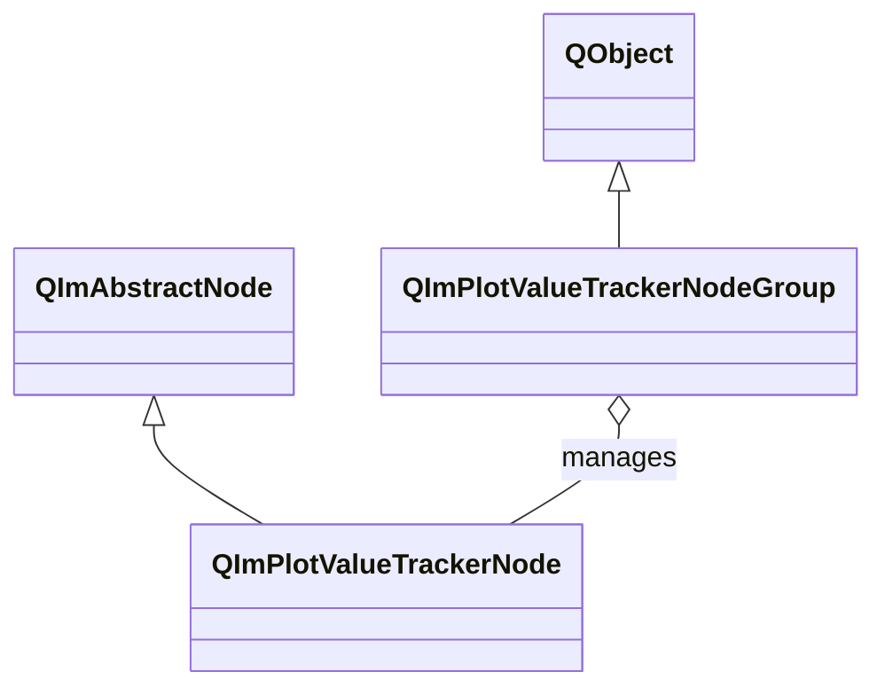

# 2D 值追踪器使用指南

`QImPlotValueTrackerNode` 是智能值追踪覆盖层，在鼠标光标最近的绘图数据点处显示十字线样式的标注。
通过 `QImPlotValueTrackerNodeGroup` 可实现多个子图之间的联动光标追踪。
ValueTracker 继承自 `QImAbstractNode`（而非 `QImPlotItemNode`），是独立的追踪覆盖层节点。

## 主要功能特性

**特性**

- ✅ **自动追踪**：鼠标移入绘图区域时自动激活，在最近的数据点处显示十字线和数值标注
- ✅ **样式自定义**：支持自定义提示框的宽度、文本/背景/边框/追踪线颜色
- ✅ **多子图联动**：通过 `QImPlotValueTrackerNodeGroup` 管理，鼠标在任意子图移动时，组内所有追踪器同步更新
- ✅ **智能过滤**：支持跳过 NaN 和无穷值，避免无效数据的干扰
- ✅ **自动发现**：自动监听父绘图节点的子节点增删，新添加的绘图项目自动被追踪器覆盖
- ✅ **像素比例同步**：组内追踪器在相同的像素比例位置处显示十字线，提供统一的跨图窗数据检查体验

## 基本概念

### 类继承关系



**继承说明：**

- `QImPlotValueTrackerNode` 继承自 `QImAbstractNode`，不是绘图项目节点（`QImPlotItemNode`），不参与 `QImPlotNode::plotItemNodes()` 的返回列表
- `QImPlotValueTrackerNodeGroup` 继承自 `QObject`，管理一组 ValueTracker 实现联动追踪，不属于绘图对象树

### 对象树定位

```mermaid
graph TD
    Figure[QImFigureWidget] --> Plot1[QImPlotNode 子图1]
    Figure --> Plot2[QImPlotNode 子图2]
    Plot1 --> Tracker1[QImPlotValueTrackerNode]
    Plot2 --> Tracker2[QImPlotValueTrackerNode]
    TrackerGroup[QImPlotValueTrackerNodeGroup] -.-> Tracker1 : sync
    TrackerGroup[QImPlotValueTrackerNodeGroup] -.-> Tracker2 : sync
```

**对象树说明：**

- ValueTracker 构造时需传入 `QImPlotNode*` 参数，以确定关联的绘图区域
- ValueTracker 以关联的 `QImPlotNode` 为父节点加入对象树
- ValueTrackerNodeGroup 是独立的 QObject，通过 `setGroup()` 建立与追踪器的管理关系

### TrackedValue 结构体

每个被追踪的数据点由 `TrackedValue` 结构体描述：

| 字段 | 类型 | 说明 |
|------|------|------|
| `label` | `const char*` | 数据系列标签 |
| `color` | `QColor` | 对应绘图项目的颜色 |
| `xValue` | `double` | X 坐标值 |
| `yValue` | `double` | Y 坐标值 |
| `xValueLabel` | `std::string` | X 值格式化字符串 |
| `yValueLabel` | `std::string` | Y 值格式化字符串 |

## 使用方法

### 1. 基本使用

创建 ValueTracker 并监听激活状态：

```cpp
#include "QImFigureWidget.h"
#include "plot/QImPlotNode.h"
#include "plot/QImPlotValueTrackerNode.h"

// 创建绘图节点
QIM::QImPlotNode* plotNode = figure->createPlotNode();
plotNode->setTitle("正弦曲线");
plotNode->addLine(xData, yData, "sin(x)");

// 创建值追踪器，传入关联的绘图节点
QIM::QImPlotValueTrackerNode* tracker = new QIM::QImPlotValueTrackerNode(plotNode);
plotNode->addChildNode(tracker);

// 监听追踪器激活状态
connect(tracker, &QIM::QImPlotValueTrackerNode::activeChanged,
        [](bool on) {
    qDebug() << "追踪器激活状态:" << on;
});
```

效果：鼠标移入绘图区域时，追踪器自动激活，在最近的绘图数据点处显示十字线和包含标签及坐标值的提示框。

### 2. 样式自定义

ValueTracker 支持自定义提示框的外观：

```cpp
QIM::QImPlotValueTrackerNode* tracker = new QIM::QImPlotValueTrackerNode(plotNode);

// 提示框宽度控制
tracker->setFixedWidth(200.0f);              // 固定宽度（像素）
tracker->setAutoWidthEnabled(true);          // 自动计算宽度（默认启用）

// 提示框颜色定制
tracker->setTextColor(QColor(255, 255, 255));         // 文本颜色
tracker->setBackgroundColor(QColor(30, 30, 30, 200)); // 半透明背景
tracker->setBorderColor(QColor(100, 100, 100));       // 边框颜色

// 追踪十字线颜色
tracker->setTrackerLineColor(QColor(255, 200, 0));    // 十字线和连接线颜色

// 数据过滤：跳过无效数值
tracker->setSkipNanFiniteValues(true);       // 跳过 NaN 和无穷值

plotNode->addChildNode(tracker);
```

### 3. 多子图联动追踪

`QImPlotValueTrackerNodeGroup` 管理一组 ValueTracker，实现多个子图之间的联动光标追踪。
当鼠标在某个子图移动时，组内所有追踪器在相同的像素比例位置处更新十字线。

（示例来自 `examples/qimfigure-splitWidget/MainWindow.cpp`）

```cpp
#include "plot/QImPlotValueTrackerNodeGroup.h"

// 创建追踪器组，管理联动关系
QIM::QImPlotValueTrackerNodeGroup* trackerGroup =
    new QIM::QImPlotValueTrackerNodeGroup(this);

// 子图1
if (QIM::QImPlotNode* plot1 = figure->createPlotNode()) {
    plot1->setTitle("子图1");
    plot1->addLine(x1, y1, "曲线A");

    QIM::QImPlotValueTrackerNode* tracker1 =
        new QIM::QImPlotValueTrackerNode(plot1);
    tracker1->setGroup(trackerGroup);          // 加入联动组
    plot1->addChildNode(tracker1);
}

// 子图2
if (QIM::QImPlotNode* plot2 = figure->createPlotNode()) {
    plot2->setTitle("子图2");
    plot2->addLine(x2, y2, "曲线B");

    QIM::QImPlotValueTrackerNode* tracker2 =
        new QIM::QImPlotValueTrackerNode(plot2);
    tracker2->setGroup(trackerGroup);          // 加入联动组
    plot2->addChildNode(tracker2);
}
```

效果：鼠标在任意子图移动时，所有子图的追踪器同步显示十字线标注，在相同的像素比例位置处指示各自的数据点。

### 4. 动态管理联动组

可通过 `addTracker()` 和 `removeTracker()` 动态管理组内追踪器：

```cpp
// 添加到组（等价于 tracker->setGroup(group)）
group->addTracker(tracker);

// 从组中移除
group->removeTracker(tracker);

// 查询组状态
if (group->isActive()) {
    qDebug() << "组内有活跃的追踪器";
}
```

## ValueTracker 属性列表

### 通用属性

| 属性/方法 | 类型 | Getter | Setter | 说明 |
|-----------|------|--------|--------|------|
| group | Group* | `group()` | `setGroup()` | 追踪器联动组，nullptr 表示未分组 |
| hasGroup | bool | `hasGroup()` | - | 是否已加入联动组 |
| fixedWidth | float | `fixedWidth()` | `setFixedWidth()` | 提示框固定宽度（像素） |
| autoWidthEnabled | bool | `isAutoWidthEnabled()` | `setAutoWidthEnabled()` | 启用自动宽度计算 |
| textColor | QColor | `textColor()` | `setTextColor()` | 提示框文本颜色 |
| backgroundColor | QColor | `backgroundColor()` | `setBackgroundColor()` | 提示框背景颜色（支持透明度） |
| borderColor | QColor | `borderColor()` | `setBorderColor()` | 提示框边框颜色 |
| trackerLineColor | QColor | `trackerLineColor()` | `setTrackerLineColor()` | 十字追踪线和连接线颜色 |
| skipNanFiniteValues | bool | `isSkipNanFiniteValues()` | `setSkipNanFiniteValues()` | 是否跳过 NaN 和无穷值 |

### 受保护方法

以下方法在派生类中可用，用于自定义提示框渲染：

| 方法 | 参数 | 说明 |
|------|------|------|
| `renderTooltip(values, mouseScreenPos)` | `const std::vector<TrackedValue>&`，`const QPointF&` | 自定义提示框渲染逻辑 |

## 信号列表

| 信号 | 参数 | 触发时机 |
|------|------|----------|
| `activeChanged(on)` | bool | 追踪器激活或非激活状态变更（鼠标进入/离开绘图区域） |

## ValueTrackerNodeGroup API

### 枚举

| 枚举值 | 说明 |
|--------|------|
| `SyncMode::Pixel` | 像素比例同步模式：组内追踪器在相同的像素比例位置处显示十字线 |

### 方法

| 方法 | 参数 | 返回值 | 说明 |
|------|------|--------|------|
| `addTracker(tracker)` | `QImPlotValueTrackerNode*` | void | 添加追踪器到联动组 |
| `removeTracker(tracker)` | `QImPlotValueTrackerNode*` | void | 从联动组移除追踪器 |
| `syncMode()` | - | `SyncMode` | 获取当前同步模式 |
| `setSyncMode(mode)` | `SyncMode` | void | 设置同步模式 |
| `isActive()` | - | bool | 组内是否存在活跃追踪器 |
| `pixelRatio()` | - | float | 获取当前像素比例 |
| `updateActiveTracker(activeTracker, pixelRatio)` | `QImPlotValueTrackerNode*`，float | void | 更新活跃追踪器和像素比例（内部使用） |
| `getSyncState(outPixelRatio, outMode)` | float&，SyncMode& | bool | 查询追踪器同步状态（渲染时使用） |

## 注意事项

!!! warning "ValueTracker 不继承 QImPlotItemNode"
    ValueTracker 继承自 `QImAbstractNode`，不是绘图项目节点（`QImPlotItemNode`）。
    它不参与 `QImPlotNode::plotItemNodes()` 的返回列表，其渲染在父 `QImPlotNode` 的 BeginPlot/EndPlot 块内进行。

!!! warning "构造函数必须传入 QImPlotNode*"
    ValueTracker 构造时必须传入关联的绘图节点：
    ```cpp
    QIM::QImPlotValueTrackerNode* tracker = new QIM::QImPlotValueTrackerNode(plotNode);
    ```
    其中 `plotNode` 参数指定追踪器关联的绘图区域，追踪器在此绘图区域内渲染和追踪数据，不可传入 `nullptr`。

!!! warning "联动组追踪器必须属于不同绘图"
    加入 `QImPlotValueTrackerNodeGroup` 的追踪器必须属于不同的 `QImPlotNode` 实例。
    在同一绘图中对多个追踪器分组没有额外效果，因为它们在同一个像素空间内已经天然同步。

!!! info "自动子节点发现"
    ValueTracker 自动监听父 `QImPlotNode` 的子节点添加/移除事件（通过 `onChildNodeAdded`/`onChildNodeRemoved` 私有槽），
    新添加的绘图项目自动被追踪器覆盖，无需手动注册。删除绘图项目后，对应的追踪条目自动移除。

!!! tip "autoWidthEnabled 与 fixedWidth"
    - 当 `autoWidthEnabled` 为 `true`（默认）时，提示框宽度根据内容自动计算
    - 当 `autoWidthEnabled` 为 `false` 时，使用 `fixedWidth` 指定的固定宽度
    - 两者互斥：设置 `setFixedWidth()` 不会自动禁用自动宽度，需显式调用 `setAutoWidthEnabled(false)`

!!! tip "skipNanFiniteValues 过滤"
    启用 `setSkipNanFiniteValues(true)` 后，追踪器在评估最近数据点时跳过 NaN、正无穷和负无穷值。
    适用于数据中存在空白区或异常值的场景，避免追踪器定位到无意义的数值位置。

## 参考

- 相关文档：[QImPlotNode](plot-node.md)、[渲染节点](../render-node.md)、[交互工具](plot-tools.md)
- 示例代码：
    - ValueTracker 联动：`examples/qimfigure-splitWidget/MainWindow.cpp`
    - 测试函数：`examples/qimfigure-test/functions/tools/`
- API 参考：
    - `src/core/plot/QImPlotValueTrackerNode.h`
    - `src/core/plot/QImPlotValueTrackerNodeGroup.h`
