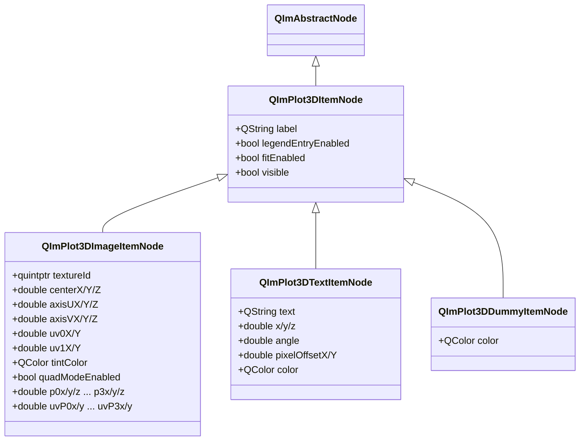
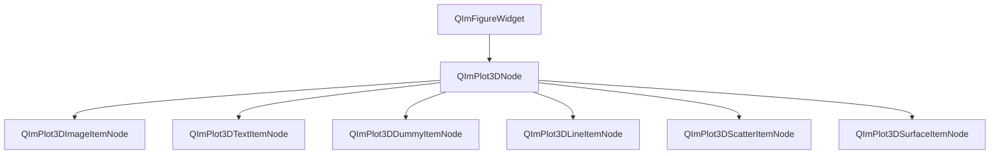

# 3D 标注元素使用指南

QIm 提供三种 3D 标注类节点，用于在 3D 绘图空间中添加图像纹理、文本标签和图例占位符，
分别对应 ImPlot3D 的 Image、Text 和 Dummy 绘图项。
这些标注类节点继承自 `QImPlot3DItemNode`，遵循 QIm 对象树管理机制和 PIMPL 设计模式。

## 主要功能特性

**特性**

- ✅ **3D 图像（Image）**：在 3D 空间中渲染纹理图像，支持标准模式（billboard）和四边形模式（任意 3D 位置）
- ✅ **3D 文本标签（Text）**：在 3D 绘图坐标处渲染居中文本，支持角度旋转和像素偏移精细定位
- ✅ **3D 虚拟项（Dummy）**：仅在图例中创建占位条目，不渲染任何图形，用于自定义图例标注
- ✅ **属性系统**：所有标注属性通过 Q_PROPERTY 暴露，支持信号槽响应式编程
- ✅ **对象树管理**：标注节点创建时指定 `QImPlot3DNode` 为父节点，自动加入对象树

## 基本概念

### 类继承关系



三种标注类节点均继承自 `QImPlot3DItemNode`，共享基类的 `label`、`visible`、`legendEntryEnabled`、`fitEnabled` 等通用属性。

### 对象树定位

标注节点在 QIm 对象树中的位置：



**对象树说明：**

- 标注节点通过构造函数指定 `QImPlot3DNode` 为父节点，自动加入对象树
- `QImPlot3DDummyItemNode` 仅影响图例，不影响绘图区域内的其他子节点渲染
- `QImPlot3DImageItemNode` 和 `QImPlot3DTextItemNode` 在 3D 空间中渲染可视元素

## QImPlot3DImageItemNode

`QImPlot3DImageItemNode` 封装 ImPlot3D 3D 图像渲染，支持在 3D 空间中显示纹理图像。
该节点提供两种渲染模式：标准模式（billboard）和四边形模式（任意 3D 定位）。

### 渲染模式

#### 标准模式（Billboard）

标准模式通过中心点（center）和两个方向向量（axisU、axisV）定义图像在 3D 空间中的位置和朝向：

```text
                    axisV（垂直方向向量）
                    ┌─────┐
                    │     │
           center → │  ★  │ ← 图像中心锚点
                    │     │
                    └─────┘
              axisU（水平方向向量）
```

- **center**：图像在 3D 空间中的中心锚点坐标（centerX/Y/Z）
- **axisU**：从中心向右延伸的方向向量，定义图像的水平宽度和朝向（axisUX/Y/Z）
- **axisV**：从中心向上延伸的方向向量，定义图像的垂直高度和朝向（axisVX/Y/Z）
- **textureId**：GPU 纹理 ID，来自渲染后端（如 `ImGui::GetIO().Fonts->TexRef.GetTexID()`）

图像的四个角点由 `center - axisU - axisV`、`center + axisU - axisV`、`center + axisU + axisV`、`center - axisU + axisV` 计算得出。

#### 四边形模式（Quad）

四边形模式通过 4 个角点（p0-p3）直接定义图像在 3D 空间中的形状，支持任意倾斜和透视变形：

```text
    p3 ──────────── p2
     │             │
     │   纹理图像   │
     │             │
    p0 ──────────── p1
```

- **quadModeEnabled**：设置为 `true` 启用四边形模式
- **p0-p3**：4 个角点的 3D 坐标（p0x/y/z、p1x/y/z、p2x/y/z、p3x/y/z）
- **uvP0-uvP3**：每个角点独立的 UV 纹理坐标（uvP0x/y、uvP1x/y、uvP2x/y、uvP3x/y）

四边形模式的优势在于可以精确控制图像在 3D 空间中的形状，支持非矩形映射和透视变形。

#### 模式对比

| 特性 | 标准模式 | 四边形模式 |
|------|----------|------------|
| 定位方式 | center + axisU + axisV | 4 个角点 p0-p3 |
| 形状 | 对称矩形 | 任意四边形 |
| 纹理坐标 | uv0 + uv1（左下角和右上角） | uvP0-uvP3（每角独立） |
| 适用场景 | 图标、徽标、简单纹理贴图 | 透视贴图、倾斜面纹理、地形贴图 |
| 启用条件 | quadModeEnabled = false（默认） | quadModeEnabled = true |

### UV 纹理坐标

UV 坐标定义纹理图像的采样区域，范围 `[0.0, 1.0]` 对应纹理的完整区域：

**标准模式 UV：**

```text
    uv1 (右上角) ──────── (1.0, 1.0)
         │              │
         │  纹理采样区域  │
         │              │
    uv0 (左下角) ──────── (0.0, 0.0)
```

- **uv0X/Y**：左下角纹理坐标（默认 0.0, 0.0）
- **uv1X/Y**：右上角纹理坐标（默认 1.0, 1.0）

**四边形模式 UV：**

四边形模式下，每个角点拥有独立的 UV 坐标，可实现更灵活的纹理映射：

```text
    uvP3 ──────────── uvP2
     │               │
     │  任意纹理映射   │
     │               │
    uvP0 ──────────── uvP1
```

- **uvP0x/y**：角点 0 的 UV 坐标
- **uvP1x/y**：角点 1 的 UV 坐标
- **uvP2x/y**：角点 2 的 UV 坐标
- **uvP3x/y**：角点 3 的 UV 坐标

!!! info "UV 坐标的应用场景"
    - 显示完整纹理：uv0=(0,0)，uv1=(1,1)
    - 显示纹理局部区域：uv0=(0.25,0.25)，uv1=(0.75,0.75)
    - 纹理翻转：uv0=(1,1)，uv1=(0,0)
    - 部分透明裁剪：配合 tintColor 的 alpha 分量控制

### 色调颜色

`tintColor` 属性定义应用于图像纹理的颜色乘数：

- 默认白色 `(255, 255, 255)` 表示图像保持不变
- alpha 分量控制透明度：`QColor(255, 255, 255, 128)` 表示半透明
- 其他颜色用于染色效果：`QColor(255, 200, 0)` 为图像叠加黄色色调

```cpp
// 保持图像原始外观
image3D->setTintColor(QColor(255, 255, 255));  // 默认值

// 半透明效果（alpha = 128，约50%透明度）
image3D->setTintColor(QColor(255, 255, 255, 128));

// 黄色色调叠加
image3D->setTintColor(QColor(255, 200, 0));
```

### 基本使用（标准模式）

该组件的示例位于 `examples/qimfigure-test` 中的 Plot3DImageFunction，示例截图如下：


使用标准模式在 3D 空间中渲染图像纹理：

```cpp
#include "QImFigureWidget.h"
#include "plot3d/QImPlot3DNode.h"
#include "plot3d/QImPlot3DImageItemNode.h"
#include "imgui.h"

// 创建 3D 绘图节点作为父节点
QIM::QImPlot3DNode* plot3D = figure->createPlot3DNode();
plot3D->setTitle("3D 图像示例");
plot3D->setBoxRotation(35.264, 45.0);  // 等距视角

// 创建 3D 图像节点，指定 plot3D 为父节点
QIM::QImPlot3DImageItemNode* image3D = new QIM::QImPlot3DImageItemNode(plot3D);

// 设置纹理 ID（从渲染后端获取）
ImTextureID fontTexId = ImGui::GetIO().Fonts->TexRef.GetTexID();
image3D->setTextureId(static_cast<quintptr>(fontTexId));

// 设置图像中心位置和方向向量（标准模式）
image3D->setCenterX(0.0);   // 中心 X 坐标
image3D->setCenterY(0.0);   // 中心 Y 坐标
image3D->setCenterZ(0.5);   // 中心 Z 坐标
image3D->setAxisUX(0.5);    // 水平方向 X 分量
image3D->setAxisUY(0.0);    // 水平方向 Y 分量
image3D->setAxisUZ(0.0);    // 水平方向 Z 分量
image3D->setAxisVX(0.0);    // 垂直方向 X 分量
image3D->setAxisVY(0.5);    // 垂直方向 Y 分量
image3D->setAxisVZ(0.0);    // 垂直方向 Z 分量

// 效果：在 3D 空间 (0, 0, 0.5) 处渲染纹理图像，
//        图像沿 X 轴方向延伸 0.5，沿 Y 轴方向延伸 0.5
// 对象树结构：figure → plot3D → image3D
```

!!! warning "纹理 ID 要求"
    `textureId` 必须是来自渲染后端的有效 ImTextureID。
    通常通过 `ImGui::GetIO().Fonts->TexRef.GetTexID()` 获取字体纹理，
    或使用自定义纹理的 GPU ID。无效的纹理 ID 会导致渲染错误。

### 四边形模式使用

启用四边形模式，通过 4 个角点直接定义图像形状：

```cpp
// 创建 3D 图像节点
QIM::QImPlot3DImageItemNode* image3D = new QIM::QImPlot3DImageItemNode(plot3D);

// 启用四边形模式
image3D->setQuadModeEnabled(true);

// 设置纹理 ID
image3D->setTextureId(static_cast<quintptr>(fontTexId));

// 使用便利方法一次性设置所有四边形参数
image3D->setQuadImage(
    static_cast<quintptr>(fontTexId),  // 纹理 ID
    0.0, 0.0, 0.0,     // p0（左下角）
    1.0, 0.0, 0.0,     // p1（右下角）
    1.0, 0.0, 1.0,     // p2（右上角）
    0.0, 0.0, 1.0,     // p3（左上角）
    0.0, 0.0,          // uvP0
    1.0, 0.0,          // uvP1
    1.0, 1.0,          // uvP2
    0.0, 1.0           // uvP3
);

// 效果：在 3D 空间中渲染一个倾斜的纹理四边形
```

!!! info "setQuadImage 便利方法"
    `setQuadImage()` 方法可一次性设置四边形模式的所有参数（纹理 ID、4 个角点坐标、
    4 个角点 UV 坐标、色调颜色），避免逐个属性设置。色调颜色默认为白色。

### 属性列表

#### 通用属性

| 属性 | 类型 | Getter | Setter | 信号 | 说明 |
|------|------|--------|--------|------|------|
| textureId | quintptr | `textureId()` | `setTextureId()` | `textureIdChanged` | GPU 纹理 ID |

#### 标准模式属性

| 属性 | 类型 | Getter | Setter | 信号 | 说明 |
|------|------|--------|--------|------|------|
| centerX | double | `centerX()` | `setCenterX()` | `centerChanged` | 图像中心 X 坐标 |
| centerY | double | `centerY()` | `setCenterY()` | `centerChanged` | 图像中心 Y 坐标 |
| centerZ | double | `centerZ()` | `setCenterZ()` | `centerChanged` | 图像中心 Z 坐标 |
| axisUX | double | `axisUX()` | `setAxisUX()` | `axisUChanged` | U 轴方向 X 分量 |
| axisUY | double | `axisUY()` | `setAxisUY()` | `axisUChanged` | U 轴方向 Y 分量 |
| axisUZ | double | `axisUZ()` | `setAxisUZ()` | `axisUChanged` | U 轴方向 Z 分量 |
| axisVX | double | `axisVX()` | `setAxisVX()` | `axisVChanged` | V 轴方向 X 分量 |
| axisVY | double | `axisVY()` | `setAxisVY()` | `axisVChanged` | V 轴方向 Y 分量 |
| axisVZ | double | `axisVZ()` | `setAxisVZ()` | `axisVChanged` | V 轴方向 Z 分量 |
| uv0X | double | `uv0X()` | `setUv0X()` | `uv0Changed` | 左下角纹理坐标 X（默认 0.0） |
| uv0Y | double | `uv0Y()` | `setUv0Y()` | `uv0Changed` | 左下角纹理坐标 Y（默认 0.0） |
| uv1X | double | `uv1X()` | `setUv1X()` | `uv1Changed` | 右上角纹理坐标 X（默认 1.0） |
| uv1Y | double | `uv1Y()` | `setUv1Y()` | `uv1Changed` | 右上角纹理坐标 Y（默认 1.0） |
| tintColor | QColor | `tintColor()` | `setTintColor()` | `tintColorChanged` | 色调颜色（默认白色） |

#### 四边形模式属性

| 属性 | 类型 | Getter | Setter | 信号 | 说明 |
|------|------|--------|--------|------|------|
| quadModeEnabled | bool | `quadModeEnabled()` | `setQuadModeEnabled()` | `quadModeEnabledChanged` | 四边形模式开关 |
| p0x | double | `p0x()` | `setP0x()` | `p0Changed` | 角点 0 X 坐标 |
| p0y | double | `p0y()` | `setP0y()` | `p0Changed` | 角点 0 Y 坐标 |
| p0z | double | `p0z()` | `setP0z()` | `p0Changed` | 角点 0 Z 坐标 |
| p1x | double | `p1x()` | `setP1x()` | `p1Changed` | 角点 1 X 坐标 |
| p1y | double | `p1y()` | `setP1y()` | `p1Changed` | 角点 1 Y 坐标 |
| p1z | double | `p1z()` | `setP1z()` | `p1Changed` | 角点 1 Z 坐标 |
| p2x | double | `p2x()` | `setP2x()` | `p2Changed` | 角点 2 X 坐标 |
| p2y | double | `p2y()` | `setP2y()` | `p2Changed` | 角点 2 Y 坐标 |
| p2z | double | `p2z()` | `setP2z()` | `p2Changed` | 角点 2 Z 坐标 |
| p3x | double | `p3x()` | `setP3x()` | `p3Changed` | 角点 3 X 坐标 |
| p3y | double | `p3y()` | `setP3y()` | `p3Changed` | 角点 3 Y 坐标 |
| p3z | double | `p3z()` | `setP3z()` | `p3Changed` | 角点 3 Z 坐标 |
| uvP0x | double | `uvP0x()` | `setUvP0x()` | `uvP0Changed` | 角点 0 UV X |
| uvP0y | double | `uvP0y()` | `setUvP0y()` | `uvP0Changed` | 角点 0 UV Y |
| uvP1x | double | `uvP1x()` | `setUvP1x()` | `uvP1Changed` | 角点 1 UV X |
| uvP1y | double | `uvP1y()` | `setUvP1y()` | `uvP1Changed` | 角点 1 UV Y |
| uvP2x | double | `uvP2x()` | `setUvP2x()` | `uvP2Changed` | 角点 2 UV X |
| uvP2y | double | `uvP2y()` | `setUvP2y()` | `uvP2Changed` | 角点 2 UV Y |
| uvP3x | double | `uvP3x()` | `setUvP3x()` | `uvP3Changed` | 角点 3 UV X |
| uvP3y | double | `uvP3y()` | `setUvP3y()` | `uvP3Changed` | 角点 3 UV Y |

!!! info "信号合并说明"
    center 的三个分量共用 `centerChanged(double x, double y, double z)` 信号，
    axisU 的三个分量共用 `axisUChanged(double x, double y, double z)` 信号，
    axisV 的三个分量共用 `axisVChanged(double x, double y, double z)` 信号，
    每个角点的三个分量共用各自的信号（如 `p0Changed(double x, double y, double z)`），
    每个角点 UV 的两个分量共用各自的信号（如 `uvP0Changed(double x, double y)`）。

### 方法列表

| 方法 | 参数 | 说明 |
|------|------|------|
| `setTextureId(id)` | quintptr | 设置 GPU 纹理 ID |
| `textureId()` | - | 获取 GPU 纹理 ID |
| `setCenterX/Y/Z(val)` | double | 设置图像中心坐标分量 |
| `centerX/Y/Z()` | - | 获取图像中心坐标分量 |
| `setAxisUX/Y/Z(val)` | double | 设置 U 轴方向向量分量 |
| `axisUX/Y/Z()` | - | 获取 U 轴方向向量分量 |
| `setAxisVX/Y/Z(val)` | double | 设置 V 轴方向向量分量 |
| `axisVX/Y/Z()` | - | 获取 V 轴方向向量分量 |
| `setUv0X/Y(val)` | double | 设置左下角纹理坐标分量 |
| `uv0X/Y()` | - | 获取左下角纹理坐标分量 |
| `setUv1X/Y(val)` | double | 设置右上角纹理坐标分量 |
| `uv1X/Y()` | - | 获取右上角纹理坐标分量 |
| `setTintColor(color)` | QColor | 设置色调颜色 |
| `tintColor()` | - | 获取色调颜色 |
| `setQuadModeEnabled(enabled)` | bool | 启用/禁用四边形模式 |
| `quadModeEnabled()` | - | 检查四边形模式是否启用 |
| `setP0x/y/z(val)` ... `setP3x/y/z(val)` | double | 设置角点坐标分量 |
| `p0x/y/z()` ... `p3x/y/z()` | - | 获取角点坐标分量 |
| `setUvP0x/y(val)` ... `setUvP3x/y(val)` | double | 设置角点 UV 分量 |
| `uvP0x/y()` ... `uvP3x/y()` | - | 获取角点 UV 分量 |
| `setQuadImage(...)` | 21+ 参数 | 便利方法：一次性设置所有四边形参数 |
| `imageFlags()` | - | 获取原始 ImPlot3DImageFlags |
| `setImageFlags(flags)` | int | 设置原始 ImPlot3DImageFlags |

### 信号列表

| 信号 | 参数 | 触发时机 |
|------|------|----------|
| `textureIdChanged(id)` | quintptr | 纹理 ID 变更时 |
| `centerChanged(x, y, z)` | double, double, double | 任意中心坐标变更时 |
| `axisUChanged(x, y, z)` | double, double, double | 任意 U 轴分量变更时 |
| `axisVChanged(x, y, z)` | double, double, double | 任意 V 轴分量变更时 |
| `uv0Changed(x, y)` | double, double | 任意 UV0 坐标变更时 |
| `uv1Changed(x, y)` | double, double | 任意 UV1 坐标变更时 |
| `tintColorChanged(color)` | QColor | 色调颜色变更时 |
| `imageFlagChanged()` | - | 任意图像标志变更时 |
| `quadModeEnabledChanged(enabled)` | bool | 四边形模式开关变更时 |
| `p0Changed(x, y, z)` | double, double, double | 角点 0 任意坐标变更时 |
| `p1Changed(x, y, z)` | double, double, double | 角点 1 任意坐标变更时 |
| `p2Changed(x, y, z)` | double, double, double | 角点 2 任意坐标变更时 |
| `p3Changed(x, y, z)` | double, double, double | 角点 3 任意坐标变更时 |
| `uvP0Changed(x, y)` | double, double | UV 点 0 任意坐标变更时 |
| `uvP1Changed(x, y)` | double, double | UV 点 1 任意坐标变更时 |
| `uvP2Changed(x, y)` | double, double | UV 点 2 任意坐标变更时 |
| `uvP3Changed(x, y)` | double, double | UV 点 3 任意坐标变更时 |

```cpp
// 监控图像中心位置变更
connect(image3D, &QIM::QImPlot3DImageItemNode::centerChanged,
        this, [](double x, double y, double z) {
    qDebug() << "图像中心已更新为:" << x << y << z;
});

// 监控四边形模式开关
connect(image3D, &QIM::QImPlot3DImageItemNode::quadModeEnabledChanged,
        this, [](bool enabled) {
    qDebug() << "四边形模式:" << (enabled ? "已启用" : "已禁用");
});
```

!!! warning "imageFlagChanged 信号"
    所有图像标志属性共用 `imageFlagChanged()` 信号。
    此信号不指示具体哪个标志发生变更，连接的槽函数需查询相关属性以确定变更内容。

### 示例代码

完整示例来自 `examples/qimfigure-test/functions/3d/Plot3DImageFunction.cpp`：

```cpp
void Plot3DImageFunction::createPlot(QIM::QImFigureWidget* figure)
{
    // 重置为单图模式
    figure->setSubplot3DGrid(1, 1);
    
    // 创建 3D 绘图节点
    m_plot3DNode = figure->createPlot3DNode();
    
    // 配置坐标轴和标题
    m_plot3DNode->xAxis()->setLabel(m_xLabel);
    m_plot3DNode->yAxis()->setLabel(m_yLabel);
    m_plot3DNode->zAxis()->setLabel(m_zLabel);
    m_plot3DNode->setTitle(m_title);
    
    // 设置等距视角
    m_plot3DNode->setBoxRotation(35.264, 45.0);
    
    // 创建 3D 图像节点，指定 plot3D 为父节点
    m_image3DNode = new QIM::QImPlot3DImageItemNode(m_plot3DNode);
    
    // 使用 ImGui 字体纹理作为测试纹理源
    ImTextureID fontTexId = ImGui::GetIO().Fonts->TexRef.GetTexID();
    m_image3DNode->setTextureId(static_cast<quintptr>(fontTexId));
    
    // 设置标准模式属性
    m_image3DNode->setCenterX(m_centerX);
    m_image3DNode->setCenterY(m_centerY);
    m_image3DNode->setCenterZ(m_centerZ);
    
    m_image3DNode->setAxisUX(m_axisUX);
    m_image3DNode->setAxisUY(m_axisUY);
    m_image3DNode->setAxisUZ(m_axisUZ);
    
    m_image3DNode->setAxisVX(m_axisVX);
    m_image3DNode->setAxisVY(m_axisVY);
    m_image3DNode->setAxisVZ(m_axisVZ);
    
    m_image3DNode->setTintColor(m_tintColor);
    
    m_image3DNode->setUv0X(m_uv0X);
    m_image3DNode->setUv0Y(m_uv0Y);
    m_image3DNode->setUv1X(m_uv1X);
    m_image3DNode->setUv1Y(m_uv1Y);
}
```

## QImPlot3DTextItemNode

`QImPlot3DTextItemNode` 封装 ImPlot3D 文本标签，在指定 3D 绘图坐标处渲染居中文本，
可选角度旋转和像素偏移。适用于在 3D 空间中标注数据点、标记特征区域或添加描述性标签。

!!! info "与 2D 文本标签的区别"
    3D 文本标签使用三维坐标 `(x, y, z)` 定位（而非 2D 的 `(x, y)`），
    使用 `angle` 属性控制旋转角度（而非 2D 的 `vertical` 布尔值），
    其他使用方式与 2D 版本一致。

### 基本使用

该组件的示例位于 `examples/qimfigure-test` 中的 Plot3DTextFunction，示例截图如下：


创建 3D 文本标签并定位到绘图坐标：

```cpp
#include "QImFigureWidget.h"
#include "plot3d/QImPlot3DNode.h"
#include "plot3d/QImPlot3DTextItemNode.h"

// 创建 3D 绘图节点作为父节点
QIM::QImPlot3DNode* plot3D = figure->createPlot3DNode();
plot3D->setTitle("3D 文本标注示例");
plot3D->setBoxRotation(35.264, 45.0);

// 创建 3D 文本标签，指定 plot3D 为父节点
QIM::QImPlot3DTextItemNode* text3D = new QIM::QImPlot3DTextItemNode(plot3D);
text3D->setLabel("Text Label");
text3D->setText("关键数据点");           // 设置文本内容
text3D->setPosition(0.0, 0.0, 0.5);     // 设置 3D 绘图坐标位置
text3D->setColor(QColor(255, 0, 0));    // 设置文本颜色

// 效果：在 3D 空间坐标 (0, 0, 0.5) 处显示红色文本"关键数据点"
// 对象树结构：figure → plot3D → text3D
```

### 3D 定位与偏移

`position` 使用 3D 绘图坐标系（与数据点相同的坐标空间），`pixelOffset` 使用屏幕像素坐标系。
两者叠加实现精细定位：先在 3D 坐标处定位锚点，再通过像素偏移微调显示位置。

```cpp
// 在 3D 数据点附近标注，用像素偏移避免遮挡
text3D->setPosition(1.0, 2.0, 0.5);     // 锚点定位到 3D 坐标 (1.0, 2.0, 0.5)
text3D->setPixelOffset(10.0, -5.0);     // 向右偏移 10 像素、向上偏移 5 像素

// 效果：文本标签在 3D 位置 (1.0, 2.0, 0.5) 的右上方显示，避免与数据点重叠
```

!!! info "position 与 pixelOffset 的区别"
    - `position (x, y, z)`：3D 绘图坐标系，随旋转、缩放和平移变化。适合标注特定数据位置
    - `pixelOffset (pixelOffsetX, pixelOffsetY)`：屏幕像素坐标系，不受 3D 变换影响。适合微调文本与锚点的相对距离

### 旋转角度

`angle` 属性控制文本的旋转角度（单位：度），与 2D 版本的 `vertical` 布尔值不同：
- `angle = 0`：文本水平显示（默认）
- `angle = 90`：文本垂直显示
- `angle = 45`：文本倾斜 45°

```cpp
// 水平文本（默认）
text3D->setAngle(0.0);    // 文本水平显示

// 垂直文本
text3D->setAngle(90.0);   // 文本旋转 90° 垂直显示

// 自定义角度
text3D->setAngle(45.0);   // 文本倾斜 45°
```

### 属性列表

| 属性 | 类型 | Getter | Setter | 信号 | 说明 |
|------|------|--------|--------|------|------|
| text | QString | `text()` | `setText()` | `textChanged` | 文本内容 |
| x | double | `x()` | `setX()` | `positionChanged` | 3D 位置 X 坐标 |
| y | double | `y()` | `setY()` | `positionChanged` | 3D 位置 Y 坐标 |
| z | double | `z()` | `setZ()` | `positionChanged` | 3D 位置 Z 坐标 |
| angle | double | `angle()` | `setAngle()` | `angleChanged` | 旋转角度（度） |
| pixelOffsetX | double | `pixelOffsetX()` | `setPixelOffsetX()` | `pixelOffsetChanged` | 水平像素偏移 |
| pixelOffsetY | double | `pixelOffsetY()` | `setPixelOffsetY()` | `pixelOffsetChanged` | 垂直像素偏移 |
| color | QColor | `color()` | `setColor()` | `colorChanged` | 文本颜色 |

!!! info "便利重载方法"
    - `setPosition(double x, double y, double z)`：一次性设置 3 个坐标分量
    - `setPixelOffset(double offsetX, double offsetY)`：一次性设置 2 个偏移分量

!!! info "positionChanged 信号合并"
    x、y、z 三个分量共用 `positionChanged(double x, double y, double z)` 信号，
    pixelOffsetX、pixelOffsetY 共用 `pixelOffsetChanged(double offsetX, double offsetY)` 信号。

### 方法列表

| 方法 | 参数 | 说明 |
|------|------|------|
| `setText(text)` | QString | 设置文本内容 |
| `text()` | - | 获取文本内容 |
| `setX(x)` | double | 设置 3D 位置 X 坐标 |
| `x()` | - | 获取 3D 位置 X 坐标 |
| `setY(y)` | double | 设置 3D 位置 Y 坐标 |
| `y()` | - | 获取 3D 位置 Y 坐标 |
| `setZ(z)` | double | 设置 3D 位置 Z 坐标 |
| `z()` | - | 获取 3D 位置 Z 坐标 |
| `setPosition(x, y, z)` | double, double, double | 便利方法：一次性设置 3D 位置 |
| `setAngle(angleDeg)` | double | 设置旋转角度（度） |
| `angle()` | - | 获取旋转角度（度） |
| `setPixelOffsetX(offset)` | double | 设置水平像素偏移 |
| `pixelOffsetX()` | - | 获取水平像素偏移 |
| `setPixelOffsetY(offset)` | double | 设置垂直像素偏移 |
| `pixelOffsetY()` | - | 获取垂直像素偏移 |
| `setPixelOffset(offsetX, offsetY)` | double, double | 便利方法：一次性设置像素偏移 |
| `setColor(color)` | QColor | 设置文本颜色 |
| `color()` | - | 获取文本颜色 |

### 信号列表

| 信号 | 参数 | 触发时机 |
|------|------|----------|
| `textChanged(text)` | QString | 文本内容变更时 |
| `positionChanged(x, y, z)` | double, double, double | 任意位置坐标变更时 |
| `angleChanged(angleDeg)` | double | 旋转角度变更时 |
| `pixelOffsetChanged(offsetX, offsetY)` | double, double | 任意像素偏移变更时 |
| `colorChanged(color)` | QColor | 文本颜色变更时 |

```cpp
// 监控 3D 文本位置变更
connect(text3D, &QIM::QImPlot3DTextItemNode::positionChanged,
        this, [](double x, double y, double z) {
    qDebug() << "3D 文本位置已更新为:" << x << y << z;
});

// 监控旋转角度变更
connect(text3D, &QIM::QImPlot3DTextItemNode::angleChanged,
        this, [](double angleDeg) {
    qDebug() << "旋转角度已更新为:" << angleDeg << "度";
});
```

### 示例代码

完整示例来自 `examples/qimfigure-test/functions/3d/Plot3DTextFunction.cpp`：

```cpp
void Plot3DTextFunction::createPlot(QIM::QImFigureWidget* figure)
{
    // 重置为单图模式
    figure->setSubplot3DGrid(1, 1);
    
    // 创建 3D 绘图节点
    m_plot3DNode = figure->createPlot3DNode();
    
    // 配置坐标轴和标题
    m_plot3DNode->xAxis()->setLabel(m_xLabel);
    m_plot3DNode->yAxis()->setLabel(m_yLabel);
    m_plot3DNode->zAxis()->setLabel(m_zLabel);
    m_plot3DNode->setTitle(m_title);
    
    // 设置等距视角
    m_plot3DNode->setBoxRotation(35.264, 45.0);
    
    // 创建 3D 文本节点，指定 plot3D 为父节点
    m_text3DNode = new QIM::QImPlot3DTextItemNode(m_plot3DNode);
    m_text3DNode->setText(m_text);                               // 文本内容
    m_text3DNode->setPosition(m_x, m_y, m_z);                   // 3D 坐标定位
    m_text3DNode->setAngle(m_angle);                             // 旋转角度
    m_text3DNode->setPixelOffset(m_pixelOffsetX, m_pixelOffsetY); // 像素偏移微调
    m_text3DNode->setColor(m_color);                             // 文本颜色
}
```

## QImPlot3DDummyItemNode

`QImPlot3DDummyItemNode` 是一种特殊的标注节点，仅在图例中创建带有颜色图标的占位条目，
不在 3D 绘图区域渲染任何可见图形。其设计与 2D 的 `QImPlotDummyItemNode` 一致。

### 设计用途

虚拟项的核心用途是为图例添加自定义标注条目，而不与实际绘图数据关联：

- 为手动标注添加图例说明
- 表示分组数据的类别标识
- 作为图例中的分隔或提示条目

```text
3D 绘图区域：仅显示螺旋线数据（虚拟项不渲染）
图例区域：
┌─────────────────────┐
│ ── Helix            │ ← 3D 线图图例条目
│ ■ Sensor A          │ ← 虚拟项图例条目（仅图标+标签）
│ ■ Sensor B          │ ← 虚拟项图例条目
│ ■ Sensor C          │ ← 虚拟项图例条目
└─────────────────────┘
```

!!! info "虚拟项不渲染任何图形"
    `QImPlot3DDummyItemNode` 只在图例中创建一个带颜色图标和标签的条目，
    3D 绘图区域中不会出现任何与之对应的图形元素。

### 基本使用

该组件的示例位于 `examples/qimfigure-test` 中的 Plot3DDummyFunction，示例截图如下：


创建虚拟项作为图例占位：

```cpp
#include "QImFigureWidget.h"
#include "plot3d/QImPlot3DNode.h"
#include "plot3d/QImPlot3DLineItemNode.h"
#include "plot3d/QImPlot3DDummyItemNode.h"

// 创建 3D 绘图节点
QIM::QImPlot3DNode* plot3D = figure->createPlot3DNode();
plot3D->setTitle("3D 虚拟项示例");
plot3D->setLegendEnabled(true);  // 必须启用图例才能看到虚拟项

// 创建 3D 螺旋线数据
std::vector<double> xs, ys, zs;
for (int i = 0; i < 200; ++i) {
    double t = i * 0.05 * M_PI;
    xs.push_back(std::cos(t));
    ys.push_back(std::sin(t));
    zs.push_back(t * 0.1);
}

// 创建 3D 线图节点
QIM::QImPlot3DLineItemNode* line3D = new QIM::QImPlot3DLineItemNode(plot3D);
line3D->setData(xs, ys, zs);
line3D->setColor(QColor(0, 114, 189));
line3D->setLineWeight(2.0f);
line3D->setLabel("Helix");

// 创建虚拟项节点，仅作为图例占位
QIM::QImPlot3DDummyItemNode* dummy1 = new QIM::QImPlot3DDummyItemNode(plot3D);
dummy1->setLabel("Sensor A");         // 图例中显示的标签
dummy1->setColor(QColor(255, 0, 0)); // 图例图标颜色

QIM::QImPlot3DDummyItemNode* dummy2 = new QIM::QImPlot3DDummyItemNode(plot3D);
dummy2->setLabel("Sensor B");
dummy2->setColor(QColor(0, 255, 0));

QIM::QImPlot3DDummyItemNode* dummy3 = new QIM::QImPlot3DDummyItemNode(plot3D);
dummy3->setLabel("Sensor C");
dummy3->setColor(QColor(0, 0, 255));

// 效果：图例中显示 4 条条目——线图"Helix"和虚拟项"Sensor A/B/C"
// 3D 绘图区域仅显示螺旋线数据，虚拟项不渲染任何图形
// 对象树结构：figure → plot3D → line3D, dummy1, dummy2, dummy3
```

!!! warning "图例必须启用"
    虚拟项仅在图例中可见。如果 `QImPlot3DNode` 的 `legendEnabled` 为 `false`，
    虚拟项将完全不可见。创建虚拟项前应确保图例已启用：
    ```cpp
    plot3D->setLegendEnabled(true);  // 启用图例
    ```

### 属性列表

| 属性 | 类型 | Getter | Setter | 信号 | 说明 |
|------|------|--------|--------|------|------|
| color | QColor | `color()` | `setColor()` | `colorChanged` | 图例图标颜色 |

!!! info "label 属性"
    `label` 属性继承自 `QImPlot3DItemNode` 基类，通过 `setLabel()` 设置图例标签文本，
    `label()` 获取标签。这是虚拟项最重要的属性，决定了图例中显示的文字。

### 方法列表

| 方法 | 参数 | 说明 |
|------|------|------|
| `setColor(color)` | QColor | 设置图例图标颜色 |
| `color()` | - | 获取图例图标颜色 |

### 信号列表

| 信号 | 参数 | 触发时机 |
|------|------|----------|
| `colorChanged(color)` | QColor | 图例图标颜色变更时 |

```cpp
// 监控虚拟项颜色变更
connect(dummyNode, &QIM::QImPlot3DDummyItemNode::colorChanged,
        this, [](const QColor& newColor) {
    qDebug() << "虚拟项颜色已更新为:" << newColor.name();
});
```

### 示例代码

完整示例来自 `examples/qimfigure-test/functions/3d/Plot3DDummyFunction.cpp`：

```cpp
void Plot3DDummyFunction::createPlot(QIM::QImFigureWidget* figure)
{
    // 重置为单图模式
    figure->setSubplot3DGrid(1, 1);
    
    // 创建 3D 绘图节点
    m_plot3DNode = figure->createPlot3DNode();
    
    // 配置坐标轴和标题
    m_plot3DNode->xAxis()->setLabel(m_xLabel);
    m_plot3DNode->yAxis()->setLabel(m_yLabel);
    m_plot3DNode->zAxis()->setLabel(m_zLabel);
    m_plot3DNode->setTitle(m_title);
    
    // 启用图例以显示虚拟项
    m_plot3DNode->setLegendEnabled(true);
    
    // 创建 3 个虚拟项节点，仅作为图例占位
    m_dummy1Node = new QIM::QImPlot3DDummyItemNode(m_plot3DNode);
    m_dummy1Node->setLabel(QStringLiteral("Sensor A"));
    m_dummy1Node->setColor(m_dummy1Color);
    
    m_dummy2Node = new QIM::QImPlot3DDummyItemNode(m_plot3DNode);
    m_dummy2Node->setLabel(QStringLiteral("Sensor B"));
    m_dummy2Node->setColor(m_dummy2Color);
    
    m_dummy3Node = new QIM::QImPlot3DDummyItemNode(m_plot3DNode);
    m_dummy3Node->setLabel(QStringLiteral("Sensor C"));
    m_dummy3Node->setColor(m_dummy3Color);
    
    // 添加可见螺旋线作为 3D 几何演示
    const int numLinePoints = 200;
    std::vector<double> xsLine, ysLine, zsLine;
    for (int i = 0; i < numLinePoints; ++i) {
        double t = i * 0.05 * M_PI;
        xsLine.push_back(std::cos(t));
        ysLine.push_back(std::sin(t));
        zsLine.push_back(t * 0.1);
    }
    m_lineNode = new QIM::QImPlot3DLineItemNode(m_plot3DNode);
    m_lineNode->setData(xsLine, ysLine, zsLine);
    m_lineNode->setColor(QColor(0, 114, 189));
    m_lineNode->setLineWeight(2.0f);
    m_lineNode->setLabel(QStringLiteral("Helix"));
}
```

## 继承属性说明

三种标注类节点均继承自 `QImPlot3DItemNode`，共享以下通用属性：

| 属性 | 类型 | Getter | Setter | 信号 | 说明 |
|------|------|--------|--------|------|------|
| label | QString | `label()` | `setLabel()` | `labelChanged` | 图例标签文本 |
| legendEntryEnabled | bool | `isLegendEntryEnabled()` | `setLegendEntryEnabled()` | `legendEntryEnabledChanged` | 是否显示在图例中 |
| fitEnabled | bool | `isFitEnabled()` | `setFitEnabled()` | `fitEnabledChanged` | 是否参与坐标轴自适应 |
| visible | bool | `isVisible()` | `setVisible()` | - | 可见性控制 |

!!! info "label 的 UTF8 存储规范"
    `QImPlot3DItemNode` 内部仅以 UTF8 格式存储标签文本（使用 `QByteArray`），
    符合 QIm 的字符串存储规范。`labelConstData()` 方法返回直接用于渲染的 UTF8 指针。

## 信号槽连接

三种标注类节点的信号使用方式一致，均遵循 Qt 信号槽机制：

```cpp
// 3D Image 信号连接
connect(image3D, &QIM::QImPlot3DImageItemNode::centerChanged,
        this, &MyClass::onImageCenterChanged);

// 3D Text 信号连接
connect(text3D, &QIM::QImPlot3DTextItemNode::positionChanged,
        this, &MyClass::onTextPositionChanged);

// 3D Dummy 信号连接
connect(dummyNode, &QIM::QImPlot3DDummyItemNode::colorChanged,
        this, &MyClass::onDummyColorChanged);
```

!!! info "信号命名约定"
    QIm 信号命名遵循 Qt 惯例：属性变更信号为 `propertyNameChanged`，
    标志变更信号为 `flagNameChanged`（如 `imageFlagChanged`）。
    注意使用 `Q_SIGNALS` 而非 `signals` 关键字。

## 注意事项

!!! warning "对象树父子关系"
    创建 3D 标注节点时，必须指定 `QImPlot3DNode` 为父节点：
    ```cpp
    // 正确：构造时指定父节点（推荐）
    QIM::QImPlot3DTextItemNode* text = new QIM::QImPlot3DTextItemNode(plot3D);
    
    // 正确：通过 addPlotItem() 添加
    QIM::QImPlot3DTextItemNode* text = new QIM::QImPlot3DTextItemNode();
    plot3D->addPlotItem(text);
    ```
    两种方式等效。方式1 更符合 Qt 对象树习惯，节点生命周期由父节点管理。

!!! warning "纹理 ID 有效性"
    `QImPlot3DImageItemNode` 的 `textureId` 必须是有效的 GPU 纹理 ID。
    无效的纹理 ID（如 0）会导致渲染错误。应在 ImGui 上下文初始化完成后获取纹理 ID：
    ```cpp
    // ImGui 1.92+ 获取字体纹理 ID
    ImTextureID fontTexId = ImGui::GetIO().Fonts->TexRef.GetTexID();
    image3D->setTextureId(static_cast<quintptr>(fontTexId));
    ```

!!! warning "标准模式与四边形模式的切换"
    切换模式时，应确保设置完整的对应属性组：
    - 切换到标准模式：设置 center + axisU + axisV + textureId + uv0/uv1
    - 切换到四边形模式：设置 quadModeEnabled=true + p0-p3 + uvP0-uvP3 + textureId
    部分属性缺失可能导致渲染异常。

!!! tip "颜色默认值"
    所有标注类节点的 `color` 属性未设置时，使用 ImPlot3D 的默认颜色序列自动分配颜色。
    如需精确控制颜色，应在创建节点后立即调用 `setColor()`。

## 参考

- 相关文档：[3D 绘图概述](index.md)、[渲染节点](../render-node.md)、[2D 标注类](../plot2d/plot-annotations.md)
- 示例代码：`examples/qimfigure-test/functions/3d/Plot3DImageFunction.cpp`、`examples/qimfigure-test/functions/3d/Plot3DTextFunction.cpp`、`examples/qimfigure-test/functions/3d/Plot3DDummyFunction.cpp`
- API参考：`src/core/plot3d/QImPlot3DImageItemNode.h`、`src/core/plot3d/QImPlot3DTextItemNode.h`、`src/core/plot3d/QImPlot3DDummyItemNode.h`、`src/core/plot3d/QImPlot3DItemNode.h`