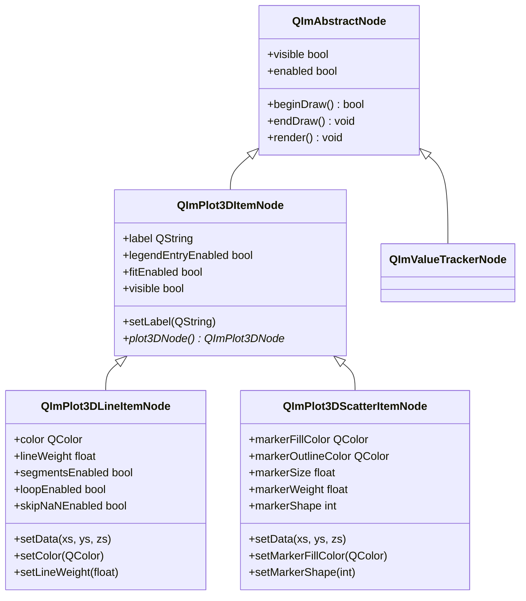
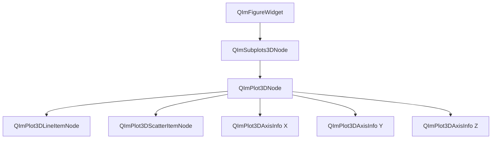

# 3D基本图表使用指南

QIm的3D基本图表包含 **3D曲线图**（`QImPlot3DLineItemNode`）和 **3D散点图**（`QImPlot3DScatterItemNode`）两种核心图表类型，分别用于可视化3D空间中的连续曲线和离散数据点。所有3D图表元素均以Qt节点对象的形式呈现，支持完整的Qt属性系统和信号槽交互。

## 主要功能特性

**特性**

- ✅ **3D曲线图**：支持3D空间中的连续曲线绘制，可自定义颜色、线宽和线条标志
- ✅ **3D散点图**：支持3D散点数据可视化，可配置标记形状、大小、填充颜色和描边样式
- ✅ **XYZ数据格式**：使用三组向量（xs, ys, zs）描述3D数据，与2D的XY格式不同
- ✅ **便捷方法**：`QImPlot3DNode` 提供 `addLine()` 和 `addScatter()` 快捷创建方法
- ✅ **线条标志**：支持线段模式、循环模式和跳过 NaN 模式
- ✅ **10种标记形状**：支持圆形、方形、菱形、方向箭头、十字、加号、星号等10种标记形状
- ✅ **交互控制**：支持鼠标旋转、平移、缩放操作，可通过属性启用/禁用
- ✅ **延迟颜色初始化**：标记颜色未设置时自动捕获 ImPlot3D 默认值

## 基本概念

### 3D与2D数据格式差异

3D图表与2D图表最核心的差异在于数据格式：

| 特性 | 2D图表 | 3D图表 |
|------|--------|--------|
| 数据维度 | XY（2组向量） | XYZ（3组向量） |
| 数据系列类 | `QImAbstractXYDataSeries` | `QImAbstractXYZDataSeries` |
| 坐标轴 | X1/Y1/X2/Y2/X3/Y3（6轴） | X/Y/Z（3轴） |
| setData 调用 | `setData(x, y)` | `setData(xs, ys, zs)` |

```cpp
// 2D数据格式：只需要X和Y两组向量
std::vector<double> x2d, y2d;
line2d->setData(x2d, y2d);

// 3D数据格式：需要X、Y、Z三组向量
std::vector<double> xs, ys, zs;
line3d->setData(xs, ys, zs);  // 三个维度
```

!!! info "说明"
    3D图表使用 `QImAbstractXYZDataSeries` 作为数据输入接口，其模板实现 `QImVectorXYZDataSeries` 支持零拷贝访问连续容器（`std::vector<double>`、`QVector<double>`）的原始数据指针。

### 组件定位

3D基本图表元素在对象树中的位置如下：

- **3D曲线图** 和 **3D散点图** 均以 `QImPlot3DNode` 作为父节点
- 创建元素时将 `QImPlot3DNode` 作为 parent 传入构造函数
- 元素自动成为父节点的子对象，通过 Qt 对象树管理生命周期

### 类继承关系



### 对象树结构



用文本表示：

```text
QImFigureWidget (绘图窗口)
└── QImSubplots3DNode (子图布局管理)
    └── QImPlot3DNode (3D绘图区域)
        ├── QImPlot3DLineItemNode (3D曲线)
        ├── QImPlot3DScatterItemNode (3D散点)
        ├── QImPlot3DAxisInfo (X轴)
        ├── QImPlot3DAxisInfo (Y轴)
        └── QImPlot3DAxisInfo (Z轴)
```

## 使用方法

3D基本图表的示例位于：`examples/qimfigure-test/functions/3d/` 和 `examples/readme-3d-example`

### 1. 创建3D绘图区域

在创建3D曲线或散点之前，需要先创建 `QImPlot3DNode` 作为绘图容器：

```cpp
// 创建图窗，设置3D子图布局
QIM::QImFigureWidget* figure = new QIM::QImFigureWidget(this);
figure->setSubplot3DGrid(1, 1);  // 1×1布局

// 创建3D绘图区域节点
QIM::QImPlot3DNode* plot = figure->createPlot3DNode();  // 自动成为figure的子节点
plot->setTitle("3D Plot");  // 设置标题

// 配置坐标轴
plot->xAxis()->setLabel("X");
plot->yAxis()->setLabel("Y");
plot->zAxis()->setLabel("Z");

// 设置等轴测视角
plot->setBoxRotation(35.264, 45.0);  // 仰角35.264°，方位角45°

// 节点树结构：MainWindow → figure → Subplots3D → plot → (子元素)
```

### 2. 3D曲线图（QImPlot3DLineItemNode）

3D曲线图用于在3D空间中绘制连续曲线，将一组有序的XYZ数据点用线段依次连接。

**基本使用**：

```cpp
// 来源：examples/qimfigure-test/functions/3d/Plot3DLineFunction.cpp

// 创建3D绘图区域
QIM::QImPlot3DNode* plot = figure->createPlot3DNode();
plot->setTitle("3D Spiral Line");
plot->xAxis()->setLabel("X");
plot->yAxis()->setLabel("Y");
plot->zAxis()->setLabel("Z");

// 设置等轴测视角
plot->setBoxRotation(35.264, 45.0);

// 生成3D螺旋数据
const int numPoints = 1000;
QVector<double> xs, ys, zs;
xs.reserve(numPoints);
ys.reserve(numPoints);
zs.reserve(numPoints);

for (int i = 0; i < numPoints; ++i) {
    double t = i * 0.01 * M_PI * 10;  // t 从0到10π
    xs.append(std::cos(t));
    ys.append(std::sin(t));
    zs.append(t / 10.0);
}

// 创建3D曲线元素，以plot为父节点
QIM::QImPlot3DLineItemNode* line = new QIM::QImPlot3DLineItemNode(plot);
line->setData(xs, ys, zs);      // 设置XYZ数据
line->setColor(QColor(0, 114, 189));  // 设置颜色
line->setLineWeight(2.0f);      // 设置线宽

// 节点树：figure → plot → line
```

**便捷方法**：

`QImPlot3DNode` 提供 `addLine()` 方法，一步完成创建和数据设置：

```cpp
// 来源：examples/readme-3d-example/main.cpp

QIM::QImPlot3DNode* plot = figure->createPlot3DNode();
plot->setTitle("3D Line");

std::vector<double> xs, ys, zs;
for (int i = 0; i < 200; ++i) {
    double t = i * 0.05;
    xs.push_back(std::cos(t));
    ys.push_back(std::sin(t));
    zs.push_back(t * 0.1);
}

// addLine() 自动创建QImPlot3DLineItemNode并设置数据
auto* line = plot->addLine(xs, ys, zs, "helix");
// line自动成为plot的子节点
```

**线条标志配置**：

3D曲线图支持三种线条标志，均使用肯定语义（设置 `true` 表示启用该功能）：

```cpp
// 线段模式：每两个连续点之间绘制独立线段
line->setSegmentsEnabled(true);

// 循环模式：将最后一个点与第一个点连接
line->setLoopEnabled(true);

// 跳过NaN：遇到NaN值时跳过该点，不绘制线段
line->setSkipNaNEnabled(true);
```

!!! info "语义说明"
    ImPlot3D 的 `ImPlot3DLineFlags` 使用肯定语义（`Segments`、`Loop`、`SkipNaN`），不是 `NoXxx` 否定形式。QIm 直接映射为 `segmentsEnabled`、`loopEnabled`、`skipNaNEnabled` 属性，语义一致，无需反转。

### 3. 3D散点图（QImPlot3DScatterItemNode）

3D散点图用于在3D空间中绘制离散数据点，每个数据点以标记（Marker）的形式呈现。

**基本使用**：

```cpp
// 来源：examples/qimfigure-test/functions/3d/Plot3DScatterFunction.cpp

// 创建3D绘图区域
QIM::QImPlot3DNode* plot = figure->createPlot3DNode();
plot->setTitle("3D Scatter");
plot->setLegendEnabled(true);

// 生成3D散点数据（螺旋模式+噪声）
const int numPoints = 1000;
std::vector<double> xData(numPoints);
std::vector<double> yData(numPoints);
std::vector<double> zData(numPoints);

for (int i = 0; i < numPoints; ++i) {
    double t = static_cast<double>(i) / numPoints * 6.0 * M_PI;
    double radius = 1.0 + noiseDist(gen) * 0.2;
    xData[i] = radius * std::cos(t) + noiseDist(gen) * 0.1;
    yData[i] = radius * std::sin(t) + noiseDist(gen) * 0.1;
    zData[i] = t / (6.0 * M_PI) * 2.0 - 1.0 + noiseDist(gen) * 0.1;
}

// 创建3D散点元素，以plot为父节点
QIM::QImPlot3DScatterItemNode* scatter = new QIM::QImPlot3DScatterItemNode(plot);
scatter->setData(xData, yData, zData);  // 设置XYZ数据
scatter->setMarkerSize(5.0f);           // 设置标记大小（像素）
scatter->setMarkerFillColor(QColor(217, 83, 25));  // 设置标记填充颜色

// 节点树：figure → plot → scatter
```

**便捷方法**：

`QImPlot3DNode` 提供 `addScatter()` 方法：

```cpp
// 来源：examples/readme-3d-example/main.cpp

QIM::QImPlot3DNode* plot = figure->createPlot3DNode();
plot->setTitle("3D Scatter");

std::vector<double> xs, ys, zs;
for (int i = 0; i < 200; ++i) {
    double t = i * 0.05;
    xs.push_back(std::cos(t) * 0.8);
    ys.push_back(std::sin(t) * 0.8);
    zs.push_back(std::sin(t * 0.5));
}

// addScatter() 自动创建QImPlot3DScatterItemNode并设置数据
auto* scatter = plot->addScatter(xs, ys, zs, "samples");
```

**标记样式配置**：

3D散点图支持丰富的标记样式自定义：

```cpp
// 设置标记填充颜色
scatter->setMarkerFillColor(QColor(217, 83, 25));

// 设置标记描边颜色
scatter->setMarkerOutlineColor(QColor(120, 45, 10));

// 设置标记大小（像素）
scatter->setMarkerSize(6.0f);

// 设置标记描边粗细（像素）
scatter->setMarkerWeight(1.5f);

// 设置标记形状
scatter->setMarkerShape(static_cast<int>(QIM::QImPlot3DMarkerShape::Diamond));
```

### 4. 标记形状（QImPlot3DMarkerShape）

3D散点图支持10种标记形状，通过 `QImPlot3DMarkerShape` 枚举值设置：

| 枚举值 | 数值 | 形状 | 说明 |
|--------|------|------|------|
| `None` | -1 | 无标记 | 不显示任何标记 |
| `Circle` | 0 | 圆形 | 默认标记形状，圆形点 |
| `Square` | 1 | 方形 | 正方形标记 |
| `Diamond` | 2 | 菱形 | 菱形/钻石形状标记 |
| `Up` | 3 | 向上三角形 | ▲ 向上箭头形状 |
| `Down` | 4 | 向下三角形 | ▼ 向下箭头形状 |
| `Left` | 5 | 向左三角形 | ◀ 向左箭头形状 |
| `Right` | 6 | 向右三角形 | ▶ 向右箭头形状 |
| `Cross` | 7 | 十字 | ✕ 交叉形状标记 |
| `Plus` | 8 | 加号 | ＋ 加号形状标记 |
| `Asterisk` | 9 | 星号 | ★ 星号形状标记 |

!!! info "自动标记循环"
    `QImPlot3DNode` 提供 `nextMarker()` 方法，可以获取下一个标记形状用于自动循环分配。每个新增的散点图元素可以自动获得不同的标记形状。

使用示例：

```cpp
// 设置标记形状为菱形
scatter->setMarkerShape(static_cast<int>(QIM::QImPlot3DMarkerShape::Diamond));

// 设置标记形状为星号
scatter->setMarkerShape(static_cast<int>(QIM::QImPlot3DMarkerShape::Asterisk));
```

!!! warning "注意事项"
    `markerShape` 属性类型为 `int`，需要将 `QImPlot3DMarkerShape` 枚举值通过 `static_cast<int>()` 转换后设置。

### 5. 交互操作

3D绘图区域支持鼠标交互操作，交互方式与 ImPlot3D 原生保持一致：

| 操作 | 鼠标动作 | 说明 |
|------|----------|------|
| 平移 | 左键拖拽 | 沿3D空间平移视图 |
| 旋转 | 右键拖拽 | 旋转3D视角 |
| 缩放 | 滚轮或中键拖拽 | 放大/缩小视图 |
| 重置旋转 | 右键双击 | 重置到初始旋转状态 |
| Z轴缩放 | Ctrl + 滚轮 | 沿Z轴方向缩放 |
| 屏幕平面平移 | Shift + 右键拖拽 | 沿屏幕平面平移 |

交互操作可以通过 `QImPlot3DNode` 的属性进行控制：

```cpp
// 启用旋转交互（默认启用）
plot->setRotateEnabled(true);

// 禁用平移交互
plot->setPanEnabled(false);

// 启用缩放交互（默认启用）
plot->setZoomEnabled(true);

// 禁用所有交互（只允许查看，不允许操作）
plot->setInputsEnabled(false);
```

!!! info "语义说明"
    交互属性使用否定→肯定语义转换：ImPlot3D 的 `NoRotate`、`NoPan`、`NoZoom`、`NoInputs` 标志被映射为 `rotateEnabled`、`panEnabled`、`zoomEnabled`、`inputsEnabled` 属性。设置 `true` 表示启用，设置 `false` 表示禁用，语义更直观。

## 属性表

### QImPlot3DLineItemNode 属性

| 属性名 | 类型 | 读取方法 | 写入方法 | 信号 | 说明 |
|--------|------|----------|----------|------|------|
| `color` | `QColor` | `color()` | `setColor(QColor)` | `colorChanged(QColor)` | 线条颜色 |
| `lineWeight` | `float` | `lineWeight()` | `setLineWeight(float)` | `lineWeightChanged(float)` | 线宽（像素） |
| `segmentsEnabled` | `bool` | `isSegmentsEnabled()` | `setSegmentsEnabled(bool)` | `lineFlagChanged()` | 线段模式启用 |
| `loopEnabled` | `bool` | `isLoopEnabled()` | `setLoopEnabled(bool)` | `lineFlagChanged()` | 循环模式启用 |
| `skipNaNEnabled` | `bool` | `isSkipNaNEnabled()` | `setSkipNaNEnabled(bool)` | `lineFlagChanged()` | 跳过NaN启用 |

继承自 `QImPlot3DItemNode` 的属性：

| 属性名 | 类型 | 读取方法 | 写入方法 | 信号 | 说明 |
|--------|------|----------|----------|------|------|
| `label` | `QString` | `label()` | `setLabel(QString)` | `labelChanged(QString)` | 图例标签 |
| `legendEntryEnabled` | `bool` | `isLegendEntryEnabled()` | `setLegendEntryEnabled(bool)` | `legendEntryEnabledChanged()` | 图例条目启用 |
| `fitEnabled` | `bool` | `isFitEnabled()` | `setFitEnabled(bool)` | `fitEnabledChanged()` | 自适应轴范围启用 |

### QImPlot3DScatterItemNode 属性

| 属性名 | 类型 | 读取方法 | 写入方法 | 信号 | 说明 |
|--------|------|----------|----------|------|------|
| `markerFillColor` | `QColor` | `markerFillColor()` | `setMarkerFillColor(QColor)` | `markerFillColorChanged(QColor)` | 标记填充颜色 |
| `markerOutlineColor` | `QColor` | `markerOutlineColor()` | `setMarkerOutlineColor(QColor)` | `markerOutlineColorChanged(QColor)` | 标记描边颜色 |
| `markerSize` | `float` | `markerSize()` | `setMarkerSize(float)` | `markerSizeChanged(float)` | 标记大小（像素） |
| `markerWeight` | `float` | `markerWeight()` | `setMarkerWeight(float)` | `markerWeightChanged(float)` | 标记描边粗细（像素） |
| `markerShape` | `int` | `markerShape()` | `setMarkerShape(int)` | `markerShapeChanged(int)` | 标记形状（QImPlot3DMarkerShape枚举值） |

继承自 `QImPlot3DItemNode` 的属性：

| 属性名 | 类型 | 读取方法 | 写入方法 | 信号 | 说明 |
|--------|------|----------|----------|------|------|
| `label` | `QString` | `label()` | `setLabel(QString)` | `labelChanged(QString)` | 图例标签 |
| `legendEntryEnabled` | `bool` | `isLegendEntryEnabled()` | `setLegendEntryEnabled(bool)` | `legendEntryEnabledChanged()` | 图例条目启用 |
| `fitEnabled` | `bool` | `isFitEnabled()` | `setFitEnabled(bool)` | `fitEnabledChanged()` | 自适应轴范围启用 |

!!! info "延迟颜色初始化"
    `markerFillColor` 和 `markerOutlineColor` 使用 `QImOptional3DColor` 进行延迟初始化。当用户未设置颜色时，系统会在首次渲染时自动捕获 ImPlot3D 的默认颜色。这意味着你可以不设置颜色，让 ImPlot3D 自动分配颜色循环序列中的下一个颜色。

### QImPlot3DNode 交互属性

| 属性名 | 类型 | 读取方法 | 写入方法 | 信号 | 说明 |
|--------|------|----------|----------|------|------|
| `rotateEnabled` | `bool` | `isRotateEnabled()` | `setRotateEnabled(bool)` | `plot3DFlagChanged()` | 旋转交互启用 |
| `panEnabled` | `bool` | `isPanEnabled()` | `setPanEnabled(bool)` | `plot3DFlagChanged()` | 平移交互启用 |
| `zoomEnabled` | `bool` | `isZoomEnabled()` | `setZoomEnabled(bool)` | `plot3DFlagChanged()` | 缩放交互启用 |
| `inputsEnabled` | `bool` | `isInputsEnabled()` | `setInputsEnabled(bool)` | `plot3DFlagChanged()` | 所有交互启用 |

## 信号槽连接

### QImPlot3DLineItemNode 信号

| 信号 | 参数 | 触发时机 |
|------|------|----------|
| `dataChanged()` | 无 | XYZ数据系列变更时 |
| `colorChanged(QColor)` | 新颜色值 | 线条颜色变更时 |
| `lineWeightChanged(float)` | 新线宽值 | 线宽变更时 |
| `lineFlagChanged()` | 无 | 任意线条标志（segments/loop/skipNaN）变更时 |

### QImPlot3DScatterItemNode 信号

| 信号 | 参数 | 触发时机 |
|------|------|----------|
| `dataChanged()` | 无 | XYZ数据系列变更时 |
| `markerFillColorChanged(QColor)` | 新填充颜色 | 标记填充颜色变更时 |
| `markerOutlineColorChanged(QColor)` | 新描边颜色 | 标记描边颜色变更时 |
| `markerSizeChanged(float)` | 新标记大小 | 标记大小变更时 |
| `markerWeightChanged(float)` | 新描边粗细 | 标记描边粗细变更时 |
| `markerShapeChanged(int)` | 新标记形状枚举值 | 标记形状变更时 |
| `scatterFlagChanged()` | 无 | 散点图标志变更时 |

### QImPlot3DItemNode 信号（基类）

| 信号 | 参数 | 触发时机 |
|------|------|----------|
| `labelChanged(QString)` | 新标签文本 | 标签变更时 |
| `legendEntryEnabledChanged()` | 无 | 图例条目启用状态变更时 |
| `fitEnabledChanged()` | 无 | 自适应启用状态变更时 |

### 信号槽连接示例

```cpp
// 连接3D曲线颜色变更信号
connect(line, &QIM::QImPlot3DLineItemNode::colorChanged,
        this, &MyClass::onLineColorChanged);

// 连接3D散点标记大小变更信号
connect(scatter, &QIM::QImPlot3DScatterItemNode::markerSizeChanged,
        this, &MyClass::onMarkerSizeChanged);

// 连接线条标志变更信号（segments/loop/skipNaN共用一个信号）
connect(line, &QIM::QImPlot3DLineItemNode::lineFlagChanged,
        this, &MyClass::onLineFlagChanged);

// 连接标记形状变更信号
connect(scatter, &QIM::QImPlot3DScatterItemNode::markerShapeChanged,
        [](int shape) {
    qDebug() << "Marker shape changed to:" << shape;
});
```

## 进阶使用

### 多曲线/多散点叠加

可以在同一个 `QImPlot3DNode` 中添加多条曲线或多个散点系列：

```cpp
QIM::QImPlot3DNode* plot = figure->createPlot3DNode();
plot->setTitle("Multiple Series");

// 添加第一条曲线（螺旋线）
auto* line1 = plot->addLine(xs1, ys1, zs1, "Line 1");

// 添加第二条曲线
auto* line2 = plot->addLine(xs2, ys2, zs2, "Line 2");
line2->setColor(QColor(217, 83, 25));  // 不同颜色区分

// 添加散点系列
auto* scatter = plot->addScatter(xs3, ys3, zs3, "Points");
scatter->setMarkerShape(static_cast<int>(QIM::QImPlot3DMarkerShape::Diamond));

// 节点树：plot → line1, line2, scatter（三个子元素叠加显示）
```

### 动态更新数据

3D图表支持动态更新数据，通过信号槽机制实现实时数据可视化：

```cpp
// 动态更新3D曲线数据
void MyClass::updateLineData() {
    std::vector<double> newXs, newYs, newZs;
    // 生成新数据...
    m_line3DNode->setData(newXs, newYs, newZs);  // 替换整个数据系列
    // dataChanged()信号自动发射
}

// 动态更新3D散点标记大小
void MyClass::onMarkerSizeChanged(float size) {
    m_scatter3DNode->setMarkerSize(size);
    // markerSizeChanged()信号自动发射
}
```

!!! warning "注意事项"
    `setData(xs, ys, zs)` 模板方法每次调用会创建新的 `QImVectorXYZDataSeries` 对象，替换旧的数据系列。如果需要频繁更新，请考虑使用 `setData(QImAbstractXYZDataSeries*)` 方法传入预先构建的数据系列对象，避免重复创建开销。

### 2×2布局示例

以下完整示例创建包含3D曲线图和3D散点图的2×2布局窗口：

```cpp
// 来源：examples/readme-3d-example/main.cpp

#include "QImFigureWidget.h"
#include "plot3d/QImPlot3DLineItemNode.h"
#include "plot3d/QImPlot3DNode.h"
#include "plot3d/QImPlot3DScatterItemNode.h"
#include <QApplication>
#include <QMainWindow>
#include <cmath>
#include <vector>

int main(int argc, char* argv[])
{
    QApplication app(argc, argv);

    QMainWindow window;
    window.setWindowTitle("3D Plot Example");

    QIM::QImFigureWidget* figure3D = new QIM::QImFigureWidget(&window);
    figure3D->setSubplot3DGrid(2, 2);  // 2×2布局
    figure3D->setRenderMode(QIM::QImWidget::RenderOnDemand);
    window.setCentralWidget(figure3D);

    // 子图1 - 3D曲线图（螺旋线）
    if (QIM::QImPlot3DNode* plot = figure3D->createPlot3DNode()) {
        plot->setTitle("3D Line");
        std::vector<double> xs, ys, zs;
        for (int i = 0; i < 200; ++i) {
            double t = i * 0.05;
            xs.push_back(std::cos(t));
            ys.push_back(std::sin(t));
            zs.push_back(t * 0.1);
        }
        auto* line = new QIM::QImPlot3DLineItemNode(plot);
        line->setLabel("helix");
        line->setData(xs, ys, zs);
        line->setColor(QColor(0, 114, 189));
        line->setLineWeight(2.0f);
    }

    // 子图2 - 3D散点图
    if (QIM::QImPlot3DNode* plot = figure3D->createPlot3DNode()) {
        plot->setTitle("3D Scatter");
        std::vector<double> xs, ys, zs;
        for (int i = 0; i < 200; ++i) {
            double t = i * 0.05;
            xs.push_back(std::cos(t) * 0.8);
            ys.push_back(std::sin(t) * 0.8);
            zs.push_back(std::sin(t * 0.5));
        }
        auto* scatter = new QIM::QImPlot3DScatterItemNode(plot);
        scatter->setLabel("samples");
        scatter->setData(xs, ys, zs);
        scatter->setMarkerSize(4.0f);
        scatter->setMarkerFillColor(QColor(217, 83, 25));
    }

    window.resize(1280, 900);
    window.show();
    return app.exec();
}
```

!!! warning "注意事项"
    - 3D图表使用 `setData(xs, ys, zs)` 设置数据，三组向量长度应一致，否则取最小长度作为有效数据点数
    - `markerShape` 属性类型为 `int`，设置 `QImPlot3DMarkerShape` 枚举值需要使用 `static_cast<int>()` 转换
    - 标记颜色未设置时将自动捕获 ImPlot3D 默认值，设置后将使用指定颜色
    - `segmentsEnabled`、`loopEnabled`、`skipNaNEnabled` 均使用肯定语义，设置 `true` 启用功能
    - 线宽（`lineWeight`）单位为像素，默认值由 ImPlot3D 样式系统决定

## 参考

- 3D绘图概述：[3D绘图模块](index.md)
- 核心概念：[渲染节点](../render-node.md)
- 基类说明：`QImPlot3DItemNode` 是所有3D图表元素的基类
- 数据系列：`QImAbstractXYZDataSeries` 和 `QImVectorXYZDataSeries` 提供3D数据管理
- 示例代码：`examples/qimfigure-test/functions/3d/Plot3DLineFunction.cpp`、`examples/qimfigure-test/functions/3d/Plot3DScatterFunction.cpp`、`examples/readme-3d-example`
- ImPlot3D 官方文档：<https://github.com/epezent/implot3d>