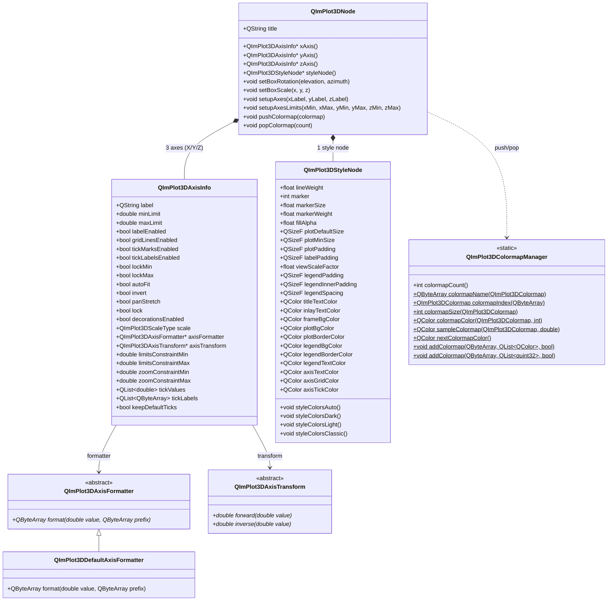

# 3D 配置指南（Axis + Style + Colormap）

QIm 的 3D 配置体系由三个核心组件构成：`QImPlot3DAxisInfo`（坐标轴）、`QImPlot3DStyleNode`（样式）和 `QImPlot3DColormapManager`（色彩映射），它们协同管理 3D 绘图的外观和行为。坐标轴控制 X/Y/Z 三轴的标签、范围与刻度；样式节点管理线条粗细、标记大小、填充透明度以及所有 `QImPlot3DCol` 颜色槽位；色彩映射系统提供 16 种内置色图、push/pop 栈式切换和自定义注册能力。

## 主要功能特性

**特性**

- ✅ **三轴配置**：独立的 X/Y/Z 轴属性系统，支持标签、范围、刻度、标志等配置
- ✅ **3D 视角控制**：通过 `setBoxRotation(elevation, azimuth)` 设置 3D 视角，支持四元数和动画
- ✅ **轴比例缩放**：通过 `setBoxScale(x, y, z)` 对各轴方向进行独立缩放
- ✅ **自定义格式化器**：继承 `QImPlot3DAxisFormatter` 实现刻度标签自定义格式
- ✅ **自定义轴变换**：继承 `QImPlot3DAxisTransform` 实现 forward/inverse 坐标变换
- ✅ **样式变量**：13 个 `QImPlot3DStyleVar` 变量，涵盖线宽、标记、填充、布局等
- ✅ **颜色槽位**：15 个 `QImPlot3DCol` 颜色属性，覆盖绘图区、图例、坐标轴等视觉元素
- ✅ **主题预设**：4 种内置主题（Auto/Dark/Light/Classic），一键切换
- ✅ **16 种内置色图**：Deep、Dark、Pastel、Viridis、Plasma 等科学可视化标准色图
- ✅ **色图栈管理**：push/pop 栈式色图切换，支持多绘图共享不同色图
- ✅ **自定义色图注册**：通过 `addColormap()` 注册自定义色图
- ✅ **色图采样**：`sampleColormap()` 在 0.0~1.0 范围内连续采样色图颜色
- ✅ **信号通知**：所有配置变更均提供信号通知，便于动态响应

## 组件关系总览



对象树结构如下：

```text
QImFigureWidget
└── QImSubplots3DNode
    └── QImPlot3DNode (3D 绘图区域)
        ├── QImPlot3DAxisInfo (X轴)
        ├── QImPlot3DAxisInfo (Y轴)
        ├── QImPlot3DAxisInfo (Z轴)
        ├── QImPlot3DStyleNode (样式)
        ├── QImPlot3DLineItemNode / ScatterItemNode / SurfaceItemNode ... (绘图元素)
```

## 坐标轴配置（QImPlot3DAxisInfo）

`QImPlot3DAxisInfo` 是 QIm 中用于管理 ImPlot3D 坐标轴配置的 Qt 封装类，提供类型安全的属性接口来配置 3D 坐标轴，无需直接操作底层 ImPlot3DAxisFlags 位掩码。

!!! info "与 2D 坐标轴的关系"
    3D 坐标轴（`QImPlot3DAxisInfo`）与 2D 坐标轴（`QImPlotAxisInfo`）共享大部分属性语义（标签、范围、标志、刻度类型等），详见 [2D 坐标轴配置指南](../plot2d/plot-axis.md)。本文档**仅补充 3D 特有的差异**，通用属性请参考 2D 文档。

### 3D 坐标轴差异要点

| 特性 | 2D（QImPlotAxisInfo） | 3D（QImPlot3DAxisInfo） |
|------|----------------------|------------------------|
| 坐标轴数量 | 最多 6 轴（X1/X2/X3, Y1/Y2/Y3） | 固定 3 轴（X1/Y1/Z1） |
| 访问方式 | `plot->x1Axis()` / `y1Axis()` | `plot->xAxis()` / `yAxis()` / `zAxis()` |
| 枚举类型 | `QImPlotAxisId` → `ImAxis` | `QImPlot3DAxisId` → `ImAxis3D` |
| 刻度类型 | Linear/Time/Log10/SymLog | Linear/Log10/SymLog（**无 Time**） |
| 视角控制 | 无 | `setBoxRotation(elevation, azimuth)` |
| 轴缩放 | 无 | `setBoxScale(x, y, z)` |
| 条件枚举 | `QImPlotCondition` | `QImPlot3DCondition` |
| 自定义格式化器 | 无 | `QImPlot3DAxisFormatter` |
| 自定义轴变换 | 无 | `QImPlot3DAxisTransform` |
| 标志差异 | 有 `menusEnabled`、`highlightEnabled`、`sideSwitchEnabled` 等 | 无这些标志 |
| 标志差异 | `noDecorations` | `decorationsEnabled`（肯定语义） |

### 访问坐标轴

3D 绘图节点提供 3 个坐标轴对象，通过以下方法访问：

```cpp
// 创建 3D 绘图节点
QIM::QImPlot3DNode* plot = figure->createPlot3DNode();

// 访问三个坐标轴
QIM::QImPlot3DAxisInfo* xAxis = plot->xAxis();   // X 轴
QIM::QImPlot3DAxisInfo* yAxis = plot->yAxis();   // Y 轴
QIM::QImPlot3DAxisInfo* zAxis = plot->zAxis();   // Z 轴

// 也可通过 axisId 访问
QIM::QImPlot3DAxisInfo* axis = plot->axisInfo(QIM::QImPlot3DAxisId::X1);
```

示例来自 `examples/qimfigure-test/functions/3d/Plot3DSubplotsFunction.cpp`：

```cpp
// 设置三个坐标轴的标签
m_plot3DNode1->xAxis()->setLabel("X");
m_plot3DNode1->yAxis()->setLabel("Y");
m_plot3DNode1->zAxis()->setLabel("Z");
```

### 便捷方法：setupAxes 和 setupAxesLimits

`QImPlot3DNode` 提供两个便捷方法，一次性配置所有三轴的标签和范围：

```cpp
// 一次性设置三个坐标轴标签和标志
plot->setupAxes("X轴", "Y轴", "Z轴");

// 一次性设置三个坐标轴的范围
plot->setupAxesLimits(-3.0, 3.0, -3.0, 3.0, -1.0, 1.0,
                       QIM::QImPlot3DCondition::Once);
```

!!! tip "便捷方法 vs 逐轴设置"
    `setupAxes()` 和 `setupAxesLimits()` 是便捷封装，内部调用每个轴的 `setLabel()` 和 `setLimits()`。如果需要对单个轴进行更细致的配置（如标志、格式化器等），应使用逐轴设置方式。

### 3D 视角控制：setBoxRotation

3D 绘图独有的视角控制功能，通过仰角（elevation）和方位角（azimuth）指定 3D 空间的观察角度。

```cpp
// 设置等轴测视图（经典 3D 视角）
plot->setBoxRotation(35.264, 45.0);  // elevation: 35.264°, azimuth: 45°

// 设置俯视图（从正上方往下看）
plot->setBoxRotation(90.0, 0.0);

// 设置正视图（从正前方看）
plot->setBoxRotation(0.0, 0.0);

// 设置四元数旋转（更精确的 3D 旋转控制）
QQuaternion rotation = QQuaternion::fromEulerAngles(35.264f, 45.0f, 0.0f);
plot->setBoxRotation(rotation);

// 启用动画过渡到新视角
plot->setBoxRotation(35.264, 45.0, true);  // animate = true

// 设置初始旋转角度（双击右键重置时恢复到此视角）
plot->setBoxInitialRotation(35.264, 45.0);
```

示例来自 `examples/qimfigure-test/functions/3d/Plot3DSurfaceFunction.cpp`：

```cpp
// 设置默认等轴测视图，提升 3D 可视化效果
m_plot3DNode->setBoxRotation(35.264, 45.0);  // 等轴测视图
```

!!! info "仰角与方位角"
    - **仰角（elevation）**：从水平面向上旋转的角度，正值向上仰视
    - **方位角（azimuth）**：绕垂直轴水平旋转的角度，正值顺时针旋转
    - **默认视角**：ImPlot3D 默认的等轴测视角为 elevation=35.264°、azimuth=45°

### 3D 轴缩放：setBoxScale

通过 `setBoxScale()` 对 X/Y/Z 三轴方向进行独立的缩放变换，用于调整 3D 空间中各维度的视觉比例。

```cpp
// 均匀缩放（所有轴等比例）
plot->setBoxScale(1.0, 1.0, 1.0);

// 拉伸 Z 轴（使高度方向更突出）
plot->setBoxScale(1.0, 1.0, 2.0);

// 压缩 X 轴（使宽度方向更紧凑）
plot->setBoxScale(0.5, 1.0, 1.0);
```

### 自定义坐标轴格式化器（QImPlot3DAxisFormatter）

3D 坐标轴支持自定义刻度标签格式化器，通过继承 `QImPlot3DAxisFormatter` 抽象基类实现。

`QImPlot3DAxisFormatter` 是纯虚接口（非 QObject），只需实现 `format()` 方法：

```cpp
// 自定义温度轴格式化器：将数值转为 "xx°C" 格式
class TemperatureFormatter : public QIM::QImPlot3DAxisFormatter
{
public:
    QByteArray format(double value, const QByteArray& prefix) override
    {
        // 使用 %g 风格格式化数值，附加温度单位
        QByteArray numStr = QByteArray::number(value, 'f', 1);
        return prefix + numStr + "°C";
    }
};

// 应用自定义格式化器
auto* formatter = new TemperatureFormatter;  // 注意：需保证生命周期
plot->zAxis()->setAxisFormatter(formatter);
```

内置的 `QImPlot3DDefaultAxisFormatter` 使用 `%g` 风格（`QByteArray::number(value, 'g', 6)`）进行标准数值格式化。

!!! warning "格式化器生命周期"
    `QImPlot3DAxisFormatter` 对象在绘图渲染期间必须保持存活。若格式化器在渲染之前被删除，将导致未定义行为。推荐将格式化器作为坐标轴的子对象或使用长期持有的智能指针管理。

### 自定义坐标轴变换（QImPlot3DAxisTransform）

3D 坐标轴支持自定义刻度变换，通过继承 `QImPlot3DAxisTransform` 实现 forward（数据→屏幕）和 inverse（屏幕→数据）双向变换。

`QImPlot3DAxisTransform` 是纯虚接口（非 QObject），需实现 `forward()` 和 `inverse()` 两个方法：

```cpp
// 自定义平方根变换：适用于数据范围大、小值密集的场景
class SquareRootTransform : public QIM::QImPlot3DAxisTransform
{
public:
    double forward(double value) override
    {
        // 数据值 → 屏幕坐标：取平方根
        return (value >= 0) ? std::sqrt(value) : -std::sqrt(-value);
    }

    double inverse(double value) override
    {
        // 屏幕坐标 → 数据值：取平方
        return value * value;
    }
};

// 应用自定义轴变换
auto* transform = new SquareRootTransform;  // 注意：需保证生命周期
plot->zAxis()->setAxisTransform(transform);
```

!!! warning "变换对象生命周期"
    `QImPlot3DAxisTransform` 的生命周期由外部管理 — `QImPlot3DAxisInfo` 不拥有变换对象。使用者需确保变换对象在绘图渲染期间保持存活。

### 坐标轴属性参考

以下为 `QImPlot3DAxisInfo` 的全部 Q_PROPERTY 列表。与 2D 坐标轴共有的属性语义一致，此处仅列出属性定义，详细说明请参考 [2D 坐标轴配置指南](../plot2d/plot-axis.md)。

**基础属性**

| 属性 | 类型 | 说明 |
|------|------|------|
| `label` | `QString` | 坐标轴标签文本 |
| `minLimit` | `double` | 坐标轴可见范围的最小值 |
| `maxLimit` | `double` | 坐标轴可见范围的最大值 |

**标志属性（否定→肯定语义：NoXxx → xxxEnabled）**

| 属性 | 类型 | 对应 ImPlot3D 标志 | 说明 |
|------|------|---------------------|------|
| `labelEnabled` | `bool` | `ImPlot3DAxisFlags_NoLabel` | `true`=标签可见 |
| `gridLinesEnabled` | `bool` | `ImPlot3DAxisFlags_NoGridLines` | `true`=网格线可见 |
| `tickMarksEnabled` | `bool` | `ImPlot3DAxisFlags_NoTickMarks` | `true`=刻度标记可见 |
| `tickLabelsEnabled` | `bool` | `ImPlot3DAxisFlags_NoTickLabels` | `true`=刻度标签可见 |

**标志属性（肯定→肯定语义：直接映射）**

| 属性 | 类型 | 对应 ImPlot3D 标志 | 说明 |
|------|------|---------------------|------|
| `lockMin` | `bool` | `ImPlot3DAxisFlags_LockMin` | 锁定最小值 |
| `lockMax` | `bool` | `ImPlot3DAxisFlags_LockMax` | 锁定最大值 |
| `autoFit` | `bool` | `ImPlot3DAxisFlags_AutoFit` | 自动适配范围 |
| `invert` | `bool` | `ImPlot3DAxisFlags_Invert` | 反转轴方向 |
| `panStretch` | `bool` | `ImPlot3DAxisFlags_PanStretch` | 平移拉伸 |

**组合标志属性**

| 属性 | 类型 | 说明 |
|------|------|------|
| `lock` | `bool` | 同时锁定最小值和最大值（`lockMin && lockMax`） |
| `decorationsEnabled` | `bool` | 是否显示所有装饰（对应 `NoDecorations` 的肯定语义） |

**刻度类型**

| 属性 | 类型 | 说明 |
|------|------|------|
| `scale` | `QImPlot3DScaleType` | 刻度类型（Linear/Log10/SymLog） |

**范围约束**

| 属性 | 类型 | 说明 |
|------|------|------|
| `limitsConstraintMin` | `double` | 范围最小约束值 |
| `limitsConstraintMax` | `double` | 范围最大约束值 |
| `zoomConstraintMin` | `double` | 缩放最小约束值 |
| `zoomConstraintMax` | `double` | 缩放最大约束值 |

**刻度配置**

| 属性 | 类型 | 说明 |
|------|------|------|
| `tickValues` | `QList<double>` | 自定义刻度值列表 |
| `tickLabels` | `QList<QByteArray>` | 自定义刻度标签列表（UTF8） |
| `keepDefaultTicks` | `bool` | 是否保留默认刻度 |

**高级属性**

| 属性 | 类型 | 说明 |
|------|------|------|
| `axisFormatter` | `QImPlot3DAxisFormatter*` | 自定义刻度标签格式化器 |
| `axisTransform` | `QImPlot3DAxisTransform*` | 自定义轴变换（通过 setter 访问） |

### 坐标轴信号

| 信号 | 参数 | 触发时机 |
|------|------|----------|
| `labelChanged(const QString& label)` | `QString` | 坐标轴标签文本改变时 |
| `limitsChanged(double min, double max)` | `double, double` | 坐标轴范围限制改变时 |
| `axisFlagChanged()` | 无 | 任意坐标轴标志属性变更时 |
| `scaleChanged()` | 无 | 坐标轴刻度类型变更时 |
| `limitsConstraintsChanged()` | 无 | 范围约束变更时 |
| `zoomConstraintsChanged()` | 无 | 缩放约束变更时 |
| `axisTransformChanged(QImPlot3DAxisTransform* transform)` | 指针 | 自定义轴变换变更时 |
| `axisFormatterChanged()` | 无 | 格式化器变更时 |
| `tickConfigChanged()` | 无 | 刻度配置（值、标签或保留默认）变更时 |

### 3D 枚举类型

#### QImPlot3DAxisId - 坐标轴标识

| 枚举值 | ImPlot3D 对应值 | 说明 |
|--------|-----------------|------|
| `X1` | `ImAxis3D_X` | X 轴 |
| `Y1` | `ImAxis3D_Y` | Y 轴 |
| `Z1` | `ImAxis3D_Z` | Z 轴 |
| `AxisCount` | `ImAxis3D_COUNT` | 坐标轴总数（3） |

#### QImPlot3DScaleType - 刻度类型

| 枚举值 | ImPlot3D 对应值 | 说明 |
|--------|-----------------|------|
| `Linear` | `ImPlot3DScale_Linear` | 线性刻度（默认） |
| `Log10` | `ImPlot3DScale_Log10` | 以 10 为底的对数刻度 |
| `SymLog` | `ImPlot3DScale_SymLog` | 对称对数刻度 |

!!! info "与 2D 刻度类型的差异"
    3D 刻度类型**不包含 `Time`**（时间刻度），这是 ImPlot3D 与 ImPlot 的显著差异。3D 空间中时间轴不适用。

#### QImPlot3DCondition - 条件类型

| 枚举值 | ImPlot3D 对应值 | 说明 |
|--------|-----------------|------|
| `None` | `ImPlot3DCond_None` | 不应用约束 |
| `Always` | `ImPlot3DCond_Always` | 每帧都应用约束 |
| `Once` | `ImPlot3DCond_Once` | 仅在首帧应用约束（默认） |

#### QImPlot3DMarkerShape - 标记形状

| 枚举值 | ImPlot3D 对应值 | 说明 |
|--------|-----------------|------|
| `None` | `ImPlot3DMarker_None` | 无标记 |
| `Circle` | `ImPlot3DMarker_Circle` | 圆形 |
| `Square` | `ImPlot3DMarker_Square` | 方形 |
| `Diamond` | `ImPlot3DMarker_Diamond` | 菱形 |
| `Up` | `ImPlot3DMarker_Up` | 上三角 |
| `Down` | `ImPlot3DMarker_Down` | 下三角 |
| `Left` | `ImPlot3DMarker_Left` | 左三角 |
| `Right` | `ImPlot3DMarker_Right` | 右三角 |
| `Cross` | `ImPlot3DMarker_Cross` | 十字叉 |
| `Plus` | `ImPlot3DMarker_Plus` | 加号 |
| `Asterisk` | `ImPlot3DMarker_Asterisk` | 星号 |

### 坐标轴使用示例

示例来自 `examples/qimfigure-test/functions/3d/Plot3DSubplotsFunction.cpp`：

```cpp
// 创建 3D 绘图节点，配置坐标轴
m_plot3DNode1 = figure->createPlot3DNode();
m_plot3DNode1->setTitle("3D Line");
m_plot3DNode1->xAxis()->setLabel("X");
m_plot3DNode1->yAxis()->setLabel("Y");
m_plot3DNode1->zAxis()->setLabel("Z");

// 隐藏坐标轴装饰（用于图例展示等特殊场景）
m_plot3DNode4->xAxis()->setDecorationsEnabled(false);
m_plot3DNode4->yAxis()->setDecorationsEnabled(false);
m_plot3DNode4->zAxis()->setDecorationsEnabled(false);
```

示例来自 `examples/qimfigure-test/functions/3d/Plot3DSurfaceFunction.cpp`：

```cpp
// 创建曲面图并设置等轴测视角
m_plot3DNode = figure->createPlot3DNode();
m_plot3DNode->xAxis()->setLabel(m_xLabel);
m_plot3DNode->yAxis()->setLabel(m_yLabel);
m_plot3DNode->zAxis()->setLabel(m_zLabel);
m_plot3DNode->setBoxRotation(35.264, 45.0);  // 设置等轴测视角
```

## 样式配置（QImPlot3DStyleNode）

`QImPlot3DStyleNode` 是 3D 绘图的持久样式节点，提供基于 Q_PROPERTY 的样式管理。它管理所有 `ImPlot3DStyle` 字段和 `ImPlot3DCol` 颜色值，以 Qt 属性形式暴露。每个 `QImPlot3DNode` 拥有一个 `QImPlot3DStyleNode`（作为子节点创建），通过 `plot->styleNode()` 访问。

样式节点在 `QImPlot3DNode::beginDraw()` 中作为一次性的 `GetStyle()` 赋值应用到子元素渲染之前，不向用户暴露 Push/Pop API。

### 访问样式节点

```cpp
// 获取 3D 绘图的样式节点
QIM::QImPlot3DStyleNode* style = plot->styleNode();

// 修改样式变量
style->setLineWeight(2.0f);    // 设置线条粗细为 2px
style->setMarkerSize(6.0f);    // 设置标记大小为 6px
style->setFillAlpha(0.5f);     // 设置填充透明度为 50%

// 修改颜色
style->setPlotBgColor(QColor(30, 30, 30));   // 深色绘图背景
style->setAxisGridColor(QColor(80, 80, 80));  // 网格线颜色
```

### 样式变量（QImPlot3DStyleVar）

以下为所有 `QImPlot3DStyleVar` 枚举值及其对应的 Q_PROPERTY：

| 枚举值 | ImPlot3D 对应值 | Q_PROPERTY | 类型 | 说明 |
|--------|-----------------|------------|------|------|
| `LineWeight` | `ImPlot3DStyleVar_LineWeight` | `lineWeight` | `float` | 线条粗细（像素） |
| `Marker` | `ImPlot3DStyleVar_Marker` | `marker` | `int` | 标记形状（`QImPlot3DMarkerShape` 值） |
| `MarkerSize` | `ImPlot3DStyleVar_MarkerSize` | `markerSize` | `float` | 标记大小（像素） |
| `MarkerWeight` | `ImPlot3DStyleVar_MarkerWeight` | `markerWeight` | `float` | 标记轮廓粗细（像素） |
| `FillAlpha` | `ImPlot3DStyleVar_FillAlpha` | `fillAlpha` | `float` | 填充透明度 |
| `PlotDefaultSize` | `ImPlot3DStyleVar_PlotDefaultSize` | `plotDefaultSize` | `QSizeF` | 默认绘图尺寸 |
| `PlotMinSize` | `ImPlot3DStyleVar_PlotMinSize` | `plotMinSize` | `QSizeF` | 最小绘图尺寸 |
| `PlotPadding` | `ImPlot3DStyleVar_PlotPadding` | `plotPadding` | `QSizeF` | 绘图内边距 |
| `LabelPadding` | `ImPlot3DStyleVar_LabelPadding` | `labelPadding` | `QSizeF` | 标签内边距 |
| `ViewScaleFactor` | `ImPlot3DStyleVar_ViewScaleFactor` | `viewScaleFactor` | `float` | 3D 视图缩放因子 |
| `LegendPadding` | `ImPlot3DStyleVar_LegendPadding` | `legendPadding` | `QSizeF` | 图例距绘图边缘的边距 |
| `LegendInnerPadding` | `ImPlot3DStyleVar_LegendInnerPadding` | `legendInnerPadding` | `QSizeF` | 图例内部边距 |
| `LegendSpacing` | `ImPlot3DStyleVar_LegendSpacing` | `legendSpacing` | `QSizeF` | 图例条目间距 |

!!! info "3D 特有样式变量"
    `ViewScaleFactor` 是 3D 绘图独有的样式变量，用于控制 3D 视图的缩放比例因子，2D 绘图中不存在此属性。

### 颜色槽位（QImPlot3DCol）

以下为所有 `QImPlot3DCol` 枚举值及其对应的 Q_PROPERTY：

| 枚举值 | ImPlot3D 对应值 | Q_PROPERTY | 说明 |
|--------|-----------------|------------|------|
| `Line` | `ImPlot3DCol_Line` | — | 线条颜色（由绘图元素直接设置） |
| `Fill` | `ImPlot3DCol_Fill` | — | 填充颜色（由绘图元素直接设置） |
| `MarkerOutline` | `ImPlot3DCol_MarkerOutline` | — | 标记轮廓颜色（由绘图元素直接设置） |
| `MarkerFill` | `ImPlot3DCol_MarkerFill` | — | 标记填充颜色（由绘图元素直接设置） |
| `TitleText` | `ImPlot3DCol_TitleText` | `titleTextColor` | 标题文本颜色 |
| `InlayText` | `ImPlot3DCol_InlayText` | `inlayTextColor` | 内嵌文本颜色 |
| `FrameBg` | `ImPlot3DCol_FrameBg` | `frameBgColor` | 帧背景颜色 |
| `PlotBg` | `ImPlot3DCol_PlotBg` | `plotBgColor` | 绘图区域背景颜色 |
| `PlotBorder` | `ImPlot3DCol_PlotBorder` | `plotBorderColor` | 绘图区域边框颜色 |
| `LegendBg` | `ImPlot3DCol_LegendBg` | `legendBgColor` | 图例背景颜色 |
| `LegendBorder` | `ImPlot3DCol_LegendBorder` | `legendBorderColor` | 图例边框颜色 |
| `LegendText` | `ImPlot3DCol_LegendText` | `legendTextColor` | 图例文本颜色 |
| `AxisText` | `ImPlot3DCol_AxisText` | `axisTextColor` | 坐标轴文本颜色 |
| `AxisGrid` | `ImPlot3DCol_AxisGrid` | `axisGridColor` | 坐标轴网格颜色 |
| `AxisTick` | `ImPlot3DCol_AxisTick` | `axisTickColor` | 坐标轴刻度颜色 |
| `COUNT` | `ImPlot3DCol_COUNT` | — | 颜色槽位总数（15） |

!!! info "元素颜色 vs 样式颜色"
    `Line`、`Fill`、`MarkerOutline`、`MarkerFill` 这 4 个颜色槽位由具体绘图元素（如 `QImPlot3DLineItemNode::setColor()`）直接设置，不在 `QImPlot3DStyleNode` 的 Q_PROPERTY 中暴露。其余 11 个颜色槽位作为样式属性暴露，控制绘图区域整体外观。

### 样式节点属性参考

**样式变量属性**

| 属性 | 类型 | 说明 |
|------|------|------|
| `lineWeight` | `float` | 线条粗细（像素），默认约 1px |
| `marker` | `int` | 标记形状（`QImPlot3DMarkerShape` 枚举值） |
| `markerSize` | `float` | 标记大小（像素） |
| `markerWeight` | `float` | 标记轮廓粗细（像素） |
| `fillAlpha` | `float` | 填充透明度，范围 0.0~1.0 |
| `plotDefaultSize` | `QSizeF` | 默认绘图尺寸 |
| `plotMinSize` | `QSizeF` | 最小绘图尺寸 |
| `plotPadding` | `QSizeF` | 绘图内边距 |
| `labelPadding` | `QSizeF` | 标签内边距 |
| `viewScaleFactor` | `float` | 3D 视图缩放因子 |
| `legendPadding` | `QSizeF` | 图例距绘图边缘的边距 |
| `legendInnerPadding` | `QSizeF` | 图例内部边距 |
| `legendSpacing` | `QSizeF` | 图例条目间距 |

**绘图区域颜色**

| 属性 | 类型 | 说明 |
|------|------|------|
| `titleTextColor` | `QColor` | 标题文本颜色 |
| `inlayTextColor` | `QColor` | 内嵌文本颜色 |
| `frameBgColor` | `QColor` | 帧背景颜色 |
| `plotBgColor` | `QColor` | 绘图区域背景颜色 |
| `plotBorderColor` | `QColor` | 绘图区域边框颜色 |

**图例颜色**

| 属性 | 类型 | 说明 |
|------|------|------|
| `legendBgColor` | `QColor` | 图例背景颜色 |
| `legendBorderColor` | `QColor` | 图例边框颜色 |
| `legendTextColor` | `QColor` | 图例文本颜色 |

**坐标轴颜色**

| 属性 | 类型 | 说明 |
|------|------|------|
| `axisTextColor` | `QColor` | 坐标轴文本颜色 |
| `axisGridColor` | `QColor` | 坐标轴网格颜色 |
| `axisTickColor` | `QColor` | 坐标轴刻度颜色 |

### 主题预设

`QImPlot3DStyleNode` 提供 4 种内置主题预设方法，一键切换整体外观：

```cpp
// 应用 Auto 主题（颜色从当前 ImGui 样式派生）
plot->styleNode()->styleColorsAuto();

// 应用 Dark 主题（深色背景）
plot->styleNode()->styleColorsDark();

// 应用 Light 主题（浅色背景）
plot->styleNode()->styleColorsLight();

// 应用 Classic 主题（经典样式）
plot->styleNode()->styleColorsClassic();
```

!!! tip "主题使用建议"
    主题预设方法会覆盖所有颜色属性。如果需要在预设主题基础上微调个别颜色，应先调用预设方法，再单独修改特定颜色属性：

    ```cpp
    // 先设置 Dark 主题，再微调网格线颜色
    plot->styleNode()->styleColorsDark();
    plot->styleNode()->setAxisGridColor(QColor(100, 100, 100));  // 浅灰色网格
    ```

### 样式节点信号

| 信号 | 参数 | 触发时机 |
|------|------|----------|
| `styleChanged()` | 无 | 任意样式属性（变量或颜色）变更时 |

!!! info "信号聚合说明"
    `styleChanged()` 是聚合信号，不区分具体哪个样式属性变更。所有样式变量和颜色属性的变更都会触发此信号。如需判断具体变更属性，应在信号槽中查询相关属性值。

## 色彩映射（Colormap）

3D 绘图的色彩映射系统由 `QImPlot3DColormapManager`（静态工具类）和 `QImPlot3DNode`（push/pop 栈操作）两部分构成。色彩映射主要用于 Surface 等绘图元素，根据 Z 值（或其他数据维度）映射颜色。

### 内置色图（QImPlot3DColormap）

QIm 提供 16 种内置色图，涵盖科学可视化常用色图方案：

| 枚举值 | ImPlot3D 对应值 | 说明 |
|--------|-----------------|------|
| `Deep` | `ImPlot3DColormap_Deep` | 深色渐变（默认色图） |
| `Dark` | `ImPlot3DColormap_Dark` | 暗色渐变 |
| `Pastel` | `ImPlot3DColormap_Pastel` | 柔和渐变 |
| `Paired` | `ImPlot3DColormap_Paired` | 配对色（定性色图） |
| `Viridis` | `ImPlot3DColormap_Viridis` | Viridis 渐变（感知均匀，科学可视化推荐） |
| `Plasma` | `ImPlot3DColormap_Plasma` | Plasma 渐变（感知均匀） |
| `Hot` | `ImPlot3DColormap_Hot` | 热力图渐变（黑→红→黄→白） |
| `Cool` | `ImPlot3DColormap_Cool` | 冷色渐变 |
| `Pink` | `ImPlot3DColormap_Pink` | 粉色渐变 |
| `Jet` | `ImPlot3DColormap_Jet` | Jet 渐变（经典彩虹色图） |
| `Twilight` | `ImPlot3DColormap_Twilight` | Twilight 渐变（循环色图） |
| `RdBu` | `ImPlot3DColormap_RdBu` | 红-蓝双向渐变（发散色图） |
| `BrBG` | `ImPlot3DColormap_BrBG` | 棕-蓝绿双向渐变（发散色图） |
| `PiYG` | `ImPlot3DColormap_PiYG` | 粉-黄绿双向渐变（发散色图） |
| `Spectral` | `ImPlot3DColormap_Spectral` | 光谱渐变（发散色图） |
| `Greys` | `ImPlot3DColormap_Greys` | 灰度渐变 |

### 色图栈管理：push/pop

3D 绘图节点提供 push/pop 栈式色图切换。Push 将色图压入栈顶，Pop 从栈中弹出色图。栈操作在 `beginDraw()/endDraw()` 中自动映射到 ImPlot3D 的 `PushColormap/PopColormap`。

```cpp
// 将 Viridis 色图压入栈（当前绘图使用 Viridis）
plot->pushColormap(QIM::QImPlot3DColormap::Viridis);

// 也可通过名称压入色图
plot->pushColormap("Viridis");

// 绘制使用 Viridis 色图的曲面
// ...

// 弹出 1 个色图（恢复之前的色图）
plot->popColormap(1);

// 弹出多个色图（批量恢复）
plot->popColormap(3);
```

!!! info "push/pop 的典型场景"
    push/pop 栈机制主要用于**多绘图共享同一 ImPlot3D 上下文**的场景。当需要在同一绘图区域内交替使用不同色图时，通过 push/pop 切换色图而不会影响其他绘图元素的色图设置。对于单一绘图元素（如 Surface），通常直接通过 `setColormap()` 设置，无需 push/pop。

### 色图管理器（QImPlot3DColormapManager）

`QImPlot3DColormapManager` 是纯静态工具类（非 QObject），提供色图查询和注册功能。

#### 查询方法

```cpp
// 获取可用色图数量
int count = QIM::QImPlot3DColormapManager::colormapCount();

// 获取色图名称
QByteArray name = QIM::QImPlot3DColormapManager::colormapName(
    QIM::QImPlot3DColormap::Viridis);  // 返回 "Viridis"

// 通过名称查找色图枚举值
QIM::QImPlot3DColormap cmap = QIM::QImPlot3DColormapManager::colormapIndex(
    QByteArray("Viridis"));  // 返回 QImPlot3DColormap::Viridis

// 获取色图中颜色数量
int size = QIM::QImPlot3DColormapManager::colormapSize(
    QIM::QImPlot3DColormap::Viridis);  // 返回色图中的颜色数

// 获取色图中指定索引的颜色
QColor color = QIM::QImPlot3DColormapManager::colormapColor(
    QIM::QImPlot3DColormap::Viridis, 0);  // 获取 Viridis 的第一个颜色

// 在 0.0~1.0 范围内采样色图
QColor sampled = QIM::QImPlot3DColormapManager::sampleColormap(
    QIM::QImPlot3DColormap::Viridis, 0.5);  // Viridis 的中间颜色
```

#### 自动色图颜色

```cpp
// 获取下一个自动分配的色图颜色（用于多系列绘图自动配色）
QColor autoColor = QIM::QImPlot3DColormapManager::nextColormapColor();
```

#### 自定义色图注册

```cpp
// 通过 QColor 列表注册自定义色图
QList<QColor> colors = {
    QColor(0, 0, 0),      // 黑
    QColor(255, 0, 0),    // 红
    QColor(255, 255, 0),  // 黄
    QColor(255, 255, 255) // 白
};
QIM::QImPlot3DColormapManager::addColormap(
    QByteArray("CustomHeat"), colors, false);  // qualitative = false 表示连续色图

// 通过 quint32 列表注册自定义色图（RGBA 打包格式）
QList<quint32> packedColors = {0xFF000000, 0xFFFF0000, 0xFFFF00FF, 0xFFFFFFFF};
QIM::QImPlot3DColormapManager::addColormap(
    QByteArray("CustomPacked"), packedColors, false);
```

!!! info "定性色图 vs 连续色图"
    `addColormap()` 的 `qualitative` 参数控制色图类型：
    - `qualitative = false`（默认）：**连续色图**，适用于数值渐变映射（如 Surface 的 Z 值）
    - `qualitative = true`：**定性色图**，适用于离散类别区分（如多系列自动配色）

### 色图在 Surface 中的应用

示例来自 `examples/qimfigure-test/functions/3d/Plot3DSurfaceFunction.cpp`：

```cpp
// 创建曲面图，启用色彩映射
m_surface3DNode = new QIM::QImPlot3DSurfaceItemNode(m_plot3DNode);
m_surface3DNode->setData(xs, ys, zs, rows, cols);
m_surface3DNode->setColormapEnabled(true);  // 启用色彩映射
if (m_colormapEnabled) {
    m_surface3DNode->setColormap(ImPlot3DColormap_Viridis);  // 使用 Viridis 色图
}
```

!!! warning "色图枚举命名空间"
    在 Surface 等绘图元素中设置色图时，可直接使用 ImPlot3D 原生枚举值（如 `ImPlot3DColormap_Viridis`），也可使用 QIm 封装枚举（如 `QIM::QImPlot3DColormap::Viridis`）。两者对应的底层值一致。

### 色图管理器完整方法列表

| 方法 | 返回类型 | 说明 |
|------|----------|------|
| `colormapCount()` | `int` | 返回可用色图总数（含内置和自定义） |
| `colormapName(QImPlot3DColormap)` | `QByteArray` | 返回指定色图的名称 |
| `colormapIndex(const QByteArray&)` | `QImPlot3DColormap` | 通过名称查找色图枚举值 |
| `colormapSize(QImPlot3DColormap)` | `int` | 返回指定色图中的颜色数量 |
| `colormapColor(QImPlot3DColormap, int)` | `QColor` | 返回色图中指定索引的颜色 |
| `sampleColormap(QImPlot3DColormap, double)` | `QColor` | 在 0.0~1.0 范围采样色图颜色 |
| `nextColormapColor()` | `QColor` | 返回下一个自动配色颜色 |
| `addColormap(const QByteArray&, const QList<QColor>&, bool)` | `void` | 注册 QColor 列表色图 |
| `addColormap(const QByteArray&, const QList<quint32>&, bool)` | `void` | 注册 quint32 列表色图 |

## 综合配置示例

以下示例展示了坐标轴、样式和色彩映射的综合配置：

```cpp
#include "QImFigureWidget.h"
#include "plot3d/QImPlot3DNode.h"
#include "plot3d/QImPlot3DAxisInfo.h"
#include "plot3d/QImPlot3DSurfaceItemNode.h"
#include "plot3d/QImPlot3DColormapManager.h"

// 创建绘图窗口
QIM::QImFigureWidget* figure = new QIM::QImFigureWidget(this);

// 创建 3D 绘图节点
QIM::QImPlot3DNode* plot = figure->createPlot3DNode();

// === 坐标轴配置 ===
plot->xAxis()->setLabel("经度 (°)");
plot->yAxis()->setLabel("纬度 (°)");
plot->zAxis()->setLabel("高程 (m)");
plot->xAxis()->setLimits(-180.0, 180.0, QIM::QImPlot3DCondition::Always);
plot->yAxis()->setLimits(-90.0, 90.0, QIM::QImPlot3DCondition::Always);
plot->xAxis()->setGridLinesEnabled(true);
plot->yAxis()->setGridLinesEnabled(true);
plot->zAxis()->setGridLinesEnabled(true);

// === 3D 视角控制 ===
plot->setBoxRotation(30.0, 45.0);  // 自定义视角
plot->setBoxScale(1.0, 1.0, 1.5);  // Z 轴拉伸 1.5 倍

// === 样式配置 ===
QIM::QImPlot3DStyleNode* style = plot->styleNode();
style->styleColorsDark();                      // 应用暗色主题
style->setLineWeight(1.5f);                    // 线条粗细
style->setMarkerSize(4.0f);                    // 标记大小
style->setFillAlpha(0.7f);                     // 填充透明度
style->setPlotBgColor(QColor(20, 20, 30));     // 自定义绘图背景
style->setAxisGridColor(QColor(60, 60, 80));   // 自定义网格颜色

// === 色彩映射配置 ===
plot->pushColormap(QIM::QImPlot3DColormap::Viridis);  // 压入 Viridis 色图

// 查询色图信息
int cmapSize = QIM::QImPlot3DColormapManager::colormapSize(
    QIM::QImPlot3DColormap::Viridis);
QColor midColor = QIM::QImPlot3DColormapManager::sampleColormap(
    QIM::QImPlot3DColormap::Viridis, 0.5);

// 创建曲面图（使用当前色图）
auto* surface = new QIM::QImPlot3DSurfaceItemNode(plot);
surface->setData(xs, ys, zs, rows, cols);
surface->setColormapEnabled(true);
surface->setColormap(ImPlot3DColormap_Viridis);

plot->popColormap(1);  // 恢复之前色图
```

!!! warning "综合注意事项"
    - **属性变更延迟生效**：所有属性变更仅在本地存储，实际绘图外观更新需在重新渲染时将配置应用到 ImPlot3D 上下文后生效。
    - **范围验证**：`setLimits()` 不验证 `min < max`；无效范围可能导致渲染问题。
    - **对数刻度限制**：切换到 `Log10` 刻度时，数据必须包含正值。
    - **格式化器/变换生命周期**：自定义格式化器和变换对象在渲染期间必须存活，否则导致未定义行为。
    - **push/pop 配对**：确保 `pushColormap()` 和 `popColormap()` 配对使用，栈不平衡可能导致渲染异常。
    - **3D 视角参数**：`setBoxRotation()` 的仰角和方位角单位为度（°），不是弧度。

## 参考

- 2D 坐标轴配置：[QImPlotAxisInfo 坐标轴配置指南](../plot2d/plot-axis.md)
- 3D 绘图概述：[3D 绘图模块](index.md)
- 渲染节点概念：[渲染节点](../render-node.md)
- 示例代码：`examples/qimfigure-test/functions/3d/Plot3DSurfaceFunction.cpp`、`examples/qimfigure-test/functions/3d/Plot3DSubplotsFunction.cpp`
- API 参考：`src/core/plot3d/QImPlot3DAxisInfo.h`、`src/core/plot3d/QImPlot3DStyleNode.h`、`src/core/plot3d/QImPlot3DColormapManager.h`、`src/core/plot3d/QImPlot3DNode.h`
- ImPlot3D 官方文档：<https://github.com/epezent/implot3d>