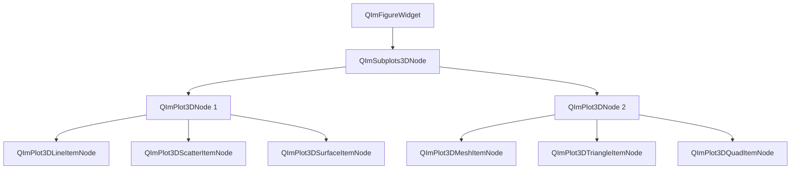
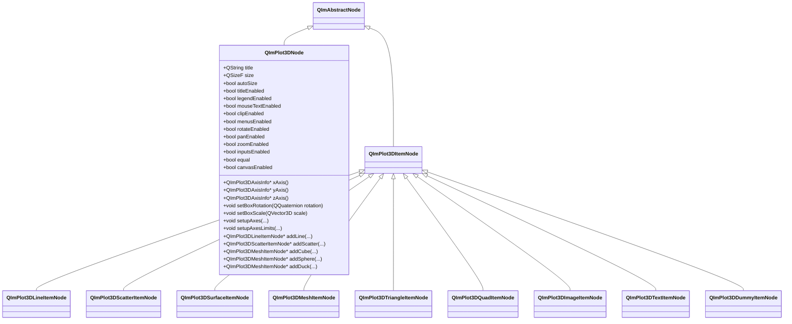

# 3D绘图模块

QIm的3D绘图模块基于 `ImPlot3D` 封装，提供完整的3D数据可视化功能，包括3D曲线图、散点图、曲面图、网格图等常见3D图表类型。所有3D绘图组件均以Qt节点对象的形式呈现，支持信号槽交互和属性系统配置，为Qt开发者提供熟悉的编程范式构建高性能3D可视化应用。

## 主要功能特性

**特性**

- ✅ **Figure Widget 集成**：3D绘图可直接嵌入 `QImFigureWidget`，与2D绘图共享同一窗口
- ✅ **3D曲线图**：支持3D空间中的曲线绘制，可自定义线宽、颜色和样式
- ✅ **3D散点图**：支持3D散点数据可视化，可配置标记大小、填充颜色和轮廓颜色
- ✅ **3D曲面图**：支持曲面数据可视化，内置颜色映射支持，可切换填充/线框模式
- ✅ **3D网格图**：支持三角形网格和四边形网格渲染，内置立方体、球体、鸭子等预设模型
- ✅ **3D标注元素**：支持3D图像纹理（Image）、3D文本标签（Text）和图例虚拟项（Dummy）
- ✅ **3D坐标轴配置**：独立的X/Y/Z轴属性系统，支持标签、范围、刻度、自定义格式化器和轴变换等配置
- ✅ **交互操作**：支持鼠标旋转、平移、缩放等3D交互操作
- ✅ **颜色映射**：内置多种颜色映射方案，支持自定义颜色映射栈

## 模块架构

3D绘图模块的对象树结构如下：



3D绘图模块的类继承关系如下：



## 文档导航

| 文档 | 说明 |
|------|------|
| [基本图表](basic-charts.md) | 3D曲线图、3D散点图的使用方法 |
| [曲面图表](surface-charts.md) | 3D曲面图、三角形图、四边形图的详细配置 |
| [网格图表](mesh.md) | 3D网格图的使用方法和预设模型 |
| [标注元素](annotations.md) | 3D图像、文本、占位符等标注元素 |
| [配置指南](configuration.md) | 3D坐标轴配置、样式设置和颜色映射系统 |

## 快速示例

下面的示例创建一个 `2×2` 的3D图形窗口，并分别绘制3D曲线图、3D散点图、3D曲面图和3D线框图：

```cpp
#include "QImFigureWidget.h"
#include "plot3d/QImPlot3DLineItemNode.h"
#include "plot3d/QImPlot3DNode.h"
#include "plot3d/QImPlot3DScatterItemNode.h"
#include "plot3d/QImPlot3DSurfaceItemNode.h"

#include "implot3d.h"

#include <QApplication>
#include <QMainWindow>
#include <cmath>
#include <vector>

int main(int argc, char* argv[])
{
    QApplication app(argc, argv);

    QMainWindow window;
    window.setWindowTitle("3D Plot Example");

    QIM::QImFigureWidget* figure3D = new QIM::QImFigureWidget(&window);
    figure3D->setSubplot3DGrid(2, 2);
    figure3D->setRenderMode(QIM::QImWidget::RenderOnDemand);
    window.setCentralWidget(figure3D);

    // 创建子图1 - 3D曲线图（螺旋线）
    if (QIM::QImPlot3DNode* plot = figure3D->createPlot3DNode()) {
        plot->setTitle("3D Line");
        std::vector<double> xs, ys, zs;
        for (int i = 0; i < 200; ++i) {
            double t = i * 0.05;
            xs.push_back(std::cos(t));
            ys.push_back(std::sin(t));
            zs.push_back(t * 0.1);
        }
        auto* line = new QIM::QImPlot3DLineItemNode(plot);
        line->setLabel("helix");
        line->setData(xs, ys, zs);
        line->setColor(QColor(0, 114, 189));
        line->setLineWeight(2.0f);
    }

    // 创建子图2 - 3D散点图
    if (QIM::QImPlot3DNode* plot = figure3D->createPlot3DNode()) {
        plot->setTitle("3D Scatter");
        std::vector<double> xs, ys, zs;
        for (int i = 0; i < 200; ++i) {
            double t = i * 0.05;
            xs.push_back(std::cos(t) * 0.8);
            ys.push_back(std::sin(t) * 0.8);
            zs.push_back(std::sin(t * 0.5));
        }
        auto* scatter = new QIM::QImPlot3DScatterItemNode(plot);
        scatter->setLabel("samples");
        scatter->setData(xs, ys, zs);
        scatter->setMarkerSize(4.0f);
        scatter->setMarkerFillColor(QColor(217, 83, 25));
    }

    // 创建子图3 - 3D曲面图（填充模式）
    if (QIM::QImPlot3DNode* plot = figure3D->createPlot3DNode()) {
        plot->setTitle("3D Surface");
        constexpr int rows = 40;
        constexpr int cols = 40;
        std::vector<double> xs(rows * cols);
        std::vector<double> ys(rows * cols);
        std::vector<double> zs(rows * cols);
        for (int r = 0; r < rows; ++r) {
            for (int c = 0; c < cols; ++c) {
                int index = r * cols + c;
                double x = -3.0 + 6.0 * c / (cols - 1);
                double y = -3.0 + 6.0 * r / (rows - 1);
                xs[index] = x;
                ys[index] = y;
                zs[index] = std::sin(x) * std::cos(y);
            }
        }
        auto* surface = new QIM::QImPlot3DSurfaceItemNode(plot);
        surface->setLabel("surface");
        surface->setData(xs, ys, zs, rows, cols);
        surface->setColormapEnabled(true);
        surface->setColormap(ImPlot3DColormap_Viridis);
    }

    // 创建子图4 - 3D曲面图（线框模式）
    if (QIM::QImPlot3DNode* plot = figure3D->createPlot3DNode()) {
        plot->setTitle("3D Wireframe");
        constexpr int rows = 40;
        constexpr int cols = 40;
        std::vector<double> xs(rows * cols);
        std::vector<double> ys(rows * cols);
        std::vector<double> zs(rows * cols);
        for (int r = 0; r < rows; ++r) {
            for (int c = 0; c < cols; ++c) {
                int index = r * cols + c;
                double x = -3.0 + 6.0 * c / (cols - 1);
                double y = -3.0 + 6.0 * r / (rows - 1);
                xs[index] = x;
                ys[index] = y;
                zs[index] = std::sin(x) * std::cos(y);
            }
        }
        auto* wireframe = new QIM::QImPlot3DSurfaceItemNode(plot);
        wireframe->setLabel("wireframe");
        wireframe->setData(xs, ys, zs, rows, cols);
        wireframe->setColormapEnabled(true);
        wireframe->setColormap(ImPlot3DColormap_Viridis);
        wireframe->setFillVisible(false);
        wireframe->setMarkersVisible(false);
        wireframe->setLineWidth(1.2f);
    }

    window.resize(1280, 900);
    window.show();
    return app.exec();
}
```

## 交互方式

3D绘图模块的交互方式与 `ImPlot3D` 原生保持一致，提供直观的鼠标操作：

- **左键拖拽**：平移视图
- **右键拖拽**：旋转视角
- **滚轮或中键拖拽**：缩放视图
- **右键双击**：重置旋转到初始状态
- **Ctrl + 滚轮**：沿Z轴缩放
- **Shift + 右键拖拽**：沿屏幕平面平移

这些交互操作可以通过 `QImPlot3DNode` 的属性进行控制：
- `rotateEnabled`：启用/禁用旋转交互
- `panEnabled`：启用/禁用平移交互  
- `zoomEnabled`：启用/禁用缩放交互

## 参考

- 核心概念：[渲染节点](../render-node.md)、[对象树](../object-tree.md)
- 2D绘图模块：[2D绘图概述](../plot2d/index.md)
- 示例代码：`examples/readme-3d-example`、`examples/qimfigure-mixed-test`
- ImPlot3D 官方文档：<https://github.com/epezent/implot3d>