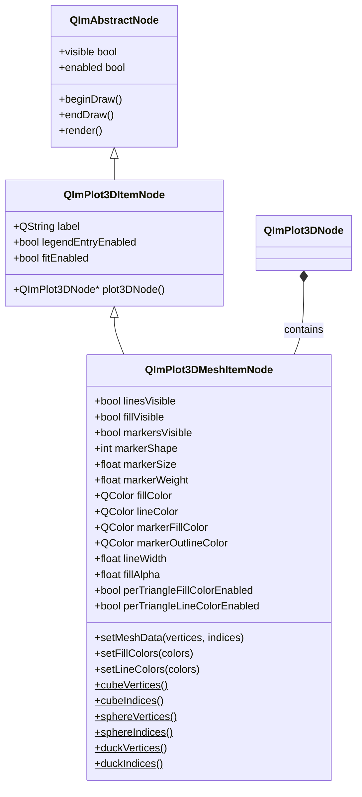
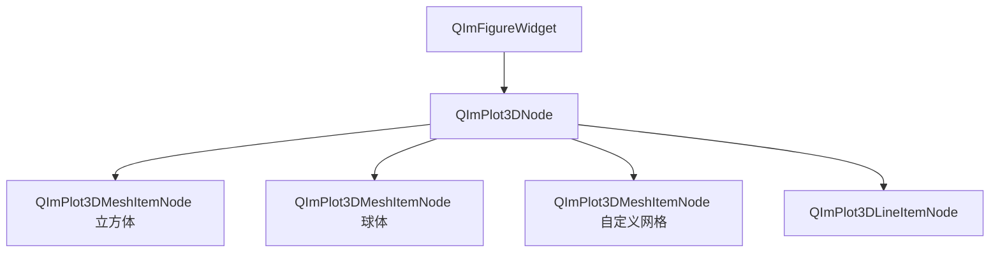

# 3D 网格图使用指南

`QImPlot3DMeshItemNode` 是 QIm 3D 绘图模块中最灵活的绘图元素，通过顶点和三角面索引渲染三维网格。它既支持自定义顶点/索引数据的自由建模，也内置了立方体、球体、鸭子等预设模型的快捷创建方法，同时还提供逐三角面颜色（Per-Triangle Coloring）机制，可实现精细化的色彩控制。

## 主要功能特性

**特性**

- ✅ **自定义网格数据**：通过 `setMeshData(vertices, indices)` 传入任意顶点和三角面索引，渲染自由形状的三维网格
- ✅ **预设形状快捷创建**：`QImPlot3DNode` 提供 `addCube()`、`addSphere()`、`addDuck()` 便捷方法，一行代码即可创建常见三维模型
- ✅ **静态预设数据访问**：通过 `cubeVertices()/cubeIndices()`、`sphereVertices()/sphereIndices()`、`duckVertices()/duckIndices()` 获取预设顶点数据，用于自定义网格变形
- ✅ **三元素独立可见性**：线条（`linesVisible`）、填充面（`fillVisible`）、标记点（`markersVisible`）各自独立控制显隐
- ✅ **逐三角面颜色**：`perTriangleFillColorEnabled` 和 `perTriangleLineColorEnabled` 支持为每个三角面单独指定填充色和线条色
- ✅ **自定义颜色列表**：`setFillColors()` 和 `setLineColors()` 可传入 `QList<QColor>` 为每个三角面设置不同颜色
- ✅ **标记点样式配置**：支持标记形状（`markerShape`）、大小（`markerSize`）、轮廓粗细（`markerWeight`）等属性
- ✅ **颜色与透明度**：独立的填充色、线条色、标记填充色、标记轮廓色，以及填充透明度（`fillAlpha`）属性

## 基本概念

### 组件定位

`QImPlot3DMeshItemNode` 在 QIm 对象树中作为 `QImPlot3DNode` 的子节点存在。每个 Mesh 节点代表一个三维网格图形元素，由顶点列表和三角面索引列表定义几何形状。Mesh 节点创建时必须以 `QImPlot3DNode` 作为父节点，从而自动加入 3D 绘图的渲染流程。

Mesh 是 3D 绘图模块中最独特的元素类型——其他 3D 元素（Line、Scatter、Surface）的数据格式是固定的，而 Mesh 允许用户完全自定义几何拓扑结构。

### 类继承关系



### 对象树结构

Mesh 节点在对象树中的典型位置如下：



用文本表示对象树结构：

```text
QImFigureWidget (根节点)
└── QImPlot3DNode (3D绘图区域)
    ├── QImPlot3DMeshItemNode (立方体网格)
    ├── QImPlot3DMeshItemNode (球体网格)
    ├── QImPlot3DMeshItemNode (自定义网格)
    └── QImPlot3DLineItemNode (曲线)
```

## 使用方法

该组件的示例位于：`examples/qimfigure-test/functions/3d/Plot3DMeshFunction.cpp`

### 1. 基本使用：自定义网格数据

通过 `setMeshData()` 方法传入顶点坐标和三角面索引，可以渲染任意形状的三维网格。顶点使用 `QImPlot3DPoint` 结构体表示三维坐标点，索引为三角面顶点序号的列表。

```cpp
#include "QImFigureWidget.h"
#include "plot3d/QImPlot3DNode.h"
#include "plot3d/QImPlot3DMeshItemNode.h"
#include "plot3d/QImPlot3DTypes.h"

// 创建图窗和3D绘图节点
QIM::QImFigureWidget* figure = new QIM::QImFigureWidget(this);
figure->setSubplot3DGrid(1, 1);

QIM::QImPlot3DNode* plot3D = figure->createPlot3DNode();  // plot3D 自动成为 figure 的子节点
plot3D->setTitle("Custom Mesh");
plot3D->setBoxRotation(35.264, 45.0);  // 设置等轴测视角

// 定义立方体顶点：8 个角点
std::vector<QIM::QImPlot3DPoint> vertices;
vertices.reserve(8);
vertices.emplace_back(-1.0, -1.0, -1.0);  // v0
vertices.emplace_back(1.0, -1.0, -1.0);   // v1
vertices.emplace_back(1.0, 1.0, -1.0);    // v2
vertices.emplace_back(-1.0, 1.0, -1.0);   // v3
vertices.emplace_back(-1.0, -1.0, 1.0);   // v4
vertices.emplace_back(1.0, -1.0, 1.0);    // v5
vertices.emplace_back(1.0, 1.0, 1.0);     // v6
vertices.emplace_back(-1.0, 1.0, 1.0);    // v7

// 定义三角面索引：12 个三角面（36 个索引值）
std::vector<unsigned int> indices;
indices.reserve(36);
// 前面 (z=1)
indices.insert(indices.end(), {4, 5, 6, 4, 6, 7});
// 后面 (z=-1)
indices.insert(indices.end(), {1, 0, 3, 1, 3, 2});
// 上面 (y=1)
indices.insert(indices.end(), {7, 6, 2, 7, 2, 3});
// 下面 (y=-1)
indices.insert(indices.end(), {0, 1, 5, 0, 5, 4});
// 右面 (x=1)
indices.insert(indices.end(), {5, 1, 2, 5, 2, 6});
// 左面 (x=-1)
indices.insert(indices.end(), {0, 4, 7, 0, 7, 3});

// 创建 Mesh 节点，以 plot3D 为父节点
QIM::QImPlot3DMeshItemNode* mesh = new QIM::QImPlot3DMeshItemNode(plot3D);
mesh->setMeshData(vertices, indices);  // 设置网格几何数据
mesh->setFillColor(QColor(100, 149, 237));  // 矢矢蓝填充色
mesh->setLineColor(QColor(50, 50, 50));     // 深灰线条色
mesh->setLineWidth(1.5f);                   // 线宽1.5像素

// 效果：在3D绘图区域中渲染一个填充的立方体网格
// 对象树结构：figure → plot3D → mesh
```

!!! info "说明"
    `QImPlot3DPoint` 是双精度（`double`）三维坐标点，与 ImPlot3D 的 `ImPlot3DPoint` API 镜像对应。之所以不使用 `QVector3D`，是因为 `QVector3D` 是单精度浮点型，而 ImPlot3D 内部使用双精度。

### 2. 预设形状：addCube / addSphere / addDuck

`QImPlot3DNode` 提供了三个便捷方法，可以一行代码创建预设的三维模型。这些方法内部会自动创建 `QImPlot3DMeshItemNode`、调用对应的静态数据方法设置顶点和索引，并将其添加为子节点。

```cpp
#include "QImFigureWidget.h"
#include "plot3d/QImPlot3DNode.h"
#include "plot3d/QImPlot3DMeshItemNode.h"

QIM::QImFigureWidget* figure = new QIM::QImFigureWidget(this);
figure->setSubplot3DGrid(3, 1);

// 子图1 - 立方体（addCube 一行代码创建）
if (QIM::QImPlot3DNode* plot = figure->createPlot3DNode()) {
    plot->setTitle("Cube");
    plot->setBoxRotation(35.264, 45.0);
    QIM::QImPlot3DMeshItemNode* cube = plot->addCube("unit cube");  // 自动创建并添加Mesh节点
    cube->setFillColor(QColor(100, 149, 237));  // 可继续设置样式
}

// 子图2 - 球体（addSphere 一行代码创建）
if (QIM::QImPlot3DNode* plot = figure->createPlot3DNode()) {
    plot->setTitle("Sphere");
    plot->setBoxRotation(35.264, 45.0);
    QIM::QImPlot3DMeshItemNode* sphere = plot->addSphere("sphere");  // 自动创建并添加Mesh节点
    sphere->setFillColor(QColor(255, 165, 0));  // 橙色填充
    sphere->setLinesVisible(false);              // 只显示填充面，隐藏线条
}

// 子图3 - 鸭子（addDuck 一行代码创建）
if (QIM::QImPlot3DNode* plot = figure->createPlot3DNode()) {
    plot->setTitle("Duck");
    plot->setBoxRotation(35.264, 45.0);
    QIM::QImPlot3DMeshItemNode* duck = plot->addDuck("duck");  // ImPlot3D经典鸭子模型
    duck->setFillColor(QColor(255, 220, 50));  // 黄色鸭子
    duck->setFillVisible(true);
    duck->setLinesVisible(false);
}

// 效果：三个子图分别显示立方体、球体和鸭子模型
// 对象树结构：figure → plot(cube) → cubeMesh
//                        plot(sphere) → sphereMesh
//                        plot(duck) → duckMesh
```

!!! tip "技巧"
    `addCube()`、`addSphere()`、`addDuck()` 的可选 `label` 参数用于图例显示。如果不传标签，图例中不会出现该 Mesh 的条目。

### 3. 预设形状的详细说明

三种预设形状的几何参数如下：

| 预设形状 | 方法 | 顶点数 | 三角面数 | 说明 |
|----------|------|--------|----------|------|
| 立方体 | `addCube()` | 8 | 12 | 位于原点中心的单位立方体，边长为 2（坐标范围 ±1） |
| 球体 | `addSphere()` | 较多 | 较多 | 位于原点中心的球体，半径约为 1 |
| 鸭子 | `addDuck()` | 较多 | 较多 | ImPlot3D 经典鸭子模型，用于演示和测试 |

### 4. 静态预设数据方法

`QImPlot3DMeshItemNode` 提供静态方法获取预设形状的顶点和索引数据。这些方法返回 `QList` 类型，便于在自定义网格创建时使用预设数据作为基础进行变形或组合。

```cpp
#include "plot3d/QImPlot3DMeshItemNode.h"
#include "plot3d/QImPlot3DTypes.h"

// 获取立方体预设数据
QList<QIM::QImPlot3DPoint> cubeVerts = QIM::QImPlot3DMeshItemNode::cubeVertices();
QList<unsigned int> cubeIdx = QIM::QImPlot3DMeshItemNode::cubeIndices();

// 获取球体预设数据
QList<QIM::QImPlot3DPoint> sphereVerts = QIM::QImPlot3DMeshItemNode::sphereVertices();
QList<unsigned int> sphereIdx = QIM::QImPlot3DMeshItemNode::sphereIndices();

// 获取鸭子预设数据
QList<QIM::QImPlot3DPoint> duckVerts = QIM::QImPlot3DMeshItemNode::duckVertices();
QList<unsigned int> duckIdx = QIM::QImPlot3DMeshItemNode::duckIndices();

// 示例：基于预设立方体数据创建变形网格
// 将 QList 转换为 std::vector 用于自定义修改
std::vector<QIM::QImPlot3DPoint> customVerts(cubeVerts.begin(), cubeVerts.end());
std::vector<unsigned int> customIdx(cubeIdx.begin(), cubeIdx.end());

// 对顶点进行变形——沿Z轴拉伸
for (auto& v : customVerts) {
    v.z *= 2.0;  // Z坐标放大2倍，形成长方体
}

QIM::QImPlot3DMeshItemNode* mesh = new QIM::QImPlot3DMeshItemNode(plot3D);
mesh->setMeshData(customVerts, customIdx);  // 使用变形后的数据
mesh->setFillColor(QColor(200, 100, 50));

// 效果：渲染一个沿Z轴拉伸的长方体（基于立方体预设数据变形）
```

!!! info "说明"
    静态方法返回 `QList`，而 `setMeshData()` 接受 `std::vector` 参数。需要自行进行类型转换。这是因为静态方法面向 Qt 生态（`QList`），而底层 ImPlot3D 渲染使用 `std::vector`。

### 5. 可见性控制

Mesh 节点的三元素（线条、填充、标记点）拥有独立的可见性属性，可以自由组合显示模式：

```cpp
// 创建 Mesh 节点
QIM::QImPlot3DMeshItemNode* mesh = plot->addCube("cube");

// 线框模式：只显示线条，隐藏填充和标记点
mesh->setFillVisible(false);      // 隐藏填充面
mesh->setMarkersVisible(false);   // 隐藏标记点
mesh->setLinesVisible(true);      // 显示线条

// 纯填充模式：只显示填充面，隐藏线条和标记点
mesh->setFillVisible(true);       // 显示填充面
mesh->setLinesVisible(false);     // 隐藏线条
mesh->setMarkersVisible(false);   // 隐藏标记点

// 完整模式：同时显示填充、线条和标记点
mesh->setFillVisible(true);
mesh->setLinesVisible(true);
mesh->setMarkersVisible(true);

// 效果：不同的可见性组合呈现不同的视觉风格
```

三种可见性属性的默认值均为 `true`（全部可见）。

### 6. 逐三角面颜色（Per-Triangle Coloring）

Mesh 节点支持逐三角面着色机制——为每个三角面指定独立的填充色或线条色，而非使用统一的颜色。这是 Mesh 区别于其他 3D 元素的重要特性。

#### 启用逐面着色

通过 `perTriangleFillColorEnabled` 和 `perTriangleLineColorEnabled` 属性分别控制填充面和线条的逐面着色模式：

```cpp
QIM::QImPlot3DMeshItemNode* mesh = plot->addCube("colored cube");

// 启用逐三角面填充颜色
mesh->setPerTriangleFillColorEnabled(true);

// 设置每个三角面的填充颜色（12个面对应12个颜色）
QList<QColor> fillColors;
fillColors << QColor(255, 0, 0)     // 面1：红色
           << QColor(0, 255, 0)     // 面2：绿色
           << QColor(0, 0, 255)     // 面3：蓝色
           << QColor(255, 255, 0)   // 面4：黄色
           << QColor(255, 0, 255)   // 面5：紫色
           << QColor(0, 255, 255)   // 面6：青色
           << QColor(128, 0, 0)     // 面7：深红
           << QColor(0, 128, 0)     // 面8：深绿
           << QColor(0, 0, 128)     // 面9：深蓝
           << QColor(128, 128, 0)   // 面10：深黄
           << QColor(128, 0, 128)   // 面11：深紫
           << QColor(0, 128, 128);  // 面12：深青
mesh->setFillColors(fillColors);

// 效果：立方体的每个三角面显示不同的颜色
```

#### 逐面线条颜色

同样可以为每个三角面的线条设置不同颜色：

```cpp
QIM::QImPlot3DMeshItemNode* mesh = plot->addCube("cube");

// 启用逐三角面线条颜色
mesh->setPerTriangleLineColorEnabled(true);

// 设置每个三角面的线条颜色
QList<QColor> lineColors;
for (int i = 0; i < 12; ++i) {
    lineColors << QColor(i * 21, 0, 255 - i * 21);  // 渐变色线条
}
mesh->setLineColors(lineColors);

// 效果：每个三角面的边缘线条呈现渐变色彩
```

!!! warning "注意事项"
    逐面颜色列表的长度应与三角面数量一致。如果颜色列表长度不足，超出范围的面将使用默认颜色。启用逐面着色后，统一颜色属性（`fillColor` / `lineColor`）将不再生效。

### 7. 标记点样式配置

Mesh 节点在顶点位置可以显示标记点，支持配置形状、大小和轮廓粗细：

```cpp
QIM::QImPlot3DMeshItemNode* mesh = plot->addCube("cube with markers");

// 显示标记点
mesh->setMarkersVisible(true);

// 配置标记样式
mesh->setMarkerShape(QIM::QImPlot3DMarkerShape::Circle);  // 圆形标记
mesh->setMarkerSize(6.0f);       // 标记大小6像素
mesh->setMarkerWeight(2.0f);     // 标记轮廓粗细2像素

// 设置标记颜色
mesh->setMarkerFillColor(QColor(255, 255, 255));    // 白色填充
mesh->setMarkerOutlineColor(QColor(0, 0, 0));       // 黑色轮廓

// 效果：在每个顶点位置显示白色圆形标记点，带黑色轮廓
```

### 8. 从示例代码学习

以下代码摘自 `examples/qimfigure-test/functions/3d/Plot3DMeshFunction.cpp`，展示了 Mesh 节点的完整创建和配置流程：

```cpp
void Plot3DMeshFunction::createPlot(QIM::QImFigureWidget* figure)
{
    if (!figure) {
        return;
    }
    
    // 重置为单图模式
    figure->setSubplot3DGrid(1, 1);
    
    // 创建 3D 绘图节点
    m_plot3DNode = figure->createPlot3DNode();
    
    // 配置坐标轴和标题
    m_plot3DNode->xAxis()->setLabel(m_xLabel);
    m_plot3DNode->yAxis()->setLabel(m_yLabel);
    m_plot3DNode->zAxis()->setLabel(m_zLabel);
    m_plot3DNode->setTitle(m_title);
    
    // 设置等轴测视角
    m_plot3DNode->setBoxRotation(35.264, 45.0);
    
    // 定义立方体顶点：8 个角点
    std::vector<QIM::QImPlot3DPoint> vertices;
    vertices.reserve(8);
    vertices.emplace_back(-1.0, -1.0, -1.0);  // v0
    vertices.emplace_back(1.0, -1.0, -1.0);   // v1
    vertices.emplace_back(1.0, 1.0, -1.0);    // v2
    vertices.emplace_back(-1.0, 1.0, -1.0);   // v3
    vertices.emplace_back(-1.0, -1.0, 1.0);   // v4
    vertices.emplace_back(1.0, -1.0, 1.0);    // v5
    vertices.emplace_back(1.0, 1.0, 1.0);     // v6
    vertices.emplace_back(-1.0, 1.0, 1.0);    // v7
    
    // 定义三角面索引：12 个面（36 个索引值）
    std::vector<unsigned int> indices;
    indices.reserve(36);
    indices.insert(indices.end(), {4, 5, 6, 4, 6, 7});  // 前面
    indices.insert(indices.end(), {1, 0, 3, 1, 3, 2});  // 后面
    indices.insert(indices.end(), {7, 6, 2, 7, 2, 3});  // 上面
    indices.insert(indices.end(), {0, 1, 5, 0, 5, 4});  // 下面
    indices.insert(indices.end(), {5, 1, 2, 5, 2, 6});  // 右面
    indices.insert(indices.end(), {0, 4, 7, 0, 7, 3});  // 左面
    
    // 创建 Mesh 节点，以 plot3D 为父节点
    m_mesh3DNode = new QIM::QImPlot3DMeshItemNode(m_plot3DNode);
    m_mesh3DNode->setMeshData(vertices, indices);
    m_mesh3DNode->setFillColor(m_fillColor);
    m_mesh3DNode->setLineColor(m_lineColor);
    m_mesh3DNode->setLineWidth(m_lineWidth);
    m_mesh3DNode->setLinesVisible(m_linesVisible);
    m_mesh3DNode->setFillVisible(m_fillVisible);
    m_mesh3DNode->setMarkersVisible(m_markersVisible);
}
```

!!! example "示例"
    示例代码路径：`examples/qimfigure-test/functions/3d/Plot3DMeshFunction.cpp`

## 属性一览

### Mesh 可见性属性

| 属性 | 类型 | 默认值 | 说明 |
|------|------|--------|------|
| `linesVisible` | `bool` | `true` | 网格线条是否可见，`true` 显示线条，`false` 隐藏线条 |
| `fillVisible` | `bool` | `true` | 网格填充面是否可见，`true` 显示填充，`false` 隐藏填充 |
| `markersVisible` | `bool` | `true` | 网格标记点是否可见，`true` 显示标记，`false` 隐藏标记 |

### 标记点样式属性

| 属性 | 类型 | 默认值 | 说明 |
|------|------|--------|------|
| `markerShape` | `int` | ImPlot3D 默认 | 标记形状，对应 `ImPlot3DMarker` 枚举值 |
| `markerSize` | `float` | ImPlot3D 默认 | 标记大小，单位为像素 |
| `markerWeight` | `float` | ImPlot3D 默认 | 标记轮廓粗细，单位为像素 |

### 颜色属性

| 属性 | 类型 | 默认值 | 说明 |
|------|------|--------|------|
| `fillColor` | `QColor` | ImPlot3D 默认 | 填充面统一颜色。未设置时返回无效 `QColor`，首次渲染后捕获 ImPlot3D 默认值 |
| `lineColor` | `QColor` | ImPlot3D 默认 | 线条统一颜色。未设置时返回无效 `QColor`，首次渲染后捕获 ImPlot3D 默认值 |
| `markerFillColor` | `QColor` | ImPlot3D 默认 | 标记点填充颜色 |
| `markerOutlineColor` | `QColor` | ImPlot3D 默认 | 标记点轮廓颜色 |

### 线宽与透明度属性

| 属性 | 类型 | 默认值 | 说明 |
|------|------|--------|------|
| `lineWidth` | `float` | ImPlot3D 默认 | 线条宽度，单位为像素 |
| `fillAlpha` | `float` | ImPlot3D 默认 | 填充透明度，范围 0.0（完全透明）到 1.0（完全不透明），-1.0 表示自动 |

### 逐三角面颜色属性

| 属性 | 类型 | 默认值 | 说明 |
|------|------|--------|------|
| `perTriangleFillColorEnabled` | `bool` | `false` | 是否启用逐三角面填充颜色。启用后 `fillColor` 不再生效 |
| `perTriangleLineColorEnabled` | `bool` | `false` | 是否启用逐三角面线条颜色。启用后 `lineColor` 不再生效 |

!!! warning "注意事项"
    颜色属性在用户未主动设置时返回无效 `QColor`（`!color.isValid()`）。首次渲染后，如果用户仍未设置颜色，节点会捕获 ImPlot3D 分配的默认颜色值，此后 `color.isValid()` 返回 `true`。这是 QIm 的「延迟初始化」模式——只在渲染时才获取底层默认值。

## 方法一览

### 核心方法

| 方法 | 参数 | 说明 |
|------|------|------|
| `setMeshData(vertices, indices)` | `std::vector<QImPlot3DPoint>`, `std::vector<unsigned int>` | 设置网格顶点和三角面索引，触发 `dataChanged` 信号 |
| `vertices()` | - | 返回当前网格顶点列表的引用 |
| `indices()` | - | 返回当前三角面索引列表的引用 |

### 预设数据静态方法

| 方法 | 返回类型 | 说明 |
|------|----------|------|
| `cubeVertices()` | `QList<QImPlot3DPoint>` | 返回立方体预设顶点数据（8 个顶点） |
| `cubeIndices()` | `QList<unsigned int>` | 返回立方体预设三角面索引（12 个面，36 个索引） |
| `sphereVertices()` | `QList<QImPlot3DPoint>` | 返回球体预设顶点数据 |
| `sphereIndices()` | `QList<unsigned int>` | 返回球体预设三角面索引 |
| `duckVertices()` | `QList<QImPlot3DPoint>` | 返回鸭子预设顶点数据 |
| `duckIndices()` | `QList<unsigned int>` | 返回鸭子预设三角面索引 |

### 逐三角面颜色方法

| 方法 | 参数 | 说明 |
|------|------|------|
| `setFillColors(colors)` | `QList<QColor>` | 设置逐三角面填充颜色列表 |
| `fillColors()` | - | 返回当前逐三角面填充颜色列表 |
| `setLineColors(colors)` | `QList<QColor>` | 设置逐三角面线条颜色列表 |
| `lineColors()` | - | 返回当前逐三角面线条颜色列表 |

### 原始标志方法

| 方法 | 参数 | 说明 |
|------|------|------|
| `meshFlags()` | - | 返回原始 `ImPlot3DMeshFlags` 整数值 |
| `setMeshFlags(flags)` | `int` | 设置原始 `ImPlot3DMeshFlags` 整数值 |

!!! info "说明"
    `meshFlags()` / `setMeshFlags()` 提供对底层 `ImPlot3DMeshFlags` 的原始访问，用于高级场景。日常使用推荐通过 `linesVisible`、`fillVisible`、`markersVisible` 等肯定语义属性操作。

### QImPlot3DNode 预设形状便捷方法

以下方法位于 `QImPlot3DNode` 类中，用于一行代码创建预设 Mesh 节点：

| 方法 | 参数 | 返回类型 | 说明 |
|------|------|----------|------|
| `addCube(label)` | `QString`（可选） | `QImPlot3DMeshItemNode*` | 创建立方体 Mesh 节点，自动使用 `cubeVertices()/cubeIndices()` 数据 |
| `addSphere(label)` | `QString`（可选） | `QImPlot3DMeshItemNode*` | 创建球体 Mesh 节点，自动使用 `sphereVertices()/sphereIndices()` 数据 |
| `addDuck(label)` | `QString`（可选） | `QImPlot3DMeshItemNode*` | 创建鸭子 Mesh 节点，自动使用 `duckVertices()/duckIndices()` 数据 |

## 信号槽连接

### QImPlot3DMeshItemNode 信号

| 信号 | 参数 | 触发时机 |
|------|------|----------|
| `dataChanged` | - | 通过 `setMeshData()` 更新网格顶点或索引时触发 |
| `meshFlagChanged` | - | `linesVisible`、`fillVisible` 或 `markersVisible` 属性变更时触发 |
| `markerShapeChanged` | `int shape` | 标记形状实际更改时由 `setMarkerShape()` 触发 |
| `markerStyleChanged` | - | `markerSize` 或 `markerWeight` 属性变更时触发 |
| `fillColorChanged` | `QColor color` | 填充颜色值实际更改时由 `setFillColor()` 触发 |
| `lineColorChanged` | `QColor color` | 线条颜色值实际更改时由 `setLineColor()` 触发 |
| `markerFillColorChanged` | `QColor color` | 标记填充颜色值实际更改时由 `setMarkerFillColor()` 触发 |
| `markerOutlineColorChanged` | `QColor color` | 标记轮廓颜色值实际更改时由 `setMarkerOutlineColor()` 触发 |
| `lineWidthChanged` | `float width` | 线宽值实际更改时由 `setLineWidth()` 触发 |
| `fillAlphaChanged` | `float alpha` | 填充透明度值实际更改时由 `setFillAlpha()` 触发 |
| `perTriangleFillColorEnabledChanged` | `bool enabled` | 逐三角面填充颜色启用状态实际变更时触发 |
| `perTriangleLineColorEnabledChanged` | `bool enabled` | 逐三角面线条颜色启用状态实际变更时触发 |

### 继承自 QImPlot3DItemNode 的信号

| 信号 | 参数 | 触发时机 |
|------|------|----------|
| `labelChanged` | `QString name` | 标签文本变更时触发 |
| `legendEntryEnabledChanged` | - | 图例条目启用状态变更时触发 |
| `fitEnabledChanged` | - | 自适应启用状态变更时触发 |

### 典型信号槽连接示例

```cpp
// 监听网格数据变更
connect(mesh, &QIM::QImPlot3DMeshItemNode::dataChanged,
        this, &MyClass::onMeshDataUpdated);

// 监听填充颜色变更
connect(mesh, &QIM::QImPlot3DMeshItemNode::fillColorChanged,
        this, [](const QColor& color) {
    qDebug() << "Fill color changed to:" << color.name();
});

// 监听可见性标志变更
connect(mesh, &QIM::QImPlot3DMeshItemNode::meshFlagChanged,
        this, &MyClass::onMeshVisibilityChanged);

// 监听逐三角面颜色启用状态变更
connect(mesh, &QIM::QImPlot3DMeshItemNode::perTriangleFillColorEnabledChanged,
        this, [](bool enabled) {
    qDebug() << "Per-triangle fill coloring:" << (enabled ? "enabled" : "disabled");
});
```

## 注意事项

!!! warning "对象树父子关系"
    Mesh 节点必须以 `QImPlot3DNode` 作为父节点创建。如果使用 `addCube()/addSphere()/addDuck()` 便捷方法，节点会自动以调用方的 `QImPlot3DNode` 为父节点。如果手动创建 `new QImPlot3DMeshItemNode(plot3DNode)`，需要传入正确的父节点指针。

!!! warning "逐面颜色列表长度"
    使用 `setFillColors()` 或 `setLineColors()` 时，颜色列表长度应与三角面数量一致。三角面数量 = `indices.size() / 3`。颜色数量不足时，超出范围的三角面将使用 ImPlot3D 默认颜色。

!!! info "延迟颜色初始化"
    颜色属性（`fillColor`、`lineColor`、`markerFillColor`、`markerOutlineColor`）在用户未主动设置时返回无效 `QColor`。首次渲染后节点会捕获 ImPlot3D 分配的默认颜色。如果需要获取默认颜色，应在首次渲染后读取属性值。

!!! info "QImPlot3DPoint 与 QVector3D"
    `QImPlot3DPoint` 使用双精度 `double` 存储（与 ImPlot3D 一致），而非 `QVector3D` 的单精度 `float`。在高精度场景（如科学计算、工程仿真）中，双精度可以避免浮点累积误差。

!!! tip "性能建议"
    对于复杂网格（顶点数 >1000），建议关闭标记点显示（`setMarkersVisible(false)`），因为标记点渲染开销较大。同时，线框模式（`setFillVisible(false)`, `setLinesVisible(true)`）在三角面数量多时可能显得密集，适当增大 `lineWidth` 可提升视觉清晰度。

## 参考

- 3D 绘图概述：[3D 绘图模块](index.md)
- 核心概念：[渲染节点](../render-node.md)
- 示例代码：`examples/qimfigure-test/functions/3d/Plot3DMeshFunction.cpp`
- ImPlot3D 官方文档：<https://github.com/epezent/implot3d>