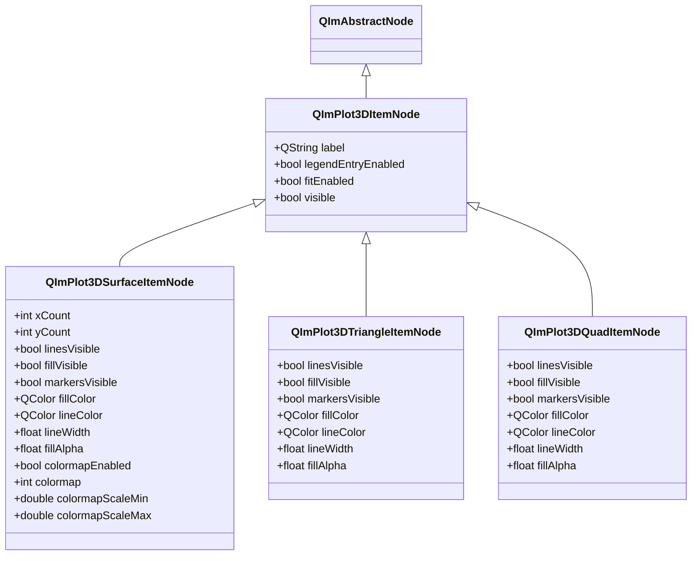
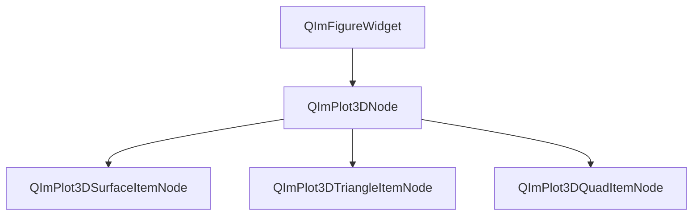

# 3D 曲面图表使用指南

QIm 提供 Surface、Triangle、Quad 三种 3D 曲面图表类型，分别用于网格曲面、三角面片和四边形面片的渲染。它们共享统一的 `QImPlot3DItemNode` 基类接口，支持线条、填充、标记点的独立可见性控制和颜色配置，并通过对象树机制管理父子节点关系。

## 主要功能特性

**特性**

- ✅ **网格曲面（Surface）**：通过 X/Y/Z 数据网格渲染三维曲面，支持填充模式和线框模式切换
- ✅ **三角形面片（Triangle）**：每 3 个连续顶点定义一个三角面，适合不规则几何体
- ✅ **四边形面片（Quad）**：每 4 个连续顶点定义一个四边形面，适合规则网格结构
- ✅ **颜色映射（Colormap）**：Surface 支持基于 Z 值的颜色映射，内置 16 种映射方案
- ✅ **线框模式**：Surface 可关闭填充和标记点，仅显示网格线
- ✅ **独立样式控制**：线条、填充、标记点各自拥有独立的颜色和尺寸属性
- ✅ **信号槽交互**：所有属性变更均通过 Qt 信号通知，支持动态响应式更新

## 基本概念

### 组件定位

Surface、Triangle、Quad 三种图表类型均位于 3D 对象树中 `QImPlot3DNode` 的子级，作为绘图项（Item）节点添加到三维图表中：

```text
QImFigureWidget (根节点)
└── QImPlot3DNode (三维图表)
    ├── QImPlot3DSurfaceItemNode (曲面项)
    ├── QImPlot3DTriangleItemNode (三角面片项)
    └── QImPlot3DQuadItemNode (四边形面片项)
```

创建时需指定 `QImPlot3DNode` 作为父节点，节点自动加入对象树。

### 类继承关系



### 对象树结构



### 三种图表类型对比

| 特性 | Surface | Triangle | Quad |
|------|---------|----------|------|
| 数据格式 | 网格（rows × cols） | 3 顶点/面 | 4 顶点/面 |
| setData 参数 | `(xs, ys, zs, rows, cols)` | `(xs, ys, zs)` | `(xs, ys, zs)` |
| 颜色映射 | ✅ 支持 | ❌ 不支持 | ❌ 不支持 |
| 线框模式 | ✅ 支持 | ❌ 不适用 | ❌ 不适用 |
| 适用场景 | 规则网格曲面 | 不规则三角面 | 规则四边形面 |
| 网格维度属性 | xCount/yCount | 无 | 无 |

- **Surface**：适用于规则网格数据，如数学函数曲面、地形数据等。数据按行列组织，每行每列的数据点构成矩形网格，渲染为曲面
- **Triangle**：适用于三角形面片组成的几何体，如四面体、不规则三角网格（TIN）等。每 3 个连续顶点定义一个三角面
- **Quad**：适用于四边形面片组成的结构，如规则网格截面、建筑平面等。每 4 个连续顶点定义一个四边形面

## Surface 曲面图

`QImPlot3DSurfaceItemNode` 通过 X、Y、Z 数据点网格渲染三维曲面，是最常用的 3D 曲面图表类型。支持填充模式和线框模式，以及基于 Z 值的颜色映射着色。

该组件的示例位于：`examples/readme-3d-example` 和 `examples/qimfigure-test/functions/3d/Plot3DSurfaceFunction.cpp`

### 1. 基本使用（填充模式）

创建一个带颜色映射的填充曲面，数据为 `z = sin(x) * cos(y)` 的 40×40 网格：

```cpp
#include "QImFigureWidget.h"
#include "plot3d/QImPlot3DNode.h"
#include "plot3d/QImPlot3DSurfaceItemNode.h"
#include "implot3d.h"

#include <cmath>
#include <vector>

// 创建图表控件
QIM::QImFigureWidget* figure3D = new QIM::QImFigureWidget(this);
figure3D->setSubplot3DGrid(1, 1);

// 创建三维图表节点
if (QIM::QImPlot3DNode* plot = figure3D->createPlot3DNode()) {
    plot->setTitle("3D Surface");

    // 生成 40x40 网格数据：z = sin(x)*cos(y)
    constexpr int rows = 40;
    constexpr int cols = 40;
    std::vector<double> xs(rows * cols);
    std::vector<double> ys(rows * cols);
    std::vector<double> zs(rows * cols);
    for (int r = 0; r < rows; ++r) {
        for (int c = 0; c < cols; ++c) {
            int index = r * cols + c;
            double x = -3.0 + 6.0 * c / (cols - 1);
            double y = -3.0 + 6.0 * r / (rows - 1);
            xs[index] = x;
            ys[index] = y;
            zs[index] = std::sin(x) * std::cos(y);
        }
    }

    // 创建曲面项节点，以 plot 为父节点
    auto* surface = new QIM::QImPlot3DSurfaceItemNode(plot);  // 自动成为 plot 的子节点
    surface->setLabel("surface");
    surface->setData(xs, ys, zs, rows, cols);  // 设置网格数据
    surface->setColormapEnabled(true);          // 启用颜色映射
    surface->setColormap(ImPlot3DColormap_Viridis);  // 使用 Viridis 映射方案
}
```

**关键说明**：

- `setData(xs, ys, zs, rows, cols)`：数据向量的总长度为 `rows * cols`，索引计算为 `index = r * cols + c`
- `setColormapEnabled(true)` + `setColormap(ImPlot3DColormap_Viridis)`：启用颜色映射后，曲面颜色根据 Z 值自动映射
- 曲面项节点创建时以 `QImPlot3DNode` 为父节点，自动加入对象树

### 2. 线框模式

线框模式仅显示网格线，不显示填充面和标记点。通过关闭 `fillVisible` 和 `markersVisible` 实现：

```cpp
// 创建三维图表节点
if (QIM::QImPlot3DNode* plot = figure3D->createPlot3DNode()) {
    plot->setTitle("3D Wireframe");

    // 生成与填充曲面相同的网格数据
    constexpr int rows = 40;
    constexpr int cols = 40;
    std::vector<double> xs(rows * cols);
    std::vector<double> ys(rows * cols);
    std::vector<double> zs(rows * cols);
    for (int r = 0; r < rows; ++r) {
        for (int c = 0; c < cols; ++c) {
            int index = r * cols + c;
            double x = -3.0 + 6.0 * c / (cols - 1);
            double y = -3.0 + 6.0 * r / (rows - 1);
            xs[index] = x;
            ys[index] = y;
            zs[index] = std::sin(x) * std::cos(y);
        }
    }

    // 创建曲面项节点，配置为线框模式
    auto* wireframe = new QIM::QImPlot3DSurfaceItemNode(plot);  // 自动成为 plot 的子节点
    wireframe->setLabel("wireframe");
    wireframe->setData(xs, ys, zs, rows, cols);
    wireframe->setColormapEnabled(true);              // 线框也支持颜色映射
    wireframe->setColormap(ImPlot3DColormap_Viridis);
    wireframe->setFillVisible(false);                 // 关闭填充面
    wireframe->setMarkersVisible(false);              // 关闭标记点
    wireframe->setLineWidth(1.2f);                    // 设置线宽
}
```

!!! info "线框模式原理"
    线框模式通过三个属性组合实现：`setFillVisible(false)` 关闭填充面、`setMarkersVisible(false)` 关闭标记点、`setLineWidth()` 控制线条粗细。颜色映射在线框模式下仍然生效，线条颜色根据 Z 值映射。

### 3. 自定义颜色

不使用颜色映射时，可分别设置填充颜色、线条颜色和标记点颜色：

```cpp
// 创建曲面项节点，使用自定义颜色
auto* surface = new QIM::QImPlot3DSurfaceItemNode(plot);  // 以 plot 为父节点
surface->setData(xs, ys, zs, rows, cols);

// 设置填充颜色和透明度
surface->setFillColor(QColor(0, 114, 189));  // 填充颜色
surface->setFillAlpha(0.6f);                  // 填充透明度（0.0~1.0）

// 设置线条颜色和线宽
surface->setLineColor(QColor(255, 255, 255));  // 线条颜色
surface->setLineWidth(1.0f);                    // 线宽

// 设置标记点样式
surface->setMarkersVisible(true);
surface->setMarkerFillColor(QColor(217, 83, 25));     // 标记点填充颜色
surface->setMarkerOutlineColor(QColor(120, 45, 10));  // 标记点轮廓颜色
surface->setMarkerSize(4.0f);                          // 标记点大小
surface->setMarkerWeight(1.0f);                        // 标记点轮廓线宽
```

### 4. 颜色映射系统

Surface 支持基于 Z 值的颜色映射（Colormap），可自动将 Z 值映射为颜色梯度，适用于科学数据可视化。

#### 启用颜色映射

```cpp
surface->setColormapEnabled(true);              // 启用颜色映射
surface->setColormap(ImPlot3DColormap_Viridis); // 选择映射方案
surface->setColormapScaleMin(-1.0);             // 映射最小值（可选）
surface->setColormapScaleMax(1.0);              // 映射最大值（可选）
```

!!! tip "颜色映射缩放范围"
    `colormapScaleMin` 和 `colormapScaleMax` 用于控制颜色映射的数值范围。如果不设置，系统会根据数据自动确定范围。手动设置范围适用于需要固定颜色映射区间的场景，如多图表对比时保持一致的映射范围。

#### QImPlot3DColormap 映射方案

`QImPlot3DColormap` 封装了 ImPlot3D 的颜色映射枚举，提供 16 种内置映射方案：

| 枚举值 | ImPlot3D 对应值 | 说明 |
|--------|----------------|------|
| `QImPlot3DColormap::Deep` | `ImPlot3DColormap_Deep` (0) | 深色渐变，适合暗色主题 |
| `QImPlot3DColormap::Dark` | `ImPlot3DColormap_Dark` (1) | 深暗色调，低对比度 |
| `QImPlot3DColormap::Pastel` | `ImPlot3DColormap_Pastel` (2) | 柔和浅色调，适合演示 |
| `QImPlot3DColormap::Paired` | `ImPlot3DColormap_Paired` (3) | 对比色配对，适合分类 |
| `QImPlot3DColormap::Viridis` | `ImPlot3DColormap_Viridis` (4) | 感知均匀渐变，科学可视化首选 |
| `QImPlot3DColormap::Plasma` | `ImPlot3DColormap_Plasma` (5) | 紫红渐变，高对比度 |
| `QImPlot3DColormap::Hot` | `ImPlot3DColormap_Hot` (6) | 热力图渐变（黑→红→黄→白） |
| `QImPlot3DColormap::Cool` | `ImPlot3DColormap_Cool` (7) | 冷色调渐变（蓝→绿） |
| `QImPlot3DColormap::Pink` | `ImPlot3DColormap_Pink` (8) | 粉色调渐变 |
| `QImPlot3DColormap::Jet` | `ImPlot3DColormap_Jet` (9) | 经典彩虹渐变 |
| `QImPlot3DColormap::Twilight` | `ImPlot3DColormap_Twilight` (10) | 循环渐变，适合周期数据 |
| `QImPlot3DColormap::RdBu` | `ImPlot3DColormap_RdBu` (11) | 红-蓝双向渐变，适合正负数据 |
| `QImPlot3DColormap::BrBG` | `ImPlot3DColormap_BrBG` (12) | 棕-蓝绿双向渐变 |
| `QImPlot3DColormap::PiYG` | `ImPlot3DColormap_PiYG` (13) | 粉红-黄绿双向渐变 |
| `QImPlot3DColormap::Spectral` | `ImPlot3DColormap_Spectral` (14) | 多色光谱渐变 |
| `QImPlot3DColormap::Greys` | `ImPlot3DColormap_Greys` (15) | 灰度渐变 |

!!! tip "映射方案选择建议"
    - 科学数据可视化推荐使用 **Viridis**（感知均匀，色盲友好）
    - 热力数据推荐使用 **Hot** 或 **Plasma**
    - 正负值对比推荐使用 **RdBu** 或 **Spectral**
    - 灰度打印推荐使用 **Greys**

使用 `setColormap()` 时可直接传入 ImPlot3D 的原生枚举值（如 `ImPlot3DColormap_Viridis`），也可传入 `QImPlot3DColormap` 的整数值（如 `(int)QImPlot3DColormap::Viridis` 即 4）。

### 5. 属性表

#### Q_PROPERTY 完整列表

| 属性 | 类型 | 读取方法 | 写入方法 | 通知信号 | 说明 |
|------|------|----------|----------|----------|------|
| `xCount` | `int` | `xCount()` | `setXCount(int)` | `gridShapeChanged()` | X 方向网格点数 |
| `yCount` | `int` | `yCount()` | `setYCount(int)` | `gridShapeChanged()` | Y 方向网格点数 |
| `linesVisible` | `bool` | `isLinesVisible()` | `setLinesVisible(bool)` | `surfaceFlagChanged()` | 线条是否可见 |
| `fillVisible` | `bool` | `isFillVisible()` | `setFillVisible(bool)` | `surfaceFlagChanged()` | 填充面是否可见 |
| `markersVisible` | `bool` | `isMarkersVisible()` | `setMarkersVisible(bool)` | `surfaceFlagChanged()` | 标记点是否可见 |
| `markerShape` | `int` | `markerShape()` | `setMarkerShape(int)` | `markerShapeChanged(int)` | 标记点形状（ImPlot3DMarker） |
| `markerSize` | `float` | `markerSize()` | `setMarkerSize(float)` | `markerStyleChanged()` | 标记点大小 |
| `markerWeight` | `float` | `markerWeight()` | `setMarkerWeight(float)` | `markerStyleChanged()` | 标记点轮廓线宽 |
| `fillColor` | `QColor` | `fillColor()` | `setFillColor(QColor)` | `fillColorChanged(QColor)` | 填充颜色 |
| `lineColor` | `QColor` | `lineColor()` | `setLineColor(QColor)` | `lineColorChanged(QColor)` | 线条颜色 |
| `markerFillColor` | `QColor` | `markerFillColor()` | `setMarkerFillColor(QColor)` | `markerFillColorChanged(QColor)` | 标记点填充颜色 |
| `markerOutlineColor` | `QColor` | `markerOutlineColor()` | `setMarkerOutlineColor(QColor)` | `markerOutlineColorChanged(QColor)` | 标记点轮廓颜色 |
| `lineWidth` | `float` | `lineWidth()` | `setLineWidth(float)` | `lineWidthChanged(float)` | 线宽（像素） |
| `fillAlpha` | `float` | `fillAlpha()` | `setFillAlpha(float)` | `fillAlphaChanged(float)` | 填充透明度（0.0~1.0，-1.0 为自动） |
| `colormapEnabled` | `bool` | `isColormapEnabled()` | `setColormapEnabled(bool)` | `colormapChanged()` | 是否启用颜色映射 |
| `colormap` | `int` | `colormap()` | `setColormap(int)` | `colormapChanged()` | 颜色映射方案 |
| `colormapScaleMin` | `double` | `colormapScaleMin()` | `setColormapScaleMin(double)` | `colormapScaleChanged()` | 颜色映射最小值 |
| `colormapScaleMax` | `double` | `colormapScaleMax()` | `setColormapScaleMax(double)` | `colormapScaleChanged()` | 颜色映射最大值 |

#### 标记点形状（ImPlot3DMarker）

`markerShape` 属性使用 ImPlot3D 的标记形状枚举值，对应的 `QImPlot3DMarkerShape` 封装如下：

| 枚举值 | 整数值 | 说明 |
|--------|--------|------|
| `QImPlot3DMarkerShape::None` | -1 | 无标记 |
| `QImPlot3DMarkerShape::Circle` | 0 | 圆形 |
| `QImPlot3DMarkerShape::Square` | 1 | 方形 |
| `QImPlot3DMarkerShape::Diamond` | 2 | 菱形 |
| `QImPlot3DMarkerShape::Up` | 3 | 上三角 |
| `QImPlot3DMarkerShape::Down` | 4 | 下三角 |
| `QImPlot3DMarkerShape::Left` | 5 | 左三角 |
| `QImPlot3DMarkerShape::Right` | 6 | 右三角 |
| `QImPlot3DMarkerShape::Cross` | 7 | 十字 |
| `QImPlot3DMarkerShape::Plus` | 8 | 加号 |
| `QImPlot3DMarkerShape::Asterisk` | 9 | 星号 |

### 6. 信号表

| 信号 | 参数 | 触发时机 |
|------|------|----------|
| `dataChanged()` | 无 | `setData()` 更新 XYZ 数据时 |
| `gridShapeChanged()` | 无 | `xCount` 或 `yCount` 变更时 |
| `surfaceFlagChanged()` | 无 | `linesVisible`、`fillVisible` 或 `markersVisible` 变更时 |
| `markerShapeChanged(int shape)` | 新的标记形状值 | `setMarkerShape()` 实际改变形状时 |
| `markerStyleChanged()` | 无 | `markerSize` 或 `markerWeight` 变更时 |
| `fillColorChanged(const QColor& color)` | 新的填充颜色 | `setFillColor()` 实际改变颜色时 |
| `lineColorChanged(const QColor& color)` | 新的线条颜色 | `setLineColor()` 实际改变颜色时 |
| `markerFillColorChanged(const QColor& color)` | 新的标记填充颜色 | `setMarkerFillColor()` 实际改变颜色时 |
| `markerOutlineColorChanged(const QColor& color)` | 新的标记轮廓颜色 | `setMarkerOutlineColor()` 实际改变颜色时 |
| `lineWidthChanged(float width)` | 新的线宽 | `setLineWidth()` 实际改变线宽时 |
| `fillAlphaChanged(float alpha)` | 新的透明度 | `setFillAlpha()` 实际改变透明度时 |
| `colormapChanged()` | 无 | `colormapEnabled` 或 `colormap` 变更时 |
| `colormapScaleChanged()` | 无 | `colormapScaleMin` 或 `colormapScaleMax` 变更时 |

### 7. 信号槽连接示例

```cpp
// 监听颜色映射开关变化
connect(surface, &QIM::QImPlot3DSurfaceItemNode::colormapChanged,
        this, &MyClass::onColormapChanged);

// 监听填充颜色变化
connect(surface, &QIM::QImPlot3DSurfaceItemNode::fillColorChanged,
        this, [](const QColor& color) {
    qDebug() << "Surface fill color changed to:" << color;
});

// 监听线宽变化
connect(surface, &QIM::QImPlot3DSurfaceItemNode::lineWidthChanged,
        this, [](float width) {
    qDebug() << "Surface line width changed to:" << width;
});
```

## Triangle 三角面片图

`QImPlot3DTriangleItemNode` 通过 X、Y、Z 数据点序列渲染三维三角形面片。每 3 个连续顶点定义一个三角面，适合不规则几何体的渲染。

该组件的示例位于：`examples/qimfigure-test/functions/3d/Plot3DTriangleFunction.cpp`

### 1. 基本使用

创建一个四面体（由 4 个三角面组成）：

```cpp
#include "QImFigureWidget.h"
#include "plot3d/QImPlot3DNode.h"
#include "plot3d/QImPlot3DTriangleItemNode.h"

#include <QVector>

// 创建图表控件
QIM::QImFigureWidget* figure3D = new QIM::QImFigureWidget(this);
figure3D->setSubplot3DGrid(1, 1);

// 创建三维图表节点
if (QIM::QImPlot3DNode* plot = figure3D->createPlot3DNode()) {
    plot->setTitle("3D Triangle - Tetrahedron");
    plot->setBoxRotation(35.264, 45.0);  // 设置等轴测视角

    // 定义四面体的 4 个顶点
    // V0 = (0, 0, 1)            顶部
    // V1 = (0.943, 0, -0.333)   底部右侧
    // V2 = (-0.471, 0.816, -0.333)  底部后左
    // V3 = (-0.471, -0.816, -0.333) 底部前左

    // 4 个三角面（每个面 3 个点，从外部看逆时针）
    // 总计 12 个点（4 面 × 3 点/面）
    QVector<double> xs, ys, zs;
    xs.reserve(12);
    ys.reserve(12);
    zs.reserve(12);

    // 面 0: V0-V1-V2
    xs.append(0.0);      ys.append(0.0);       zs.append(1.0);      // V0
    xs.append(0.943);    ys.append(0.0);       zs.append(-0.333);   // V1
    xs.append(-0.471);   ys.append(0.816);     zs.append(-0.333);   // V2

    // 面 1: V0-V2-V3
    xs.append(0.0);      ys.append(0.0);       zs.append(1.0);      // V0
    xs.append(-0.471);   ys.append(0.816);     zs.append(-0.333);   // V2
    xs.append(-0.471);   ys.append(-0.816);    zs.append(-0.333);   // V3

    // 面 2: V0-V3-V1
    xs.append(0.0);      ys.append(0.0);       zs.append(1.0);      // V0
    xs.append(-0.471);   ys.append(-0.816);    zs.append(-0.333);   // V3
    xs.append(0.943);    ys.append(0.0);       zs.append(-0.333);   // V1

    // 面 3: V1-V3-V2 (底面)
    xs.append(0.943);    ys.append(0.0);       zs.append(-0.333);   // V1
    xs.append(-0.471);   ys.append(-0.816);    zs.append(-0.333);   // V3
    xs.append(-0.471);   ys.append(0.816);     zs.append(-0.333);   // V2

    // 创建三角面片项节点，以 plot 为父节点
    auto* triangle = new QIM::QImPlot3DTriangleItemNode(plot);  // 自动成为 plot 的子节点
    triangle->setData(xs, ys, zs);  // 设置数据（无需 rows/cols 参数）
    triangle->setFillColor(QColor(0, 114, 189));   // 设置填充颜色
    triangle->setLineColor(QColor(255, 255, 255));  // 设置线条颜色
    triangle->setLineWidth(1.5f);                    // 设置线宽
    triangle->setLinesVisible(true);                 // 显示线条
    triangle->setFillVisible(true);                  // 显示填充
    triangle->setMarkersVisible(false);              // 不显示标记点
}
```

**关键说明**：

- `setData(xs, ys, zs)`：Triangle 不需要 `rows/cols` 参数，数据长度必须为 3 的倍数（每个三角面 3 个顶点）
- 顶点顺序建议从外部看逆时针排列，以确保正确的面朝向
- 共享顶点需要重复写入数据向量中（如四面体的 V0 出现了 3 次）

### 2. 属性表

#### Q_PROPERTY 完整列表

| 属性 | 类型 | 读取方法 | 写入方法 | 通知信号 | 说明 |
|------|------|----------|----------|----------|------|
| `linesVisible` | `bool` | `isLinesVisible()` | `setLinesVisible(bool)` | `triangleFlagChanged()` | 线条是否可见 |
| `fillVisible` | `bool` | `isFillVisible()` | `setFillVisible(bool)` | `triangleFlagChanged()` | 填充面是否可见 |
| `markersVisible` | `bool` | `isMarkersVisible()` | `setMarkersVisible(bool)` | `triangleFlagChanged()` | 标记点是否可见 |
| `markerShape` | `int` | `markerShape()` | `setMarkerShape(int)` | `markerShapeChanged(int)` | 标记点形状（ImPlot3DMarker） |
| `markerSize` | `float` | `markerSize()` | `setMarkerSize(float)` | `markerStyleChanged()` | 标记点大小 |
| `markerWeight` | `float` | `markerWeight()` | `setMarkerWeight(float)` | `markerStyleChanged()` | 标记点轮廓线宽 |
| `fillColor` | `QColor` | `fillColor()` | `setFillColor(QColor)` | `fillColorChanged(QColor)` | 填充颜色 |
| `lineColor` | `QColor` | `lineColor()` | `setLineColor(QColor)` | `lineColorChanged(QColor)` | 线条颜色 |
| `markerFillColor` | `QColor` | `markerFillColor()` | `setMarkerFillColor(QColor)` | `markerFillColorChanged(QColor)` | 标记点填充颜色 |
| `markerOutlineColor` | `QColor` | `markerOutlineColor()` | `setMarkerOutlineColor(QColor)` | `markerOutlineColorChanged(QColor)` | 标记点轮廓颜色 |
| `lineWidth` | `float` | `lineWidth()` | `setLineWidth(float)` | `lineWidthChanged(float)` | 线宽（像素） |
| `fillAlpha` | `float` | `fillAlpha()` | `setFillAlpha(float)` | `fillAlphaChanged(float)` | 塅充透明度（0.0~1.0，-1.0 为自动） |

!!! info "Triangle 与 Surface 属性差异"
    Triangle 不支持颜色映射（colormap）属性，也不支持网格维度属性（xCount/yCount）。通知信号使用 `triangleFlagChanged()` 而非 `surfaceFlagChanged()`。

### 3. 信号表

| 信号 | 参数 | 触发时机 |
|------|------|----------|
| `dataChanged()` | 无 | `setData()` 更新 XYZ 数据时 |
| `triangleFlagChanged()` | 无 | `linesVisible`、`fillVisible` 或 `markersVisible` 变更时 |
| `markerShapeChanged(int shape)` | 新的标记形状值 | `setMarkerShape()` 实际改变形状时 |
| `markerStyleChanged()` | 无 | `markerSize` 或 `markerWeight` 变更时 |
| `fillColorChanged(const QColor& color)` | 新的填充颜色 | `setFillColor()` 实际改变颜色时 |
| `lineColorChanged(const QColor& color)` | 新的线条颜色 | `setLineColor()` 实际改变颜色时 |
| `markerFillColorChanged(const QColor& color)` | 新的标记填充颜色 | `setMarkerFillColor()` 实际改变颜色时 |
| `markerOutlineColorChanged(const QColor& color)` | 新的标记轮廓颜色 | `setMarkerOutlineColor()` 实际改变颜色时 |
| `lineWidthChanged(float width)` | 新的线宽 | `setLineWidth()` 实际改变线宽时 |
| `fillAlphaChanged(float alpha)` | 新的透明度 | `setFillAlpha()` 实际改变透明度时 |

## Quad 四边形面片图

`QImPlot3DQuadItemNode` 通过 X、Y、Z 数据点序列渲染三维四边形面片。每 4 个连续顶点定义一个四边形面，适合规则截面结构的渲染。

!!! tip "完整示例"
    Quad 组件的示例位于 `examples/qimfigure-test/functions/3d/` 目录。以下用法说明基于完整实现。

### 1. 基本使用

创建一个由四边形面片组成的几何体：

```cpp
#include "QImFigureWidget.h"
#include "plot3d/QImPlot3DNode.h"
#include "plot3d/QImPlot3DQuadItemNode.h"

#include <vector>

// 创建图表控件
QIM::QImFigureWidget* figure3D = new QIM::QImFigureWidget(this);
figure3D->setSubplot3DGrid(1, 1);

// 创建三维图表节点
if (QIM::QImPlot3DNode* plot = figure3D->createPlot3DNode()) {
    plot->setTitle("3D Quad");

    // 定义数据：每 4 个连续点定义一个四边形面
    // 数据长度必须为 4 的倍数
    std::vector<double> xs, ys, zs;

    // 四边形面 1（4 个顶点）
    xs.push_back(0.0);   ys.push_back(0.0);   zs.push_back(1.0);
    xs.push_back(1.0);   ys.push_back(0.0);   zs.push_back(1.0);
    xs.push_back(1.0);   ys.push_back(1.0);   zs.push_back(1.0);
    xs.push_back(0.0);   ys.push_back(1.0);   zs.push_back(1.0);

    // 四边形面 2（4 个顶点）
    xs.push_back(0.0);   ys.push_back(0.0);   zs.push_back(0.0);
    xs.push_back(1.0);   ys.push_back(0.0);   zs.push_back(0.0);
    xs.push_back(1.0);   ys.push_back(1.0);   zs.push_back(0.0);
    xs.push_back(0.0);   ys.push_back(1.0);   zs.push_back(0.0);

    // 创建四边形面片项节点，以 plot 为父节点
    auto* quad = new QIM::QImPlot3DQuadItemNode(plot);  // 自动成为 plot 的子节点
    quad->setData(xs, ys, zs);  // 设置数据（无需 rows/cols 参数）
    quad->setFillColor(QColor(80, 170, 90));   // 设置填充颜色
    quad->setLineColor(QColor(60, 60, 60));     // 设置线条颜色
    quad->setLineWidth(1.0f);                    // 设置线宽
    quad->setFillVisible(true);                  // 显示填充
    quad->setLinesVisible(true);                 // 显示线条
    quad->setMarkersVisible(false);              // 不显示标记点
}
```

**关键说明**：

- `setData(xs, ys, zs)`：Quad 不需要 `rows/cols` 参数，数据长度必须为 4 的倍数（每个四边形面 4 个顶点）
- 顶点顺序建议从外部看逆时针排列，以确保正确的面朝向
- Quad 不支持颜色映射

### 2. 属性表

#### Q_PROPERTY 完整列表

| 属性 | 类型 | 读取方法 | 写入方法 | 通知信号 | 说明 |
|------|------|----------|----------|----------|------|
| `linesVisible` | `bool` | `isLinesVisible()` | `setLinesVisible(bool)` | `quadFlagChanged()` | 线条是否可见 |
| `fillVisible` | `bool` | `isFillVisible()` | `setFillVisible(bool)` | `quadFlagChanged()` | 塅充面是否可见 |
| `markersVisible` | `bool` | `isMarkersVisible()` | `setMarkersVisible(bool)` | `quadFlagChanged()` | 标记点是否可见 |
| `markerShape` | `int` | `markerShape()` | `setMarkerShape(int)` | `markerShapeChanged(int)` | 标记点形状（ImPlot3DMarker） |
| `markerSize` | `float` | `markerSize()` | `setMarkerSize(float)` | `markerStyleChanged()` | 标记点大小 |
| `markerWeight` | `float` | `markerWeight()` | `setMarkerWeight(float)` | `markerStyleChanged()` | 标记点轮廓线宽 |
| `fillColor` | `QColor` | `fillColor()` | `setFillColor(QColor)` | `fillColorChanged(QColor)` | 塅充颜色 |
| `lineColor` | `QColor` | `lineColor()` | `setLineColor(QColor)` | `lineColorChanged(QColor)` | 线条颜色 |
| `markerFillColor` | `QColor` | `markerFillColor()` | `setMarkerFillColor(QColor)` | `markerFillColorChanged(QColor)` | 标记点填充颜色 |
| `markerOutlineColor` | `QColor` | `markerOutlineColor()` | `setMarkerOutlineColor(QColor)` | `markerOutlineColorChanged(QColor)` | 标记点轮廓颜色 |
| `lineWidth` | `float` | `lineWidth()` | `setLineWidth(float)` | `lineWidthChanged(float)` | 线宽（像素） |
| `fillAlpha` | `float` | `fillAlpha()` | `setFillAlpha(float)` | `fillAlphaChanged(float)` | 塅充透明度（0.0~1.0，-1.0 为自动） |

### 3. 信号表

| 信号 | 参数 | 触发时机 |
|------|------|----------|
| `dataChanged()` | 无 | `setData()` 更新 XYZ 数据时 |
| `quadFlagChanged()` | 无 | `linesVisible`、`fillVisible` 或 `markersVisible` 变更时 |
| `markerShapeChanged(int shape)` | 新的标记形状值 | `setMarkerShape()` 实际改变形状时 |
| `markerStyleChanged()` | 无 | `markerSize` 或 `markerWeight` 变更时 |
| `fillColorChanged(const QColor& color)` | 新的填充颜色 | `setFillColor()` 实际改变颜色时 |
| `lineColorChanged(const QColor& color)` | 新的线条颜色 | `setLineColor()` 实际改变颜色时 |
| `markerFillColorChanged(const QColor& color)` | 新的标记填充颜色 | `setMarkerFillColor()` 实际改变颜色时 |
| `markerOutlineColorChanged(const QColor& color)` | 新的标记轮廓颜色 | `setMarkerOutlineColor()` 实际改变颜色时 |
| `lineWidthChanged(float width)` | 新的线宽 | `setLineWidth()` 实际改变线宽时 |
| `fillAlphaChanged(float alpha)` | 新的透明度 | `setFillAlpha()` 实际改变透明度时 |

## 基类属性

Surface、Triangle、Quad 共享 `QImPlot3DItemNode` 基类提供的以下属性和信号：

### 基类 Q_PROPERTY

| 属性 | 类型 | 读取方法 | 写入方法 | 通知信号 | 说明 |
|------|------|----------|----------|----------|------|
| `label` | `QString` | `label()` | `setLabel(QString)` | `labelChanged(QString)` | 图例标签 |

### 基类公共方法

| 方法 | 说明 |
|------|------|
| `plot3DNode()` | 返回父 `QImPlot3DNode` |
| `isLegendEntryEnabled()` | 是否在图例中显示 |
| `setLegendEntryEnabled(bool)` | 设置图例显示 |
| `isFitEnabled()` | 是否参与坐标轴自适应 |
| `setFitEnabled(bool)` | 设置坐标轴自适应 |
| `isVisible()` | 是否可见 |
| `setVisible(bool)` | 设置可见性 |

### 基类信号

| 信号 | 参数 | 触发时机 |
|------|------|----------|
| `labelChanged(const QString& name)` | 新标签文本 | `setLabel()` 改变标签时 |
| `legendEntryEnabledChanged()` | 无 | 图例条目启用状态变更时 |
| `fitEnabledChanged()` | 无 | 自适应启用状态变更时 |

## setData 方法详解

三种图表类型的 `setData()` 方法签名不同，体现了各自的数据组织方式：

| 类型 | 方法签名 | 数据要求 |
|------|----------|----------|
| Surface | `setData(xs, ys, zs, rows, cols)` | 数据长度 = rows × cols |
| Triangle | `setData(xs, ys, zs)` | 数据长度 = 3 × N（N 为三角面数） |
| Quad | `setData(xs, ys, zs)` | 数据长度 = 4 × N（N 为四边形面数） |

三种类型均支持模板版本和非模板版本：

- **模板版本**：接受任意容器类型（`std::vector<double>`、`QVector<double>` 等），内部创建 `QImVectorXYZDataSeries` 并委托给非模板版本
- **非模板版本**：接受 `QImAbstractXYZDataSeries*` 指针，接管数据系列的所有权

```cpp
// 模板版本 - 使用 std::vector
surface->setData(xsVec, ysVec, zsVec, rows, cols);

// 模板版本 - 使用 QVector
surface->setData(xsQVec, ysQVec, zsQVec, rows, cols);

// 非模板版本 - 使用自定义数据系列
QImAbstractXYZDataSeries* series = new MyCustomDataSeries(...);
surface->setData(series, rows, cols);  // Surface 需要额外的 rows/cols
triangle->setData(series);             // Triangle 无需 rows/cols
quad->setData(series);                 // Quad 无需 rows/cols
```

!!! warning "数据所有权"
    非模板版本的 `setData()` 会接管 `QImAbstractXYZDataSeries` 指针的所有权，无需手动释放。模板版本内部自动创建数据系列对象，同样由节点管理生命周期。

## 注意事项

!!! warning "Surface 数据格式"
    Surface 的 `setData(xs, ys, zs, rows, cols)` 中，数据向量的总长度必须为 `rows × cols`。索引计算方式为 `index = row * cols + col`，其中 `row` 对应 Y 方向，`col` 对应 X 方向。

!!! warning "Triangle 和 Quad 数据长度"
    - Triangle：数据长度必须为 3 的倍数，不足 3 个点的尾部数据会被忽略
    - Quad：数据长度必须为 4 的倍数，不足 4 个点的尾部数据会被忽略

!!! tip "线框模式组合"
    Surface 的线框模式通过三个属性组合实现：
    ```cpp
    surface->setFillVisible(false);      // 关闭填充面
    surface->setMarkersVisible(false);   // 关闭标记点
    surface->setLineWidth(1.2f);         // 调整线宽（线框线条较细更美观）
    ```
    颜色映射在线框模式下仍然生效，线条颜色根据 Z 值自动映射。

!!! tip "fillAlpha 特殊值"
    `fillAlpha` 属性支持特殊值 `-1.0`，表示自动透明度（使用 ImPlot3D 默认值）。设置为 `0.0` 到 `1.0` 之间的值时，手动控制填充透明度。

!!! tip "颜色映射与填充颜色的关系"
    启用颜色映射（`colormapEnabled = true`）后，`fillColor` 属性不再生效，曲面颜色完全由颜色映射决定。关闭颜色映射后，曲面使用 `fillColor` 的颜色。

## 参考

- 3D 绘图概述：[3D 绘图模块](index.md)
- 基本图表：[基本图表](basic-charts.md)
- 网格图表：[网格图表](mesh.md)
- 样式与颜色映射：[3D 配置](configuration.md)
- 核心概念：[渲染节点](../render-node.md)
- 示例代码：`examples/readme-3d-example`、`examples/qimfigure-test/functions/3d/Plot3DSurfaceFunction.cpp`、`examples/qimfigure-test/functions/3d/Plot3DTriangleFunction.cpp`
- ImPlot3D 官方文档：<https://github.com/epezent/implot3d>