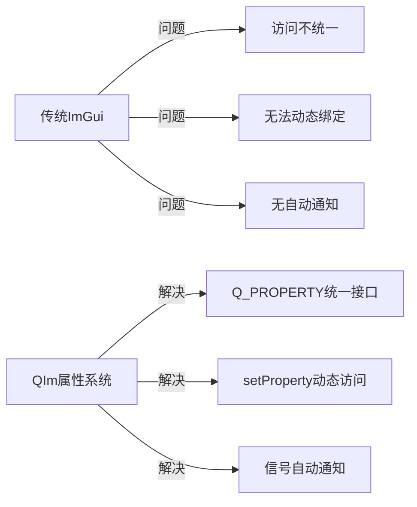
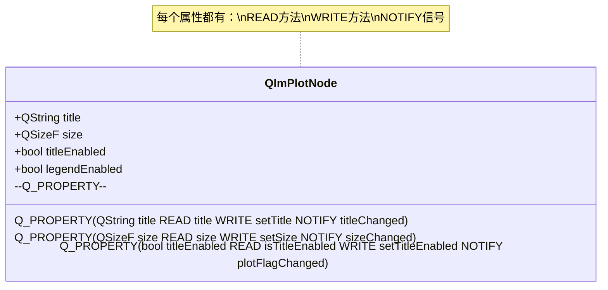

# 属性系统集成

QIm充分利用Qt的**属性系统（Q_PROPERTY）**暴露组件的可配置属性，
让开发者能够使用熟悉的Qt编程范式（setProperty、信号通知）管理UI状态。

## 为什么需要属性系统

传统ImGui的属性设置采用函数调用方式，没有统一的属性管理机制：

```cpp
// 传统ImGui - 直接调用函数
ImPlot::SetNextPlotLimits(0, 10, 0, 100);
ImGui::SetWindowFontScale(1.5f);
```

这种方式存在几个问题：
1. **无法统一访问**：不同属性使用不同的函数，缺乏一致性
2. **无法动态绑定**：无法像Qt那样通过字符串名称访问属性
3. **无自动通知**：属性变化时无法自动通知监听者

QIm通过Q_PROPERTY解决了这些问题：



## 核心原理

### Q_PROPERTY机制

Q_PROPERTY是Qt的元对象系统核心，提供：
- **READ函数**：获取属性值
- **WRITE函数**：设置属性值
- **NOTIFY信号**：属性变化时自动发射
- **设计时属性**：支持Qt Designer集成



### QIm的属性命名规范

QIm遵循Qt的属性命名约定：

| 属性类型 | Getter命名 | Setter命名 | Signal命名 |
|----------|------------|------------|------------|
| 基础属性 | `color()` | `setColor()` | `colorChanged()` |
| 布尔属性 | `isVisible()` 或 `visible()` | `setVisible()` | `visibleChanged()` |
| 尺寸属性 | `size()` | `setSize()` | `sizeChanged()` |
| 启用属性 | `isTitleEnabled()` | `setTitleEnabled()` | `titleChanged()` |

!!! tip "命名约定"
    - Getter：属性名本身（`color`）或加`is`前缀（`isVisible`）
    - Setter：`set` + 属性名（`setColor`）
    - Signal：属性名 + `Changed`（`colorChanged`）

## 使用方法

### 1. 基本属性访问

```cpp
// 获取属性值
QString title = plot->title();
QSizeF size = plot->size();
bool legendEnabled = plot->isLegendEnabled();

// 设置属性值（自动发射信号）
plot->setTitle("数据监控图表");
plot->setSize(QSizeF(800, 600));
plot->setLegendEnabled(true);
```

### 2. 动态属性访问

通过setProperty动态访问属性（适合脚本、配置文件场景）：

```cpp
// 通过名称设置属性
plot->setProperty("title", QVariant("动态标题"));
plot->setProperty("visible", QVariant(false));

// 通过名称获取属性
QVariant titleVar = plot->property("title");
QString title = titleVar.toString();

// 获取所有属性名称
const QMetaObject* meta = plot->metaObject();
for (int i = 0; i < meta->propertyCount(); ++i) {
    QMetaProperty prop = meta->property(i);
    qDebug() << prop.name() << ":" << plot->property(prop.name());
}
```

### 3. 属性变化监听

连接属性的NOTIFY信号监听变化：

```cpp
// 监听标题变化
connect(plot, &QIM::QImPlotNode::titleChanged,
        this, [](const QString& newTitle) {
    qDebug() << "标题已更新：" << newTitle;
});

// 监听尺寸变化
connect(plot, &QIM::QImPlotNode::sizeChanged,
        this, [](const QSizeF& newSize) {
    qDebug() << "尺寸已更新：" << newSize;
});
```

### 4. 属性绑定（Qt 5.15+）

使用Qt的属性绑定机制自动同步属性：

```cpp
// Qt 5.15+ 属性绑定
plot->setTitle(QImPlotNode::bindableTitle().makeBinding([&]() {
    return QString("图表 - %1").arg(dataCount);
}));
```

## QIm核心类的属性列表

### QImAbstractNode 属性

| 属性 | 类型 | Getter | Setter | Signal |
|------|------|--------|--------|--------|
| visible | bool | `isVisible()` | `setVisible()` | `visibleChanged(bool)` |
| enabled | bool | `isEnabled()` | `setEnabled()` | `enabledChanged(bool)` |

### QImPlotNode 属性

| 属性 | 类型 | Getter | Setter | Signal |
|------|------|--------|--------|--------|
| title | QString | `title()` | `setTitle()` | `titleChanged(QString)` |
| size | QSizeF | `size()` | `setSize()` | `sizeChanged(QSizeF)` |
| autoSize | bool | `isAutoSize()` | `setAutoSize()` | `autoSizeChanged(bool)` |
| titleEnabled | bool | `isTitleEnabled()` | `setTitleEnabled()` | `plotFlagChanged()` |
| legendEnabled | bool | `isLegendEnabled()` | `setLegendEnabled()` | `plotFlagChanged()` |
| mouseTextEnabled | bool | `isMouseTextEnabled()` | `setMouseTextEnabled()` | `plotFlagChanged()` |
| inputsEnabled | bool | `isInputsEnabled()` | `setInputsEnabled()` | `plotFlagChanged()` |
| menusEnabled | bool | `isMenusEnabled()` | `setMenusEnabled()` | `plotFlagChanged()` |
| boxSelectEnabled | bool | `isBoxSelectEnabled()` | `setBoxSelectEnabled()` | `plotFlagChanged()` |
| frameEnabled | bool | `isFrameEnabled()` | `setFrameEnabled()` | `plotFlagChanged()` |
| equal | bool | `isEqual()` | `setEqual()` | `plotFlagChanged()` |
| crosshairs | bool | `isCrosshairs()` | `setCrosshairs()` | `plotFlagChanged()` |
| canvasEnabled | bool | `isCanvasEnabled()` | `setCanvasEnabled()` | `plotFlagChanged()` |

### QImPlotLineItemNode 属性

| 属性 | 类型 | Getter | Setter | Signal |
|------|------|--------|--------|--------|
| label | QString | `label()` | `setLabel()` | `labelChanged(QString)` |
| segments | bool | `isSegments()` | `setSegments()` | `lineFlagChanged()` |
| loop | bool | `isLoop()` | `setLoop()` | `lineFlagChanged()` |
| skipNaN | bool | `isSkipNaN()` | `setSkipNaN()` | `lineFlagChanged()` |
| shaded | bool | `isShaded()` | `setShaded()` | `lineFlagChanged()` |
| adaptiveSampling | bool | `isAdaptiveSampling()` | `setAdaptivesSampling()` | - |

!!! info "说明"
    - 多个布尔属性可能共享同一个Signal（如plotFlagChanged）
    - Setter内部自动发射对应的Notify信号
    - 属性名使用Qt风格（camelCase），遵循AGENTS.md中的命名规范

## 最佳实践

### 在自定义节点中定义属性

```cpp
class CustomNode : public QIM::QImAbstractNode
{
    Q_OBJECT
    // 定义属性 - 遵循QIm命名规范
    Q_PROPERTY(QString customTitle READ customTitle WRITE setCustomTitle NOTIFY customTitleChanged)
    Q_PROPERTY(int customValue READ customValue WRITE setCustomValue NOTIFY customValueChanged)
    Q_PROPERTY(bool customEnabled READ isCustomEnabled WRITE setCustomEnabled NOTIFY customEnabledChanged)
    
public:
    // Getter
    QString customTitle() const { return m_customTitle; }
    int customValue() const { return m_customValue; }
    bool isCustomEnabled() const { return m_customEnabled; }
    
    // Setter（内部发射信号）
    void setCustomTitle(const QString& title) {
        if (m_customTitle != title) {
            m_customTitle = title;
            emit customTitleChanged(title);
        }
    }
    
    void setCustomValue(int value) {
        if (m_customValue != value) {
            m_customValue = value;
            emit customValueChanged(value);
        }
    }
    
    void setCustomEnabled(bool enabled) {
        if (m_customEnabled != enabled) {
            m_customEnabled = enabled;
            emit customEnabledChanged(enabled);
        }
    }
    
Q_SIGNALS:
    void customTitleChanged(const QString& title);
    void customValueChanged(int value);
    void customEnabledChanged(bool enabled);
    
private:
    QString m_customTitle;
    int m_customValue = 0;
    bool m_customEnabled = true;
};
```

!!! warning "注意事项"
    - Setter中必须检查值是否变化，避免重复发射信号
    - NOTIFY信号参数应与READ返回类型一致
    - 属性变化后才发射信号，不是在设置前
    - 布尔属性使用`isXxx()`或`xxx()`两种getter风格均可

!!! tip "最佳实践"
    - 使用PIMPL模式存储属性值，避免头文件膨胀
    - 遵循QIm的命名规范：setColor、color、colorChanged
    - 复杂属性考虑使用Q_PROPERTY的USER attribute标记主要属性
    - 使用Qt5新式信号槽语法连接属性变化信号

## 参考

- 相关文档：[信号槽](signal-slot.md)、[PIMPL模式](pimpl-pattern.md)
- Qt文档：[Qt Property System](https://doc.qt.io/qt-6/properties.html)
- 源码参考：`src/core/plot/QImPlotNode.h`（Q_PROPERTY定义）