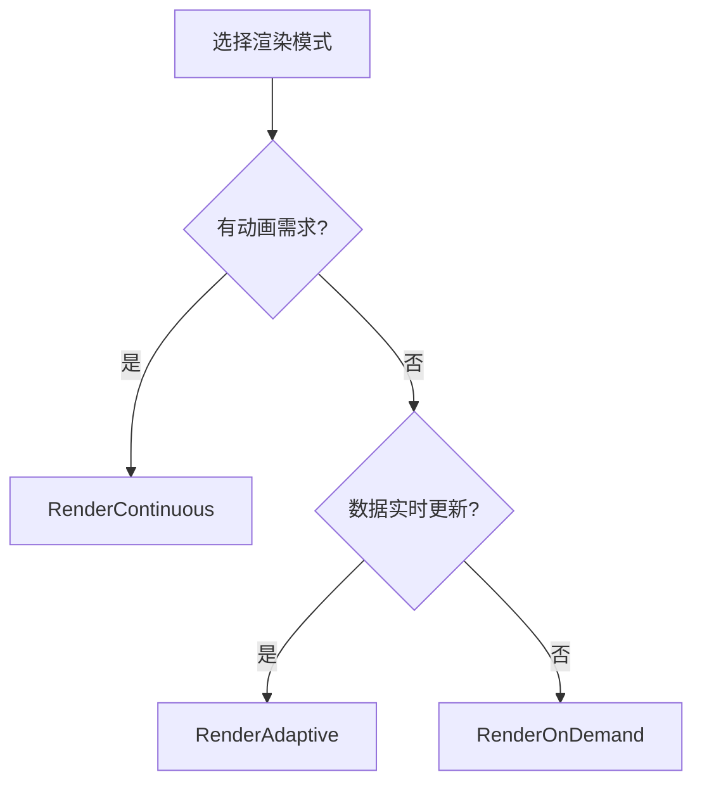

# 渲染模式控制指南

QIm提供三种渲染策略适应不同应用场景，
通过`QImWidget::setRenderMode()`配置。

## 主要功能特性

**特性**

- ✅ **自适应模式**：交互时高帧率，静止时低帧率
- ✅ **连续模式**：持续高帧率，适合动画
- ✅ **按需模式**：仅事件触发时渲染，最节能

## 三种渲染模式

### 1. RenderAdaptive（自适应）- 默认推荐

```cpp
widget->setRenderMode(QIM::QImWidget::RenderAdaptive);
```

| 状态 | 帧率 | 适用场景 |
|------|------|----------|
| 交互中 | ~18 FPS | 鼠标拖拽、缩放 |
| 静止 | ~1 FPS | 等待用户操作 |

**特点**：自动根据用户交互状态调整帧率，平衡流畅性与能耗。

### 2. RenderContinuous（连续）

```cpp
widget->setRenderMode(QIM::QImWidget::RenderContinuous);
```

| 状态 | 帧率 | 适用场景 |
|------|------|----------|
| 常驻 | ~18 FPS | 实时动画、动态更新 |

**特点**：始终高帧率渲染，适合需要持续动画效果的场景。

### 3. RenderOnDemand（按需）

```cpp
widget->setRenderMode(QIM::QImWidget::RenderOnDemand);
```

| 状态 | 帧率 | 适用场景 |
|------|------|----------|
| 触发时 | 单次 | 静态图表、低功耗 |

**特点**：仅在数据更新或用户操作时渲染一帧，最节能但交互响应较慢。

## 使用场景推荐



| 应用类型 | 推荐模式 | 原因 |
|----------|----------|------|
| 实时数据监控 | RenderAdaptive | 交互流畅，静止节能 |
| 演示动画 | RenderContinuous | 保证动画连贯 |
| 静态报表 | RenderOnDemand | 无交互时零CPU占用 |
| 科学仿真 | RenderAdaptive | 观察时可交互，计算时可节能 |

!!! warning "注意事项"
    - RenderContinuous会持续占用CPU/GPU
    - RenderOnDemand可能导致交互响应延迟
    - 数据实时更新时推荐RenderAdaptive或RenderContinuous

## 参考

- API参考：`src/widgets/QImWidget.h`