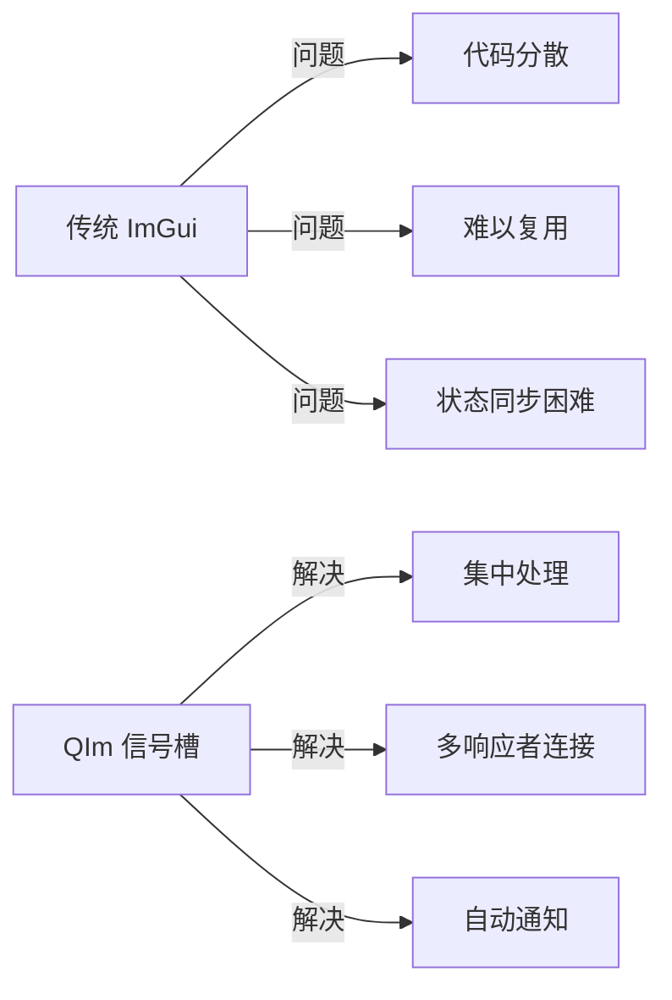

# 信号槽集成

QIm 充分利用 Qt 的**信号槽机制**实现组件间的事件通讯，
让开发者能够以熟悉的 Qt 编程范式响应 UI 事件和状态变化。

## 为什么需要信号槽

传统 ImGui 的事件处理采用回调或即时查询方式：

```cpp
// 传统 ImGui - 每帧查询状态
if (ImGui::Button("OK")) {
    // 点击事件处理
}
if (ImPlot::IsPlotHovered()) {
    ImVec2 pos = ImPlot::GetPlotMousePos();
    // 鼠标位置处理
}
```

这种方式存在几个问题：
1. **代码分散**：事件处理逻辑分散在渲染代码中
2. **难以复用**：无法像 Qt 那样连接多个响应者
3. **状态同步困难**：属性变化需要手动通知

QIm 通过信号槽解决了这些问题：



## 核心原理

### 设计思想

QIm 将 ImGui 的状态变化映射为 Qt 信号：
- 属性变化时自动发射信号（如 `visibleChanged`、`titleChanged`）
- 交互事件提供信号（如鼠标悬停、点击）
- 用户可连接槽函数响应事件

### QImAbstractNode 的基础信号

所有节点继承以下基础信号：

```cpp
Q_SIGNALS:
    void visibleChanged(bool visible);    // 可见性变化
    void enabledChanged(bool enabled);    // 可用性变化
    void childNodeRemoved(QImAbstractNode* c);  // 子节点移除
    void childNodeAdded(QImAbstractNode* c);    // 子节点添加
```

### QImPlotNode 的信号

绘图节点提供属性变化信号：

```cpp
Q_SIGNALS:
    void titleChanged(const QString& title);     // 标题变化
    void sizeChanged(const QSizeF& size);        // 尺寸变化
    void autoSizeChanged(bool autoSize);         // 自适应尺寸变化
    void plotFlagChanged();                      // 绘图标志变化
```

### QImPlotItemNode 的信号

绘图项节点提供标签变化信号：

```cpp
Q_SIGNALS:
    void labelChanged(const QString& name);  // 标签/名称变化
```

### QImFigureWidget 的信号

Figure Widget 提供子图管理信号：

```cpp
Q_SIGNALS:
    void plotNodeAttached(QImPlotNode* plot, bool attach);  // 绘图节点添加/移除
```

## 如何应用

### 基本信号槽连接

```cpp
// 连接标题变化信号
connect(plot, &QIM::QImPlotNode::titleChanged,
        this, [](const QString& title) {
    qDebug() << "Plot title changed to:" << title;
});

// 连接可见性变化信号
connect(node, &QIM::QImAbstractNode::visibleChanged,
        this, [](bool visible) {
    qDebug() << "Node visibility:" << visible;
});
```

### 监控子节点变化

```cpp
// 监控绘图节点的添加
connect(figure, &QIM::QImFigureWidget::plotNodeAttached,
        this, [](QIM::QImPlotNode* plot, bool attach) {
    if (attach) {
        qDebug() << "New plot added";
    } else {
        qDebug() << "Plot removed";
    }
});
```

### 自定义节点的信号

继承 QImAbstractNode 时添加自定义信号：

```cpp
class CustomPlotNode : public QImAbstractNode
{
    Q_OBJECT
public:
    // 自定义信号
    Q_SIGNALS:
        void dataUpdated();           // 数据更新信号
        void rangeChanged(double min, double max);  // 范围变化信号
    
    void updateData()
    {
        // ... 数据更新逻辑 ...
        emit dataUpdated();  // 发射信号
    }
};
```

!!! warning "注意事项"
    - 信号发射在属性 setter 中自动处理，无需手动 emit
    - 连接信号时使用 Qt5 新式语法（函数指针），避免字符串匹配问题
    - 信号槽连接不影响渲染性能，连接在初始化时建立

!!! tip "最佳实践"
    - 将业务逻辑放在槽函数中，保持渲染代码简洁
    - 使用 lambda 表达式处理简单响应，复杂逻辑使用成员槽函数
    - 需要跨线程通讯时使用 `QueuedConnection`

## 参考

- 相关文档：[属性系统](property-system.md)、[对象树](object-tree.md)
- Qt 文档：[Signals & Slots](https://doc.qt.io/qt-6/signalsandslots.html)
