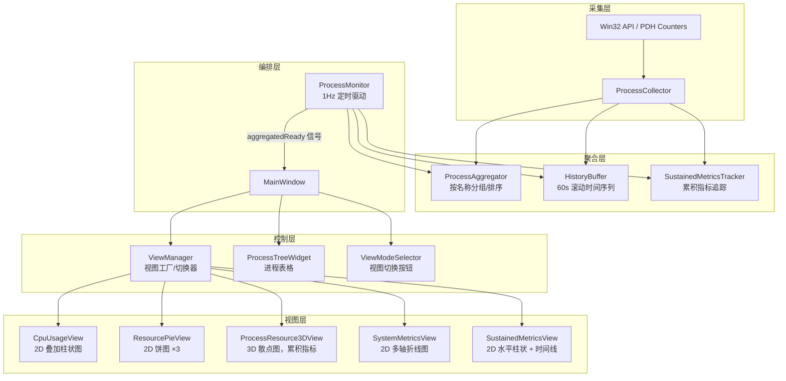

# System Monitor 示例

基于 QIm 的实时系统进程监控应用，展示 2D 与 3D 可视化的完整开发范式。

该示例通过 Windows 底层 API（`psapi`、`pdh`）采集系统进程的 CPU、内存、磁盘 I/O、网络、GPU 等实时指标，以 1Hz 频率更新，提供 **5 种可切换的可视化视图**——涵盖折线图、叠加柱状图、饼图、3D 散点图等 QIm 典型用法。

## 功能特性

- ✅ **5 种可视化视图**：CPU 使用率（叠加柱状图）、资源饼图、进程 3D 散点图、系统多轴指标、持续累积指标排名
- ✅ **实时进程表格**：按进程名分组的树形表格，支持按任意列排序，刷新时保持展开状态
- ✅ **QIm 二维 + 三维混合渲染**：2D 与 3D 子图在同一 `QImFigureWidget` 中自由切换
- ✅ **色盲友好的配色方案**：基于 Paul Tol 22 色定性色盘，通过 `QImPlotColormapManager` 管理
- ✅ **从零开始构建的完整示范**：从 Win32 数据采集 → 聚合 → 历史缓冲区 → 视图渲染的完整数据管道
- ✅ **自定义 QIm 节点实现**：`ColoredBarGroupsNode` 展示如何继承现有节点并重写 `beginDraw()`
- ✅ **持续指标追踪**：跨会话累积指标记录，支持 CPU 时间、GPU 时间、平均内存、磁盘读写等 5 种指标

### 运行截图

> 待补充：运行 system-monitor 示例并截图，放置到 `docs/assets/screenshots/system-monitor.png`

## 架构设计

示例采用 **5 层管道架构**，从底层数据采集到顶层可视化逐层流转：



### 视图与 QIm API 对照

| 视图 | QIm 节点类 | ImPlot API | 关键特性 |
|------|-----------|------------|----------|
| CpuUsageView | `QImPlotBarGroupsItemNode` | `PlotBarGroups` | 叠加柱状图，有序名称确保稳定层级 |
| ResourcePieView | `QImPlotPieChartItemNode` | `PlotPieChart` | 3 饼图横排，累积聚合数据（来自 SustainedMetricsTracker），Top8 + Others |
| ProcessResource3DView | `QImPlot3DScatterItemNode` | `PlotScatter3D` | 3D 散点，X=累积CPU / Y=平均内存 / Z=累积磁盘（来自 SustainedMetricsTracker） |
| SystemMetricsView | `QImPlotLineItemNode` | `PlotLine` | 7 条线共享 3 个 Y 轴 |
| SustainedMetricsView | `QImPlotBarGroupsItemNode` + `QImPlotLineItemNode` | `PlotBarGroups` (horizontal) + `PlotLine` | 水平排名柱状图 + 时间线折线图 |

## 构建与运行

### 环境要求

- **操作系统**：仅支持 Windows（使用 `psapi`、`pdh` API）
- **编译器**：Visual Studio 2019+，C++17
- **Qt**：Qt 5.14+ 或 Qt 6.x
- **GPU**：需要 OpenGL 3.3+ 支持

!!! warning "平台限制"
    该示例使用 Windows 专属的性能计数器 API（`EnumProcesses`、`PDH Query` 等），**无法在 Linux/macOS 下编译**。非 Windows 构建会触发 `#error` 编译错误。

### 一键构建

```powershell
# 构建整个项目（包含 system-monitor）
.\build.ps1

# 仅编译 system-monitor 目标
.\build.ps1 build
```

### 手动构建

```cmake
cmake -S . -B build -G "Visual Studio 16 2019" -A x64 ^
      -DCMAKE_PREFIX_PATH="<Qt安装路径>"
cmake --build build --config Release --target system-monitor
```

CMakeLists 自动链接所需依赖：

```cmake
target_link_libraries(system-monitor PRIVATE
    QIm::Core
    QIm::Widgets
    Qt${QT_VERSION_MAJOR}::Core
    Qt${QT_VERSION_MAJOR}::Gui
    Qt${QT_VERSION_MAJOR}::Widgets
    Qt${QT_VERSION_MAJOR}::OpenGL
    psapi        # 进程枚举 API
    pdh          # 性能计数器 API
)
```

## 使用方法

### 启动

运行 `system-monitor.exe`，主窗口包含两个选项卡：

- **进程表格**：按进程名分组的树形列表，可排序、展开/折叠
- **图表视图**：5 种可视化模式，通过顶部的单选按钮切换

### 视图切换

点击顶部的 5 个单选按钮（CPU 使用率 / 资源饼图 / 进程 3D / 系统指标 / 持续指标）即可切换视图。

### 资源饼图（Resource Pie）

"资源饼图"视图显示程序启动以来的**累积聚合数据**，而非实时快照：

- **CPU 饼图**：累积 CPU 时间（%·秒），反映各进程对 CPU 资源的长期占用贡献
- **内存饼图**：平均内存占用（MB），反映各进程的平均内存使用水平
- **磁盘饼图**：累积磁盘读写总量（MB），反映各进程的磁盘 I/O 总贡献

每个饼图显示排名前 8 的进程，其余进程归入 "Other" 切片。累积数据与"持续指标"视图共享同一个 `SustainedMetricsTracker`，可通过 `系统菜单 → Sustained Metrics → Reset` 重置。

### 持续指标追踪

在"持续指标"模式下：
1. 通过底部的 5 个单选按钮选择指标类型（CPU 时间 / GPU 时间 / 平均内存 / 磁盘读取 / 磁盘写入）
2. 左侧排名柱状图显示进程的历史累计排名
3. 右侧时间线折线图展示各进程的指标变化趋势
4. 可通过 `系统菜单 → Sustained Metrics → Reset` 重置所有累积数据

### 2D 图表交互

- 滚轮缩放、右键拖拽平移
- `q` 键：十字准线
- `w` 键：框选缩放
- `e` 键：自适应范围
- `右键双击`：重置视图

### 3D 图表交互

- 左键拖拽：平移
- 右键拖拽：旋转视角
- 滚轮：缩放
- 右键双击：重置旋转

## 文件结构

```
examples/system-monitor/
├── CMakeLists.txt                   # 构建配置（链接 psapi、pdh、QIm::Core/Widgets）
├── main.cpp                         # 入口点（OpenGL 3.3 Core Profile）
├── MainWindow.h / .cpp              # 主窗口（QTabWidget：表格 + 图表布局）
├── collector/
│   ├── ProcessInfo.h                # 5 种数据结构定义
│   └── ProcessCollector.h / .cpp    # Win32/PDH 数据采集（480+ 行）
├── aggregator/
│   ├── ProcessAggregator.h / .cpp   # 按进程名分组 + TopN 排序
│   ├── HistoryBuffer.h / .cpp       # 60s 滚动环形缓冲区
│   └── SustainedMetricsTracker.h / .cpp  # 跨会话累积指标追踪
├── core/
│   ├── ColorPalette.h               # Paul Tol 22 色色盘 + ColorManager（内联）
│   ├── ProcessMonitor.h / .cpp      # 单例编排器（1Hz 定时驱动）
│   └── ViewManager.h / .cpp         # 视图工厂/切换器
├── widgets/
│   ├── ViewModeSelector.h / .cpp    # 6 视图切换按钮
│   ├── ProcessTreeWidget.h / .cpp   # 可排序进程表格
│   └── SustainedMetricSelector.h / .cpp  # 5 指标切换按钮
└── views/
    ├── ColoredBarGroupsNode.h       # 自定义 QIm 节点（25 行继承示范）
    ├── CpuUsageView.h / .cpp        # 叠加柱状图（CPU 时间序列）
    ├── ResourcePieView.h / .cpp     # 3 饼图（CPU/内存/磁盘）
    ├── ProcessResource3DView.h / .cpp    # 3D 散点图
    ├── SystemOverview3DView.h / .cpp   # 3D 曲面图（300×5 system metrics 3D surface with 5 metric lanes）
    ├── SystemMetricsView.h / .cpp   # 多轴系统指标折线图
    └── SustainedMetricsView.h / .cpp     # 排名柱状图 + 时间线折线图
```

### 关键文件说明

| 文件 | 行数 | 要点 |
|------|------|------|
| `ProcessCollector.cpp` | ~470 | 通过 `EnumProcesses` + `PdhExpandWildCardPathW` 采集所有进程指标，使用 `prevProcData_` 哈希跨帧计算差值 |
| `SustainedMetricsView.cpp` | ~250 | 最复杂的视图，展示双子图布局 + 水平柱状图 + 动态折线 + 自定义轴刻度 |
| `SystemMetricsView.cpp` | ~140 | 展示 Y1/Y2/Y3 三轴绑定 + 7 条折线的渲染模式 |
| `ColoredBarGroupsNode.h` | 25 | 最小自定义节点实现——继承 + 重写 `beginDraw()` 调用 `ImPlot::SetAxes()` |
| `ColorPalette.h` | 80 | 基于 Paul Tol 方案的 22 色定性色盘，适用于色盲用户 |
| `ViewManager.cpp` | ~140 | 视图切换核心：清理子图网格 + 销毁旧节点 + 构建新视图 |

## 开发注意事项

!!! warning "ImPlot 柱状图的 itemCount / groupCount 语义"
    对于水平柱状图（`PlotBarGroups`），每个柱条需要独立的 Y 位置（即独立的 group）。因此：
    
    - **垂直柱状图**：`setData(values, labels, itemCount=N, groupCount=M)` — N 个柱条组 × M 个柱条
    - **水平柱状图**：`setData(values, labels, itemCount=1, groupCount=N)` — 1 组 × N 个柱条
    
    如果参数颠倒（使用垂直柱的逻辑），所有柱条会堆叠在 Y=0 位置，无法区分。

!!! warning "`itemLabels` 数量必须等于 `itemCount`"
    ImPlot 内部会验证 `itemLabels.size() == itemCount`。当 `itemCount=1` 时，只能传入一个标签，进程名应通过**轴刻度标签**（`setAxisTicks`）而非 itemLabels 展示。

!!! tip "Colormap 注册必须在 ImGui 上下文初始化之后"
    `QImPlotColormapManager::addColormap()` 内部依赖 `ImGuiStorage`，必须在 OpenGL 上下文初始化完成（即 `initializeGL()` 调用后）才能使用。
    
    该示例通过 `QTimer::singleShot(0, ...)` 延迟首次视图切换，确保色图注册在 ImGui 就绪后执行。

!!! warning "`setAutoFit(true)` 会每帧重置视图范围"
    `setAutoFit(true)` 在每帧渲染时重新计算并应用最优范围，这会**持续覆盖用户的缩放/拖拽操作**，导致交互功能失效。
    
    需要一次性自适应并且允许用户后续交互时，应使用 `setLimits(min, max, QImPlotCondition::Once)`。

!!! warning "排序时需保持严格弱序"
    实现降序排序时，应**交换比较操作数**（`return b < a`），而非**取反比较结果**（`return !(a < b)`）。后者违反 strict weak ordering，可能导致 `std::sort` 未定义行为。
    
    ```cpp
    // ✅ 正确：交换操作数
    std::stable_sort(..., [&](const auto& a, const auto& b) { return b.cpu < a.cpu; });
    
    // ❌ 错误：取反结果（违反 strict weak ordering）
    std::stable_sort(..., [&](const auto& a, const auto& b) { return !(a.cpu < b.cpu); });
    ```

!!! tip "进程名规范化"
    PDH 返回的进程名可能包含 `#1`、`#2` 等后缀，这些后缀本身不包含有用信息。`ProcessAggregator` 在分组前会去除这些后缀，确保同名的多实例进程被正确聚合。


## 参考资料

- [QIm 主项目 README](../../README.md)
- [QIm 文档撰写规范](../../docs/doc-writing-guide.md)
- [QIm 开发规范](../../docs/zh/dev/)
- [ImPlot 官方文档](https://github.com/epezent/implot)
- [ImPlot3D 官方文档](https://github.com/brenocq/implot3d)
- [Paul Tol 配色方案](https://personal.sron.nl/~pault/)