# QIm介绍

`QIm` 是一个将 `Dear ImGui`、`ImPlot`、`ImPlot3D` 等ImGui生态集成到Qt框架中的开源库。它通过保留模式（Retained Mode）的封装，让Qt开发者能够使用熟悉的Qt编程范式（信号槽、属性系统、对象树）来构建高性能的实时数据可视化应用。

基于`QIm`，你无需学习 `ImGui`，即可直接使用熟悉的 Qt 信号槽、属性系统与对象树管理机制，构建实时数据监控、科学绘图2D/3D界面、工程仿真可视化等高性能应用场景。

`QIm`计划把ImGui生态的成熟库进行封装，目前正在做`ImPlot`和`ImPlot3D`的封装，旨在为Qt开发环境提供一款开箱即用的数据可视化库。

## 效果

通过`QIm`的`Plot`模块，可以实现如下数据可视化效果：

### 2D绘图

|  |  |  |
|:---:|:---:|:---:|
| 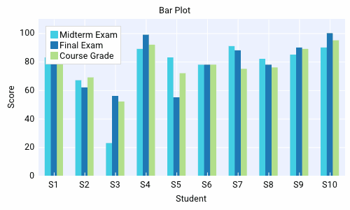 | 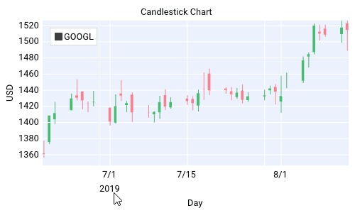 |  |
| 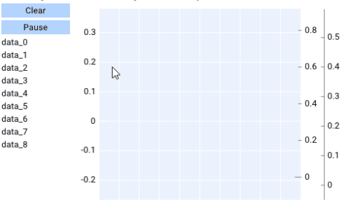 | 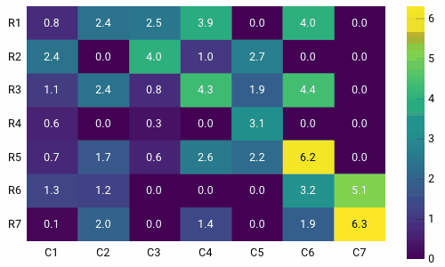 | 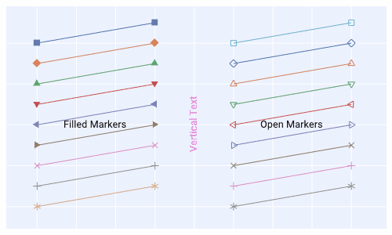 |
| 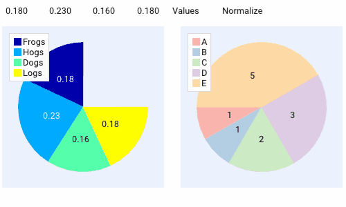 | 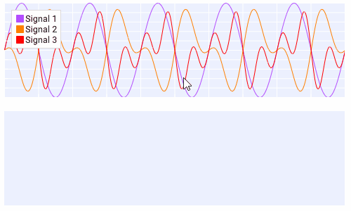 | 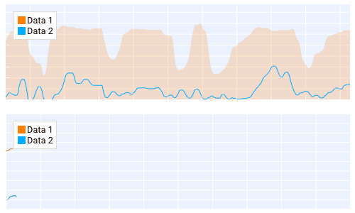 |
| 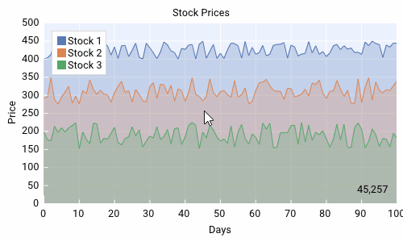 | 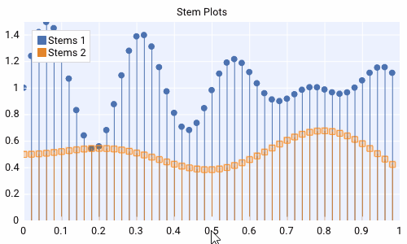 | 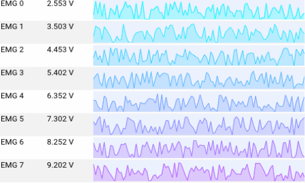 |

### 3D绘图

|  |  |  |
|:---:|:---:|:---:|
|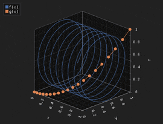|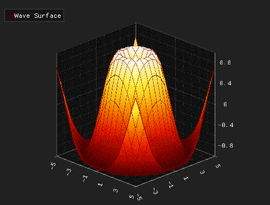|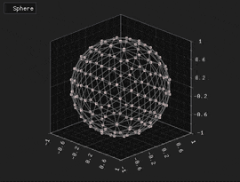|
|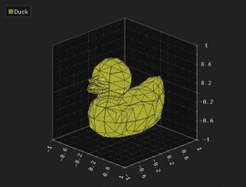|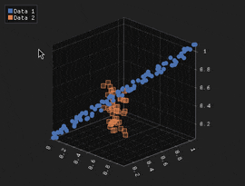|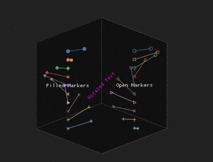|

## 核心设计

`ImGui` 原生采用即时模式（Immediate Mode）：每次渲染都需重新构建 UI 结构，与 Qt 编程习惯差异较大：

```cpp
// 传统ImGui代码即时模式代码,这段带码每次刷新帧都要执行一遍
if (ImGui::Begin("Window")) {
    if (ImPlot::BeginPlot("Plot")) {
        ImPlot::PlotLine(...);
        ImPlot::EndPlot();
    }
    ImGui::End();
}
```

`QIm` 将其转换为 Qt 开发者熟悉的保留模式（Retained Mode），通过面向对象 + 对象树的方式管理 UI 组件，属性与交互完全贴合 Qt 生态：

```cpp
// QIm方式 - 面向对象，更符合Qt习惯
auto window = new QImWindowNode(root);
window->setTitle("Window");

auto plot = new QImPlotNode(window);  // 自动成为子节点
plot->setTitle("Plot");

auto line = new QImPlotLineNode(plot);
line->setData(...);
```

`QIm`的核心是将 `ImGui` 生态的组件映射为 Qt 节点对象，将 `ImGui` 属性映射为 Qt 属性系统，同时保留信号槽机制

## 快速开始


### 编译和安装

项目使用`cmake`构建,建议执行安装(install)后使用

```cmake
# 创建构建目录
mkdir build && cd build
# 配置（指定 Qt 安装路径，或确保 Qt 已加入环境变量）
cmake .. -G "Visual Studio 17 2022" -A x64 ^
         -DCMAKE_PREFIX_PATH="C:/Qt/6.5.0/msvc2019_64" ^
         -DCMAKE_BUILD_TYPE=Release
# 构建
cmake --build . --config Release
# 安装（可选，默认安装到 build/install 目录）
cmake --install .
```
### 项目集成

在你的 Qt 项目 `CMakeLists.txt` 中引入 `QIm`：

```cmake
# 基础 Qt 组件依赖
set(MIN_QT_VERSION 5.14)
find_package(QT NAMES Qt6 Qt5 COMPONENTS Core REQUIRED)
find_package(Qt${QT_VERSION_MAJOR} ${MIN_QT_VERSION} COMPONENTS
    Core
    Gui
    Widgets
    OpenGL
    REQUIRED
)

# Qt6 需额外引入 OpenGLWidgets
if(${QT_VERSION_MAJOR} EQUAL 6)
    find_package(Qt${QT_VERSION_MAJOR} ${MIN_QT_VERSION} COMPONENTS
        OpenGLWidgets
        REQUIRED
    )
    target_link_libraries(<your_target> PRIVATE
        Qt${QT_VERSION_MAJOR}::OpenGLWidgets
    )
endif()

# 引入 QIm
find_package(QIm REQUIRED)

# 链接依赖
target_link_libraries(<your_target> PRIVATE 
    Qt${QT_VERSION_MAJOR}::Core
    Qt${QT_VERSION_MAJOR}::Gui
    Qt${QT_VERSION_MAJOR}::Widgets
    Qt${QT_VERSION_MAJOR}::OpenGL
    QIm::Core 
    QIm::Widgets
)

```

### 简单示例

`QIm`目前把`ImPlot`进行了封装，同步封装了对应的`Widget`窗口，在一个Qt桌面应用程序中，像建立窗口一样即可实现ImGui的界面，同时还支持信号槽，实现Qt环境的数据交互

```cpp
#include <QImFigureWidget.h>

class MainWindow : public QMainWindow {
    Q_OBJECT
public:
    MainWindow(QWidget* parent = nullptr) : QMainWindow(parent) {
        // 创建绘图窗口
        QIM::QImFigureWidget* figure = new QIM::QImFigureWidget(this);
        setCentralWidget(figure);
        
        // 配置2行1列的子图
        figure->setSubplotGrid(2, 1);
        
        // 创建第一个子图
        QIM::QImPlotNode* plot1 = figure->createPlotNode();
        plot1->x1Axis()->setLabel("时间 (s)");
        plot1->y1Axis()->setLabel("幅度");
        
        // 添加数据
        QVector<double> x = {0, 1, 2, 3, 4};
        QVector<double> y = {0, 1, 4, 9, 16};
        plot1->addLine(x, y, "二次曲线");
        
        // 第二个子图
        QIM::QImPlotNode* plot2 = figure->createPlotNode();
        plot2->setLegendEnabled(true);
        
        // 添加多条曲线
        std::vector<double> x2 = {0, 1, 2, 3, 4};
        std::vector<double> sin_y, cos_y;
        for (double val : x2) {
            sin_y.push_back(std::sin(val));
            cos_y.push_back(std::cos(val));
        }
        plot2->addLine(x2, sin_y, "sin(x)");
        plot2->addLine(x2, cos_y, "cos(x)");
    }
};
```

### 大规模数据处理

针对超大数据量（>50 万点）的渲染压力，QIm 内置基于 `LTTB` 算法的降采样模块（QImLTTBDownsampler），默认开启自适应采样，兼顾渲染性能与数据可视化精度。

### 渲染模式控制

QIm提供三种渲染策略适应不同场景，你可以通过`QImWidget::setRenderMode`根据你面对的场景选择合适的渲染模式：

```cpp
QImWidget* widget = new QImWidget();
widget->setRenderMode(QImWidget::RenderAdaptive);  // 默认：智能自适应

// 三种模式：
// 1. RenderAdaptive: 交互时高帧率(18FPS)，静止时低帧率(1FPS)
// 2. RenderContinuous: 持续渲染(18FPS)，适合动画
// 3. RenderOnDemand: 仅在事件触发时渲染，最节能
```

### 自定义节点开发

继承`QImAbstractNode`创建自定义组件：

```cpp
class CustomPlotNode : public QImAbstractNode {
    Q_OBJECT
public:
    CustomPlotNode(QObject* parent = nullptr) : QImAbstractNode(parent) {}
    
protected:
    bool beginDraw() override {
        // 对应 ImGui::Begin("MyCustomWindow")
        return ImGui::Begin("MyCustomWindow", nullptr, m_flags);
    }
    
    void endDraw() override {
        ImGui::End();
    }
    
private:
    ImGuiWindowFlags m_flags = 0;
};
```

## 已知限制

当前`QIm`的`Plot`模块存在如下**缺陷**，选用请自行评估

- 不能任意添加字体，你需要先加载字体文件才能加载对应字体
- 不支持线形，你无法指定虚线、点划线等操作

## 绘图性能对比测试

Qt 生态里能画图的库不多，主流的为`QCustomPlot`、`Qwt`、`Qt Charts`和`KDChart`，后两者性能低，和前两者不是一个数量级，这里不做讨论，在性能对比测试中，主要对比`QCustomPlot`和`Qwt`

`QCustomPlot`和`Qwt`都自带了降采样算法，在点数非常多的时候可与高效绘图，`Qwt`默认不开启降采样算法，`QCustomplot`默认是开启降采样算法的，Qwt可以通过`QwtPlotCurve::setPaintAttribute(QwtPlotCurve::FilterPointsAggressive);`开启降采样算法，性能可以极大提高，下面对比区分开启降采样算法和不开启降采样算法以及开启OpenGL和不开启OpenGL的情况

下面是`QIm`和`QCustomPlot`、`Qwt`在「100万点绘图」场景下进行性能对比（渲染100次取平均），测试覆盖不同降采样/OpenGL 配置：

### 测试1：降采样关闭 + OpenGL 关闭

| 绘图库 | 单次绘图耗时(MS) | FPS |
|--------|------------------|-----|
| QCustomPlot | 249.3 | 4.01123 |
| Qwt | 144.1 | 6.93963 |
| QIm | 92.45 | 10.8167 |

### 测试2：降采样开启 + OpenGL 关闭

| 绘图库 | 单次绘图耗时(MS) | FPS |
|--------|------------------|-----|
| QCustomPlot | 39.58 | 25.2653 |
| Qwt | 41.51 | 24.0906 |
| QIm | 36.61 | 27.3149 |

### 测试3：降采样关闭 + OpenGL 开启

| 绘图库 | 单次绘图耗时(MS) | FPS |
|--------|------------------|-----|
| QCustomPlot | 152.93 | 6.53894 |
| Qwt | 121.78 | 8.21153 |
| QIm | 80.72 | 12.3885 |

### 测试4：降采样开启 + OpenGL 开启

| 绘图库 | 单次绘图耗时(MS) | FPS |
|--------|------------------|-----|
| QCustomPlot | 44.56 | 22.4417 |
| Qwt | 43.58 | 22.9463 |
| QIm | 38.73 | 25.8198 |

### 结论

| 场景 | 性能排序 | 关键特征 |
|------|----------|----------|
| **无降采样 + 无OpenGL** | **QIm ≫ Qwt > QCustomPlot** | QIm 凭借 OpenGL 渲染管线优势，在百万级数据下性能领先 1.5~2 倍 |
| **开启降采样（LTTB）** | **三者性能趋同** | 降采样成为性能瓶颈，库间差异缩小至 10% 以内 |
| **内存占用** | **Qwt ≈ QCustomPlot ≪ QIm** | QIm 内存开销约为其他库的 5~15 倍（架构特性决定） |

#### 1. 降采样是大数据量渲染的决定性因素

- **10万点以下**：原生渲染性能差异显著（QIm 优势明显）
- **50万点以上**：开启降采样后，三者渲染耗时差距缩小至 5% 以内
- **结论**：>10万点场景**必须启用降采样**，此时选择库应优先考虑功能与易用性，而非纯渲染性能

#### 2. OpenGL 加速的实际收益有限

对于Qwt,QCustomPlot等库
- 在**已开启降采样**的前提下，启用 OpenGL 对 FPS 提升 <5%
- 仅在**无降采样 + 超大数据量**场景下，OpenGL 能带来 30%+ 性能增益（但此时帧率仍低于 10 FPS，实用性低）
- **建议**：优先启用降采样，OpenGL 作为辅助优化手段

#### 3. 内存占用呈现明显差异

| 库 | 100万点内存 | 500万点内存 | 特点 |
|----|-------------|-------------|------|
| QIm | ~460 MB | ~1.4 GB | ImGui 架构需维护双缓冲+GPU资源，内存开销大 |
| Qwt | ~21 MB | ~134 MB | 内存效率高 |
| QCustomPlot | ~21 MB | ~82 MB | 内存控制优秀，500万点时反超Qwt |

**注：**测试中的内存检测是检测整个测试过程的峰值内存差值，可能会存在偏差

具体测试代码见`benchmark/performance`

详细测试结果见：[docs/zh/performance.md](./docs/zh/performance.md)