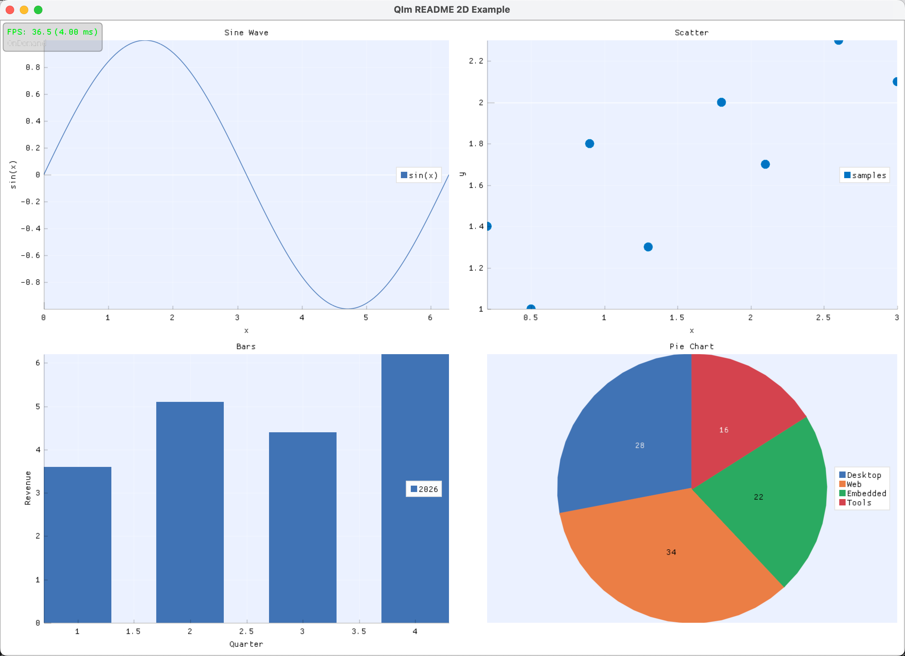
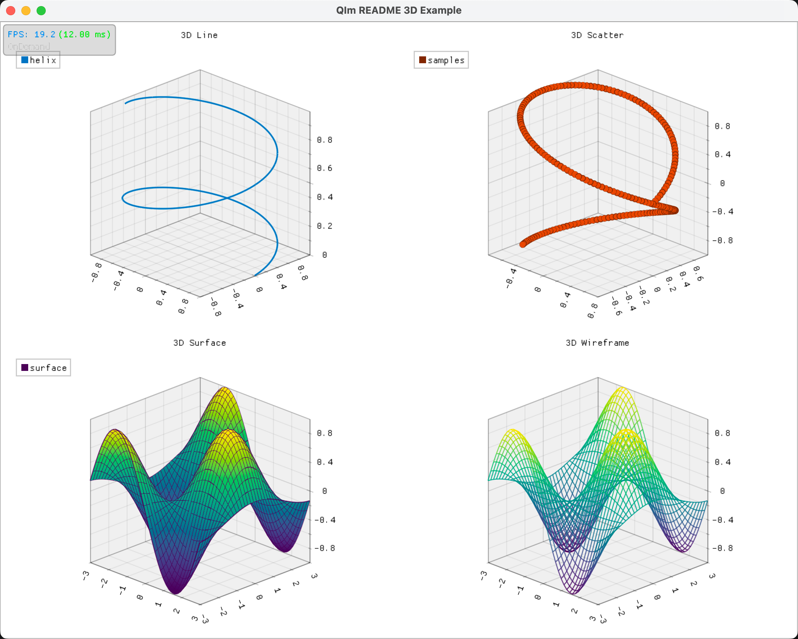

# QIm介绍

`QIm` 是一个将 `Dear ImGui`、`ImPlot`、`ImPlot3D` 等ImGui生态集成到Qt框架中的开源库。它通过保留模式（Retained Mode）的封装，让Qt开发者能够使用熟悉的Qt编程范式（信号槽、属性系统、对象树）来构建高性能的实时数据可视化应用。

基于`QIm`，你无需学习 `ImGui`，即可直接使用熟悉的 Qt 信号槽、属性系统与对象树管理机制，构建实时数据监控、科学绘图2D/3D界面、工程仿真可视化等高性能应用场景。

`QIm`计划把ImGui生态的成熟库进行封装，目前正在做`ImPlot`和`ImPlot3D`的封装，旨在为Qt开发环境提供一款开箱即用的数据可视化库。

## 编译说明

在开始编译前，建议先确认以下环境要求和注意事项：

- Qt 最低版本要求：`Qt 5.14`
- 当前支持版本：`Qt 5` 和 `Qt 6`
- 编译器要求：项目使用 `C++17`
- 构建工具：使用 `CMake` 构建

注意事项：

- 如果使用 `Qt 6`，除了 `Core / Gui / Widgets / OpenGL` 外，还需要额外提供 `OpenGLWidgets` 组件。
- `QIm` 基于 `QOpenGLWidget`、`ImGui`、`ImPlot` 和 `ImPlot3D`，运行环境需要可用的 OpenGL 上下文。
- 在 macOS 下，示例程序建议使用 `OpenGL 3.3 Core Profile` 默认格式，否则可能出现窗口能打开但内容无法正常渲染的问题。
- 项目默认会同时构建 `examples` 和 `benchmark`。如果你只想先验证主库，可在 CMake 配置阶段按需关闭相关选项。
- 首次接入项目时，建议优先运行 `examples/qimfigure-test`、`examples/qt-with-implots` 或 `examples/readme-*` 示例，先确认当前机器上的 Qt 和 OpenGL 环境工作正常。

## 当前进展

目前 `QIm` 已完成的图形能力如下：

- 2D 图形：`Line`、`Scatter`、`Stairs`、`Bars`、`Shaded`、`ErrorBars`、`Stems`、`InfLines`、`PieChart`、`Text`、`Dummy`、`Histogram`
- 3D 图形：`Line`、`Scatter`、`Surface`、`Triangle`、`Mesh`
- 大数据能力：已支持 `LTTB` 和 `MinMaxLTTB` 降采样

后续计划继续补齐以下图形能力：

- 2D 图形：`Heatmap`、`Histogram2D`、`Digital`、`Image`
- 2D 扩展图形：分组柱状图、堆叠柱状图、蜡烛图
- 3D 图形：`Quad`

## 使用方式

`QIm` 的典型使用方式是创建 `QImFigureWidget`，再设置子图网格，最后向每个 `PlotNode` 添加对应的图形节点。`QImFigureWidget` 现在同时支持二维和三维绘图，下面的示例代码可以直接参考 `examples/qimfigure-test`、`examples/qimfigure-mixed-test` 与 `examples/readme-*` 中的实际写法。

### 2D 示例

下面示例创建一个 `2x2` 的二维图形窗口，并分别绘制折线图、散点图、柱状图和饼图：

```cpp
#include "QImFigureWidget.h"
#include "plot/QImPlotNode.h"
#include "plot/QImPlotScatterItemNode.h"
#include "plot/QImPlotBarsItemNode.h"
#include "plot/QImPlotPieChartItemNode.h"

// 创建图窗，并设置布局为2x2
QIM::QImFigureWidget* figure = new QIM::QImFigureWidget(this);
figure->setSubplotGrid(2, 2);

// 创建子图1-折线图
if (QIM::QImPlotNode* plot = figure->createPlotNode()) {
    plot->setTitle("Sine Wave");
    std::vector<double> x;
    std::vector<double> y;
    for (int i = 0; i < 400; ++i) {
        double value = i * 2.0 * M_PI / 399.0;
        x.push_back(value);
        y.push_back(std::sin(value));
    }
    plot->addLine(x, y, "sin(x)");
}
// 创建子图2-散点图
if (QIM::QImPlotNode* plot = figure->createPlotNode()) {
    plot->setTitle("Scatter");
    std::vector<double> x {0.2, 0.5, 0.9, 1.3, 1.8, 2.1, 2.6, 3.0};
    std::vector<double> y {1.4, 1.0, 1.8, 1.3, 2.0, 1.7, 2.3, 2.1};
    auto* scatter = new QIM::QImPlotScatterItemNode(plot);
    scatter->setLabel("samples");
    scatter->setData(x, y);
    scatter->setMarkerSize(6.0f);
    scatter->setMarkerFill(true);
    scatter->setColor(QColor(0, 114, 189));
}
// 创建子图3-条形图
if (QIM::QImPlotNode* plot = figure->createPlotNode()) {
    plot->setTitle("Bars");
    std::vector<double> x {1, 2, 3, 4};
    std::vector<double> y {3.6, 5.1, 4.4, 6.2};
    auto* bars = new QIM::QImPlotBarsItemNode(plot);
    bars->setLabel("2026");
    bars->setData(x, y);
    bars->setBarWidth(0.6);
    bars->setColor(QColor(80, 170, 90));
}
// 创建子图4-饼图
if (QIM::QImPlotNode* plot = figure->createPlotNode()) {
    plot->setTitle("Pie Chart");
    plot->setEqual(true);
    plot->setMouseTextEnabled(false);
    plot->x1Axis()->setNoDecorations(true);
    plot->y1Axis()->setNoDecorations(true);
    plot->x1Axis()->setLimits(0.0, 1.0, QIM::QImPlotCondition::Always);
    plot->y1Axis()->setLimits(0.0, 1.0, QIM::QImPlotCondition::Always);

    auto* pie = new QIM::QImPlotPieChartItemNode(plot);
    pie->setData(QStringList() << "Desktop" << "Web" << "Embedded" << "Tools",
                 std::vector<double> {28.0, 34.0, 22.0, 16.0});
    pie->setCenter(QPointF(0.5, 0.5));
    pie->setRadius(0.40);
    pie->setLabelFormat("%.0f");
    pie->setExploding(true);
}
```



### 3D 示例

下面示例创建一个 `2x2` 的三维图形窗口，并分别绘制三维线图、三维散点图、三维曲面图和三维网格图：

```cpp
#include "QImFigureWidget.h"
#include "plot/QImPlot3DLineItemNode.h"
#include "plot/QImPlot3DScatterItemNode.h"
#include "plot/QImPlot3DSurfaceItemNode.h"
#include "implot3d.h"

// 创建图窗，并设置布局为2x2
QIM::QImFigureWidget* figure3D = new QIM::QImFigureWidget(this);
figure3D->setSubplotGrid(2, 2);

// 创建子图1-三维曲线图
if (QIM::QImPlot3DNode* plot = figure3D->createPlot3DNode()) {
    plot->setTitle("3D Line");
    std::vector<double> xs, ys, zs;
    for (int i = 0; i < 200; ++i) {
        double t = i * 0.05;
        xs.push_back(std::cos(t));
        ys.push_back(std::sin(t));
        zs.push_back(t * 0.1);
    }
    auto* line = new QIM::QImPlot3DLineItemNode(plot);
    line->setLabel("helix");
    line->setData(xs, ys, zs);
    line->setColor(QColor(0, 114, 189));
    line->setLineWidth(2.0f);
}
// 创建子图2-三维散点图
if (QIM::QImPlot3DNode* plot = figure3D->createPlot3DNode()) {
    plot->setTitle("3D Scatter");
    std::vector<double> xs, ys, zs;
    for (int i = 0; i < 200; ++i) {
        double t = i * 0.05;
        xs.push_back(std::cos(t) * 0.8);
        ys.push_back(std::sin(t) * 0.8);
        zs.push_back(std::sin(t * 0.5));
    }
    auto* scatter = new QIM::QImPlot3DScatterItemNode(plot);
    scatter->setLabel("samples");
    scatter->setData(xs, ys, zs);
    scatter->setMarkerSize(4.0f);
    scatter->setFillColor(QColor(217, 83, 25));
    scatter->setOutlineColor(QColor(120, 45, 10));
}
// 创建子图3-曲面图
if (QIM::QImPlot3DNode* plot = figure3D->createPlot3DNode()) {
    plot->setTitle("3D Surface");
    constexpr int rows = 40;
    constexpr int cols = 40;
    std::vector<double> xs(rows * cols);
    std::vector<double> ys(rows * cols);
    std::vector<double> zs(rows * cols);
    for (int r = 0; r < rows; ++r) {
        for (int c = 0; c < cols; ++c) {
            int index = r * cols + c;
            double x = -3.0 + 6.0 * c / (cols - 1);
            double y = -3.0 + 6.0 * r / (rows - 1);
            xs[index] = x;
            ys[index] = y;
            zs[index] = std::sin(x) * std::cos(y);
        }
    }
    auto* surface = new QIM::QImPlot3DSurfaceItemNode(plot);
    surface->setLabel("surface");
    surface->setData(xs, ys, zs, rows, cols);
    surface->setColormapEnabled(true);
    surface->setColormap(ImPlot3DColormap_Viridis);
}
// 创建子图4-曲面图
if (QIM::QImPlot3DNode* plot = figure3D->createPlot3DNode()) {
    plot->setTitle("3D Wireframe");
    constexpr int rows = 40;
    constexpr int cols = 40;
    std::vector<double> xs(rows * cols);
    std::vector<double> ys(rows * cols);
    std::vector<double> zs(rows * cols);
    for (int r = 0; r < rows; ++r) {
        for (int c = 0; c < cols; ++c) {
            int index = r * cols + c;
            double x = -3.0 + 6.0 * c / (cols - 1);
            double y = -3.0 + 6.0 * r / (rows - 1);
            xs[index] = x;
            ys[index] = y;
            zs[index] = std::sin(x) * std::cos(y);
        }
    }
    auto* wireframe = new QIM::QImPlot3DSurfaceItemNode(plot);
    wireframe->setLabel("wireframe");
    wireframe->setData(xs, ys, zs, rows, cols);
    wireframe->setColormapEnabled(true);
    wireframe->setColormap(ImPlot3DColormap_Viridis);
    wireframe->setFillVisible(false);
    wireframe->setMarkersVisible(false);
    wireframe->setLineWidth(1.2f);
}
```



交互方式与 `ImPlot3D` 原生保持一致：

- 左键拖拽：平移
- 右键拖拽：旋转视角
- 滚轮或中键拖拽：缩放
- 右键双击：重置旋转

如果你想看更完整的用法，可以直接运行：

- `examples/qimfigure-test`
- `examples/qt-with-implots`
- `examples/readme-2d-example`
- `examples/readme-3d-example`

## 核心设计

`ImGui` 原生采用即时模式（Immediate Mode）：每次渲染都需重新构建 UI 结构，与 Qt 编程习惯差异较大：

```cpp
// 传统ImGui代码即时模式代码,这段带码每次刷新帧都要执行一遍
if (ImGui::Begin("Window")) {
    if (ImPlot::BeginPlot("Plot")) {
        ImPlot::PlotLine(...);
        ImPlot::EndPlot();
    }
    ImGui::End();
}
```

`QIm` 将其转换为 Qt 开发者熟悉的保留模式（Retained Mode），通过面向对象 + 对象树的方式管理 UI 组件，属性与交互完全贴合 Qt 生态：

```cpp
// QIm方式 - 面向对象，更符合Qt习惯
auto window = new QImWindowNode(root);
window->setTitle("Window");

auto plot = new QImPlotNode(window);  // 自动成为子节点
plot->setTitle("Plot");

auto line = new QImPlotLineNode(plot);
line->setData(...);
```

`QIm`的核心是将 `ImGui` 生态的组件映射为 Qt 节点对象，将 `ImGui` 属性映射为 Qt 属性系统，同时保留信号槽机制

## 快速开始

### 编译和安装

项目使用`cmake`构建,建议执行安装(install)后使用

```cmake
# 创建构建目录
mkdir build && cd build
# 配置（指定 Qt 安装路径，或确保 Qt 已加入环境变量）
cmake .. -G "Visual Studio 17 2022" -A x64 ^
         -DCMAKE_PREFIX_PATH="C:/Qt/6.5.0/msvc2019_64" ^
         -DCMAKE_BUILD_TYPE=Release
# 构建
cmake --build . --config Release
# 安装（可选，默认安装到 build/install 目录）
cmake --install .
```

### 项目集成

在你的 Qt 项目 `CMakeLists.txt` 中引入 `QIm`：

```cmake
# 基础 Qt 组件依赖
set(MIN_QT_VERSION 5.14)
find_package(QT NAMES Qt6 Qt5 COMPONENTS Core REQUIRED)
find_package(Qt${QT_VERSION_MAJOR} ${MIN_QT_VERSION} COMPONENTS
    Core
    Gui
    Widgets
    OpenGL
    REQUIRED
)

# Qt6 需额外引入 OpenGLWidgets
if(${QT_VERSION_MAJOR} EQUAL 6)
    find_package(Qt${QT_VERSION_MAJOR} ${MIN_QT_VERSION} COMPONENTS
        OpenGLWidgets
        REQUIRED
    )
    target_link_libraries(<your_target> PRIVATE
        Qt${QT_VERSION_MAJOR}::OpenGLWidgets
    )
endif()

# 引入 QIm
find_package(QIm REQUIRED)

# 链接依赖
target_link_libraries(<your_target> PRIVATE 
    Qt${QT_VERSION_MAJOR}::Core
    Qt${QT_VERSION_MAJOR}::Gui
    Qt${QT_VERSION_MAJOR}::Widgets
    Qt${QT_VERSION_MAJOR}::OpenGL
    QIm::Core 
    QIm::Widgets
)

```

### 大规模数据处理

针对超大数据量（>50 万点）的渲染压力，QIm 内置基于 `LTTB` 算法的降采样模块（QImLTTBDownsampler），默认开启自适应采样，兼顾渲染性能与数据可视化精度。

### 渲染模式控制

QIm提供三种渲染策略适应不同场景，你可以通过`QImWidget::setRenderMode`根据你面对的场景选择合适的渲染模式：

```cpp
QImWidget* widget = new QImWidget();
widget->setRenderMode(QImWidget::RenderAdaptive);  // 默认：智能自适应

// 三种模式：
// 1. RenderAdaptive: 交互时高帧率(18FPS)，静止时低帧率(1FPS)
// 2. RenderContinuous: 持续渲染(18FPS)，适合动画
// 3. RenderOnDemand: 仅在事件触发时渲染，最节能
```

### 自定义节点开发

继承`QImAbstractNode`创建自定义组件：

```cpp
class CustomPlotNode : public QImAbstractNode {
    Q_OBJECT
public:
    CustomPlotNode(QObject* parent = nullptr) : QImAbstractNode(parent) {}
    
protected:
    bool beginDraw() override {
        // 对应 ImGui::Begin("MyCustomWindow")
        return ImGui::Begin("MyCustomWindow", nullptr, m_flags);
    }
    
    void endDraw() override {
        ImGui::End();
    }
    
private:
    ImGuiWindowFlags m_flags = 0;
};
```

## 已知限制

当前`QIm`的`Plot`模块存在如下**缺陷**，选用请自行评估

- 不能任意添加字体，你需要先加载字体文件才能加载对应字体
- 不支持线形，你无法指定虚线、点划线等操作

## 绘图性能对比测试

Qt 生态里能画图的库不多，主流的为`QCustomPlot`、`Qwt`、`Qt Charts`和`KDChart`，后两者性能低，和前两者不是一个数量级，这里不做讨论，在性能对比测试中，主要对比`QCustomPlot`和`Qwt`

`QCustomPlot`和`Qwt`都自带了降采样算法，在点数非常多的时候可与高效绘图，`Qwt`默认不开启降采样算法，`QCustomplot`默认是开启降采样算法的，Qwt可以通过`QwtPlotCurve::setPaintAttribute(QwtPlotCurve::FilterPointsAggressive);`开启降采样算法，性能可以极大提高，下面对比区分开启降采样算法和不开启降采样算法以及开启OpenGL和不开启OpenGL的情况

下面是`QIm`和`QCustomPlot`、`Qwt`在「100万点绘图」场景下进行性能对比（渲染100次取平均），测试覆盖不同降采样/OpenGL 配置：

### 测试1：降采样关闭 + OpenGL 关闭

| 绘图库         | 单次绘图耗时(MS) | FPS     |
| ----------- | ---------- | ------- |
| QCustomPlot | 249.3      | 4.01123 |
| Qwt         | 144.1      | 6.93963 |
| QIm         | 92.45      | 10.8167 |

### 测试2：降采样开启 + OpenGL 关闭

| 绘图库         | 单次绘图耗时(MS) | FPS     |
| ----------- | ---------- | ------- |
| QCustomPlot | 39.58      | 25.2653 |
| Qwt         | 41.51      | 24.0906 |
| QIm         | 36.61      | 27.3149 |

### 测试3：降采样关闭 + OpenGL 开启

| 绘图库         | 单次绘图耗时(MS) | FPS     |
| ----------- | ---------- | ------- |
| QCustomPlot | 152.93     | 6.53894 |
| Qwt         | 121.78     | 8.21153 |
| QIm         | 80.72      | 12.3885 |

### 测试4：降采样开启 + OpenGL 开启

| 绘图库         | 单次绘图耗时(MS) | FPS     |
| ----------- | ---------- | ------- |
| QCustomPlot | 44.56      | 22.4417 |
| Qwt         | 43.58      | 22.9463 |
| QIm         | 38.73      | 25.8198 |

### 结论

| 场景                 | 性能排序                        | 关键特征                                      |
| ------------------ | --------------------------- | ----------------------------------------- |
| **无降采样 + 无OpenGL** | **QIm ≫ Qwt > QCustomPlot** | QIm 凭借 OpenGL 渲染管线优势，在百万级数据下性能领先 1.5\~2 倍 |
| **开启降采样（LTTB）**    | **三者性能趋同**                  | 降采样成为性能瓶颈，库间差异缩小至 10% 以内                  |
| **内存占用**           | **Qwt ≈ QCustomPlot ≪ QIm** | QIm 内存开销约为其他库的 5\~15 倍（架构特性决定）            |

#### 1. 降采样是大数据量渲染的决定性因素

- **10万点以下**：原生渲染性能差异显著（QIm 优势明显）
- **50万点以上**：开启降采样后，三者渲染耗时差距缩小至 5% 以内
- **结论**：>10万点场景**必须启用降采样**，此时选择库应优先考虑功能与易用性，而非纯渲染性能

#### 2. OpenGL 加速的实际收益有限

对于Qwt,QCustomPlot等库

- 在**已开启降采样**的前提下，启用 OpenGL 对 FPS 提升 <5%
- 仅在**无降采样 + 超大数据量**场景下，OpenGL 能带来 30%+ 性能增益（但此时帧率仍低于 10 FPS，实用性低）
- **建议**：优先启用降采样，OpenGL 作为辅助优化手段

#### 3. 内存占用呈现明显差异

| 库           | 100万点内存  | 500万点内存  | 特点                         |
| ----------- | -------- | -------- | -------------------------- |
| QIm         | \~460 MB | \~1.4 GB | ImGui 架构需维护双缓冲+GPU资源，内存开销大 |
| Qwt         | \~21 MB  | \~134 MB | 内存效率高                      |
| QCustomPlot | \~21 MB  | \~82 MB  | 内存控制优秀，500万点时反超Qwt         |

\*\*注：\*\*测试中的内存检测是检测整个测试过程的峰值内存差值，可能会存在偏差

具体测试代码见`benchmark/performance`

详细测试结果见：[docs/zh/performance.md](./docs/zh/performance.md)
